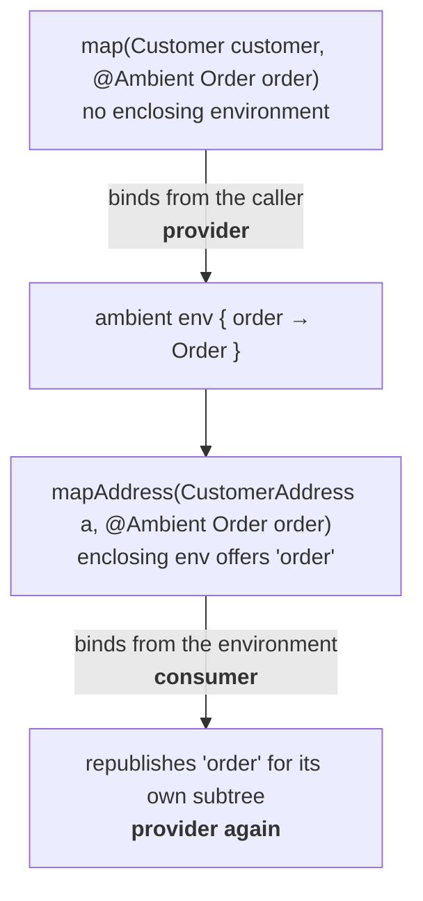
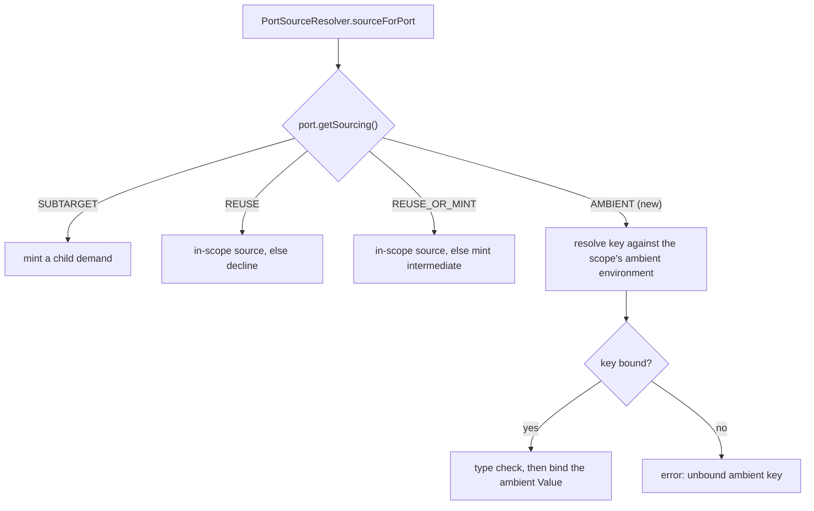
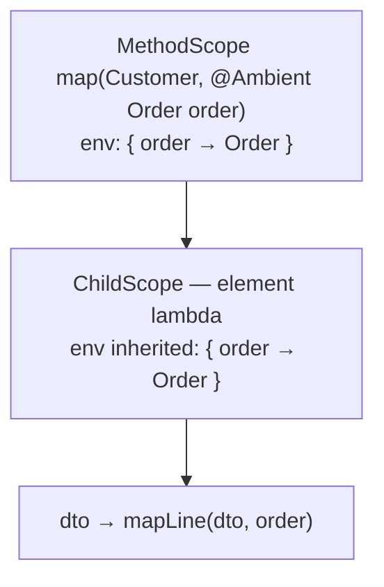
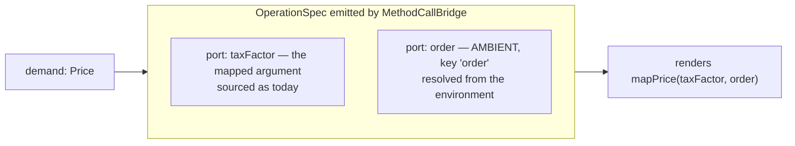
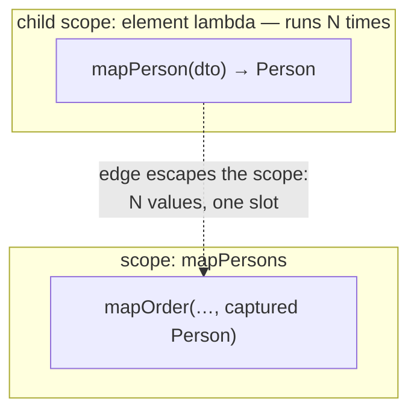

## Context

Percolate's engine is **target-driven** and **directive-rooted**: expansion self-seeds one return-root demand
per abstract method, and every producer chain must originate from something the developer wrote down — a
`@Map` source path, or a constant. `graph-expansion` states this as *"No silent sourcing — supply is
directive-rooted only."* Strategies are myopic: they answer a local question from a `Demand` plus a
`ResolveCtx` and never touch the graph. All port sourcing goes through one `Port.Sourcing` mode that
`PortSourceResolver` interprets.

Two consequences of that design shape this change.

First, **multi-parameter mapper methods are nearly free** and appear already to work. `MethodScope.inputDecls`
yields one `InputDecl` per parameter; `SourcePathDescender.materialiseRoot` roots a descent by *name*;
`ValidateSourceParametersStage` validates a source's first segment against the set of *all* parameter names;
`SelfCallGuard.parameterRootLocations` already returns one root per parameter. Because nothing is auto-mapped
by property name, a second parameter introduces no ambiguity — every source says which root it starts from.
What is missing is specification, coverage and documentation, not engine work.

**Probe outcome (task 1).** A throwaway `PercolateCompiler` probe (`MultiParameterProbeSpec`, deleted after
recording this) compiled all three cases: two differently-typed parameters each rooting their own directive,
two same-typed parameters (`Diff compare(Person before, Person after)`), and a sub-target assembled from both
parameter roots. All three compiled cleanly with zero errors. The premise holds — multi-parameter mapper
methods already work; the rest of this change proceeds as planned.

Second, **there is no way to supply a value that is not derived from the mapped object.**
`CallableMethodFilter` keeps only methods with exactly one parameter, and `callable-method-discovery` records
the intent to lift that later via *"a multi-argument assembly strategy (an `AssemblyStrategy`, analogous to
`ConstructorCall` but over a callable method)."* That approach was re-examined and rejected: nested-target
assembly through `ConstructorCall` plus single-argument delegation already cover ordinary multi-argument
construction, and what remains is not "assemble from many mapped sources" but "thread one ambient value down
the chain" — a different problem with a much smaller answer.

## Goals / Non-Goals

**Goals:**

- Specify, cover and document multi-parameter mapper methods, including two same-typed parameters.
- Let a developer declare a parameter whose value is threaded down the mapping call chain and bound wherever
  a deeper conversion method asks for it, by name.
- Unlock multi-argument conversion methods without a multi-argument assembly strategy.
- Keep strategies myopic and add no processor stage for sourcing.
- Fail loudly on every ambient mistake — no silent non-match, no quiet plan change.

**Non-Goals:**

- Return-value captures. Deferred; see Decision 8.
- A multi-argument `AssemblyStrategy`, or name-/type-matched sourcing of multi-argument calls. Rejected; see
  Decision 6.
- Lifecycle hooks on the ambient object (MapStruct dispatches `@BeforeMapping`/`@AfterMapping` on `@Context`
  arguments). Percolate has no lifecycle hooks and this change adds none.
- Fixing the `-parameters` exposure on inherited compiled methods. Documented as a scenario, not repaired.

## Architecture note — read this first

> **This change widens a load-bearing invariant.** `graph-expansion`'s *"No silent sourcing — supply is
> directive-rooted only"* currently admits exactly two supply origins: a directive source path, and a
> constant. `@Ambient` adds a third.

The *intent* of the invariant is preserved and should be restated rather than weakened: **nothing is sourced
that the developer did not write down.** An `@Ambient` parameter is written down — it is a declaration in the
mapper signature, as explicit as a `@Map`. What changes is the letter: supply is **declaration-rooted**, where
a declaration is a directive, a constant, or an ambient binding.

This distinction is what rules out the alternatives in Decision 6. Name-matching a call's arguments against
whatever happens to be in scope, or type-matching them, would be sourcing the developer did *not* write down —
those genuinely break the invariant, and are rejected. `@Ambient` does not.

## Decisions

### Decision 1 — One annotation; provider and consumer roles are positional

`@Ambient` is a single annotation applied to parameters. There is no `@Provide`/`@Consume` split.

An `@Ambient` parameter is **bound** from the enclosing ambient environment when one offers a matching key,
and is **published** into the environment for its own subtree either way. Which role it plays follows from
where it sits, and the engine already knows that:



*Alternative considered:* two annotations (`@Capture`/`@Captured`, or `@Provide`/`@Require`). Rejected —
the pair is redundant with information the engine already has, and it forces the developer to restate a fact
that position determines. It also answers, for free, the question of whether a consumed parameter re-enters
scope inside its own generated body: it does, uniformly, with no branch.

*Alternative considered:* MapStruct's `@Context`, matched purely by type. Rejected as the *keying* scheme in
Decision 2, but its single-annotation shape is adopted here.

### Decision 2 — The key is the parameter name; the type is verified, not encoded

`@Ambient Person simon` publishes under key `"simon"`. `@Ambient("simon") Person p` lets a consumer name its
own parameter differently while binding the same key. The declared type is **checked** against the binding's
type; it is **not** part of the key.

Rationale:

- **Percolate is already name-keyed.** `@Map(source = "customer.address")` names a parameter;
  `ValidateSourceParametersStage` validates against `getSimpleName()`; `SourcePathDescender.materialiseRoot`
  roots by name match. Type keying would be the odd one out.
- **It is consistent with the same-typed-parameter decision.** `compare(Person before, Person after)` is
  legal precisely because every source is named. Type keying would make
  `map(@Ambient Person simon, @Ambient Person alice)` illegal for no reason but the keying scheme.

*Alternative considered:* a composite key of name and fully-qualified type, e.g.
`@Ambient("simon@io.example.Person")`. **Rejected — it converts type errors into silent misses.** Given

```java
OrderView map(Customer c, @Ambient Person simon);
default Address mapAddress(CustomerAddress a, @Ambient Customer simon) { … }
```

a composite key yields two different strings, so the two simply do not match; `mapAddress` becomes quietly
inapplicable and the developer gets a diagnostic pointing somewhere else entirely. Keying on the name alone
and verifying the type produces the error they actually need — one that names the key and both types.

### Decision 3 — An unmatched ambient port is an error, not a declined operation

`Port.Sourcing.REUSE` declines: *"the feeding value must already exist in scope, or the operation does not
apply."* `AMBIENT` must not inherit that. A renamed parameter would silently deselect a conversion method,
and the engine would either choose a different producer or report an unrelated "no plan" — in both cases
pointing away from the mistake.

`AMBIENT` therefore **fails loudly**: an unmatched ambient port is an error naming the unbound key. This is
the one sourcing mode where declining is worse than erroring, because the developer manifestly intended that
method to be called.

### Decision 4 — A fourth `Port.Sourcing` mode, spending the port-sourcing growth axis



Strategies stay myopic: a strategy marks a port `AMBIENT` with a key and knows nothing further —
no environment lookup, no graph access. `PortSourceResolver` grows exactly one branch. This spends the
**port-sourcing growth axis** already identified on the SPI roadmap, exactly as intended, and adds no
processor stage.

*Alternative considered:* resolving ambients in a dedicated stage before or after expansion. Rejected — a
sourcing decision belongs at the one site that already makes sourcing decisions, and a stage would need graph
access that the myopia rule denies.

### Decision 5 — The ambient environment lives on `Scope` and is inherited by `ChildScope`

`Scope` already declares base-case inputs uniformly (`inputDecls`) with no scope-kind branch. The ambient
environment is a parallel per-scope declaration, and a `ChildScope` inherits its parent's.



Inheritance makes ambients work inside container and element lambdas **for free**: the generated lambda
closes over an effectively-final parameter, which is already legal Java and needs no codegen support beyond
rendering the argument.

### Decision 6 — The callable gate becomes `parameterCount - ambientCount == 1`

`CallableMethodFilter` currently keeps methods with exactly one parameter. It becomes: exactly one
**non-ambient** parameter. Ambient parameters do not participate in the bridge decision at all.



So `default Price mapPrice(Integer taxFactor, @Ambient Order order)` is still, structurally, a
**one-port bridge**. This withdraws `callable-method-discovery`'s deferral of multi-parameter methods to a
future `AssemblyStrategy`.

*Alternatives considered, all rejected* — each would source an argument the developer never wrote down, which
is the invariant discussed in the architecture note above:

| Approach | Shape | Why rejected |
| --- | --- | --- |
| Name-matched multi-arg call | callee's parameter names matched against the enclosing method's parameters | Action at a distance; renaming a parameter silently changes which methods are called. |
| Declared-bindings multi-arg call | a method treated as assembly, gated like `ConstructorCall` on the declared-children name set | Coherent, and it introduces no new principle — but it is redundant. Nested-target `ConstructorCall` assembly plus single-argument delegation already express every case it would serve. |
| Type-matched multi-arg call | each argument bound to an in-scope value of its type | Undefined the moment two parameters share a type — exactly the case Decision 2 makes legal. |

### Decision 7 — An ambient parameter remains an ordinary `@Map` source

```java
@Map(target = "address",  source = "customer.address")
@Map(target = "orderRef", source = "order.id")          // same parameter, used normally
OrderView map(Customer customer, @Ambient Order order);
```

MapStruct must exclude `@Context` parameters from source resolution because it auto-maps by property name, so
an unexcluded context parameter would pollute the matching. Percolate is directive-rooted: nothing is a source
unless a `@Map` names it. The exclusion rule is therefore unnecessary, and adding it would be a restriction
with no purpose.

### Decision 8 — Return-value captures are deferred, and `@Capture` is left unspent

Capturing a method's *return* value was considered and deferred. Modelled honestly, it is an extra dependency
edge from consumer to producer, and it fails in two distinct ways:



- **Multiplicity** — the capture sits in a child scope and the consumer outside it, so there is no single
  captured value.
- **Cyclicity** — the consumer produces part of the captured object, so the edge closes a cycle. With
  `ConstructorCall` as the only assembly strategy, a target never exists in half-built form, so there is no
  point at which the value could be handed out.

Both are the same defect: a return capture has no well-defined scope in a target-driven DAG. Worse, its
identity depends on which invocation the *cost model* selected, so a weight change could silently relocate
it. A future change can address this with a scope-crossing rule and cycle detection on capture edges; the name
`@Capture` is deliberately left unspent so it remains available and accurate there.

### Decision 9 — Same-typed parameters are legal, and the two type-matched sites are pinned down

`Diff compare(Person before, Person after)` is legal: every source names its root. But two sites choose a
source by *type*, where a second same-typed parameter first makes the choice observable:

- `SourceCandidates.materialiseMatchingInput` filters by type and takes `findFirst`. With one parameter this
  can only ever return that parameter; with two it silently resolves on declaration order.
- `SourceCandidates.sourceTypes(scope)` concatenates every declared input and feeds it to
  `BindingEnumerator` during grounding-by-match, so a template port unifies against both and over-emits two
  equal-cost operations with no principled tie-break.

Neither has been demonstrated to be reachable from user code; both are pinned down by spec here rather than
left to be discovered later. The engine must be deterministic at both sites.

### Implementation note — how the engine stays diagnostics-free while AMBIENT still fails loudly (group 5/8 split)

`ExpandStage` and its collaborators (`PortSourceResolver`, `SourceCandidates`, ...) have zero `Diagnostics`
access today — a firm existing boundary this change does not cross. `PortBinder.bind` is also all-or-nothing:
if any port fails to source, the whole `OperationSpec` never lands as an `Operation`. Consequently
`PortSourceResolver`'s `AMBIENT` branch **declines exactly like `REUSE`** on failure (unbound key, or a
key that resolves but whose type doesn't verify) — it does not itself report anything, and the failed
candidate leaves no trace in the graph to inspect afterwards.

The loud-failure requirement is therefore met by a **downstream, independent re-derivation**, not by
inspecting what expansion did. `ValidateAmbientBindingsStage` (group 8) walks every `FREE`-role `Value` `v`
actually demanded during expansion and, for each `MethodCandidate` `ctx.getCallableMethods().producing(v.type())`
offers (the exact same query `MethodCallBridge` itself makes), re-checks each of that candidate's `@Ambient`
parameters against `v.getScope().ambientDecls()` — the same rule `PortSourceResolver` used, computed
independently. This faithfully mirrors what expansion attempted (candidates are demand-scoped, not
graph-scoped, so no false positives from unrelated abstract methods sharing one mapper type) without needing
`Operation`/`AddOperation` to retain a `callTarget` back-reference — which would have rippled through ~30
existing `AddOperation` call sites across the graph-test suite, well outside this change's stated Impact.

**Positioning trade-off, accepted deliberately.** `Diagnostics.hasErrorsFor(mapperType)` (which
`RealisationDiagnosticsStage` checks to suppress its own generic "no plan" message) is only satisfied by
scarring the mapper type itself or an element whose *immediate* enclosing element is the mapper type (see
`Diagnostics.error`'s `scarredWithEnclosing` bookkeeping). Positioning at the offending `@Ambient` parameter
(whose enclosing element is the *method*, not the mapper type) would not suppress it, and positioning at an
*inherited* candidate method's own element is unsound (its enclosing element is the declaring supertype, not
the mapper type). All three ambient diagnostics — duplicate key, key/type mismatch, unbound key — are
therefore positioned at `ctx.getMapperType()` uniformly, naming the key/types/method/parameter in the message
text instead of via precise `AnnotationMirror` source positioning. This satisfies every scenario's *content*
requirement and, critically, the "never a generic unrealisable-target diagnostic instead" requirement; it
trades away IDE-squiggle precision on the `@Ambient` annotation itself.

### Implementation note — MethodCallBridge asks ResolveCtx, not the annotation directly (group 7)

`strategies-builtin` has never depended on the `annotations` module in its main source set — strategies read
`javax.lang.model` shape, never percolate's own annotations directly; that reading is a processor-side
(discovery/directive) concern. So `MethodCallBridge` cannot call `param.getAnnotation(Ambient.class)` itself.
`ResolveCtx` gained one more type-query-seam default method, `ambientKey(VariableElement)`, implementing
Decision 2's key rule (`value()` else simple name) directly against the annotation — its only abstract
dependency-free default method, since resolving an ambient key needs neither `types()` nor `elements()`. This
required adding `implementation project(':annotations')` to `spi`'s main dependencies (previously test-only) —
a small, justified addition: any percolate mapper author already depends on `annotations` transitively via the
starter, so this adds no new footprint for end users, and it keeps `strategies-builtin` free of the
dependency entirely, consuming only the `ResolveCtx` interface call. `CandidateDescriptor.ambientKeys` (group
6) is a *separate*, discovery-time-only concern — read directly from `javax.lang.model` inside `processor`
(which already depends on `annotations`), before a `ResolveCtx` even exists — so no duplication of purpose,
only of the tiny two-line key rule itself (`processor.internal.graph.AmbientKeys` and `ResolveCtx.ambientKey`
each implement it once, for their own layer).

### Implementation note — @Ambient is not propagated to the generated override (task 9.7)

`AssembleMapperType.parameterSpec` needed no change: it already builds a `ParameterSpec` from a parameter's
type and simple name alone, with no branch on which annotations the source parameter carries — exactly like
`@Map`/`@Mapper` today, neither of which is echoed onto the generated override's signature either. Verified
end-to-end: `AmbientMapper.map(Customer customer, @Ambient Order order)` generates
`map(Customer customer, Order order)` with no `@Ambient` on the override (see
`AmbientMapperImpl.java` under `strategies-builtin/build/generated/sources/annotationProcessor/...`), and the
mapper runs correctly. **Decision: do not propagate.** `@Ambient` has `@Retention(CLASS)` and is fully
consumed at annotation-processing time — the generated override never needs to re-declare it, and there is no
runtime-reflection consumer that would need it there.

## Risks / Trade-offs

**[The multi-parameter premise is unverified] → Probe first.** That multi-parameter mapper methods compile
today is inferred from reading six classes, not witnessed. The first task is a `PercolateCompiler` probe, and
the rest of the change is conditional on it. If it fails, the change must state the actual engine gap before
any spec claims the behaviour.

**[`Port.Sourcing` gains a constant] → Accept, and note it.** An exhaustive `switch` over `Sourcing` in a
third-party strategy stops compiling. The enum is SPI-public, so this is observable even though it is
additive for mapper authors. Percolate is pre-1.0 and the built-ins are the SPI's first customers; the
alternative — a parallel sourcing channel to avoid touching the enum — would be strictly worse architecture.

**[Name keying depends on real parameter names] → Scenario, not repair.** A mapper inheriting an abstract
method from a **compiled** dependency sees `arg0`-style names unless that jar was built with `-parameters`.
`@Map(source = …)` already carries this exposure; ambients make it bite in a second place. Covered by a
scenario so the failure is at least legible; fixing it is out of scope.

**[Widening "no silent sourcing"] → Restate, don't weaken.** See the architecture note. The requirement text
must be edited to name all three declared origins, not quietly reinterpreted — otherwise a future reader
takes it as licence for the type-matched sourcing this change explicitly rejects.

**[Ambient errors could be noisy] → One diagnostic per cause.** Three distinct failures (duplicate key,
key/type mismatch, unbound key) must each produce their own message positioned at the offending annotation,
not a generic "no plan" from the extraction fold.

**[`MethodCallBridge` codegen ordering] → Positional, covered by unit specs.** `renderCodegen` uses
`inputs.single()` today; with ambients there are N inputs, so arguments must be emitted in declaration order
rather than assuming one. A miswire here produces code that compiles but passes arguments in the wrong
order — so ordering needs direct unit coverage, not only end-to-end coverage.

## Open Questions

- Should an `@Ambient` parameter on an abstract mapper method that percolate *generates* be re-published under
  its own key automatically (Decision 1 says yes, uniformly)? Confirm no case wants opt-out.
- Is a nested ambient allowed to **shadow** an inherited key of the same name, or is that a duplicate-key
  error? The spec should pick one; shadowing is more flexible, erroring is more legible.
