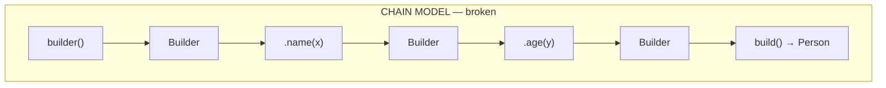
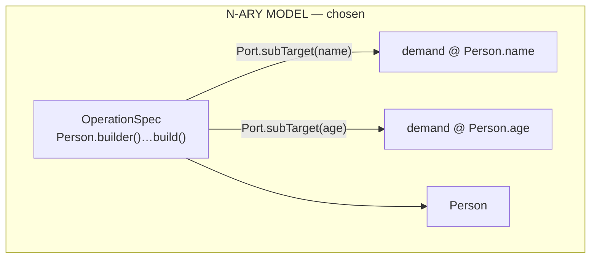
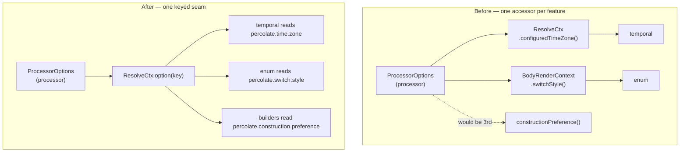

## Context

Percolate assembles a target through exactly one built-in strategy today: `ConstructorCall`. It finds a
constructor whose parameter-name set equals the demand's declared-children set, emits one `OperationSpec` with a
`Port.subTarget` per parameter, and renders `new T(a, b)`. `DirectAssign` is the only other assembly-shaped
built-in and it is pure identity. There is no setter assembly and no builder assembly, so a builder-built type
cannot be a mapping target at all.

The engine is target-driven and choice-free: strategies over-emit `OperationSpec`s from a myopic
`ProduceDemand` + `ResolveCtx`, the driver lands them, and plan extraction folds a **minimum-cost hyperpath**
where `Cost` is the lexicographic vector `(partials, weight)` with totality dominating weight absolutely. A
strategy never touches the graph; the engine never learns a feature's vocabulary.

Two constraints from that model drive everything below. First, the only mechanism that **forces** a declared
child to be produced is a `Port.subTarget` on a single operation — an unsatisfied port makes the plan partial,
and partials dominate. Second, cost's `min` chooses but cannot exclude, so a weight is a preference and never a
constraint.

A third, unrelated pressure surfaced while scoping: the generic `ResolveCtx` seam has begun accreting one
bespoke accessor per feature (`configuredTimeZone()` for temporal, `switchStyle()` on the body render context
for enums). `construction.preference` would have been the third.

## Goals / Non-Goals

**Goals:**

- Make builder-built types mappable through four shipped conventions.
- Keep the expansion engine entirely ignorant of builders — no engine change of any kind.
- Introduce no builder-specific SPI type; third-party conventions plug in through the existing
  `@AutoService(ExpansionStrategy.class)` mechanism.
- Settle constructor-vs-builder ambiguity deterministically without an arbitrary tie-break.
- Stop the option seam from growing one method per feature.

**Non-Goals:**

- Setter-based assembly of mutable beans (`T t = new T(); t.setX(…); return t;`). It needs an output shape
  percolate does not have — a statement sequence over a materialised local — and is its own change.
- Builders whose entry point lives on an unrelated type the target does not name (e.g. Immutables'
  `ImmutableFoo.builder()` for an abstract `Foo`). A third party can supply that strategy.
- Collection-shaped builder members (Lombok `@Singular`'s `addX`/`addAllX`, protobuf repeated-field adders).
  Only the single-value setter form is matched.
- Any change to how `percolate.time.zone` or `percolate.switch.style` behave for users. Only the internal read
  path moves.

## Decisions

### D1 — A builder is ONE n-ary operation, never a chain of steps

The tempting model is to decompose the builder the way container pipelines decompose: `builder()` as a source
step, each setter as a chained step, `build()` as a terminal. It is the most percolate-shaped-looking option and
it is **wrong** — it silently drops declared mappings.

Every setter is an optional link carrying weight. Skipping one is not a partial — it is simply a shorter,
cheaper chain — so the minimum-cost fold prefers it:

| plan | partials | weight | outcome |
|---|---|---|---|
| `builder().name(x).age(y).build()` | 0 | 4 | loses |
| `builder().name(x).build()` | 0 | 3 | **wins — `age` silently dropped** |

A `Builder → Builder` step also has no notion of *which* target slot it fills, so declared children could not be
connected to setter steps even in principle. The single-operation model restores the forcing function:

Drop either port and the plan is partial; partials dominate lexicographically, so it cannot be optimised away.

*Alternative considered:* chained steps with a synthetic "completeness" constraint forcing every declared child
into the plan. Rejected — it reintroduces exactly the strategy-coupled admissibility machinery that
`decouple-engine-from-strategy-semantics` dissolved, and it would put builder vocabulary in the engine.

### D2 — No builder SPI type; four plain `ExpansionStrategy` implementations

Each convention is a `final class … implements ExpansionStrategy` in
`strategies-builtin/…/spi/builtins/assembly/`, registered with `@AutoService(ExpansionStrategy.class)`. Nothing
is added to `percolate-spi` for builders.

Every query the discovery needs already exists on the seam: `membersOf`, `isMethod`, `isStatic`, `isPrivate`,
plus the plain narrowing cast to `ExecutableElement` that `ConstructorCall` already establishes as the idiom.

Third-party pluggability therefore costs nothing: an in-house convention ships as an external jar on the
processorpath, the same mechanism `percolate-reactor` uses to add a whole container paradigm with zero engine
change.

*Alternative considered:* an `Assembler` abstract base in `percolate-spi` mirroring `Accessor`, or a
`BuilderShape` + `BuilderMutator` pair. Rejected — `Accessor` was **extracted** from three resolvers that had
already duplicated the same plumbing; it was not designed up front. Committing to a builder-shaped SPI type
before the duplication exists would put a use-case name in the generic surface. If the four implementations do
converge on shared plumbing, a base may be extracted **during** this change, and it belongs in
`strategies-builtin`, not `percolate-spi`, unless a third party demonstrably needs to subclass it.

### D3 — The builder gate is subset, where the constructor gate is equality

Percolate does not auto-map by name, so `declaredChildren` is exactly the author's `@Map` target paths at that
level. That makes the two gates genuinely different:

| form | gate | why |
|---|---|---|
| constructor | `paramNames.equals(declaredChildren)` | parameters are mandatory — all or nothing |
| builder | `declaredChildren ⊆ setterNames` | setters are optional — call the ones declared, skip the rest |

Equality for builders would make them nearly unusable: a twenty-setter Lombok builder would only ever match a
mapper declaring all twenty. Subset does **not** open a vacuous-satisfaction hole, because `ConstructorCall`'s
existing `declared.isEmpty()` bail is preserved in each builder strategy — so `{} ⊆ anything` never fires and a
leaf demand is never assembled from nothing.

### D4 — Ambiguity is priced by weight, read from a compile-time switch

Lombok emits an all-args constructor alongside its builder, so both gates match in the commonest case. Rather
than an arbitrary tie-break (`thenComparingInt(Operation::getSeq)` today), a new
`percolate.construction.preference` switch prices each strategy. **Each strategy prices only itself** — neither
knows the other exists, so myopia holds.

The fold is **minimum**-cost, so the preferred form takes the **low** weight:

| `construction.preference` | `ConstructorCall` | the four builder strategies |
|---|---|---|
| `constructor` (default) | `STEP` (1) | `EXPENSIVE` (3) |
| `builder` | `EXPENSIVE` (3) | `STEP` (1) |

Two properties make this exact rather than fragile. Both forms declare the **same `subTarget` ports for the same
declared children**, so their subtrees are cost-identical and only the operation's own weight differs — a
one-unit gap decides cleanly. And because `min` chooses but cannot exclude, this stays a *preference*: if the
preferred form does not fit, the other is still used rather than the mapping failing.

All weights stay non-negative — `Cost.plus` is componentwise, so a negative weight leaks upward through the
fold.

*Alternative considered:* a `Constraint` making the non-preferred form inadmissible. Rejected — admissibility is
for declared intent that must be enforced, not for a soft global default, and it would turn an unmatched
preference into a hard failure.

### D5 — One generic option lookup replaces the per-feature accessors

`ResolveCtx` gains `Optional<String> option(String key)`. `ResolveCtx.configuredTimeZone()`,
`BodyRenderContext.switchStyle()`, and `CompileResolveCtx`'s `elemConfiguredTimeZone` field are **deleted**.
`ProcessorOptions` remains the parsing and validation owner in the `processor` module; the seam is only how a
strategy reaches a value. Each strategy interprets its own option's string — the engine continues to make no
code-generation or selection choice from an option, which stays absolute.

This is the load-bearing architectural improvement in the change: without it, every future option-reading feature
widens the generic seam by one method.

### D6 — Codegen is a single chained expression

`FluentBuilder` renders `Person.builder()$Z.name($L)$Z.age($L)$Z.build()`. Every chain continuation carries a
JavaPoet `$Z` wrap marker, per the repo's chain-wrapping convention. `SideLocatedBuilder` renders
`new MyClassBuilder()$Z…` instead of a static factory call; the rest is identical.

Setter call order follows `declaredChildren` insertion order, which `GoalSpec` maintains for determinism — so
generated output is stable across builds and safe for the build cache and the doc-tagged fixtures.

Argument hoisting needs no special handling: `HoistPlan` already hoists values feeding a port of an operation
with two or more ports, so builder arguments become named locals exactly as constructor arguments do.

## Risks / Trade-offs

- **Removing two published SPI methods breaks third-party strategies.** → In-tree only the temporal and enum
  built-ins call them; `percolate-reactor` and `percolate-reactor-blocking` call neither. The replacement is a
  one-line change at each call site, and no user-facing option name moves. Called out as **BREAKING** in the
  proposal.
- **`SideLocatedBuilder` discovers by name convention (`MyClass` → `MyClassBuilder`), which can false-positive.**
  → The match is narrowed by structure, not name alone: the candidate type must be non-private, publicly
  instantiable with a no-arg constructor, and expose a no-arg `build()` returning the target. A same-named type
  that fails any of those simply does not match, and a wrong match still has to satisfy the subset gate.
- **Four strategies will duplicate discovery and rendering plumbing.** → Accepted deliberately (D2). Extract a
  shared base from the observed duplication once all four exist, inside `strategies-builtin`. Extracting before
  the duplication exists is what produced the rejected SPI-type design.
- **`FluentBuilder` and `WithBuilder` both key off `builder()` and differ only in setter naming.** → They are
  disjoint by setter match; where a builder somehow exposes both `name(v)` and `withName(v)`, both strategies
  offer and the existing over-emit-then-prune resolves it with no new arbitration. Cost is equal, so the
  existing deterministic sequence tie-break applies — acceptable because both renderings are correct.
- **Weight preference is global, not per-mapper or per-method.** → Consistent with every other compile-time
  switch. A per-binding pin is a separate concern that belongs with the parked explicit-conversion-method work,
  not here.
- **A generic `option(String)` loses the type safety the bespoke accessors had.** → Deliberate: typed parsing
  belongs to the strategy that owns the option's meaning, which is already true for `switch.style` (the codegen
  resolves `AUTO` itself). `ProcessorOptions` keeps its typed fields for engine-internal consumers.
