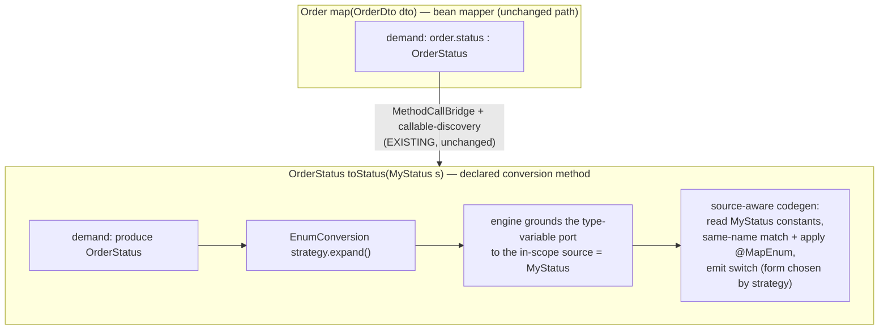
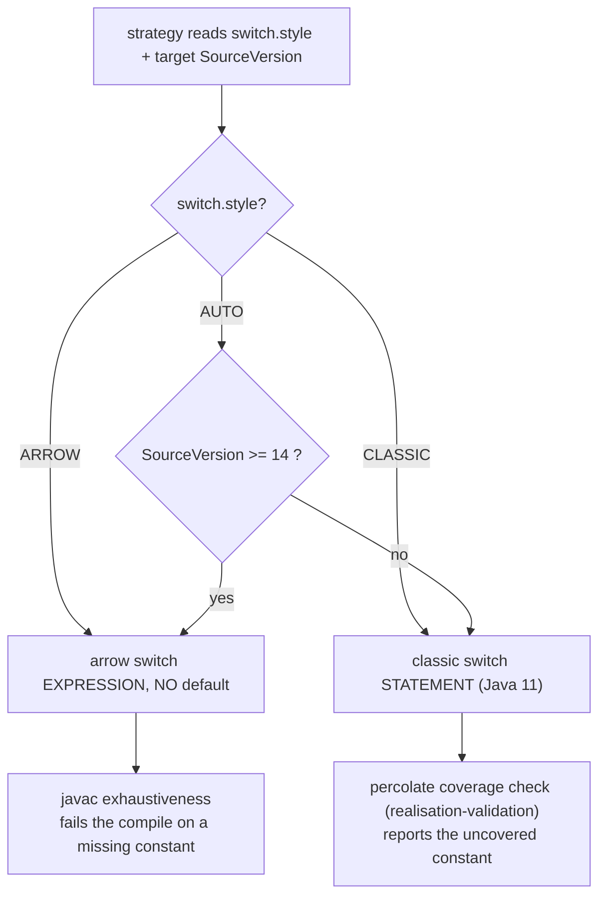

## Context

percolate assembles targets and converts scalars entirely through target-driven graph expansion: a demand ("produce
type T") is answered by `ExpansionStrategy` implementations that over-emit candidate `OperationSpec`s, and cost
extraction prunes to one winning plan. Scalar conversions ride the `Conversion` archetype (boxing, widening) or
implement `ExpansionStrategy` directly (`TemporalFormat`). There is **no** enum-to-enum conversion today, so a demand
for one enum from a differently-typed enum is unsatisfiable.

Three existing facts shape this design and were verified against the code:

- **`TemporalFormat` never receives its source type** — for target `String` it iterates a hardcoded roster of
  `java.time` types and over-emits one candidate per roster entry, each with a concrete source port; the engine keeps
  the reachable one. A strategy learns an *unbounded* source type instead by declaring a **type-variable port**, which
  `Grounding` unifies against the in-scope source types (`ProduceDemand` deliberately exposes no candidate snapshot).
- **`OperationCodegen.render(IncomingValues)` receives only incoming expressions** — never a `TypeMirror` or
  `ResolveCtx`. A codegen whose *text* depends on the source's shape cannot introspect it today.
- **A generated method body is "locals + one result expression"** (`BuildMethodBodies` / `Walk`); the engine wraps the
  return-root operation as `return <expr>;`. No body is a statement/control-flow form today.

Constraints (non-negotiable, from architecture review):

- Conversions live **exclusively** in graph-expansion strategies. A dedicated processor stage for enum mapping is an
  absolute no-go.
- The engine/generate-stage is **entirely codegen-agnostic**: it never chooses *what* to emit — not by target Java
  version, not by option. Every codegen decision lives in the strategy.
- Java 11 is the baseline; generated code must be Java 11-compilable by default.

## Goals / Non-Goals

**Goals:**
- Map one `enum` to another through a **user-declared conversion method** whose body percolate generates.
- Auto-match same-named constants; let `@MapEnum` override the rest; catch a forgotten mapping at **compile time**.
- Keep the enum conversion a single ordinary `ExpansionStrategy` produced via graph expansion.
- Let the **strategy** own the classic-vs-arrow switch decision via `switch.style` + target `SourceVersion`; keep the
  engine agnostic.
- Grow the SPI only additively; leave boxing/widening/temporal and existing strategies untouched.

**Non-Goals:**
- No fully-automatic enum conversion firing on a bean member without a declared conversion method.
- No sealed-type / pattern-switch (`PATTERN`) codegen — only enum `CLASSIC` and `ARROW` tiers are exercised; the
  switch-tier vocabulary merely reserves room for it (`@SubclassMapping`, roadmap #4/#5, is a later customer).
- No `@ValueMapping`-style catch-all policies (`ANY_REMAINING` / throw-at-runtime). Uncovered source constant = error.
- No enum ↔ String or enum ↔ int mapping. Enum ↔ enum only.

## Decisions

### Two-method structure: who does what

**D1 — Enum mapping is always a declared conversion method, never automatic inside a bean scope.**
Rationale: a single-argument conversion method has exactly **one** in-scope source, so the type-variable port grounds
cleanly to it with no competitors. Bridging into it is already solved by callable-method discovery + `MethodCallBridge`.
*Alternative — a fully-automatic scalar enum strategy firing on any enum member:* rejected. It would ground a bare
type-variable port against every in-scope source in a crowded bean scope (many non-enum sources), producing junk
candidates of equal weight, so a deterministic tie-break could select a non-enum source and emit a **false** compile
error. Constraining the port to enum sources would need a *bounded* `PortType.Var` (none exists). The declared-method
form dissolves the whole problem.

**D2 — One `ExpansionStrategy` via graph expansion; no processor stage.**
The strategy produces an `OperationSpec` for the enum conversion exactly like `TemporalFormat`. No pipeline stage, no
bespoke generation path. Enforces the "conversions are strategies" law.

**D3 — The concrete source enum reaches the strategy by type-variable-port grounding + source-aware codegen.**
The strategy declares a type-variable input port; `Grounding` unifies it against the single in-scope source
(`MyStatus`). The one **SPI addition** (OQ1, resolved) is a **richer render-context** handed to codegen — a superset of
today's expression-only `IncomingValues` that additionally carries the *grounded* concrete port types and a
`ResolveCtx`, so the codegen can enumerate the source enum's constants. Existing expression codegens see a superset and
are unaffected. This preserves myopia — the strategy sees only the resolved type of *its own* port, not a
graph/candidate snapshot.
*Alternative — hand the strategy the in-scope source types directly (temporal's roster, but from context):* rejected;
it re-introduces a candidate snapshot the SPI forbids. The prescribed mechanism is the type-variable port.

**D4 — The strategy owns every codegen choice; the engine stays agnostic.**
The strategy reads `switch.style` and the target `SourceVersion` and decides classic-statement vs arrow-expression and
default vs no-default. The engine renders whatever shape it is handed.

> **Architecture note (SPI growth, not a shift):** D4 needs the engine to render a *complete-body (statement)*
> codegen, not only an inline expression. This is a **new `BodyCodegen` interface** (OQ2, resolved) a strategy may
> implement — a sibling of `OperationCodegen` whose render returns a complete method body rather than an inline
> expression — on the reserved statement/member-codegen axis. It is *additive* and it does **not** move any decision
> into the engine: the engine dispatches on which codegen shape the strategy supplied and still selects nothing. An arrow switch expression needs none of this
> (it is an expression and rides the existing `return <expr>;` path). Because the enum conversion is a flat leaf
> operation (no child scope, no hoisted locals), its complete body is self-contained, minimising interaction with the
> existing return-root/hoisting logic.

**D5 — Compile-time coverage safety: javac on the arrow tier, percolate on the classic tier.**
`ARROW` emits a switch expression with **no `default`**, so javac's own exhaustiveness check rejects a forgotten
constant — precise and zero-maintenance. On the `ARROW` tier percolate runs **no** coverage check of its own; it
**defers entirely to javac** (OQ4, resolved). `CLASSIC` cannot rely on javac (statement switches get no totality check
on Java 11), so there — and only there — percolate validates coverage itself through the **existing**
`realisation-validation` and reports the uncovered source constant. Extra *target* constants are always fine
(unreachable, not an error).
*Alternative — always use percolate's own check and ignore javac:* rejected; the user explicitly wants the no-default
modern switch so the generated switch itself fails to compile, and javac's check is authoritative where available.

**D6 — `switch.style` = `AUTO` (default) / `CLASSIC` / `ARROW`, on the existing `ProcessorOptions` rail.**
`AUTO` resolves against `processingEnv.getSourceVersion()`: `>= 14` → `ARROW`, else `CLASSIC`. This keeps Java 11
targets compilable by default and picks the more expressive form on newer targets. The option value is read by the
strategy, never by the engine.

**D7 — `@MapEnum(source, target)` overrides, carried to the strategy via the directive channel.**
`@MapEnum` is repeatable on the conversion method. Its pairs override same-name matching; unmatched-by-name and
un-overridden source constants are the coverage-error set. The overrides travel to the demand by **extending the
existing `Directive` with an enum override table** (OQ3, resolved) — the source→target constant pairs — carried the same
way `@Map`'s `Directive` is (never stamped on a Value).

## Risks / Trade-offs

- **Coverage-safety asymmetry between tiers.** [Java 11 `CLASSIC` gets no javac totality check] → percolate's own
  coverage validation covers it; the two paths must be tested to report equivalently. Accept that the *mechanism*
  differs by tier while the *guarantee* (forgotten constant → build failure) is uniform.
- **Codegen-contract change blast radius.** [The richer render-context and the new `BodyCodegen` interface touch the
  codegen SPI] → both additive: the richer context is a superset of `IncomingValues`, so existing `OperationCodegen`s
  are unaffected, and `BodyCodegen` is a new sibling interface no existing strategy implements. No behavioural change to
  boxing/widening/temporal.
- **First flat top-level type-variable port.** [Every existing template port is `App(container, [Var])`; enum is the
  first bare top-level `Var`] → mitigated by D1 (single in-scope source in a declared conversion method). The strategy
  must still guard: produce nothing unless the grounded source `ctx.isEnum(...)`.
- **Competition with a user's hand-written conversion method.** [Both could satisfy the same enum demand] → a
  cost-tuning concern; an explicit user method should not be starved by the built-in. Verify via cost/weight, do not
  special-case in the engine.

## Migration Plan

Purely additive; no breaking changes and no new runtime dependency.
- New `@MapEnum` annotation and additive SPI (grounded-type access, complete-body codegen shape, `switch.style`).
- Generated code stays Java 11-compilable by default (`AUTO` → `CLASSIC` on Java 11 targets).
- Gate with a compiled, behaviourally-asserted end-to-end fixture that also single-sources the doc page.
- Rollback: removing the strategy + option leaves every existing mapper unaffected (enum mapping simply reverts to an
  unsatisfiable demand, as today).

## Open Questions

Resolved (folded into Decisions): OQ1 grounded-type access → a **richer render-context** (D3); OQ2 complete-body
codegen → a new **`BodyCodegen`** interface (D4); OQ3 `@MapEnum` transport → **extend `Directive`** with an override
table (D7); OQ4 arrow-tier coverage → **defer entirely to javac** (D5).

Remaining:
- Final spelling of the option key (working: `switch.style`) and its values (working: `AUTO` / `CLASSIC` / `ARROW`) —
  to be settled when the `processor-options` delta spec is written.
