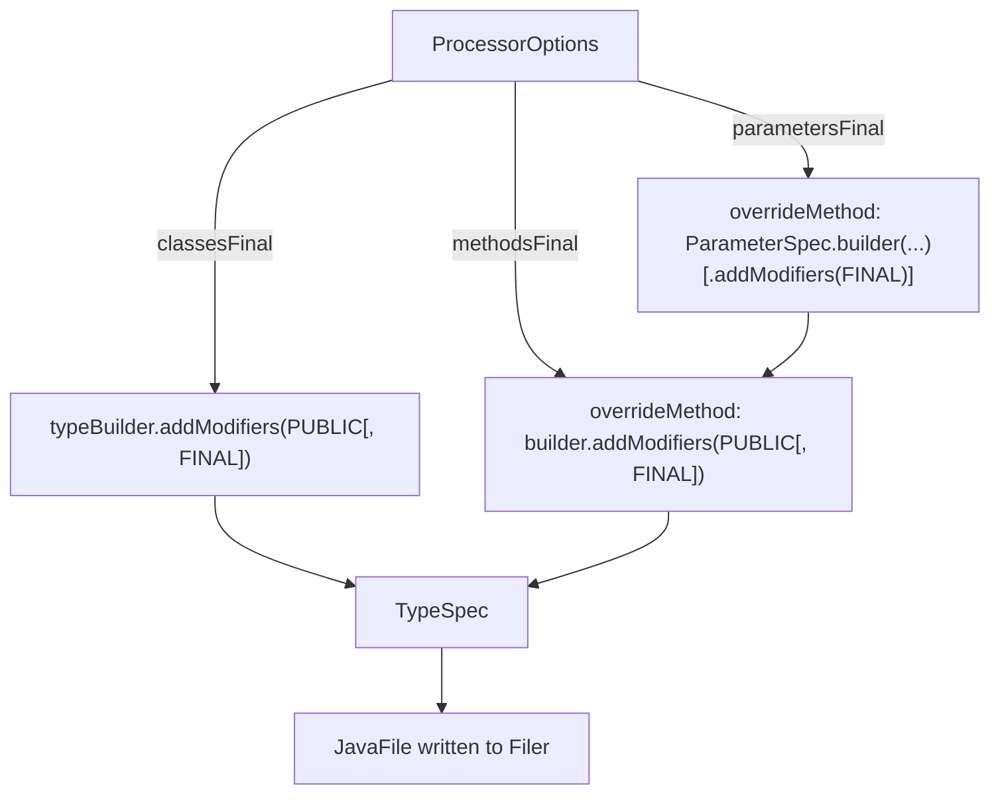

## Context

`GenerateStage`'s final phase, `AssembleMapperType`, builds the generated `<Mapper>Impl` `TypeSpec` via
JavaPoet. Today the class modifiers (`PUBLIC, FINAL`), each overridden method's modifiers (`PUBLIC`), and
each parameter's modifiers (none) are all hard-coded — there is no processor option controlling any of
them. A sibling mechanism already exists one stage over: `BuildMethodBodies` reads `ProcessorOptions` into
a small `LocalStyle` value (`makeFinal`, `useVar`) that controls how hoisted *locals* render, driven by
`-Apercolate.locals.final` / `-Apercolate.locals.var`. This change extends the same "processor option →
per-declaration modifier" shape to the class, its methods, and their parameters.

`ProcessorOptions` is a Lombok `@Value` with a hand-written positional constructor
(`debugGraphs, customNullableAnnotations, localsFinal, localsVar, docTags, timeZone` — 6 args already).
Adding three more booleans pushes it to 9 positional args at every construction call site
(`ProcessorOptions.from(Map)` and any test fixture that builds one directly), which is past the point a
positional constructor stays readable or safe against argument-order mistakes.

## Goals / Non-Goals

**Goals:**
- Three new independent compiler-option switches: `percolate.parameters.final`, `percolate.methods.final`,
  `percolate.classes.final`, each following the existing `percolate.<scope>.<style>` naming convention and
  the existing "default off" polarity.
- `percolate.classes.final` defaulting to `false` is a **deliberate, accepted breaking change**: the
  generated class stops being unconditionally `final`. This is a spec-level invariant change to
  `code-generation`'s "Generated class shape" requirement, not an implementation detail.
- Replace `ProcessorOptions`'s positional constructor with a Lombok `@Builder`, so option growth doesn't
  keep degrading call-site readability.

**Non-Goals:**
- No change to `percolate.locals.final` / `percolate.locals.var` naming or behavior — they already fit the
  convention and are left exactly as they are.
- No change to any engine, SPI, or strategy code — this is confined to `GenerateStage`'s assembly phase and
  the options plumbing that feeds it.
- No lambda-simplification (method-reference elision) or doc-tag repositioning work — explored alongside
  this idea but explicitly descoped; not part of this change.

## Decisions

### D1 — Three independent switches, not one combined "strict finality" flag

Each of class/method/parameter finality is its own option rather than a single umbrella switch. Rationale:
a consumer may want `final` parameters (a style preference with zero behavioral cost) while explicitly
*not* wanting a final class (because they need to subclass the generated mapper for a test double). Bundling
these would force an all-or-nothing choice the existing `locals.final`/`locals.var` precedent doesn't
impose either (those two already compose independently).

**Alternative considered:** a single `percolate.final=true` shorthand that turns all three (and locals) on
at once. Rejected as unnecessary scope for this change; can be added later, additively, if wanted.

### D2 — `percolate.classes.final` defaults to `false`, inverting today's implicit behavior

Today's class modifier is unconditionally `Modifier.PUBLIC, Modifier.FINAL` — there is no "off" state to
default to. Two shapes were considered:

- **(a)** Keep `final` as the default, `percolate.classes.final=false` opts *out*. Backward compatible, but
  breaks the polarity convention every other `percolate.*.final` switch uses (default-off, opt-in adds
  `final`), meaning this one flag alone would need inverted documentation and inverted test expectations.
- **(b) [chosen]** Default `false` (non-final), `percolate.classes.final=true` restores today's behavior.
  Consistent polarity across all four finality switches (`locals`, `parameters`, `methods`, `classes`) —
  "off" always means "no `final`" everywhere. Explicitly breaking for any consumer relying on the implicit
  always-final class, who must now opt in.

Chosen: **(b)**, decided with the user — consistency of the switch family outweighs the silent default
change, and the project's existing convention is to make breaking renames/behavior changes outright rather
than carry a compatibility shim (see prior `feedback_opsx_cli`/no-shim precedent elsewhere in this
codebase).

### D3 — `ProcessorOptions` becomes a Lombok `@Builder`

Replace the hand-written positional constructor and the `from(Map)` static factory's positional
`new ProcessorOptions(...)` call with `ProcessorOptions.builder()...build()`. `from(Map)` still does all
the same parsing (unchanged parsing logic per option), it just assembles the result via the builder instead
of positional arguments. This only affects internal construction and any test fixture that builds a
`ProcessorOptions` directly — no public API beyond the class itself is affected structurally (`@Value`'s
generated getters are unaffected by the builder).

### D4 — Where the three modifiers hook into `AssembleMapperType`

Each of the three checks is a local conditional at the exact point the modifier list is already being
built (`AssembleMapperType.assemble` for the class, `AssembleMapperType.overrideMethod` for methods and
parameters) — no new stage, no new data flowing through the plan; `ProcessorOptions` is already injected
into this stage's constructor path via `MapperContext`/Dagger, the same way `BuildMethodBodies` already
reads it for `LocalStyle`.

## Risks / Trade-offs

- **[Risk] Silent behavior change for existing consumers of `percolate.classes.final`'s default.** Any
  build that does not set `-Apercolate.classes.final=true` will see generated classes go from `final` to
  non-final on upgrade. → **Mitigation**: called out explicitly as **BREAKING** in the proposal and in the
  release-facing changelog/docs; the compile-time-switches manual page documents the new default plainly.
- **[Risk] `final` on a method inside a non-final class is meaningful, but `final` on a method when the
  class is *also* final is a redundant (legal, no-op) modifier.** A consumer could set
  `percolate.methods.final=true` while leaving `percolate.classes.final=false` (its default) — the case
  where the redundancy risk doesn't apply — but could also set both. → **Mitigation**: none needed; this is
  legal Java and a deliberate user choice, not a defect. No warning is generated.
- **[Trade-off] Three new options widen the processor's public option surface** (now 9 recognized keys).
  No mitigation needed beyond documentation — this mirrors the existing `locals.*` precedent exactly.

## Migration Plan

Additive processor-option change, applied entirely within one release: no data migration, no phased
rollout. Consumers who need to preserve today's always-final class must add
`-Apercolate.classes.final=true` to their build when upgrading. No rollback concern beyond reverting the
processor version.

## Open Questions

None outstanding — naming, defaults, and construction-style decisions were settled during exploration
before this design was written.
