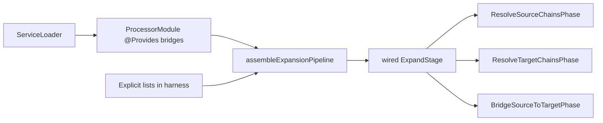

## Context

Graph expansion is the heart of the processor: a fixed-point loop that turns a stable `SEED` graph into an expanded graph by inviting registered strategies (`Bridge`, `SourceStep`, `GroupTarget`) to contribute single-hop edges. The notes archived in `2026-05-09-add-method-call-bridge` establish the algebra: node identity is `(scope, location, type)`, strategies are myopic and converge automatically through identity-based dedup, and the outer loop carries cross-strategy cooperation without any coordination protocol.

The previous test suite (removed in `e2941a4`) failed in three ways simultaneously: golden files needed regenerating on every internal refactor, structural assertions pinned the graph representation rather than its behaviour, and false positives let real bugs reach the downstream consumer. The integration project at `/home/joke/Projects/joke/percolate-integration/mappers` — a personal sandbox, not a CI surface — was the only thing surfacing regressions, late and out-of-tree.

Strategies are registered through Java's `ServiceLoader` (`ProcessorModule.java:218-249`) and declare themselves with `@AutoService`. The strategy count is about to grow substantially: boxing, enum-to-string, multiple date-time conversions. An integration-style test matrix across this set is impractical (O(n²) and growing) and unnecessary — expansion is a pure function whose contract is best stated as algebraic laws.

## Goals / Non-Goals

**Goals:**

- Verify the algebraic contract of `expand(seedGraph, strategySet) → expandedGraph` directly, so the test layer matches the math.
- Cover supported capabilities through data-driven specs that read as living documentation and grow by adding rows, not classes.
- Cover algebraic laws (determinism, idempotence, order-independence, monotonicity, identity collapse, disjoint additivity, empty-strategy identity) through generative property tests that find counterexamples the human did not think of.
- Provide auto-checked invariants on every harness call so every test contributes coverage to convergence, identity collapse, and orphan-free expansion without explicit assertions.
- Match production wiring exactly through a single source of truth (`assembleExpansionPipeline`) so test and production cannot drift.
- Produce useful failure output: shrunken counterexamples for properties, named scenarios for Spock rows, and a DOT-rendered expanded graph dumped on assertion failure.

**Non-Goals:**

- Annotation-processor lifecycle correctness (does `javac` invoke our processor with the right element set?). Belongs in a future in-tree integration tag.
- Lombok interop. Same future tag.
- Code generation (does not yet exist).
- Path selection under multiple alternatives (the future Dijkstra concern). When codegen ships, weight-based selection gets its own test layer.
- Re-creating the `percolate-integration` sandbox. It stays personal and outside CI.

## Decisions

### D1. Two-mode harness — SPI (default) and explicit

`ExpansionHarness` exposes two entry points:

- `expand(SeedGraph)` — loads `Bridge`, `SourceStep`, `GroupTarget` lists via `ServiceLoader` (production parity). Used by Spock data-driven specs and any "system as configured" scenario.
- `expand(SeedGraph, List<Bridge>, List<SourceStep>, List<GroupTarget>)` — takes the lists explicitly. Used by jqwik properties (which must vary the strategy set), isolation tests, and cycle/budget fixtures.

Both paths go through the same `ProcessorModule.assembleExpansionPipeline(...)` factory, so wiring cannot diverge between modes.

**Alternative considered**: a single explicit-only harness with helpers that load SPI on demand. Rejected because the default test surface (capability specs) should look effortless; pushing SPI loading into every test obscures intent.

**Alternative considered**: override Dagger's `@Provides` in a test module. Rejected because Dagger's compile-time generation adds startup overhead to property tests where each invocation cost matters, and because direct assembly is simpler.

**Implementation note — `MapperContext.mapperType` placeholder**: `MapperContext`'s constructor and `ValidatePathsPhase.apply(MapperGraph, TypeElement)` both require a non-null `TypeElement` representing the mapper class — used by `Diagnostics` for error attribution. In a real annotation-processor invocation this is the user's mapper interface. The harness has no such element. To keep the `MapperContext`/`ValidatePathsPhase` signatures untouched, `ExpansionHarness` holds a `MAPPER_PLACEHOLDER` constant resolved via `TypeUniverse.elements().getTypeElement("java.lang.Object")` and uses it everywhere a `TypeElement` is required. The placeholder is opaque to the algebra; the captured diagnostics route through the harness's in-process `Messager` and end up on `ExpansionResult.diagnostics()` regardless.

**Implementation note — `ExpansionResult.roundCount()` is currently a placeholder**: the harness records `1` for every successful run because `ExpandStage` does not surface its internal round counter through `MapperContext`. Tests reading `roundCount()` should not depend on its value today. A follow-up change that wires `ExpandStage` to publish rounds through the context (alongside D6's harness-side assertion of convergence) will make this useful.

### D2. `assembleExpansionPipeline` as the single source of truth

`ProcessorModule.assembleExpansionPipeline(List<Bridge>, List<SourceStep>, List<GroupTarget>)` is a `public static` factory returning the wired `ExpandStage` (with its three phases instantiated and their strategy lists wired in). The three Dagger `@Provides` methods that currently call `ServiceLoader` delegate to this factory after performing the load.

**Rationale**: refactors to phase composition or new dependencies surface in one place and propagate to both Dagger and harness.

**Alternative considered**: leave Dagger as-is and reconstruct the pipeline by hand in the harness. Rejected because every change to `ExpandStage`'s constructor would silently break test wiring with no compile-time signal until tests run.

### D3. TypeMirror sourcing via a static `TypeUniverse`

Node identity contains a `TypeMirror`, whose equality semantics belong to `javac`. Four sourcing strategies were considered:

| Option | Verdict |
|---|---|
| (a) Pull real `javac` into every test via compile-testing (one compilation per test class) | Rejected — startup cost defeats property-test economics; also unnecessary once (d) is shown to work. |
| (b) Stub `TypeMirror` in test-support | Rejected — stub grows every time production calls a new `TypeMirror` method; fragile. |
| (c) Refactor production to a thin type token; wrap `TypeMirror` at the edges | Rejected as in scope here — large refactor, premature, and the graph algebra already treats `TypeMirror` as an opaque equality key. |
| (d) **Static `TypeUniverse` backed by a single long-lived `com.sun.source.util.JavacTask`** | **Chosen.** |

`TypeUniverse` is a static fixture in `processor-test-support` whose initialiser obtains a `JavaCompiler` from `ToolProvider.getSystemJavaCompiler()`, calls `compiler.getTask(null, null, null, null, null, null)` (no sources, no listener), casts the result to `com.sun.source.util.JavacTask`, and pulls `Types`/`Elements` from it via `task.getTypes()` and `task.getElements()`. The `JavacTask` reference is held in a `static final` field for the lifetime of the JVM so that the underlying javac `Context` is never torn down and the captured `TypeMirror` instances remain valid. From that `Elements` the fixture exposes `int`, `Integer`, `long`, `Long`, `String`, an enum (`java.time.DayOfWeek`), `LocalDateTime`, `Instant`, and `List<E>` parameterised over the universe.

**Why this works without compile-testing.** A probe on JDK 25 with a Java 11 target confirmed that:

- `compiler.getTask(null, ...)` returns a usable `com.sun.source.util.JavacTask` without parsing any source.
- `task.getElements().getTypeElement("java.lang.String")` resolves bootstrap classes lazily — no `task.analyze()` or `task.call()` is required.
- `Types.getPrimitiveType`, `Types.getDeclaredType`, `Types.isSameType`, and `TypeMirror.toString()` are all stable.
- The captured types survive GC so long as the task reference is reachable.

The set is small enough that ~half of randomly generated mapper specs are solvable with the registered strategies (matters for generator quality — see R3), and large enough to exercise primitive↔boxed, enum↔string, and container shapes.

**Rationale for fixing the universe**: combinatorial blow-up in property tests is controlled by limiting the type alphabet, not by limiting input size. A 6-type universe lets the generator produce dense, meaningful seeds without exploring a state space the algebra is not meant to handle.

**Public API only.** `TypeUniverse` and `TestResolveCtx` SHALL import nothing from `com.sun.tools.javac.*` (the internal javac packages). All javac access goes through `javax.tools.*`, `javax.lang.model.*`, and `com.sun.source.util.JavacTask`. As a consequence the `processor-test-support` build does **not** require `--add-exports` flags for the `jdk.compiler` module, and `com.google.testing.compile:compile-testing` is **not** a dependency of `processor-test-support`. If a future test surface (e.g., a real-javac integration layer) needs compile-testing, it lives in a different module under the existing `integration` JUnit tag.

### D4. Spock for capability specs, jqwik for properties

The two test layers have different shapes:

- **Capabilities are claims**: "with strategy X, source S reaches target T." Each claim is independent, has a name, and a human curates the list. Spock's `@Unroll` + `where:` produces one named test failure per row, which is exactly the failure mode we want for regressions.
- **Laws are universal**: "for all seeds and strategy sets, expansion is idempotent." Property-based generation is the right tool; the framework is jqwik because it is the only actively maintained option for Java (QuickTheories' last release is 2017).

Both Spock 2.x and jqwik run on JUnit Platform; they coexist in one Gradle `test` task without ceremony.

**Alternative considered**: Spock for everything, encoding properties as `where:` tables with hand-picked rows. Rejected — hand-picked rows test the cases the human imagines; generative testing finds the rest.

### D5. Diagnostic assertions match on kind, not wording

Assertions like `result.reportedNoPathError().forSeedEdge(sourceX, targetY)` test the *kind* of diagnostic (e.g., "no realised path") and the seed edge it was attached to, never the exact message string. Message wording is editorial and may change; the contract is the diagnostic taxonomy.

**Rationale**: pinning wording produces brittle tests, the same brittleness that sank the prior suite. If a future change makes message stability part of the contract for downstream tooling (e.g., IDE consumers grep on text), that decision lives in a different spec.

### D6. Auto-invariants are exposed as `ExpansionResult` checks; harness-side assertion is deferred

`ExpansionResult` exposes four invariant checks that tests can call explicitly:

1. `converged()` — soft flag derived from the captured diagnostics (`true` unless `ExpandStage` emitted "Expansion did not converge after N rounds").
2. `isIdempotent()` — currently returns `true` unconditionally; will be wired to a structural check when D6 is strengthened (see below).
3. `hasIdentityCollisions()` — `true` iff two distinct nodes share the computed `Node.id()` (`(scope, location, type)`).
4. `hasOrphanRealisedNodes()` — `true` iff any `REALISED` edge endpoint is unreachable from any `SEED` endpoint via `REALISED`/`MARKER`/`SUB_SEED` edges.

The harness does **not** assert these before returning. Tests opt in by reading the flags and asserting on them. The Spock specs in this change exercise `converged()` and the property tests exercise `hasIdentityCollisions()` explicitly.

**Why deferred**: the originally proposed "harness asserts on every call, with per-call opt-out" requires a real opt-out mechanism (a builder on the call site) and a way to attach DOT to invariant-failure errors (see D7). That is a follow-up change with its own contract surface, not a no-op refactor; landing the test layer with explicit opt-in is the smaller, less-coupled increment. The eventual strengthening will allow capability rows to get four properties' worth of coverage "for free" as originally pitched, and will unblock the cycle/budget fixtures (tasks 7.2 and 7.3) which need to opt out of convergence.

**Rationale for the current shape**: explicit opt-in is more verbose at the call site but lets each property test pick the invariants relevant to its claim, which is clearer than a blanket assertion that subtly couples every property to four invariants.

### D7. DOT-rendered graph in assertion failure messages

`ExpansionAssertions` constructs its own failure messages and inlines the DOT rendering of the expanded graph (via the existing `DotRenderer` in the `graph` package) into every message it produces. The DOT lives in the `AssertionError` message — no sibling file, no global hook. Property test shrinkage produces minimal counterexamples; minimal is still graph-shaped, and a textual rendering of the graph is the difference between a five-second diagnosis and a thirty-minute one.

**Implementation note**: an earlier draft proposed a global AssertJ "assertion failure" hook that would attach DOT to *any* `AssertionError` thrown inside the test, including auto-invariant failures from the harness. That approach was dropped because the harness does not currently throw on auto-invariants (see D6) — there is no hook surface to install one on. If D6 is later strengthened to assert auto-invariants harness-side, that change SHOULD also extend DOT attachment to those failures.

**Alternative considered**: emit DOT to a sibling file. Rejected because property tests run many cases and per-failure files are noisy; in-line attachment keeps the failure self-contained.

### D8. Deterministic property seeds + `tries` defaults

`processor-test-support` configures jqwik with a default `tries = 500` (per property) and stores shrunken counterexamples in `build/jqwik-database`. Property classes pin a default seed via `@Property(seed = "...")` so CI failures replay locally with one command. This is a small ergonomics investment that pays for itself the first time a flaky-looking shrink turns out to be deterministic.

### D9. Separate gradle module, no SPI registrations

`processor-test-support` ships as a separate gradle module that depends on `processor`. The module deliberately contains **no** `@AutoService` registrations. If it did, every consumer of the test-support module would have its production SPI surface contaminated by test-only strategies. By rule: this module owns test infrastructure; strategies live exclusively in `processor` (or a future strategy module).

## Risks / Trade-offs

[**TypeUniverse javac startup cost**] → Mitigation: the JavacTask is initialised once per JVM (a `static final` field on `TypeUniverse`), not per test class or method. No source files are parsed and `task.analyze()` is never called; bootstrap class resolution happens on-demand inside `Elements.getTypeElement(...)`. The amortised cost across a property-test session is negligible.

[**Internal-javac coupling risk**] → Mitigation: by rule, `processor-test-support` imports nothing from `com.sun.tools.javac.*`. Only public packages are used: `javax.tools`, `javax.lang.model`, and `com.sun.source.util`. The `processor-test-support/build.gradle` carries no `--add-exports` flags. A PMD or import-check rule SHOULD fail the build if an internal-package import sneaks in.

[**Test DSL coupling to seed-graph internals**] → Mitigation: the DSL operates at the seed-graph level (not below), and the proposal premise is that seed shape is stable. If a future change reshapes the seed algebra, the DSL must change — but that change is a deliberate signal that the algebra has grown, not accidental friction.

[**Property generator quality** — too many trivial or unsolvable inputs] → Mitigation: generators emit `MapperSpec` objects (not raw graphs), constrained to the `TypeUniverse`. The universe is sized so that roughly half of random specs are solvable by registered strategies, exercising both success and no-path branches. Generator distribution is reviewed when adding new strategies.

[**Drift between Dagger wiring and explicit-mode harness**] → Mitigation: `assembleExpansionPipeline` is the single source of truth (D2). Any change to phase composition forces both paths to update together.

[**Spock + jqwik in one Gradle test task**] → Mitigation: both frameworks run on JUnit Platform 5; coexistence is supported. Tag conventions (`@Tag("unit")`) keep the existing `unit` vs `integration` split intact.

[**`@AutoService` registrations leaking from test-support**] → Mitigation: hard rule documented in module README and enforced by a Spotless/PMD check (or a simple Gradle assertion) that fails the build if `META-INF/services` exists in `processor-test-support`.

[**False sense of completeness from passing properties**] → Mitigation: property tests check laws, not behaviour. The Spock capability specs remain the canonical "what we support" surface. Both layers must pass — properties cannot replace specs and vice versa.

## Migration Plan

This change adds tests; there is no production migration. Deployment is the merge of the change branch. Rollback is `git revert`. No data, no APIs, no consumers are touched. The percolate-integration sandbox continues to function unchanged because nothing in production is modified except the introduction of the `assembleExpansionPipeline` factory, which is a refactor with no behavioural delta.

## Open Questions

None at proposal time. The following were closed during exploration and are recorded for archive context:

- *TypeMirror sourcing*: chose (d), a static `TypeUniverse` backed by a long-lived `com.sun.source.util.JavacTask`. An initial implementation used `com.sun.tools.javac.code.Types.instance(task.getContext())` and `JavacProcessingEnvironment.instance(...)` — both internal-javac entry points. That approach is unreliable: `JavacProcessingEnvironment.instance(...)` returns `null` unless processing has actually started, and the internal `Types` requires `--add-exports` for `jdk.compiler` modules. A JDK-25 probe confirmed that the public `com.sun.source.util.JavacTask.getTypes()` / `.getElements()` pair returns fully functional implementations without ever calling `task.parse()`, `task.analyze()`, or `task.call()`. The public path is the contract.
- *Assemble-helper placement*: `ProcessorModule` as `public static`.
- *Spock vs jqwik split*: both, on different surfaces (D4).
- *Test-support module isolation*: separate gradle module, zero SPI registrations (D9).
- *Diagnostic stability*: not part of the contract; assertions match on kind (D5).
- *Integration-project scope*: stays personal; future in-tree integration layer is a separate change.
