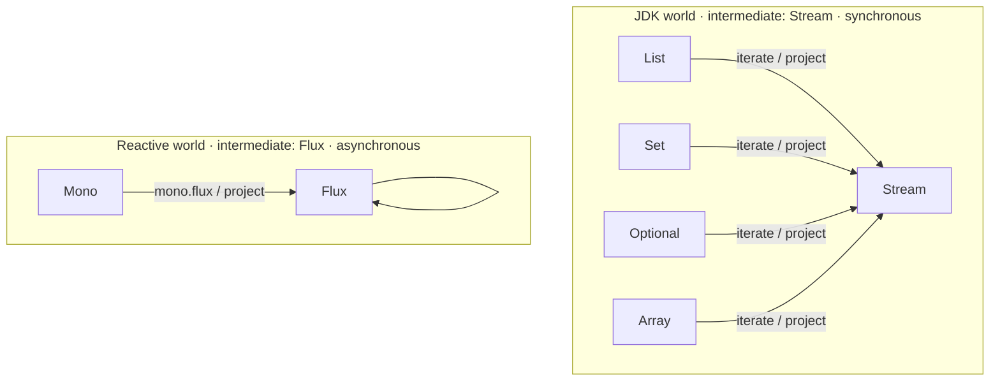
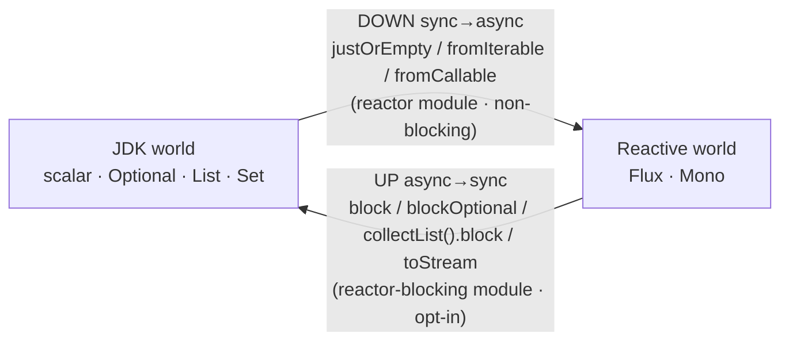

## Context

The `target-driven-engine` change (archived) made the engine uniformly target-driven and graph-agnostic, de-hardcoded `java.util.stream.Stream`, and added the source-facing `SourceProjection` SPI (D8) plus type-variable grounding (D2). It proved — **on paper** (D7) — that Project Reactor support is a pure third-party plugin. This change is the realisation: two Gradle modules built **entirely on the published `spi` surface**.

> **Not an architecture shift.** This change adds **no engine code and modifies no engine requirement.** It is the first real customer of the dev SPI built by the parent change — exactly what that change designed for. The only genuinely new ground is the `kind == intermediate` container shape (`Flux`), which is gated by a spike. If the spike reveals the `Container` base cannot express `kind == intermediate` without an engine change, that is an architecture finding and the spike gate must stop and surface it before any module code is written.

Relevant shipped surface: `Container` (base implementing both `ExpansionStrategy` + `SourceProjection`, with author-declared `intermediateErasure`), `StreamMap` (Stream-keyed functor lift), `Grounding` (type-variable unify/instantiate, restrict-v1 wildcard policy), `Weights`.

## Goals / Non-Goals

**Goals:**
- A `reactor` module (`Flux`/`Mono` containers + `FluxMap` + non-blocking interop) and a `reactor-blocking` opt-in module, both pure SPI plugins with zero engine change.
- Single shared reactive intermediate (`Flux`), so cross-kind reactive composes exactly as JDK cross-kind does over `Stream`.
- The boundary-direction rule (downward auto, upward opt-in only) enforced by *which strategies each module registers* — not by any engine special-case.
- Executed end-to-end tests that turn the parent change's paper claims (zero engine change, no auto-invented blocking) into regression guards.

**Non-Goals:**
- Any engine, `spi`, or `strategies-builtin` source change.
- `Flux → single value` selections other than `single()` (`next`/`last`/positional require a manual converter).
- Bounded-wildcard reactive signatures (`Flux<? extends T>`) — inherits the parent change's restrict-v1 grounding policy (does not unify → no producer).
- A consumer-facing annotation or any change to `@Mapper`.

## Decisions

### D1 — One shared reactive intermediate: `Flux` (Mono projects to Flux)

Both containers declare `intermediateErasure = reactor.core.publisher.Flux`. `Flux` is the sequence kind; `Mono` is the presence wrapper that `iterate`s/projects to `Flux` (`mono.flux()`/`Flux.from`). This mirrors the JDK structure exactly:



*Alternative rejected:* two intermediates (`Flux→Flux`, `Mono→Mono`). It makes `Flux<Dto>→Flux<Entity>` and `Mono<Dto>→Mono<Entity>` work but **kills cross-kind reactive** (`Mono<List<X>>→Flux<Y>`) — there would be no shared intermediate to compose through, just as List↔Stream would fail if they did not share `Stream`. One shared `Flux` is the honest analogue and the real test of the architecture's `intermediate` abstraction.

### D2 — `kind == intermediate` (Flux): spike-gated

`Flux` is the first container whose own type IS the shared intermediate. A naive base would emit a degenerate `Flux<X> ← iterate(Flux<X>)` identity self-loop. The grounding mechanic should bind a `Flux<A>` map port **directly** against an in-scope `Flux<X>` source (no projection needed; the source already has the intermediate's erasure). The spike (task 1) verifies `Flux→Flux` map and `Mono→Flux` compose with no degenerate self-loop and terminate, *before* any module code.

*Alternatives if the spike fails:* (a) have `FluxContainer` omit `iterate`/`collect` (since kind == intermediate, both are identities and a `Flux` source unifies directly); (b) if even that needs base/engine support, STOP and raise the architecture finding.

> **Spike result (PASS, no engine change):** the base *would* emit two identities for a `Flux<B>` target — `collect: Flux<B> ← intermediateOf(B) = Flux<B>` and `iterate: Flux<B> ← containerOf(B) = Flux<B>` (both `matches` and `isIntermediate` hold when kind == intermediate). Resolution is fallback **(a)**: `FluxContainer` **omits both `iterate` and `collect`**, so the base emits no self-loop. Element transform comes from an external `FluxMap` (grounds `Flux<A>` directly against a `Flux<X>` source — no projection); cross-kind `Mono→Flux` comes from `MonoContainer.iterate = mono.flux()` + its `Flux` projection. Corollary: `MonoContainer` also **omits `unwrap`** (`Mono.unwrap` is `block()` — a blocking edge), so the blocking `Mono→T` lands as a separate `reactor-blocking` strategy, not a `MonoContainer` override.

### D3 — Boundary-direction rule via packaging, not engine logic

The engine already invents no bridges (parent D4). The rule "auto-cross downward, never upward" is therefore enforced purely by **which edges exist as registered strategies**:



With only `reactor` present, an upward demand has **no producer** and the engine reports a diagnostic — it never synthesises `.block()`. Blocking becomes possible *only* by adding `reactor-blocking` to the annotation-processor classpath; a WebFlux consumer that never adds it makes blocking codegen structurally impossible.

*Alternatives rejected:* (a) one module with cost-gated blocking — high cost defers but does not prevent blocking when it is the only path (a sync field fed from a reactive source in a WebFlux app blocks silently); only *absence* is a hard guarantee. (b) a `@AllowBlocking` directive — invents new annotation surface for what classpath presence already expresses for free.

### D4 — `single()` is the canonical `Flux → Mono<T>` reduction

The module emits only `single()` for collapsing a `Flux` to one element. A developer demanding a single value from a stream means *exactly one* element; `next`/`last`/positional are distinct intents that must be written by hand. This keeps the reduction unambiguous and target-driven (`Flux<T> → Mono<T>` vs `Flux<T> → Mono<List<T>>` are distinguished by the concrete target).

### D5 — Interop bridges are plain concrete target-driven conversions

The downward bridges and reductions are keyed on the **concrete demanded reactive target**, so the element type falls out of the target — **no type variable is needed**:

```
demand Mono<PersonDTO>          → justOrEmpty   : port Optional<PersonDTO>   (concrete)
demand Mono<List<PersonDAO>>    → collectList   : port Flux<PersonDAO>       (concrete)
demand Mono<Optional<PersonDAO>>→ singleOptional: port Mono<PersonDAO>       (concrete)
```

They are simple `ExpansionStrategy` classes like `ConstructorCall`. Only **element-transforming** maps need type-variable grounding: `FluxMap` (`Flux<B> ← Flux<A>`) is a near-copy of the shipped `StreamMap`, keyed to `Flux`. So "zero engine change" holds and the new code is small.

### D6 — `reactor-core` is a declared dependency of the plugin (revised)

`percolate-reactor` declares `implementation 'io.projectreactor:reactor-core'` (pinned in `dependencies/build.gradle`). Reactor support is therefore a hard requirement of the plugin, and the plugin may reference `Flux`/`Mono` directly (cleaner than FQN strings). Erasure matching still goes through `TypeProbe.isType(t, "reactor.core.publisher.Flux", ctx)`, which resolves against the **consumer's compile classpath** — separate from the annotation-processor path the dependency rides. This is sound because any consumer writing `Flux<X>` mappers necessarily has `reactor-core` on their own compile classpath (their source would not compile otherwise), and the compile-testing suites add it to the test classpath. `intermediateErasure` therefore guards with `requireNonNull` carrying a clear message; the only uncovered window — plugin present, reactor unused, `reactor-core` absent — is a documented-unsupported misconfiguration.

> **Optional-intermediate finding (why not the `Optional<TypeElement>` SPI change).** Building the module surfaced that `Container.intermediateErasure` is called unconditionally by the base (`isIntermediate`, `Container.java:116`) and `ExpandStage.run` wraps no strategy in try/catch — so a strategy that throws on an absent intermediate crashes processing for *every* type. The clean general fix is `Container.intermediateErasure → Optional<TypeElement>` (a small additive `spi` change). We instead make `reactor-core` a hard plugin dependency (decision D6) and keep `requireNonNull`, preserving **zero `spi` change**; the gap is real and recorded here for a future change should a genuinely-optional intermediate ever be needed.

### D7 — Blocking edges weighted above any non-blocking alternative

In `reactor-blocking`, each upward edge carries a weight higher than any non-blocking path. This is not just preference: for `Mono<Dao> map(Mono<Dto>)`, the lazy `mono.map(f)` and the eager `Mono.just(f(mono.block()))` are **not equivalent Monos** (deferred vs blocks-at-assembly). The weight guarantees the lazy path wins — a correctness property, not a style one.

### D7 — bean-field convention; direct container-return is a pre-existing limitation (finding)

Building the module surfaced that percolate produces **no plan for a direct container-return** top-level method (`Flux<DAO> map(Flux<DTO>)`) — and the builtin `StreamMap` fails identically for `List<DAO> map(List<DTO>)`. The engine only maps a container when it is a **bean field sourced via `@Map`** (the Beast/Creature pattern); every existing container test is bean-field. This is **pre-existing, paradigm-agnostic, and not introduced by this change.** Decision: reactor ships using the bean-field convention (validated — generates `new Tgt(src.getPeople().map(e -> mapOne(e)))`), and "direct container-return mappers" is recorded as a known limitation and a candidate **separate** engine change (it would touch root-demand seeding/source-binding, breaking the zero-engine-change thesis if folded in here). The canonical reactive signatures discussed during design (`Flux<DAO> map(Flux<DTO>)`) therefore require a bean wrapper today.

### D8 — `reactor-blocking` deferred (self-bridge quirk finding)

Building `reactor-blocking` surfaced a second pre-existing, paradigm-agnostic percolate quirk: a mapper method **bridges its own signature** — `Tgt map(Src)` is generated as `return this.map(src)` whenever the legitimate plan is more expensive than a method call. Because the blocking edges are deliberately weighted high (D7), the self-bridge always out-prices them, masking the blocking path (and also masking a clean "no plan" for an unsatisfiable bean root). The blocking strategies themselves are correct and terminate (reuse-only ports, the `unwrap` pattern). Decision: **defer `reactor-blocking` to a follow-up** that first fixes the engine to exclude a method from bridging its own exact signature. This change still delivers the boundary rule's load-bearing half — *the engine never auto-invents blocking* — proven by the `reactor`-only negatives.

## Risks / Trade-offs

- **`kind == intermediate` (Flux) degeneracy** → gated by the spike (D2, task 1); module code does not start until it holds, with two documented fallbacks and an explicit STOP-and-surface if both fail.
- **`Flux → Mono<T>` ambiguity vs other selections** → resolved by D4 (only `single()` auto; documented limitation; manual converter for the rest).
- **Bounded-wildcard reactive signatures** (`Flux<? extends T>`) → inherits parent restrict-v1 (no unify → no producer); documented, follow-up.
- **Accidental silent blocking** → impossible in the default module by construction (no upward edge exists); the `Mono→scalar`/`Flux→List` "no producer" negative tests are the standing guards.
- **Test wiring (processor + plugin on the test annotation-processor path)** → the module's own test source set uses `testAnnotationProcessor project(':processor')` + the module + `reactor-core`; same single-threaded test config as `spi`/`strategies-builtin` (shared javac `TypeUniverse`).

## Migration Plan

1. **Spike (task 1, gate):** prove `Flux` (`kind == intermediate`) composes `Flux→Flux` map and `Mono→Flux` with no degenerate self-loop and terminates. Stop and surface if it needs engine support.
2. Add `reactor` module + `reactor-core` pin; `FluxContainer`/`MonoContainer` over the shared `Flux` intermediate; `FluxMap`.
3. Add the non-blocking downward bridges + reductions (`justOrEmpty`/`fromIterable`/`fromStream`/`fromCallable`/`collectList`/`single`/`singleOptional`).
4. Add `reactor-blocking` module with the weighted upward edges.
5. End-to-end Spock suites (positive per family + the upward "no producer" negatives + the high-weight-no-eager-block guard).

Rollback: both modules are additive and isolated; removing them from `settings.gradle` reverts with no engine impact.

## Open Questions

- None blocking. `single()` (D4) and the `reactor`/`reactor-blocking` naming (no `spring`) are decided; the `kind == intermediate` behaviour is the only technical unknown and is the spike's job.
