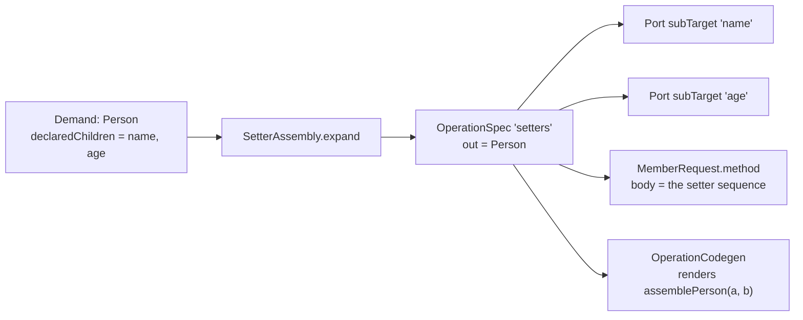
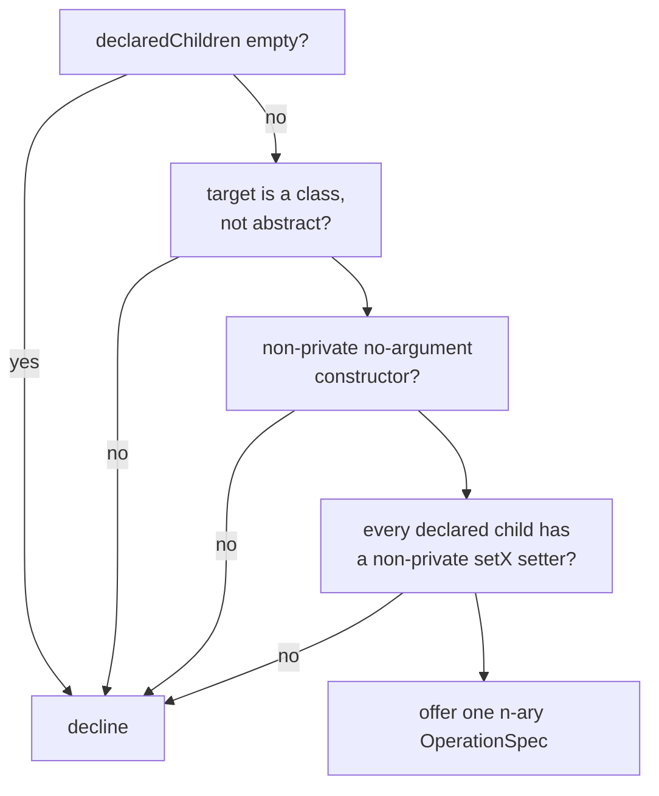

## Context

Percolate produces a target through an `ExpansionStrategy` that emits an `OperationSpec`. Two assembly forms
ship today. `ConstructorCall` gates on set **equality** between the demand's declared children and a
constructor's parameter names. `BuilderAssembly` gates on **containment** of the declared children in a
builder's setter names. Both emit **one** n-ary operation with one sub-target port per declared child.

That single-operation shape is load-bearing. `Cost` is the lexicographic vector `(partials, weight)`, and
partials dominate absolutely. An unsatisfied sub-target port makes the plan partial, which is how an
undeliverable declared mapping fails loudly. Per-setter operations would turn an omitted setter into a
**cheaper** plan instead of a partial one, so the minimum-cost fold would drop a declared mapping in silence.

A JavaBean has a no-argument constructor and `setX` methods. Assembling one is a statement sequence over a
materialised local. Every `OperationCodegen` renders one expression, so `add-builder-assembly` excluded this
form and named it as its own change.

`BodyCodegen` already renders a whole method body, but only at a method return root. A bean can be demanded
anywhere in a plan, so `BodyCodegen` does not apply.

The engine already hoists strategy-requested class members. `MemberRequest` carries a field type, an
initializer, and a dedup key. `MemberPlan` deduplicates by that key, allocates a class-scope name, and emits
one `private static final` field. The temporal formatters are its only customer.

## Goals / Non-Goals

**Goals:**

- Map to a JavaBean target through its no-argument constructor and its setters.
- Keep the single n-ary operation, so totality still rides on sub-target ports.
- Add no setter vocabulary to the engine.
- Let the author set the visibility and the `static` modifier of every generated helper member.
- Make three assembly forms totally ordered, so two forms can never tie.
- Change no current mapping's generated output.

**Non-Goals:**

- Updating an existing bean in place (`@MappingTarget`). See *Forward compatibility* below.
- Any setter convention other than JavaBean `setX`.
- A composable statement shape in the SPI. The statements stay inside a generated member.
- A new arbitration mechanism. Each strategy still prices only itself.

## Decisions

### D1 — The setter sequence lives in a generated helper method

`SetterAssembly` emits one n-ary `OperationSpec`. Its codegen renders **one call**. The statements sit in a
helper method the operation requests as a class member.

```java
// requested member, emitted once per (form, target, ordered child list)
private static Person assemblePerson(String name, int age) {
    Person result = new Person();
    result.setName(name);
    result.setAge(age);
    return result;
}

// what the operation renders
assemblePerson(dto.getName(), dto.getAge())
```



**Alternative considered — a composable statement shape in the SPI.** An `OperationCodegen` variant that
returns statements plus a result name. This changes the render contract every strategy depends on, and it makes
the generate stage decide where a statement list may appear. The helper needs neither. Rejected.

**Alternative considered — per-setter operations.** Rejected for the totality reason in *Context*. This is the
same rule `add-builder-assembly` established, and it is not open for re-decision.

### D2 — `MemberRequest` becomes an interface with two kinds

`MemberRequest` is a Lombok `@Value` class describing a field. It becomes an interface carrying only
`String dedupKey()`, with two `@Value` implementations and two static factories.

| Factory | Carries | Emits |
|---|---|---|
| `MemberRequest.field(TypeName, CodeBlock, String)` | field type, initializer, dedup key | a field |
| `MemberRequest.method(TypeName, List<Param>, CodeBlock, String)` | return type, ordered parameters, body, dedup key | a method |

`MemberPlan` dispatches on the kind in one place. The engine reads no member content, so it still makes no
codegen choice — it dispatches on a shape the strategy declared, which is the same rule that lets
`OperationCodegen` and `BodyCodegen` coexist.

**This is source-breaking for third-party strategy authors.** `new MemberRequest(type, init, key)` becomes
`MemberRequest.field(type, init, key)`. The change is already breaking through D4, so the cost is paid once.

**Alternative considered — one concrete class with a nullable method part.** It keeps source compatibility but
produces a value type whose fields are mutually exclusive, and every reader must ask which half is set.
Rejected.

### D3 — Member modifiers come from typed options read by the generate stage

`MemberPlan` hard-codes `PRIVATE, STATIC, FINAL`. Two options replace that constant.

```
percolate.helpers.visibility = private (default) | package | protected | public
percolate.helpers.static     = true (default) | false
```

Both carry **typed** `ProcessorOptions` fields, because the generate stage reads them. This follows the rule the
`processor-options` spec already states: a typed field exists only for an option an engine-internal consumer
reads. `percolate.locals.final`, `percolate.methods.final` and `percolate.classes.final` are the precedent —
each sets a modifier the generate stage emits.

The options apply to **both** member kinds. A requested field keeps `final`, which is not configurable, because
a mutable shared field would be a correctness change rather than a style change. The defaults reproduce today's
`private static final` field exactly, so no current output moves.

`static` defaults to `true`. The fields are already static, one rule for two kinds beats two rules, and the
setter helper reads no instance state.

**No `instanceRequired` flag ships.** Exploration proposed one, to let a request refuse `static`. Every member
percolate emits today is static-safe, so the flag would have no consumer and no test that can fail. The later
feature that needs an instance member adds one boolean to one interface. Adding it now is unused weight.

### D4 — The construction preference becomes a ranked list

`ConstructorCall` reads `from(ctx.option(KEY)) == BUILDER ? EXPENSIVE : STEP`. With a third form, two forms
share `EXPENSIVE` and tie. A target with a builder and setters but no matching all-args constructor reaches
that tie, and the minimum-cost fold then resolves it by an accident no author declared.

The option accepts an **ordered list**:

```
-Apercolate.construction.preference=builder,setter
```

`ConstructionPreference` owns the whole parse. It appends the unlisted tokens in the fixed default order
`constructor, builder, setter`, then maps each rank to a weight:

| Rank | Weight | Value |
|---|---|---|
| 0 | `Weights.STEP` | 1 |
| 1 | `Weights.EXPENSIVE` | 3 |
| 2 | `Weights.EXPENSIVE + 1` | 4 |

Each strategy calls `ConstructionPreference.weightOf(SETTER, ctx.option(KEY))` and receives its own number. No
strategy inspects another, and exactly one parser exists for the option. This is **less** coupled than today,
where `ConstructorCall` names the `BUILDER` token in its own weight expression.

The mapping preserves current behaviour exactly:

| Option value | constructor | builder | setter |
|---|---|---|---|
| absent | 1 *(was 1)* | 3 *(was 3)* | 4 |
| `constructor` | 1 *(was 1)* | 3 *(was 3)* | 4 |
| `builder` | 3 *(was 3)* | 1 *(was 1)* | 4 |

An unrecognised token degrades to the default order and never fails the round, as the current parser does.

**Alternative considered — distinct fallback constants per strategy.** Each strategy hard-codes a number that
only makes sense next to the other two. The coupling becomes implicit and untestable. Rejected.

**Alternative considered — accept the tie.** A documented accident is still an accident, and it fires on a
reachable shape. Rejected.

### D5 — The gate



- **Containment, not equality.** A bean exposes far more setters than a mapping declares. This matches
  `BuilderAssembly` and differs from `ConstructorCall`.
- **The empty-declaration bail is kept.** An empty declared set must never satisfy a leaf demand through a
  no-argument constructor that happens to exist.
- **Inherited setters count.** `ResolveCtx.membersOf` calls `Elements.getAllMembers`, so a setter on a
  supertype matches. Bean hierarchies are common, so this matters more here than for builders.
- **Any setter return type is accepted.** A JavaBean setter returns `void`. Some return `this`. The helper
  discards the result either way, so the return type is not part of the match.
- **Port types come from the setter parameter**, and each port's nullness resolves through the demand's
  nullness oracle, exactly as the other two forms do.

### D6 — Helper identity carries the form

The dedup key is `(form, target type, ordered child names)`. The parameter types follow from the target and the
children, so they add nothing to the key.

The form is part of the key from the start. The update feature (see below) requests a helper for the same
target and the same children with a different body. Adding the form later would rename generated members, which
is a visible change for anyone who reads the output.

The helper body allocates its local through a JavaPoet `NameAllocator`, because a bean may declare a property
named `result`.

### D7 — One strategy, no convention hierarchy

`SetterAssembly` is a `final class` implementing `ExpansionStrategy` directly, like `ConstructorCall`.
`BuilderAssembly` earned its abstract base by shipping four conventions at once. One convention does not earn
one.

### Forward compatibility with in-place bean update

MapStruct's `void updateCarFromDto(CarDto dto, @MappingTarget Car car)` is **out of scope**. It shares the
setter sequence and nothing else. Its cost sits in the engine:

1. `@MappingTarget` must remove a parameter from ordinary sourcing. No precedent exists. `@Ambient` looks
   similar but is additive — its spec states the parameter stays an ordinary `@Map` source root.
2. Without that subtraction, `DirectAssign` binds the in-scope `Car` at `Weights.NOOP = 0` and the winning plan
   is `return car;`. Zero beats every producer.
3. Creation must be refused at that root, or all three assembly forms build a fresh instance and drop the one
   the caller passed. A `Constraint` covers this. That mechanism exists.
4. A `void` method has no root demand. Every mapper method drives from its return type today.

Two decisions in this change keep that feature cheap, and both cost nothing now: the form is in the dedup key
(D6), and a method member request carries an ordered parameter list, so a leading receiver parameter is a pure
addition (D2). Creation is then update applied to a fresh instance:

```java
private static Car updateCar(Car result, String name, int age) { … }
private static Car assembleCar(String name, int age) { return updateCar(new Car(), name, age); }
```

No `updateCar` helper is emitted in this change. An unused generated method is dead code in the user's output.

**Nested in-place update** — updating a nested bean instead of replacing it — reaches into port sourcing and is
deeper still. Exclude it explicitly when that change is scoped.

## Risks / Trade-offs

**The ranked list changes a public strategy-facing API.** → `ConstructionPreference.from` is removed rather
than kept beside a new query, because the `processor-options` spec requires exactly one parser per option. The
break is recorded in the proposal, and both current option values keep their current behaviour.

**A bean with an all-args constructor and setters now has three passing gates.** → The ranked list orders them,
and the default keeps the constructor first. The e2e layer pins this with a fixture compiled once per setting,
as the builder change did.

**A generated helper with many parameters reads poorly.** → A bean with 30 declared children yields a
30-parameter helper. `ConstructorCall` already has the same shape for a 30-parameter constructor. Accepted.

**`percolate.helpers.visibility=protected` on a `final` generated class.** → Legal Java, and a static analyser
in the consumer's project may object. The two options are independent by design, so the combination is the
author's choice. Documented, not blocked.

**A bean whose setter takes a primitive while the source is nullable.** → The port carries the setter's
parameter type and the demand's nullness, so the existing nullness machinery reports it. No new handling.

**Widening `MemberRequest` invites unrelated member kinds.** → The interface carries `dedupKey()` only, and
both implementations stay in the SPI. A new kind needs a spec change, which is the intended friction.
