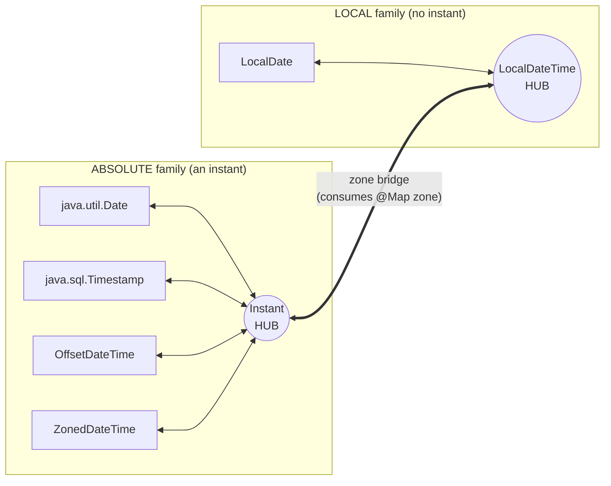
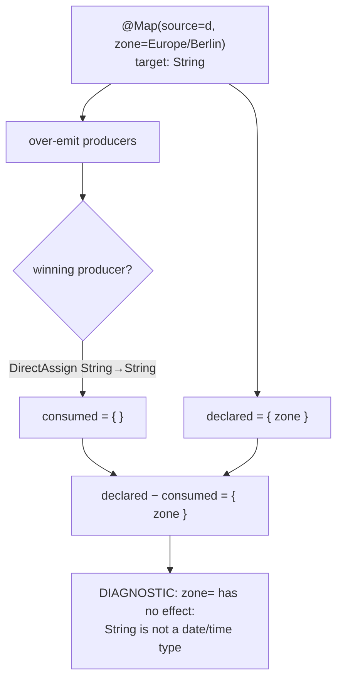
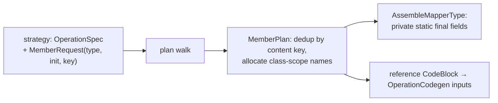

## Context

Percolate resolves a demanded target by **over-emitting** candidate producers (myopic strategies), then
**cost-pruning to one** cheapest plan and **grounding** it. Conversions compose for free: no strategy authors
`int → Long`; the engine finds `int →(widen) long →(box) Long` through synthesized intermediate type Values
and prunes to it (`type-conversion` spec; `PrimitiveWrapperConversion` javadoc). Codegen is a recursive walk
of the extracted plan emitting expressions — there is **no IR**, and the composer holds **zero container
syntax**; every container-touching snippet comes from a strategy-supplied `OperationCodegen`
(`inputs -> CodeBlock`). Strategies are strictly myopic: they decide from `Demand + ResolveCtx` and never
touch the graph.

Today there is no temporal support at all, `@Map` carries only `source`/`constant`/`defaultValue`, and codegen
can emit **expressions and locals but no class members**. This change adds date/time mapping and, to do it
honestly, lands two roadmap growth axes it is the first customer of.

## Goals / Non-Goals

**Goals:**
- Map `java.util.Date` / `java.sql.*` / `java.time.*` targets automatically, and `String ↔ temporal` via
  `@Map(format = …)`.
- Add these **without touching the engine core** (over-emit + cost-prune + grounding stay byte-for-byte).
- Establish two reusable seams — a validated per-directive **option rail** and **class-member codegen** — so
  `@Named`/`@Context`/mapper-uses-mapper inherit them.
- Consistency over fidelity/efficiency: exactly one resolution path per type pair; a hub may re-express a
  value but never silently truncates it.

**Non-Goals:**
- No N×N direct conversion table; no direct high-fidelity shortcuts even where they exist (e.g.
  `ZonedDateTime.toOffsetDateTime()` preserving the source offset).
- No auto-conversion for partials — `LocalTime`, `Year`, `YearMonth`, `MonthDay`, epoch `long` — they stay
  user-helper (`MethodCallBridge`) territory.
- No runtime library; all output is plain `java.time`/`java.util`/`java.sql` calls.
- No general third-party option *keys* yet (the rail is built; opening it to arbitrary community keys is a
  later step on the same rail).

## Decisions

### D1 — Two hubs + one zone bridge, not an N×N table

Route every temporal pair through the widest type of its family and let the engine compose the chain.



Any `A → B` is at most `spoke → hubₐ → [zone] → hub_b → spoke`; every leg is a **single-hop** emission and the
engine assembles + prunes to the shortest path. There is exactly one path per pair, so nothing to tie-break.
Spoke conversions are `Conversion`-base emissions (target-driven, directive-blind); the **zone bridge**
implements `ExpansionStrategy` directly because it reads `demand.directive()` for the zone and stamps
consumption (D3).

- **Alternative — N×N table:** rejected; O(N²) authored conversions and multiple competing paths to
  cost-tie-break. The engine's compose-through-intermediates is exactly what makes the hub model free.
- **Alternative — single hub (`Instant` only):** rejected; it would over-connect the local family (`LocalDate
  → LocalTime` via a spurious zone round-trip) and force a zone onto zone-free local↔local hops. Two hubs
  mirror java.time's own machine-vs-human split.

### D2 — No-truncation invariant

**A hub is always the widest type in its family; a time-dropping type (`LocalDate`, `LocalTime`) is never a
hub.** So a hub is at least as information-rich as both endpoints share, and can never silently drop a
time-of-day. `00:00:00` (start-of-day) appears in exactly one place — a `LocalDate` **source** that inherently
never had a time — never as a hub artifact. Adopted semantic: *a `LocalDateTime` always means wall-time in the
resolved zone*, so `ODT/ZDT → LocalDateTime` re-zones (instant identical, displayed hour reflects the zone).

### D3 — Consumption-tracked option rail (validated + universal)

Keep **typed** `@Map` fields (`format`, `zone`, default `UNSET`) for DX, but back them with a general
consumption model: the strategy that *reads* an option **stamps its key** onto the `OperationSpec` it emits
(myopic — the consumer declares consumption). A late pass unions the stamps over the **winning** plan and
diagnoses any declared-but-unconsumed option.



This validates `zone`/`format` (and every future option) with **no per-option code**, and reuses the existing
late-diagnostic shape (`ConstantValue` leaves a demand UNSAT; a late pass reports it).

- **Alternative — typed fields only:** no way to detect a misapplied option (silently ignored) — fails the
  "zone only settable for date-relevant stuff" requirement.
- **Alternative — `String[] options()` bag:** extensible but stringly-typed, no IDE/validation. The rail gives
  the validation now; a bag can back the typed fields later without re-plumbing.

### D4 — Zone resolution precedence; never bake the build-machine zone

```
  @Map(zone="America/New_York")   →  ZoneId.of("America/New_York")   (frozen literal)
  else -Apercolate.time.zone=...  →  ZoneId.of("...")                (frozen, project-wide)
  else (unset)                    →  ZoneId.systemDefault()          (generated → resolved at consumer
                                                                       runtime, honours -Duser.timezone)
```

The processor never reads its own JVM zone and freezes it; an unpinned mapper defers to the consumer's
`-Duser.timezone` at runtime.

### D5 — Class-member codegen axis (declarative, collected in the walk)

Extend codegen so a strategy can request a **class-level member** and reference it, without breaking the
no-IR/expression-walk shape. A member is declared on the `OperationSpec` (not pushed through a mutable sink),
collected during the same recursive plan walk that already gathers locals, **deduplicated by a content key**
(type + initializer) at class scope, named by a class-scoped `NameAllocator` (the sibling of `HoistPlan`'s
method-scoped one), and emitted by `AssembleMapperType` as `private static final` fields. The reference reaches
the strategy's codegen through the **same indirection as a hoisted local**, so the composer still holds zero
field syntax.



The strategy **chooses** member-vs-inline by requesting a member or not — the thread-safety fork in D6 rides on
this.

> ⚠️ **Architecture note (extension, not a break):** this adds a *new capability* to `code-generation` (members
> alongside locals) and a member-request field to the SPI's codegen surface. It does **not** introduce an IR,
> a mutable graph, or cross-hop state — members are collected in the existing walk exactly as locals are, and
> the composition ⟂ snippets seam is preserved. The one open mechanics question (port-modeled vs sidecar
> reference) is deferred to the spike (see Open Questions).

### D6 — Format strategies split by formatter thread-safety

`@Map(format=…)` strategies implement `ExpansionStrategy` directly (they read the directive). Split by target:

| Target family | Formatter | Codegen |
|---|---|---|
| `java.time.*` | `DateTimeFormatter` (immutable, thread-safe) | **hoisted** shared `private static final` (D5) |
| `java.util.Date`, `java.sql.*` | `SimpleDateFormat` (**not** thread-safe) | **inline** `new SimpleDateFormat(p)` per call — never hoisted |

`format` is stamped-consumed via D3, so `@Map(format=…)` on a non-temporal / non-`String`-crossing target
diagnoses.

### D7 — Internal spike sequencing

Build in dependency order, each spike proving its seam before the next: **(0)** option rail →
**(1)** member-codegen axis → **(2)** temporal hubs + zone bridge → **(3)** format strategies → **(4)** the doc
chapter + behavioural doc-e2e. If a spike proves larger than scoped, it splits into its own change.

## Risks / Trade-offs

- **Hub re-expression surprises a user** (`ODT +02:00 → LocalDateTime` shows `14:30` not `15:30` under a
  `+01:00` zone) → documented explicitly as "a `LocalDateTime` is wall-time in the resolved zone"; the instant
  is always identical (D2). Accepted per the consistency-over-fidelity call.
- **Member-codegen axis over-reaches into the graph** → mitigated by keeping members declarative and collected
  in the existing walk (D5), no IR, spike-gated; `AssembleMapperType` is near the ArchUnit size cap and must be
  decomposed if the field/naming logic pushes it over (extract a `MemberPlan` collaborator, mirroring
  `HoistPlan`/`TypeNameRenderer`).
- **Unconsumed-option false positives** (an option legitimately consumed by a non-winning branch) → the rail
  keys off the **winning** plan only, matching "what the generated code actually does"; a legitimately unused
  option *is* a user error worth reporting.
- **`SimpleDateFormat` hoisted by mistake** → the SPI makes hoisting opt-in per strategy; D6's legacy path
  requests no member, so it cannot be shared. Covered by an explicit thread-safety scenario.
- **pitest/ArchUnit ratchet** (new strategies + codegen) → unit-test each new class at the mock seam; no
  `private` methods; keep module-separation edges test-scope only.

## Open Questions

- **Member reference mechanics:** model the hoisted member as an extra input *port* sourced from a class field
  (unifies with `IncomingValues`), or as a lightweight *sidecar* reference resolved at assembly? Decide in
  spike 1; both keep the composer pure.
- **`java.sql.Date` vs `java.sql.Timestamp`:** `java.sql.Date` has no time — treat it as a `LocalDate`-like
  spoke (local family) rather than an absolute one? Resolve when authoring the roster in spike 2.
- **`format` + a temporal target that is not `String`** (e.g. `@Map(format=…)` on `Date → Instant`): treat as
  unconsumed (diagnose) or as a hint? Default: unconsumed → diagnose (format is a String-crossing concern).
