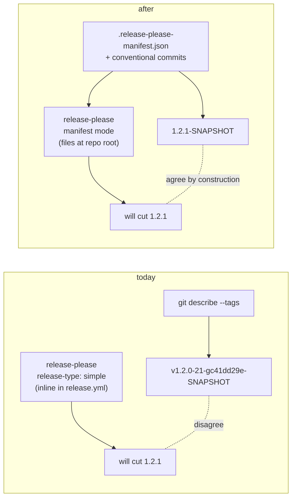
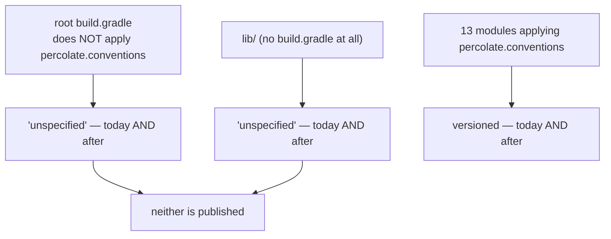
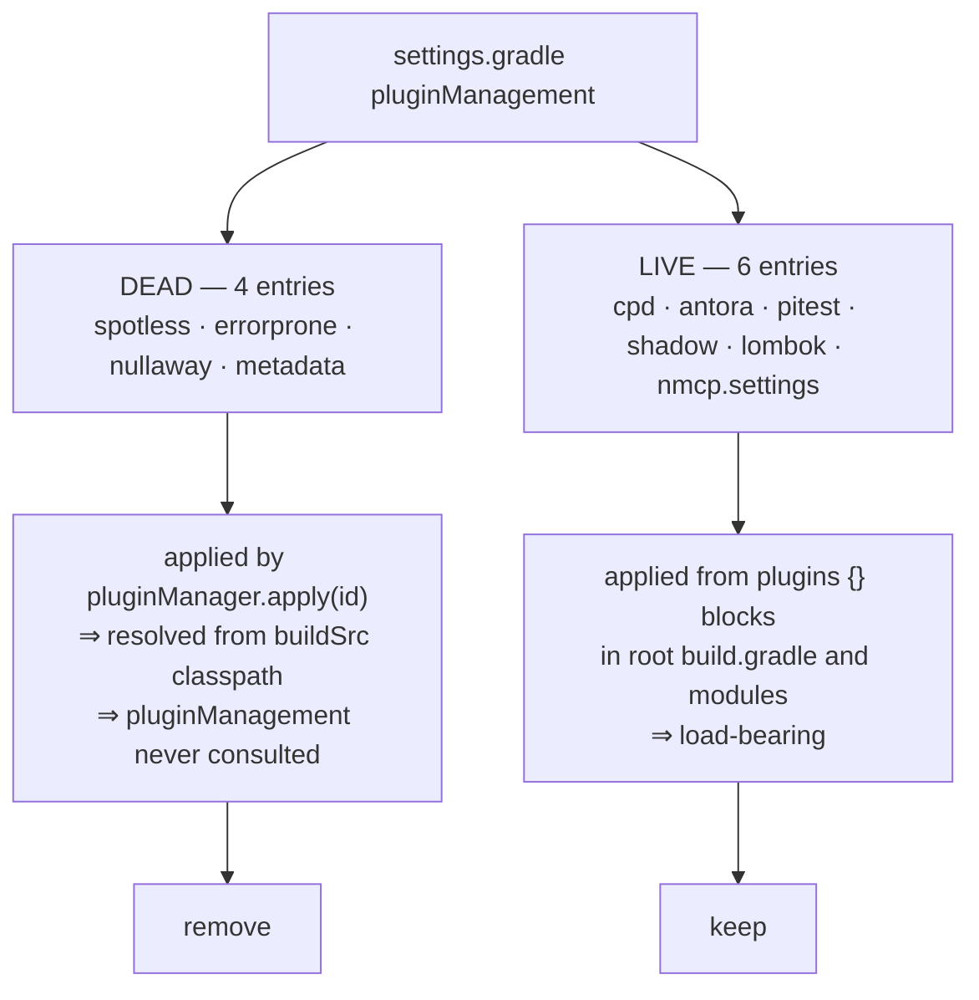
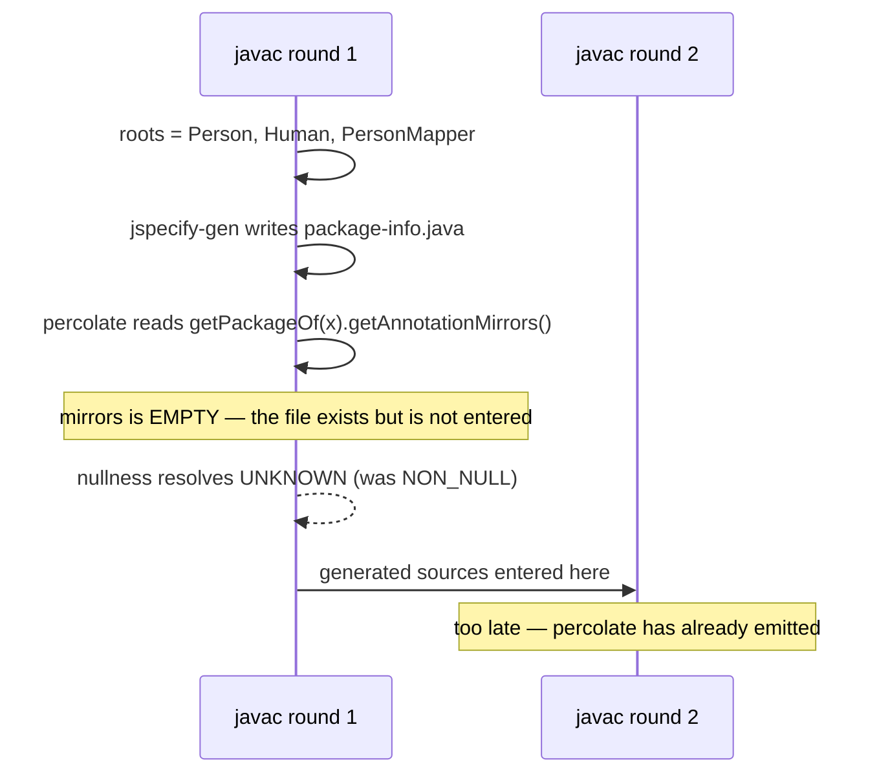
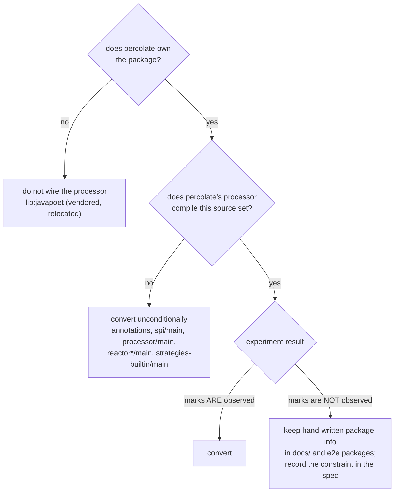

## Context

Two hand-transcribed build facts are being replaced by tools that derive them. Both tools were
written for this problem, released, and already dogfooded in the sibling `jspecify` repository —
whose convention plugin is a direct descendant of percolate's, with the versioning migration already
applied. This change is largely a transplant of a validated shape rather than a new design.

**Current version derivation** (`percolate.conventions.gradle`, lines 7–19): two `providers.exec`
calls to `git describe`, combined by a ternary. At HEAD this yields
`v1.2.0-21-gc41dd29e-SNAPSHOT`. It has three defects: it never bumps (a `feat:` still produces a
`v1.2.0-…` coordinate), it changes on every commit (so nothing can depend on it), and it embeds a
`v` prefix and commit hash that are not a Maven version.

**Current null-marking**: 45 `package-info.java` files. 44 contain exactly one annotation line.

**Current plugin version declaration**: split across `settings.gradle` `pluginManagement` (10 entries)
and `buildSrc/build.gradle` (4 entries), overlapping on four plugins — one of which,
NullAway, disagrees with itself (`3.1.0` vs `3.0.0`).



**Constraints.** Gradle 9.6.1 with the configuration cache on by default; Isolated Projects is
staged but off. Java 11 release level. The convention plugin is deliberately singular — one
`percolate.conventions` id per module, no per-concern split.

## Goals / Non-Goals

**Goals:**

- `project.version` predicts what `release-please` will publish, from the files `release-please`
  itself reads, so the two cannot disagree.
- A snapshot coordinate is stable across every commit in a release range.
- The repository-wide null-marking policy is stated once (by applying a processor) rather than
  transcribed 45 times.
- A project plugin's version is declared in exactly one place.
- Configuration cache compatibility is preserved. The versioning plugin declares
  `configurationCache = true`; the two `providers.exec` calls it replaces are the pattern that
  previously broke under the config cache with shipkit.

**Non-Goals:**

- Changing what `release-please` releases, when, or how the tag is named. The plugin *calculates*;
  it creates no tag, writes no changelog and contributes no task. `release-please` remains the sole
  release authority.
- Per-module versioning. percolate stays single repo-wide version, one manifest package (`.`).
- Gating publication on the plugin's `releasable` flag. The existing `release_created` gate in
  `release.yml` already does this and is unchanged.
- Enabling Isolated Projects. Still blocked on `info.solidsoft.pitest`.
- Changing percolate's nullness *resolution algorithm*. The `nullability` capability is untouched;
  what changes is where the `@NullMarked` input comes from.

## Decisions

### D1 — Apply the versioning plugin in the convention plugin, not `settings.gradle`

The plugin dispatches on what it is applied to. Settings mode versions every project automatically;
project mode versions only projects that apply it.

Percolate's coverage is **identical either way**, which makes project mode free:



Version is already set *inside* `percolate.conventions.gradle`, so the two uncovered projects are
uncovered today. Project mode reproduces the status quo exactly, with no publishable module left at
`unspecified`.

*Alternative considered:* the settings plugin, which is the tool's own default recommendation.
Rejected because it would move a build fact out of the single convention plugin that the
`isolated-projects-build` capability requires cross-module configuration to live in, purely to gain
coverage of two projects that are not published.

### D2 — Depend on the plugin **marker**, not the implementation jar

`buildSrc` is a separate build with its own classpath; `settings.gradle`'s `pluginManagement` does
not reach it. The coordinate form is determined by *how the plugin is applied*:

| application style | resolves via | coordinate needed |
|---|---|---|
| `pluginManager.apply('some.id')` | descriptor read from a jar already on the classpath | implementation jar |
| `plugins { id 'some.id' }` in a precompiled script plugin | resolves an id the way a build script does | **plugin marker** |

The versioning plugin sets `version`, so it cannot be deferred inside a `pluginManager.withPlugin`
callback — it must come from the `plugins {}` block at the top of the script. Therefore the marker:

```
io.github.joke.conventional-version:io.github.joke.conventional-version.gradle.plugin:2.1.0
```

The four existing `buildSrc` dependencies keep their implementation-jar form, because all four are
applied with `pluginManager.apply(id)`. This asymmetry is intentional and must be commented, or it
reads as an inconsistency and will be "fixed" into a broken build.

### D3 — Remove only the dead `pluginManagement` entries

Percolate cannot go to zero entries the way `jspecify` did, because its root build script and its
modules apply plugins from real `plugins {}` blocks.



Removing the dead four resolves the NullAway disagreement by deleting the losing declaration, rather
than by aligning two numbers that will drift again. `com.diffplug.gradle.spotless` is doubly dead —
it is the legacy id, and the convention plugin applies `com.diffplug.spotless`.

*Alternative considered:* bump `settings.gradle`'s NullAway to match `3.0.0`. Rejected — it preserves
the duplication that caused the drift.

### D4 — `release-please` manifest mode, seeded to the current release

The plugin requires manifest mode and fails the build if either file is missing. Keeping
`release-type: simple` with a single `.` package reproduces the current non-manifest behaviour
exactly, preserving tags, changelog and numbering.

```json
// release-please-config.json          // .release-please-manifest.json
{ "packages": { ".": {                 { ".": "1.2.0" }
    "release-type": "simple" } } }
```

`1.2.0` is the current highest tag. The `v` prefix is not in the manifest — `include-v-in-tag`
defaults to `true`, which is what produces the existing `v1.2.0` tags.

At HEAD this yields `1.2.1-SNAPSHOT`: 21 commits since `v1.2.0`, of which the highest-ranked
conventional type is `fix` (2), with no `feat` and no breaking change.

**The manifest seed is the one irreversible decision in this change.** A wrong seed makes
`release-please` cut a wrong number, and a Central release cannot be withdrawn. It is verified
against `git tag --sort=-v:refname | head -1` before the first post-change release.

### D5 — A shallow clone becomes a hard failure, so CI must be fixed in the same commit

`.github/workflows/build.yml` checks out with `actions/checkout@v7` and no `fetch-depth`, i.e.
shallow. Today that degrades silently to `unspecified`; after this change it **fails the build**.

This is a deliberate property of the tool — a plausible-but-wrong coordinate reaching a repository is
unrecoverable, a failed build is not — so the fix is `fetch-depth: 0`, not a fallback. Every job that
resolves a version needs it, including `check`, which does not publish but does configure the build.

### D6 — Null-marking adoption is gated by an experiment, not by assumption

Percolate is itself an annotation processor, and it reads nullness off `PackageElement`
annotation mirrors. A Filer-created source file is not parsed and entered until the *following*
round:



`percolate-smoke` cannot detect this: its mapper has no `@Nullable`, no `Optional` and no
`@Map(defaultValue=…)`, so `NON_NULL` and `UNKNOWN` emit byte-identical code. The detector must have
a nullness-sensitive shape — a `@Nullable` source crossing to a non-null target, as in
`docs/nullness/OrderMapper`, where marked-ness is what makes percolate emit the `requireNonNull`
guard.

The adoption is therefore split by whether percolate's own processor runs on the sources — but only
after a prior split on whether percolate *owns* the sources at all:



`test-foundation` and `architecture-tests` appear in neither branch: they compile no Java at all, so
there is nothing to mark and no processor to wire.

A negative result is not a failed change. It is a real constraint on the tool, belongs in the
`null-marking` spec, and still leaves the majority of the 44 files deletable.

### D7 — The `@NullUnmarked` opt-out is load-bearing and stays

`docs/mapannotation` is deliberately `@NullUnmarked`, with a comment explaining that the example
needs `UNKNOWN` nullness to demonstrate the `requireNonNullElse` fallback. The generator's
`existingPackageInfos()` sees any `package-info` in the compilation as a `PackageElement` root and
skips that package, so the file survives untouched. "Hand-write one to opt out" is the documented
mechanism, not a workaround.

### D8 — Fold the Antora `percolate-version` attribute into the manifest read (optional)

Root `build.gradle` runs a third `providers.exec` (`git describe --tags --abbrev=0`) to get the
latest *released* version for the manual's install snippets. That is verbatim what
`.release-please-manifest.json` records. Reading the manifest removes the last git-describe exec and
the `?: 'UNRELEASED'` fallback that exists only because a tagless clone breaks `describe`.

Deferred rather than dropped: the root project does not apply the convention plugin, so it has no
`conventionalVersion` extension and would parse the JSON itself. Sequenced last, and droppable
without affecting anything else.

## Risks / Trade-offs

**[Wrong manifest seed cuts a wrong release — irreversible]** → Seed is `1.2.0`, mechanically checked
against the highest tag. The first post-change `release-please` PR is inspected before merge; it
proposes a number and does not act until merged, so there is a review point before anything is cut.

**[Snapshot coordinate shape changes — BREAKING for snapshot consumers]** → No released coordinate
changes; only snapshots. The old coordinates were per-commit and therefore already undependable, so
the realistic blast radius is nil. Called out in the proposal regardless.

**[CI breaks on the first push if `fetch-depth: 0` is missed in any job]** → Fails loudly and
immediately, before publishing. Both workflows are audited for checkout steps as an explicit task,
not left to inspection of the one job that was noticed.

**[Round-visibility makes generated marks invisible to percolate's own processor]** → The experiment
runs *before* any deletion. Scope shrinks to the safe set; the constraint is recorded as a
requirement instead of being rediscovered later.

**[A fourth annotation processor on the processorpath]** → percolate's modules already run Dagger and
Lombok. The generator claims `"*"` but always returns `false` from `process`, consuming nothing, so
it cannot starve another processor of annotations. It writes eagerly in the discovering round
specifically to avoid the last-round "file will not be subject to annotation processing" warning,
which under this build's `-Werror` would be fatal.

**[buildSrc marker-vs-jar asymmetry is invisible and looks like a mistake]** → Commented in
`buildSrc/build.gradle` at the point of declaration, matching the comment `jspecify` already carries.

**[Two migrations in one change enlarges the blast radius]** → Accepted deliberately: both touch the
same four files (`settings.gradle`, `buildSrc/build.gradle`, the convention plugin, the CI
workflows), and splitting them would mean two passes over the same surface. Mitigated by task
ordering — the versioning strand is completed and verified green before the null-marking strand
begins, so a bisect lands in one strand or the other.

## Migration Plan

1. Versioning strand: manifest files → CI `fetch-depth` → `buildSrc` marker → convention plugin
   swap → dead `pluginManagement` entries. Verify `./gradlew :spi:properties` reports
   `1.2.1-SNAPSHOT` and `check` is green.
2. Null-marking strand: remove composite build → correct coordinate → wire processor → **experiment**
   → delete the cleared subset.
3. Optional D8.

**Rollback:** the versioning strand reverts by restoring the ternary; the manifest files are inert
once the workflow input is restored. The null-marking strand reverts by restoring deleted files. No
step is irreversible until a release is cut, which requires a separate merged `release-please` PR.

## Open Questions

- ~~**Does percolate observe a generated `@NullMarked` in the same compilation?**~~ **RESOLVED: no.**
  The D6 experiment on `docs/nullness/OrderMapper` showed the `requireNonNull` guard disappearing
  when the mark was generated rather than checked in — percolate resolves `UNKNOWN`, silently, with
  the generated `package-info.java` sitting in the output directory unread. The three source sets
  that declare `project(':percolate')` as an annotation processor (`spi/src/test/java`,
  `strategies-builtin/src/test/java`, `percolate-smoke/src/main/java`) keep their hand-written files.
  That is 20 files retained and 26 converted, rather than the 44 the proposal hoped for.
- ~~**Do `testAnnotationProcessor` wirings need adding per module, or does the convention plugin place
  them?**~~ **RESOLVED: per module.** The convention plugin looked like the obvious home — an
  existing `pluginManager.withPlugin('java')` gate would have kept it off modules that compile no
  Java. It was rejected: the gate expresses "compiles Java", but the actual predicate is "percolate
  owns these packages and wants them marked", and `lib:javapoet` compiles Java while failing that
  predicate. Encoding it in the shared plugin would have meant a module-name carve-out, which the
  convention plugin does not do. A module that must not be null-marked is now an absence in its own
  build file.
- **Is D8 worth doing at all**, given the root project would parse JSON by hand to avoid one exec.
