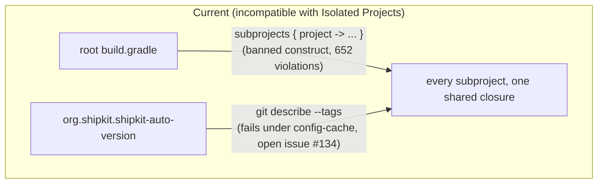
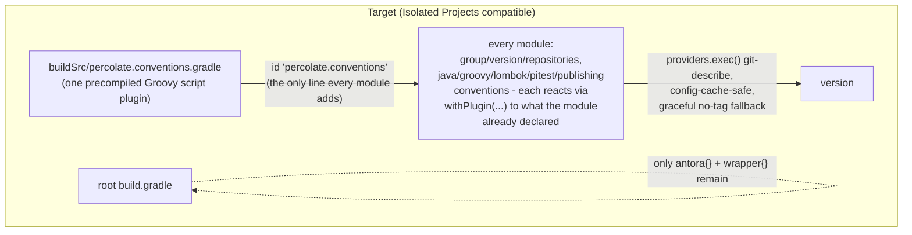

## Context

Root `build.gradle` configures all 13 subprojects (`annotations`, `architecture-tests`, `bom`, `dependencies`, `percolate`, `percolate-javapoet`, `percolate-smoke`, `processor`, `reactor`, `reactor-blocking`, `spi`, `strategies-builtin`, `test-foundation`) through one `subprojects { project -> ... }` closure (~300 lines) reacting to applied plugins via `pluginManager.withPlugin(id) { ... }`. Gradle's Isolated Projects feature (still **experimental**, not yet incubating, as of the Gradle 9.6.1 this repo now runs — confirmed via the official docs) forbids a project's build script from configuring another project's mutable state, which is exactly what `subprojects{}`/`allprojects{}` do from the root script. This was confirmed empirically, not theoretically: running `./gradlew help -Dorg.gradle.unsafe.isolated-projects=true` reports **652 configuration-cache problems (64 unique)**, essentially every line of the `subprojects{}` block — `pluginManager.*` calls, `tasks.*` access, extension configuration (`spotless{}`, `pitest{}`, `codenarc{}`, `lombok{}`), `dependencies{}` blocks, and the bare `group`/`version`/`repositories` assignments at the top. None of the 652 were attributed to the third-party plugins themselves (spotless, PMD, jacoco, pitest, codenarc, errorprone/nullaway, lombok, the `com.palantir.baseline-*` family) — the entire currently-visible fault surface is this repo's own script.

Isolated Projects also requires configuration cache and forbids disabling it ("error to enable Isolated Projects and explicitly disable Configuration Cache" — official docs). This collides with a second, independent, already-known issue: `org.shipkit.shipkit-auto-version`'s `git describe --tags` call fails configuration-cache storage — reproduced live (`./gradlew help --configuration-cache` fails with `[shipkit-auto-version] Problems executing command: git describe --tags`), matching an open, unresolved upstream issue (shipkit/shipkit-auto-version#134, no fix, no maintainer response — the only documented "workaround" is disabling configuration cache, which Isolated Projects forbids). This repository has zero git tags today (no release has ever been cut via the `automate-release-publishing` pipeline yet), so the failure is not an edge case — it reproduces on every single invocation.

`automate-release-publishing`'s own design explicitly rejected a file-based version bump (release-please writing a `gradle.properties` version) in favor of git-tag-derived versioning, specifically to keep one source of truth (the tag). This change does not reopen that decision — it keeps git tags as the single source of truth, just reads them through a configuration-cache-compatible plugin (`com.palantir.git-version`, documented compatible, and — via its `--always` equivalent — degrades to a bare commit hash instead of hard-failing when no tag exists).





## Goals / Non-Goals

**Goals:**
- Dissolve root `build.gradle`'s `subprojects { }` block entirely, redistributing its content into `buildSrc` precompiled Groovy script convention plugins applied explicitly per module — extending the primary/additional plugin convention `restructure-publishing-plugin-wiring` already established, at `buildSrc` plugin granularity.
- Replace `org.shipkit.shipkit-auto-version` with a config-cache/Isolated-Projects-safe version computation, keeping git tags as the single source of truth for `project.version`, with an explicit, defined fallback when no tag exists.
- Re-enable `org.gradle.configuration-cache=true`, verified working via `./gradlew check` and full multi-project configuration (`./gradlew projects`).
- Verify `org.gradle.unsafe.isolated-projects=true` produces zero problems for everything this change actually controls (`buildSrc` conventions, the version-source computation) — **revised mid-implementation, see D6**: actually leaving the flag enabled by default is no longer a goal of this change, since a separate, unfixable-by-us third-party blocker (`info.solidsoft.pitest`) stands in the way regardless of anything here.

**Non-Goals:**
- No change to which modules are published, their coordinates, dependency graph, or POM content.
- No change to `release-please`'s role (still decides and creates the tag) or CI publish gating — only how the Gradle side reads the tag changes.
- No attempt to fix every conceivable third-party-plugin Isolated-Projects incompatibility speculatively — the 652-problem probe attributed zero violations to third-party plugins, so this design set out to fix only the two known, confirmed blockers found during exploration. Two more third-party-plugin-internal violations surfaced anyway during implementation (`com.palantir.git-version`, worked around; `info.solidsoft.pitest`, not workable — see D4 and D6); this remains a non-goal in the sense that no further speculative fixing was attempted beyond what implementation actually surfaced.
- No change to `.codenarc.groovy`/`.pmd.xml` rule content, coverage/mutation thresholds, or any other convention's actual policy values — this is a structural relocation, not a policy change.
- **Added mid-implementation**: no attempt to vendor/fork a patched `info.solidsoft.pitest`, and no attempt to drop mutation testing to unblock the flag — see D6.

## Decisions

**D1 — `buildSrc`, not a separate `build-logic` included build.**
Confirmed via the official "Sharing build logic between subprojects" guide: `buildSrc` is positioned as the convenient default (auto-included, no `settings.gradle` wiring, direct Gradle API access), with its one named cost being that any `buildSrc` change invalidates the configuration phase for the whole build. Given convention-plugin edits are rare compared to day-to-day module work, and the project has no existing multi-build-logic complexity to justify the extra ceremony of a standalone included build, `buildSrc` is the right-sized choice.
*Alternative considered*: a separate `build-logic` composite build (`includeBuild('build-logic')`). Rejected for now — better for larger/more complex build logic or when independent versioning/testing of the convention plugins matters, neither of which applies here yet. Nothing about this decision precludes graduating to a separate included build later if `buildSrc` friction shows up.

**D2 — One convention plugin, not six, not one-per-original-`withPlugin`-block.**
A first pass split today's 14 top-level `withPlugin(...)` blocks into 6 separate `buildSrc` files (base/java/groovy/lombok/pitest/publishing), each applied via its own `id 'percolate.<name>-conventions'` line — mirroring `restructure-publishing-plugin-wiring`'s per-plugin granularity. Rejected per explicit correction from the change requester after landing: it reproduced the exact problem this change set out to remove, just relocated — instead of one `subprojects{}` block in root `build.gradle`, every module now needed up to 6 explicit ids in its own `plugins{}` block, which is *more* boilerplate than the single centralized block it replaced, for no benefit (the six-way split bought composability no module ever used — every module that wants Java conventions wants all of jacoco/pmd/errorprone/nullaway together, same as D2's own original reasoning for not going to 14 files already argued).

Collapsed to a single `buildSrc/src/main/groovy/percolate.conventions.gradle`, carrying every `withPlugin(...)` block from today's `subprojects{}` verbatim, in the same order, inside one file. Every module applies exactly one line: `id 'percolate.conventions'`. This keeps the actual win of the `buildSrc` migration (Isolated-Projects-safe by construction, verified — see D3) while restoring the "one central place" property the original `subprojects{}` block had, which the six-file split had traded away for a composability nobody needed.
*Alternative considered*: apply `percolate.conventions` from root `build.gradle` only, without any per-module `id` at all. Rejected — technically impossible without reintroducing cross-project reach: a Gradle plugin only ever configures the project it's applied to, so a root-only application cannot reach subprojects without either root iterating over them (the exact `subprojects{}` pattern being removed) or each subproject applying it itself. One `id` per module is the minimum boilerplate achievable while keeping every project's configuration self-contained.
*Alternative considered*: `gradle.lifecycle.beforeProject{}` registered once in `settings.gradle`, with zero per-module `plugins{}` changes at all (Gradle's own documented `subprojects{}` replacement, isolated per-project by construction). Prototyped and reverted: it works, but requires every `pluginManager.apply(...)` call to resolve via `settings.gradle`'s `pluginManagement` (since it isn't running as `buildSrc`, a separate build with its own classpath) — this reopened a plugin-marker-id mismatch bug (`com.diffplug.gradle.spotless` marker vs `com.diffplug.spotless` applied id, previously papered over by root `build.gradle`'s own `apply false` anchor, which had been removed) before a second, unrelated failure was hit and the whole approach was abandoned in favor of keeping `buildSrc` at the single-plugin granularity above, per explicit direction from the change requester.

**D3 — The convention plugin's internal shape is preserved verbatim, just relocated.**
Every `pluginManager.withPlugin(id) { ... }` nesting inside today's `subprojects{}` block moves into `percolate.conventions`'s own `apply(Project)` unchanged, in the same order — still reacting to `project.pluginManager`, still only ever touching `project` itself. This is what makes the convention plugin Isolated-Projects-safe by construction (a `Plugin<Project>`'s `apply()` can only configure the `Project` it was applied to) without needing to rewrite any of the actual policy logic. Modules keep choosing `java` vs `java-library` vs `java-platform` themselves, exactly as today — the convention plugin only ever reacts, never forces a base plugin.

**D4 — Version source: a hand-rolled `providers.exec()`-based git-describe in `percolate.conventions`, not `com.palantir.git-version`, with an explicit `-SNAPSHOT` policy for non-tag commits.**
`com.palantir.git-version` was the first choice (see the proposal) and was implemented, then rejected during task 7 based on a live Isolated Projects failure: decompiling `gradle-git-version-5.0.0.jar` shows `GitVersionPlugin.apply(Project)` unconditionally calls `project.getRootProject().getPluginManager().apply(GitVersionRootPlugin.class)` on *every* project it's applied to, with no conditional guard — applied to a subproject, this reaches into the root project's mutable `pluginManager`, exactly the access Isolated Projects forbids. Confirmed live: `./gradlew projects` under `org.gradle.unsafe.isolated-projects=true` reported 13 identical problems, one per module (`"Project ':<module>' cannot access 'Project.pluginManager' functionality on another project ':'"`). There is no configuration flag to suppress this call, and pre-applying `GitVersionRootPlugin` at root wouldn't help — the violation is the accessor call itself, not whether it would change anything.

Replaced with a small inline computation using `providers.exec()` (Gradle's own documented, config-cache/Isolated-Projects-safe way to shell out during configuration — its inputs are tracked properly, unlike a raw `'...'.execute()` call, which is exactly what made `shipkit-auto-version` incompatible in the first place):
```groovy
def isCleanTag = providers.exec {
    workingDir = rootDir
    commandLine 'git', 'describe', '--tags', '--exact-match'
    ignoreExitValue = true
}.result.get().exitValue == 0

def describeAlways = providers.exec {
    workingDir = rootDir
    commandLine 'git', 'describe', '--tags', '--always'
    ignoreExitValue = true
}.standardOutput.asText.map { it.trim() }.getOrElse('unspecified')

version = isCleanTag ? describeAlways : "${describeAlways}-SNAPSHOT"
```
`rootDir` is an immutable `File` path (like `Project.getRootDir()` used elsewhere in the convention plugins), not a reach into root's mutable state, so this never touches another `Project` object at all — genuinely Isolated-Projects-safe by construction, not just by absence-of-observed-violation.

The `-SNAPSHOT` policy itself is unchanged from the original design: bare `describeAlways` only when `isCleanTag` (exactly on a real tag, matching the CI publish job's checkout-at-tag flow), `-SNAPSHOT`-suffixed otherwise — preserving `shipkit-auto-version`'s observed non-release-commit behavior rather than introducing a new format. An earlier attempt keyed this off `com.palantir.git-version`'s `commitDistance == 0` and was *also* wrong, independent of the IP issue: with zero tags in the repo, that plugin reports `commitDistance == 0` for its own commit-hash fallback too (it treats the fallback point as zero-distance from itself), so the condition couldn't distinguish "genuinely on a release tag" from "no tag exists at all" — confirmed by probing `versionDetails()`'s actual field values (`lastTag=ec9411f commitDistance=0 isCleanTag=false`) before the plugin was dropped entirely. The hand-rolled version reproduces the equivalent of `isCleanTag` directly via `git describe --tags --exact-match`'s exit code (0 only on an exact tag match), which doesn't have this ambiguity.
*Alternative considered*: apply `com.palantir.git-version` only at the root project, and share the computed value across modules via a Gradle `BuildService` registered from `settings.gradle` (Gradle's sanctioned cross-project-sharing mechanism under Isolated Projects). Rejected per the change requester — more moving parts for no real benefit over independently recomputing the same deterministic value per project, and keeps a dependency on a third-party plugin whose relevant code path (`GitVersionPlugin`, not `GitVersionRootPlugin`) is not exercised.
*Alternative considered*: use the raw `git describe --tags --always` string directly as `project.version` for non-tag commits (e.g. `1.2.3-3-gabc1234` or a bare hash). Rejected — changes the version string shape for every day-to-day local build for no benefit, and the `release-versioning` spec's "no snapshot ever published" requirement already depends on recognizing the `-SNAPSHOT` suffix pattern specifically.

**D5 — Sequencing: version-source swap and `buildSrc` restructuring both land before the Isolated Projects flag flips on.**
The flag can't be usefully enabled until both prerequisites are in place — flipping it first would just reproduce the same 652+1 problems already reproduced during exploration. The two prerequisites are otherwise independent of each other (the version swap doesn't touch `subprojects{}`'s structure; the `buildSrc` restructuring doesn't touch how `project.version` is computed), so they can be implemented and verified in either order within this one change, but the flag itself is the final step, gated on both being done.

**D6 — The Isolated Projects flag ships OFF by default; `info.solidsoft.pitest` is a second, unfixable-by-us third-party blocker.**
After D1-D5 all landed clean (652-problem `subprojects{}` violation gone, `shipkit-auto-version`/`com.palantir.git-version` both resolved), enabling the flag and running a full `./gradlew check` surfaced a third, independent violation: `info.solidsoft.pitest` (applied by `processor`, `spi`, `strategies-builtin`) registers an `afterEvaluate` callback in `PitestPlugin.apply()` that unconditionally calls `failWithMeaningfulErrorMessageOnUnsupportedConfigurationInRootProjectBuildScript()` — a legacy-migration guard (present since the plugin's 1.5.0, checking whether root's `buildscript{}` still has an old-style `pitest` configuration entry, a pattern this repo has never used) that reaches into the root project's `buildscript` regardless of outcome. Confirmed by decompiling `gradle-pitest-plugin-1.19.0.jar` — the call is unconditional, with no configuration property to skip it. `1.19.0` is confirmed the latest release on the Gradle Plugin Portal (checked via `maven-metadata.xml`, last updated 2026-03-29) — there is no newer version to move to.

Unlike the git-version issue (D4), this one has no reasonable hand-rolled replacement: `info.solidsoft.pitest` wraps substantial PIT integration logic (task wiring, classpath assembly, JUnit5 plugin support, history-plugin support) this repo genuinely relies on, with real ratchet thresholds and a documented history behind the current configuration (see the `pitest` section of `percolate.conventions.gradle`'s own comments). Reimplementing that wrapper to work around one legacy-migration guard would be wildly disproportionate.

Decision, confirmed with the change requester: ship everything else (buildSrc convention plugins, configuration cache, the version-source fix — all independently valuable and fully verified working) and leave `org.gradle.unsafe.isolated-projects=true` commented out in `gradle.properties`, with the reasoning documented inline. Actually enabling the flag is deferred to a follow-up change, gated on an upstream fix to `info.solidsoft.pitest` (or another workaround — vendoring a patched copy was considered and rejected as disproportionate for a cosmetic legacy guard). This is exactly the outcome the proposal's own Non-Goals anticipated ("a follow-up change is the honest path if a plugin-internal issue surfaces") — it just turned out to be needed for the flag itself, not merely some code path within it.

## Risks / Trade-offs

- **[Risk]** Fixing the two known blockers may surface a "second wave" of Isolated-Projects violations from deeper inside third-party plugin internals (`com.palantir.baseline-*`, pitest, codenarc, spotless, lombok) that the current probe couldn't see past the outer `subprojects{}`/shipkit failures. → **Materialized twice** (not just a risk in hindsight): `com.palantir.git-version` (worked around, see D4) and `info.solidsoft.pitest` (not workable, see D6). Both were fixed forward where possible; `info.solidsoft.pitest` is the reason the flag ships off. No other third-party plugin surfaced a violation once these two were addressed.
- **[Risk]** `buildSrc` changes invalidate the whole build's configuration cache / Isolated Projects cache on every edit, which will apply to future convention-plugin maintenance (e.g. bumping the PMD ruleset). → **Mitigation**: accepted per D1 — convention-plugin edits are infrequent relative to module-level work; revisit with a separate included build if this becomes a measured pain point.
- **[Risk]** Every module's `plugins { }` block grows by one explicit id (`id 'percolate.conventions'`) in exchange for root `build.gradle` shrinking to near-nothing — a new java module must remember to apply it, same as it must remember `id 'java'` itself. → **Mitigation**: kept to a single id per module after D2's course-correction (the original 6-id-per-module draft was rejected precisely because it multiplied this cost); a missing convention-plugin application fails loudly (missing spotless/pmd/etc. enforcement) rather than silently, and is easy to catch since it changes `./gradlew check`'s tool coverage visibly.
- **[Risk]** Isolated Projects itself remains off, so this change doesn't deliver the parallel/cacheable-configuration performance benefit the original proposal motivated. → **Mitigation**: accepted per D6; configuration cache alone (which does ship, on by default) already delivers most of the same-build repeat-configuration speedup, and the `buildSrc` restructuring is the actual prerequisite work needed whenever the pitest blocker clears — this change is not wasted effort even though the flag stays off.

## Migration Plan

1. Add `buildSrc/build.gradle` (applies `groovy-gradle-plugin`, plus classpath dependencies for the plugins the convention script itself applies internally) and the single `buildSrc/src/main/groovy/percolate.conventions.gradle`, carrying every `withPlugin(...)` block moved verbatim from today's `subprojects{}` block, in order (D2/D3).
2. Update every module's `build.gradle` to add exactly one line, `id 'percolate.conventions'`; delete the `subprojects { }` block from root `build.gradle` (root keeps only the `plugins{}` header minus now-`buildSrc`-owned ids, `antora{}`, and `wrapper{}`).
3. Replace `org.shipkit.shipkit-auto-version` with the hand-rolled `providers.exec()` version computation (D4) inside `percolate.conventions`; remove the plugin coordinate from `settings.gradle` and root `build.gradle`.
4. Run `./gradlew check --no-configuration-cache` (still the safe baseline per prior project convention) to confirm the restructuring alone is behavior-preserving before touching any Isolated-Projects/config-cache flags.
5. Re-enable `org.gradle.configuration-cache=true` in `gradle.properties`; run `./gradlew check` and `./gradlew projects` to confirm the version-source swap actually resolved the shipkit-auto-version-shaped failure.
6. Enable `org.gradle.unsafe.isolated-projects=true`; run `./gradlew projects` and a full `./gradlew check` under it, fixing forward any newly-surfaced problem where possible (D4). Where not possible (D6 — `info.solidsoft.pitest`), turn the flag back off, document why inline in `gradle.properties`, and correct this design/the specs to reflect the actual shipped scope rather than silently declaring success.
7. Rollback is a plain revert at any step — this is build-config-only, no data migration, no runtime behavior change for consumers of the published artifacts, and each step above is independently revertible without un-reverting the others (e.g. the version-source swap and `buildSrc` restructuring stay regardless of whether the Isolated Projects flag itself is ever turned on).

## Open Questions

None outstanding for the design shape itself. The "second wave of violations" risk materialized as described in D6 rather than remaining hypothetical, and has been resolved into an explicit, documented decision (ship without the flag) rather than left open. Re-enabling `org.gradle.unsafe.isolated-projects=true` once `info.solidsoft.pitest` is fixed upstream (or another workaround is found) is the natural follow-up change, not an open question within this one.
