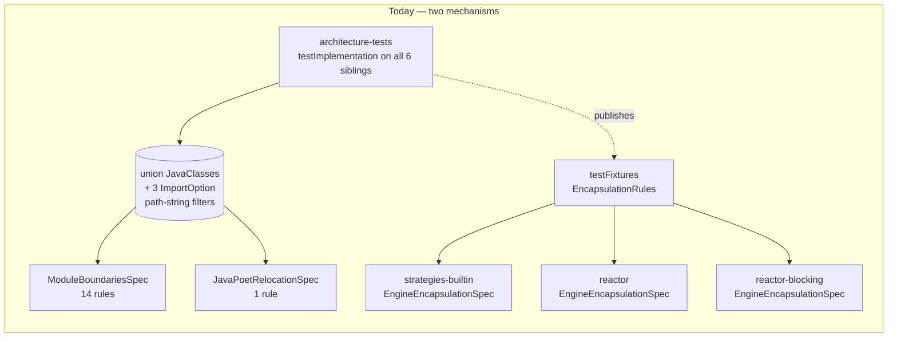
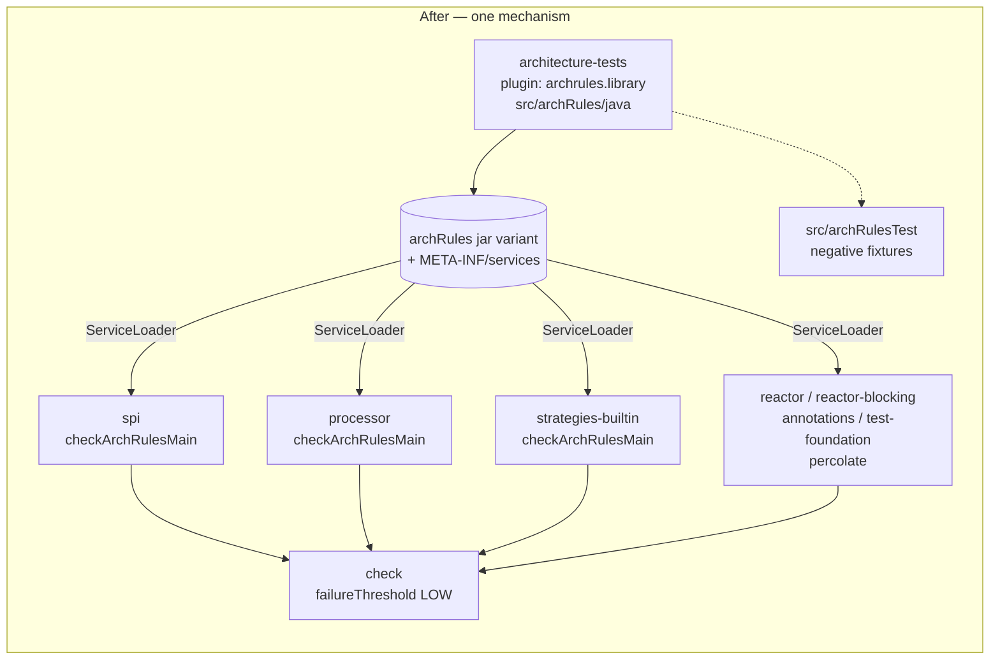
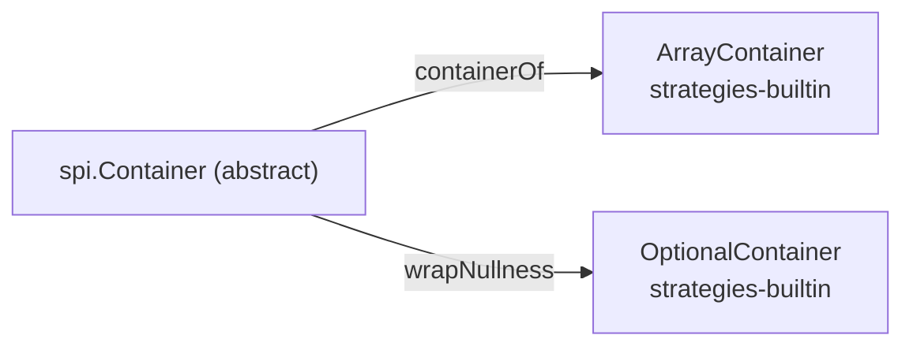

## Context

Percolate enforces 16 architecture rules through two hand-built mechanisms that both fail open.

**Mechanism 1 — the central union suite.** `architecture-tests` declares `testImplementation` on all six
sibling modules, imports `io.github.joke.percolate` off that fat classpath as a single `JavaClasses`, then
filters the union back down with three `ImportOption` path-string predicates. Two of the three carry
comments explaining a bug they were written to fix; the `-test-fixtures.jar` spelling was added only after
the directory-form predicate silently admitted `EncapsulationRules` and an unrelated rule happened to flag
it. Each rule is then wrapped in `when:` / `notThrown(AssertionError)` Spock boilerplate.

**Mechanism 2 — the shared-fixture copy.** The "no class outside the engine reaches a `processor` internal
package" rule is a static builder published as `architecture-tests`' `testFixtures`, which
`strategies-builtin`, `reactor`, and `reactor-blocking` each wrap in a near-identical
`EngineEncapsulationSpec`. Three files, one rule.

`com.netflix.nebula.archrules` 1.3.1 collapses both into one flow: rules authored once in an `archRules`
source set, published as a separate jar variant with a generated `META-INF/services` registry, and
`ServiceLoader`-discovered by a runner plugin that evaluates them **per source set** against each consuming
module's own classes.

## Goals / Non-Goals

**Goals:**
- One authoring location and one evaluation mechanism for every architecture rule.
- Replace path-string `ImportOption` filtering with build-model source-set selection.
- Keep every rule's enforcement strength at least as strong as today, or delete it deliberately with a
  recorded reason.
- Make a false negative detectable: each rule gets a negative fixture proving it fires.
- No module named anywhere in `buildSrc`; opt-in stays local to each module's `build.gradle`.

**Non-Goals:**
- No production code changes. This change moves and reformulates rules, never the code they judge.
- No new rules beyond the 16 that exist today (minus the one deleted).
- Not adopting Gradle Isolated Projects — still blocked on `info.solidsoft.pitest`.
- Not publishing the rules library to Maven Central. It stays an unpublished internal module.
- Not re-slicing the acyclicity rule deeper to catch intra-module cycles. Tempting (it would turn a
  redundant rule into a real one) but it is a *new* rule, not a migration, and belongs in its own change.

## Decisions

### D1 — Adopt library + runner + aggregate, not a single plugin

The three-plugin split matches the problem exactly: `library` owns authoring, `runner` owns evaluation,
`aggregate` owns cross-module reporting. The alternative — keeping the central suite and merely extracting
rule builders into more testFixtures — was rejected because it preserves the union classpath and the
path-string filters, which are the actual defects.

### D2 — Wire through `percolate.conventions.gradle`, opt in per module

Follows the repo's established primary/additional pattern: the conventions plugin *configures* on
`pluginManager.withPlugin(...)`, and each module *declares* the plugin id in its own `plugins {}` block.
Version lives in `settings.gradle` `pluginManagement`, matching how `info.solidsoft.pitest`,
`com.gradleup.shadow`, and `io.freefair.lombok` are already handled. No `buildSrc` dependency is needed
because the plugin is configured, never imperatively applied — the Groovy DSL resolves the `archRules`
extension and configuration dynamically.

This is what makes the two awkward modules non-events rather than special cases:

| Module | Runner? | Why |
|---|---|---|
| `architecture-tests` | no | self-apply; also what breaks the `archRules project(':architecture-tests')` cycle |
| `lib:javapoet` | no | its `com.palantir.javapoet.MethodSpec` overlay depends on its own package, tripping the relocation rule |
| `bom`, `dependencies` | no | `java-platform`, no source sets |
| everything else | yes | declares the id itself |

**Architecture note, not a shift:** this preserves the existing invariant that the conventions plugin never
special-cases a module by name. The opt-outs above are absences, not exclusions.

### D3 — `failureThreshold('LOW')` is mandatory, not tuning

The plugin defaults to failing the build on **no** priority. Adopting it without this line converts 16
load-bearing guards into console decoration. Rules keep ArchUnit's default `MEDIUM` priority and the
threshold is set to `LOW`, so everything fails. Per-rule priority tuning is explicitly not used — a rule
worth writing here is worth failing on.

### D4 — Per-source-set import replaces the union import

Most rules are *outgoing-dependency* rules (`noClasses().that().resideInAPackage(X).should()
.dependOnClassesThat()...`). ArchUnit records those edges from the source class's bytecode whether or not
the target is imported, so only the **source** module needs importing. Evaluating them inside the owning
module is strictly more precise than evaluating them against a union.

Rule-by-rule disposition:

| # | Rule | Disposition |
|---|---|---|
| 1–4 | engine↛strategy, harness↛strategy, spi↛engine/strategy, annotations↛all | port as-is |
| 5 | processor ↛ mapping annotations | port as-is |
| 6 | no raw annotation read off `Element` | port as-is (needs classpath hierarchy resolution) |
| 7 | strategy impl ↛ engine graph | port; now runs *inside* each strategy module |
| 8 | `*Stage` suffix naming | port as-is |
| 9 | Rule A — no private methods | port; becomes genuinely repo-wide |
| 10 | Rule B — size ceiling | port as-is |
| 11 | Rule D — no static | port as-is |
| 12 | Rule C — unused protected ⇒ `@VisibleForTesting` | port **+ D5 exemption** |
| 13 | acyclicity | **deleted — D6** |
| 14 | `javax.lang.model.util` confinement | port as-is |
| 15 | JavaPoet upstream-package ban | port; becomes repo-wide automatically |
| 16 | engine-internals encapsulation (×3 copies) | **collapses to one rule** |

The three `ImportOption` predicates are replaced by `skipSourceSet('test')` and
`skipSourceSet('testFixtures')`; shaded `lib` classes never appear in a module's own source-set output, so
`notShadedLib` has nothing to exclude.

### D5 — Rule C exempts the published `spi` surface

Per-source-set import cannot resolve `allSubclasses` across a module boundary, and the direction is
unfixable: from `spi` you would need to scan *downstream* modules that are not on `spi`'s classpath at all.

An audit of every concrete `protected` method in production code found exactly **two** that depend on a
cross-module subclass:

Everything else is already covered: `Container`'s four abstract hooks are exempt by the existing abstract
rule, its seven other concrete protected methods carry `@VisibleForTesting`, `spi.Accessor#toSpec` is
annotated, `spi.Conversion` declares only abstract protected members, and all 28 leaf overrides in
`strategies-builtin`/`reactor` are annotated on final classes.

Both survivors are genuine template-method extension points on a published API. Annotating them
`@VisibleForTesting` would be a factual lie and would corrupt the very annotation the rule exists to keep
truthful. Instead Rule C exempts the published `spi` surface — reusing the exemption **shape** Rule D
already carries (`notPublishedSpiApi`: `spi..` excluding `spi.builtins..`). On a published extension-point
API, `protected` *is* the contract, not a dodge around Rule A's private ban. Since every cross-module base
class in the repo lives in `spi`, this removes 100% of the cross-module dependency.

*Alternative considered:* exempt any protected method whose owner is `abstract`. Rejected — it is broader
than needed and lets an internal monolith go abstract to escape the rule.

### D6 — Delete the acyclicity rule

Its slice pattern `io.github.joke.percolate.(*)..` cuts on the first package segment, i.e. one slice per
module — so `processor.internal.graph` and `processor.internal.stages` are the same slice and intra-module
cycles have never been checked. What remains is cross-module cycles, every pair of which is already
forbidden twice:

| Pair | Already prevented by |
|---|---|
| spi ↔ processor / builtins / reactor / reactor-blocking | rule 3 (spi depends on neither engine nor strategy) |
| processor ↔ builtins / reactor / reactor-blocking | rule 1 (engine has no edge to any strategy) |
| annotations ↔ everything | rule 4 |
| test-foundation ↔ strategies | rule 2 |
| builtins ↔ reactor, reactor ↔ reactor-blocking | the Gradle module dependency DAG |

The rule enforces nothing the suite does not already enforce. Consistent with the recorded preference for
deleting a never-violated, narrow-blast-radius guard outright rather than replacing it.

### D7 — Group rules into cohesive `ArchRulesService` classes

Rules are authored in Java (not Groovy) under `src/archRules/java`, grouped by subject rather than one
class per rule:

- `ModuleLayeringRules` — rules 1–4
- `EngineEncapsulationRules` — rules 5, 6, 7, 16
- `MethodShapeRules` — rules 9, 10, 11, 12 (A, B, D, C)
- `TypeBoundaryRules` — rules 8, 14, 15

Each returns `Map<String, ArchRule>` from `getRules()`, keyed by a stable rule name so
`ruleName(...) { … }` overrides remain available. Java over Groovy because the `archRules` variant is
consumed as a plain jar by the runner and carries no Groovy runtime; the existing custom `ArchCondition`
subclasses port directly.

### D8 — Every rule sets `allowEmptyShould(true)`, and every rule gets a negative fixture

Per-source-set evaluation means most rules match zero classes in most modules — rule 5 (`processor`-scoped)
sees nothing when evaluated against `spi`. ArchUnit fails a rule that matches nothing unless
`allowEmptyShould(true)` is set, so every rule must set it.

That is a real weakening: a mis-typed package string now matches nothing everywhere and passes silently.
It is exactly the failure mode the current suite already has and cannot detect. So each ported rule gets at
least one **negative** fixture in `src/archRulesTest` — a deliberately-violating class checked with
`Runner.check(rule, Violator.class)`, asserting `hasViolation()`. The positive direction is proven
continuously by `check` passing against the real repository.

This is new coverage. Today's rules have none.

## Risks / Trade-offs

- **The plugin is three days old (published 2026-08-06, version 1.3.1)** → The blast radius of a plugin
  defect is "guards stop running", not "wrong code ships". `failureThreshold('LOW')` plus the D8 negative
  fixtures mean a plugin that stops evaluating rules fails `archRulesTest` or `check` rather than passing
  quietly. Rollback is a single revert: the deleted specs are recoverable from git and the mechanism is
  additive to the build, not entangled with production code.
- **`allowEmptyShould(true)` on every rule masks a typo'd package selector** → D8's negative fixtures are
  the mitigation, and they are the reason that item is in scope rather than deferred.
- **ArchUnit version skew**: `nebula-archrules-core` brings its own ArchUnit, while `dependencies` pins one
  for the current suite → resolve to a single version and drop the direct `com.tngtech.archunit:archunit`
  declaration where the plugin supplies it; verify the custom `ArchCondition` API surface still compiles.
- **The `archRules` source set inherits the full analyser stack** (`-Werror`, Error Prone, NullAway, PMD,
  spotless) via the conventions plugin's `java-base` hook → expected and desirable, but the Groovy→Java port
  will surface null-marking and PMD findings the Groovy specs never had to satisfy. Budget for it.
- **Rules 6 and 8 depend on classpath type resolution** (`isAssignableTo` on `javax.lang.model.element.Element`,
  `implement(...)` on a non-imported interface) → both already rely on ArchUnit resolving missing classes
  from the classpath today; confirm the runner does not disable that, and cover both with negative fixtures.
- **Cross-module cycle detection is genuinely gone** → accepted per D6; the four no-edge rules plus the
  Gradle DAG cover every pair it checked.
- **Rule C is weaker on `spi`** → accepted per D5. Two methods lose automated coverage; both are published
  extension points where `protected` is the intended contract.

## Migration Plan

1. Add plugin versions to `settings.gradle`; add the two `withPlugin` blocks to
   `percolate.conventions.gradle`; apply `aggregate` at the root.
2. Restructure `architecture-tests`: apply `library`, create `src/archRules/java`, drop
   `java-test-fixtures` and the six sibling `testImplementation` entries.
3. Port the 15 surviving rules into the four `ArchRulesService` classes, adding `allowEmptyShould(true)`
   and the D5 exemption. Delete rule 13.
4. Add `src/archRulesTest` negative fixtures.
5. Opt each eligible module into the runner.
6. Delete `ModuleBoundariesSpec`, `JavaPoetRelocationSpec`, `EncapsulationRules`, and the three
   `EngineEncapsulationSpec` copies — only after step 5 proves the replacements run and pass.
7. `./gradlew check --no-configuration-cache` (per the recorded shipkit/config-cache constraint).

Rollback: revert the commit. No production code, no published artifact, and no persistent state is touched.

## Open Questions

All three were resolved by the task-group-1 spike. Recorded here as findings.

- **Classpath type resolution — RESOLVED, enabled.** `implement("…stages.Stage")` matched all 12 `Stage`
  implementations in `processor`, and `isAssignableTo("javax.lang.model.element.Element")` resolved
  `TypeElement`/`ExecutableElement` through the non-imported javax hierarchy (33 matches). Rules 6 and 8
  need no reformulation.
- **ArchUnit version — RESOLVED, bumped.** `nebula-archrules-core` 1.3.1 depends on ArchUnit **1.5.0**;
  `dependencies` pinned 1.4.2 (twice — a duplicate constraint, now deduplicated). The pin is raised to
  1.5.0 so the `archRules` source set compiles against the version the runner evaluates with. All of
  `ArchCondition`, `DescribedPredicate`, `ConditionEvents`, and `SimpleConditionEvent` compile and run from
  an `ArchRulesService`.
- **Aggregate plugin and the configuration cache — RESOLVED, no interaction.** With
  `com.netflix.nebula.archrules.aggregate` applied at the root, the build succeeds both with and without
  `--no-configuration-cache`, and a configuration cache entry is stored.

Two findings the spike surfaced that were **not** anticipated:

- **Enforcement lives in a separate task.** `checkArchRules<SourceSet>` only *evaluates* and writes
  `build/reports/archrules/<sourceSet>.data`; it passes even with violations present. The gate is
  `enforceArchRules`, which is separately wired into `check`. Verified: with `failureThreshold('LOW')` it
  fails the build on a MEDIUM-priority violation, and it appears in `check`'s task graph. A migration that
  only checked `checkArchRulesMain` would have looked green while enforcing nothing.
- **The `archRules` source set inherits the whole analyser stack.** It is compiled by the conventions
  plugin's `java-base` `JavaCompile` hook, so `-Werror` + Error Prone + NullAway apply. NullAway's
  `RequireExplicitNullMarking` fails the compile unless the source set also gets the
  `io.github.joke.jspecify:processor` annotation processor and the `org.jspecify:jspecify` compile-only
  dependency, which the conventions `library` block now declares as `archRulesAnnotationProcessor` /
  `archRulesCompileOnly`.

Two pre-existing weaknesses observed while probing, both **out of scope** for this change — the rules are
ported faithfully, bug included, because this migration changes the mechanism and must not silently change
what is enforced.

**Rule 14's boundary list exempts the whole `processor` subtree, not just the bare package.** The boundary
is matched with `pkg.equals(boundary) || pkg.startsWith(boundary + ".")`, and the list's first entry is the
bare `io.github.joke.percolate.processor`. The prefix arm therefore matches every package beneath it, which
makes the four enumerated sub-packages (`…stages.expand`, `…stages.discover`, `…stages.generate`,
`…nullability`) redundant and exempts `processor.internal.graph`, `…internal.stages.validate`,
`…internal.stages.dump`, and the rest along with them. Verified empirically: a class in
`processor.internal.graph` taking a `javax.lang.model.util.Types` parameter is **not** reported, while the
same class in `spi.builtins` is. The identical logic is present in the pre-migration
`ModuleBoundariesSpec` (confirmed against git history), so this is inherited, not introduced. Tightening it
to an exact match for the bare package would be a genuine rule change that could surface pre-existing
violations, and belongs in its own change.

**Rule 6's receiver-type predicate misses the real shape.** Rule 6 tests
`call.target.owner.isAssignableTo("javax.lang.model.element.Element")`, but the engine's real annotation
read (`JspecifyNullabilityResolver#hasAny`) invokes `getAnnotationMirrors()` on an `AnnotatedConstruct`
receiver — a *supertype* of `Element`, so the predicate is false and the rule would not catch that shape
even outside the exempt package. The rule is ported as-is; task 5.2's negative fixture must therefore use
an `Element`-typed receiver to exercise what the rule actually tests.
