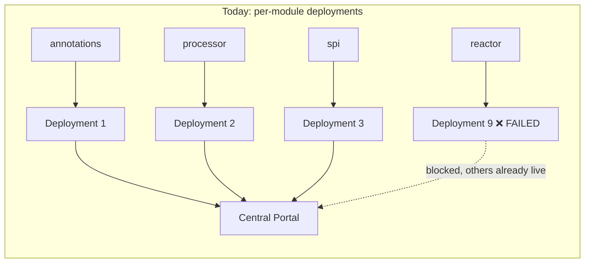

## Context

Today's incident: `reactor:v1.0.1` failed Central Portal validation ("Dependency version information is missing for dependency: io.projectreactor:reactor-core") after `./gradlew publishToMavenCentral` ran. That task, provided by `io.github.sgtsilvio.gradle.maven-central-publishing` (applied independently to all 9 publishable modules), uploads **each module as its own Central Portal deployment**. A failure in one module's deployment has no bearing on the others — the other 8 modules of the same `v1.0.1` release may already be live on Central while `reactor` sits broken, pending a whole new release to retry.

The specific missing-version defect was already root-caused and fixed in an earlier, separate commit (`61358e2e`): the internal `:dependencies` version-management platform was leaking into published POMs via `implementation platform(project(':dependencies'))`, and `reactor-core`'s version wasn't being written into the POM at all. That fix is further refined by this change (see Decision 5 below: `reactor-core` moves to `compileOnly` entirely, rather than pinning an explicit version on `implementation`). This change's own job is the aggregation infrastructure — making the *next* incident, whatever its cause, atomic instead of partial.

The 9 publishable modules are: `annotations`, `processor`, `spi`, `strategies-builtin`, `reactor`, `reactor-blocking`, `percolate`, `bom`, `lib:javapoet`. All wiring currently flows through one shared convention plugin, `buildSrc/src/main/groovy/percolate.conventions.gradle`, reacting to whichever publishing-related plugin id a module declares (mirroring the existing `errorprone → nullaway` cascade pattern already used for other plugin pairs in that file).

## Goals / Non-Goals

**Goals:**
- Make a Central Portal release atomic: either every published module's artifacts validate and go live together, or none do.
- Preserve every existing publish guarantee: Central Portal as sole target, GPG signing via `useGpgCmd()` with no in-memory key material, uniform declarative POM metadata, sources+javadoc jars, and the release-please-gated CI trigger (`release-versioning` capability, untouched).
- Keep the same hands-off release experience: `publishingType = AUTOMATIC` still auto-releases once validation passes — the atomicity comes from aggregation, not from adding a manual approval step.

**Non-Goals:**
- Not changing *when* publishing happens (still gated strictly on `release-please`'s `release_created`, still never for a `-SNAPSHOT`) — that's the `release-versioning` capability and is out of scope here.
- Not changing published artifact coordinates, groupId, versioning scheme, or any consumer-facing POM content beyond the `reactor-core` scoping fix described below.
- Not adopting Gradle Isolated Projects itself — `nmcp.settings`' documented IP/config-cache compatibility is a nice side-alignment with [[project_adopt_gradle_isolated_projects]], not a goal this change is trying to unblock.
- Not adding an automated POM pre-flight validation gate (see the rejected alternative in Decision 5) — this change relies on architectural scoping discipline plus Central Portal's own validation, not an added local check.
- Not addressing the test-fixtures optional-dependency version gap noted during today's investigation (e.g. `spi`'s published POM listing `spock-core`/`groovy` as optional deps without a version) — that's a pre-existing, separate gap and would need its own follow-up.

## Decisions

### 1. `com.gradleup.nmcp.settings` over the manually-applied `com.gradleup.nmcp` + `com.gradleup.nmcp.aggregation` pair

The settings-plugin form applies `com.gradleup.nmcp` to every project and `com.gradleup.nmcp.aggregation` to the root automatically from one `settings.gradle` declaration. The manual form requires applying both plugins by hand and is only warranted when you need finer control than the settings plugin exposes. Nothing about this project's 9-module structure needs that extra control, so the settings plugin is the simpler, lower-maintenance choice — consistent with this project's existing "one convention plugin, not one per concern" preference ([[feedback_one_convention_plugin_not_many]]).

**Alternative considered**: stay on `io.github.sgtsilvio.gradle.maven-central-publishing` and work around partial releases procedurally (e.g., manually holding/coordinating per-module publishes in CI). Rejected — it doesn't fix the underlying problem and adds fragile manual process where the tooling can just guarantee atomicity outright.

### 2. `publishingType = AUTOMATIC`, not `USER_MANAGED`

Confirmed with the user: keep the same hands-off behavior as today. The atomicity from aggregation is the safety improvement being sought here, not an added manual gate. `USER_MANAGED` remains available as a low-risk follow-up if a future incident suggests a manual checkpoint is also wanted.

### 3. Reuse existing `mavenCentralUsername`/`mavenCentralPassword` property names

Confirmed with the user: no GitHub Actions secrets renaming. `nmcpSettings { centralPortal { username = ...; password = ... } }` reads these via the same Gradle property mechanism (`providers.gradleProperty(...)`) the old plugin used, so `release.yml`'s `env:` block is untouched.

### 4. `maven-publish` becomes the cascade anchor plugin, replacing the removed plugin id

Today, each module declares only `io.github.sgtsilvio.gradle.maven-central-publishing`, and `percolate.conventions.gradle` cascades `io.github.sgtsilvio.gradle.metadata`, `maven-publish`, and `signing` from it (per the existing `maven-central-publishing` spec's "declare only the primary publishing plugin" requirement). Since nmcp does not apply `maven-publish` and does not sign anything, each module must now declare `maven-publish` directly, and `maven-publish` becomes the new cascade trigger for `signing` and `io.github.sgtsilvio.gradle.metadata`. This is a straightforward trigger swap in `withPlugin(...)` blocks — the actual publications/javadocJar/sourcesJar configuration inside those blocks is unchanged.

**Alternative considered**: introduce a synthetic marker plugin/id (e.g., a tiny `percolate.publish` precompiled script plugin each module applies instead of `maven-publish` directly) to keep a single, greppable "this module publishes" signal. Rejected as unnecessary indirection — `maven-publish` itself is already that signal, and adding a wrapper plugin just to preserve the old id's ergonomics reintroduces the same "one plugin implies everything" opacity that made today's investigation harder (finding out that `io.github.sgtsilvio.gradle.maven-central-publishing` silently implied `maven-publish` + `signing` took real digging in this session's earlier `restructure-publishing-plugin-wiring` archaeology).

### 5. `reactor-core` moves to `compileOnly`; `io.freefair.maven-central.validate-poms` rejected as a substitute safety net

Two related decisions, resolved together during implementation:

**`reactor-core` is `compileOnly`, not a pinned `implementation` version.** `reactor` and `reactor-blocking`'s SPI classes (`FluxContainer`, `MonoContainer`, etc.) reference `reactor.core.publisher.Flux`/`Mono` in their own bytecode, so `reactor-core` must be on these modules' compile classpath — but any actual consumer of these modules is, by definition, already writing Flux/Mono-based mapper code, and so already depends on `io.projectreactor:reactor-core` in their own project. Redistributing a pinned runtime version from `reactor`/`reactor-blocking` would constrain every consumer to that exact version and reintroduce exactly the "does this leak into the published POM correctly" question this whole incident started from. `compileOnly` sidesteps the question entirely: `reactor-core` is compiled against but never appears in the published dependency list at all — nothing to version, nothing to leak. Verified: the generated POM for both modules now has zero `reactor-core` entries and zero `dependencyManagement` leakage.

This does shift a real obligation onto consumers: adding `annotationProcessor 'io.github.joke.percolate:reactor'` no longer transitively brings `reactor-core` onto the *annotation processor* classpath (a separate resolution graph from the consumer's own `implementation` dependencies) — a consumer would need `reactor-core` reachable from wherever they wire up percolate's processor. This is expected to already hold for any real consumer of Flux/Mono mapper support, but is a discoverable, undocumented behavior change worth a follow-up docs note (not addressed by this change).

**`io.freefair.maven-central.validate-poms` was evaluated and rejected**, having originally been the change's second pillar (a local/CI pre-flight gate meant to catch exactly today's defect class before Central Portal ever saw it). Wiring it in and testing it against a deliberately-reintroduced copy of today's bug (an unversioned `implementation` dependency backed only by an unpublished platform) showed the `ValidateMavenPom` task **passed regardless** — decompiling `io.freefair.gradle.plugins.maven.central.ValidateMavenPom.check()` confirmed it only validates POM *metadata* completeness (`groupId`, `artifactId`, `version`, `name`, `description`, `url`, `licenses`, `developers`, `scm` + sub-fields) and never inspects the `<dependencies>` list at all. It's a real gate for a real (different) Central Portal requirement, just not the one this change needed. Kept for what it does would have meant either misrepresenting its purpose in the spec or carrying a plugin whose stated justification here was false; dropped entirely rather than keep dead weight.

**Alternative considered** (for the validate-poms question): keep the plugin wired in anyway, since it's still a legitimate (if narrower) safety net for a real Central Portal requirement. Rejected per explicit user direction — the honest framing is that this change doesn't need an added POM-validation gate to close today's incident; the `compileOnly` fix plus the existing platform-scoping discipline already do that architecturally.

### 6. Signing-gate task-name match: broaden from `contains('MavenCentral')` to `contains('Aggregation')`

The current gate (`required { gradle.taskGraph.allTasks.any { it.name.contains('MavenCentral') } }`) matches the old `publishToMavenCentral` task name. The new production task is `publishAggregationToCentralPortal`; the snapshot counterpart is `publishAggregationToCentralSnapshots`. Both contain `Aggregation`, neither contains `MavenCentral`. Matching on `Aggregation` keeps the gate correct for both without needing two separate substrings, and continues requiring signing only for an actual publish attempt (not for a bare `publishToMavenLocal`, matching the existing rationale in `percolate.conventions.gradle`). Verified against the real task graph (`./gradlew tasks --all`) — `publishAggregationToCentralPortal` and `publishAggregationToCentralSnapshots` are the actual registered task names, exactly as assumed.

## Risks / Trade-offs

- **[Risk]** All-or-nothing releases mean one module's defect now blocks *every* module's release, not just its own → **Mitigation**: this is the explicitly intended trade-off (confirmed with the user: atomicity over partial-leak risk). Today's specific defect class (missing dependency version) is closed off architecturally by the `compileOnly` fix and the existing platform-scoping discipline, not by an added validation gate — see Decision 5 for why a validation-gate mitigation was considered and rejected.
- **[Risk]** `nmcpSettings.centralPortal` credential binding syntax (`providers.gradleProperty(...)`) compiles and configures without error, but has not been exercised against a real Sonatype token exchange in this sandbox → **Mitigation**: the first real release is the actual end-to-end verification; if authentication fails, the fallback is to consult the plugin's extension API directly (already partially reverse-engineered via decompiling `nmcp-1.6.1.jar` during this implementation) rather than re-guessing from docs.
- **[Risk]** Removing `io.github.sgtsilvio.gradle.maven-central-publishing` also removes whatever implicit task-ordering/config it provided beyond what's documented (e.g., the `generateMetadataFileForMavenPublication` CI pre-step added in `87d01376` may have been working around a quirk specific to that plugin) → **Mitigation**: the release workflow no longer includes that pre-step; if `publishAggregationToCentralPortal` demonstrably needs an equivalent, reintroduce it then.
- **[Risk]** `com.gradleup.nmcp.settings` is a comparatively young, single-maintainer plugin family relative to Sonatype's own tooling → **Mitigation**: none proposed beyond normal dependency hygiene (pin the version, watch for security/maintenance signals); acceptable given the concrete, demonstrated problem it solves today.
- **[Risk]** Consumers of `reactor`/`reactor-blocking` relying on `reactor-core` being transitively supplied will hit a build failure (missing `Flux`/`Mono` classes) after upgrading → **Mitigation**: expected to already not apply in practice (using Flux/Mono mapper support implies already depending on `reactor-core`); flagged in the proposal as a consumer-facing change, follow-up docs update recommended but out of scope here.

## Migration Plan

1. Add `com.gradleup.nmcp.settings` (1.6.1) version pin to `settings.gradle`'s `pluginManagement`; add the `nmcpSettings { centralPortal { ... } }` block; add `nmcpAggregation { allowDuplicateProjectNames.set(true) }` to root `build.gradle` (needed because `rootProject.name` intentionally collides with the `:percolate` module's own project name — discovered when nmcp's own duplicate-name check failed the build).
2. Swap every publishable module's `id 'io.github.sgtsilvio.gradle.maven-central-publishing'` for `id 'maven-publish'`; remove the old plugin id from root `build.gradle`'s `apply false` and `settings.gradle`'s pin.
3. Restructure `percolate.conventions.gradle`'s `withPlugin(...)` cascades: `maven-publish` becomes the anchor for `io.github.sgtsilvio.gradle.metadata` and `signing`.
4. Update the `signing { required { ... } }` gate's substring match to `'Aggregation'`.
5. Move `io.projectreactor:reactor-core` to `compileOnly` in `reactor`/`reactor-blocking`.
6. Locally verify: `./gradlew help`/`tasks --all` (plugin wiring resolves, real task names confirmed), `generatePomFileForMavenPublication` + inspection (POMs correct, no dependency-version or `dependencyManagement` regressions), and `publishToMavenLocal -x signMavenPublication` (assembly succeeds; full signing untestable in a sandbox with no working `gpg-agent` identity — pre-existing environment constraint, not a regression).
7. Update `.github/workflows/release.yml`: drop `generateMetadataFileForMavenPublication`, replace `publishToMavenCentral` with `publishAggregationToCentralPortal`.
8. Ship as a normal release-please-driven release; the next real release is the first true end-to-end verification against the live Central Portal.

**Rollback**: revert the commit(s); the old plugin/task wiring returns immediately since nothing about this change touches published artifact history or Central Portal state itself.

## Open Questions

- Whether `nmcpSettings.centralPortal`'s credential properties actually authenticate successfully against the real Central Portal — only verifiable on the next real release (configuration-time wiring is confirmed correct; the live token exchange is not).
- Whether the `generateMetadataFileForMavenPublication` CI pre-step (added in `87d01376`) is genuinely no longer needed, or whether nmcp surfaces an equivalent requirement only under real Portal credentials.
- Documentation follow-up: consumer-facing docs for `reactor`/`reactor-blocking` should mention the now-required standalone `io.projectreactor:reactor-core` dependency (not currently documented anywhere in `docs/`, checked during this implementation).
