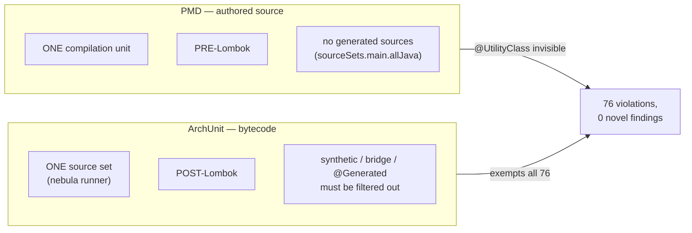
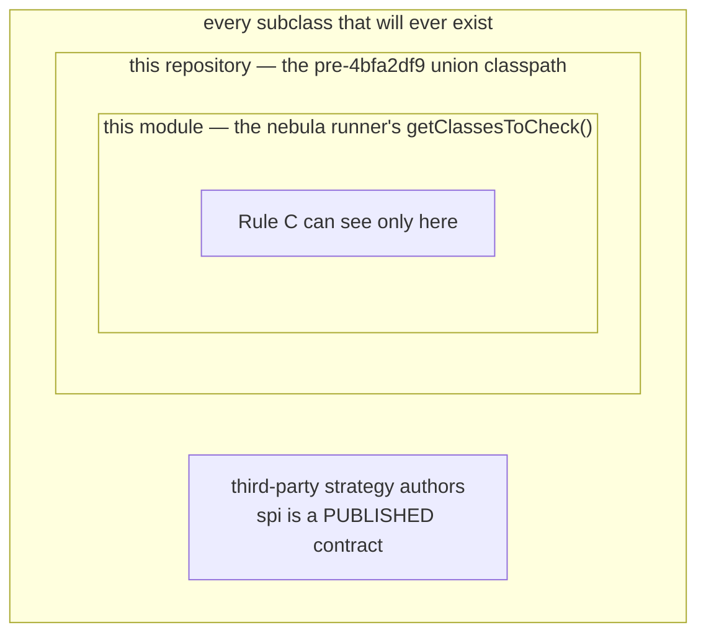
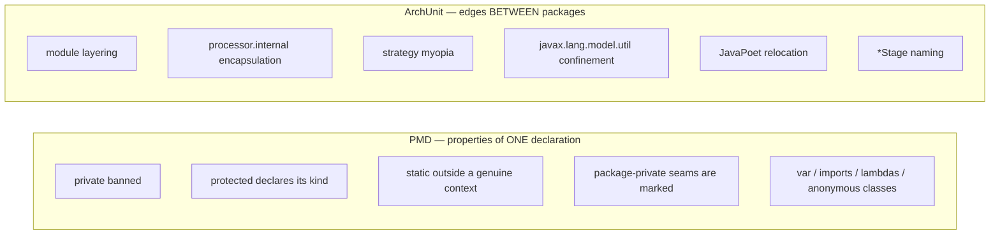

## Context

Two analysers currently enforce one doctrine. `MethodShapeRules` (ArchUnit, four rules) and the
`joke-strict` PMD ruleset both exist to make every authored method interceptable by a test double, and both
say so in nearly identical words. They disagree only about exemptions, and every disagreement traces to what
each tool can see:

Measured on the working tree: **836 violations across all source sets** — 415 `processor:main`, 196
`strategies-builtin:main`, 92 `spi:main`, 76 `architecture-tests:archRules`, 40 across the reactor pair, 17
in test source sets. Of the 76 raised by the two overlapping rules, none is a method ArchUnit missed:

| Count | Shape | ArchUnit Rule D / C |
|---|---|---|
| 29 | Lombok `@UtilityClass` | exempt — `isUtilityHolder`, matched structurally in bytecode |
| 24 | named constructor | exempt — `isNamedConstructor` |
| 5 | Dagger `@Provides` | exempt — framework-mandated |
| 8 | `protected abstract` | exempt — Rule C matches concrete only |
| 8 | `@VisibleForTesting protected` | **the sanctioned form** |
| 2 | published spi | exempt — design D5, named individually |

The constraint that decides ownership is not ergonomics. It is that Rule C's question has no answer.

## Goals / Non-Goals

**Goals:**

- One owner per invariant, chosen by what the tool can actually observe.
- A `protected` method's kind becomes a **declared fact** rather than an inferred one, so the rule holds at
  every range — module, repository, and third-party consumer.
- Retire `MethodShapeRules` and its fixture apparatus without losing a single invariant it enforced.
- Reach a green `./gradlew check --no-configuration-cache` with the full `joke-strict` ruleset active.

**Non-Goals:**

- Changing which invariants percolate holds. Every rule survives; only its owner and its phrasing change.
- Touching `ModuleLayeringRules`, `EngineEncapsulationRules`, or `TypeBoundaryRules`.
- Restoring a union-classpath aggregation module. Explicitly rejected — see D2.
- Authoring the upstream rule fixes. They are a separate change in the `pmd-rules` repository (D6).
- Any change to the published API, the generated-mapper contract, or the processing surface.
- Revisiting the ruleset's stock-category composition, exclusions, or thresholds beyond what D5 requires.

## Decisions

### D1 — A `protected` method declares its kind; nothing infers it

> **Architecture note:** this is a doctrine shift, not a refactor. The repo currently treats *"no subclass
> uses it"* as evidence of a test seam. That inference is deleted, not relocated.

Rule C asks whether **no** subclass uses a `protected` method — absence of evidence over a set that must be
enumerated to be trusted. Three nested scopes, and the answer is out of reach in all of them:

Widening the scope buys two methods and still leaves `T` unreachable. So the question is replaced by a
declaration:

| Marker | Meaning |
|---|---|
| `@VisibleForTesting` | widened for a test seam |
| `@ApiStatus.OverrideOnly` | a genuine extension point |

Exactly one, on every `protected` method. This needs no import scope at all, which makes it correct at every
range — and it is **strictly stronger** than Rule C, which passes vacuously the moment any subclass happens
to override, conflating a designed hook with an accidental one.

*Alternatives considered.* (a) An aggregation module restoring `importPackages(ROOT)` — rejected: it undoes
the module-local evaluation `adopt-nebula-archrules` bought four days earlier, reintroduces a module
depending on every sibling as an end-of-build serialisation point, and still cannot see `T`. (b) Keep D5's
blanket published-spi exemption — rejected: it silently drops coverage exactly where the contract is most
public. (c) A custom `@ExtensionPoint` in `annotations` — rejected in favour of D7.

### D2 — The ownership line is *relationships between types* vs *properties of a declaration*

Once D1 removes the only method-shape rule needing a whole-graph query, the entire family collapses to the
left column. PMD then wins on every remaining axis: a violation carries a line number and an IDE squiggle
(`.idea/PMDPlugin.xml` is already configured); a test case is ~8 lines of declarative XML rather than a
compiled fixture class whose *package* is load-bearing; thresholds are consumer-tunable through
`<properties>`, which `ArchRulesService` cannot express (it offers priority overrides and rule exclusions
only, never property injection); and because Gradle feeds PMD `allJava`, generated sources are never seen —
so the `NOT_SYNTHETIC_OR_BRIDGE` / `isGeneratedOrNestedInGenerated` / dual-Dagger-spelling apparatus simply
has nothing to do.

The surviving ArchUnit rules sit entirely in the right column, and each is answerable from one module's own
classes, so none of them inherits Rule C's problem.

### D3 — Delete `MethodShapeRules` whole, not trimmed

Rules A and D could technically stay as belt-and-braces over PMD. They will not: two owners with two
exemption sets is the condition this change exists to end, and a rule that never fires is a rule nobody
maintains correctly. The class, its four `getRules()` entries, `MethodShapeRulesSpec`, and all six negative
fixtures go together.

A pleasing consequence: **51 of the 76 `architecture-tests:archRules` violations are inside
`MethodShapeRules.java` itself** — the rule library was never runner-enrolled, so its own code was never
subject to the rules it defines. Deleting it removes those 51 outright. The remaining 25 (in the three
surviving rule classes) are ordinary fixes.

`Packages` is pruned of any coordinate no surviving rule reads — expected to be `DECOMPOSED_ENGINE_PACKAGES`,
`DAGGER_PROVIDES`, `DAGGER_GENERATED`, `VISIBLE_FOR_TESTING`, `LOMBOK_GENERATED`.

### D4 — The size ceiling moves to `TooManyMethods`, re-enabled locally

Rule B is the one rule with no *conceptual* home in the family — it is a package list plus a number, which is
configuration wearing a rule's clothes. It exists to co-enforce Rule A: without it, "no private methods" is
satisfied by exposing a monolith's guts as package-private members.

PMD's `TooManyMethods` is the equivalent and is **excluded** by `joke-strict.xml`. Re-enabling it needs a
local ruleset (D8) and costs the package-scoping Rule B had — it would apply repo-wide at whatever
`maxmethods` is set, not just to the decomposed engine packages. Two options survive to implementation:

1. Re-enable `TooManyMethods` repo-wide at a threshold no current class breaches, accepting that the
   decomposed packages are no longer singled out.
2. Drop the ceiling and record it as a review-caught convention.

**Decision: option 1**, at a threshold measured from the current worst class rather than a round number, so
it acts as a ratchet in the same spirit as the `processor` pitest thresholds. Option 2 is the fallback if the
measured threshold turns out so high it enforces nothing.

### D5 — Ruleset composition lives in a local file that references `joke-strict`

`joke-strict.xml` states that Gradle's `ruleSets` cannot subtract, so any exclusion or property override
requires a local ruleset referencing it. D4 needs exactly that. The orphaned root `.pmd.xml` is therefore
**repurposed rather than deleted** — same path, new content: a thin file referencing
`rulesets/java/joke-strict.xml` and carrying only percolate-local composition. If D4 falls back to option 2
and no local composition remains, `.pmd.xml` is deleted instead.

### D6 — The rule fixes are upstream, and this change is blocked on them

Three fixes belong to `io.github.joke.pmd:rules`, not here:

| Rule | Fix | Removes |
|---|---|---|
| `StaticMethodsModifyStaticState` | named-constructor exemption — a static returning its own declaring type, or an interface that type implements | ~24 |
| `StaticMethodsModifyStaticState` | recognise Lombok `@UtilityClass` by simple name, the same type-resolution-dodging trick `UseVisibleForTestingAnnotation` already uses | ~29 |
| `AvoidPrivateAndProtectedMethods` | accept `protected` when marked `@ApiStatus.OverrideOnly` | enables D1 |

They are a separate change in that repository, which carries its own OpenSpec with `method-visibility-rule`
and `static-method-state-rule` specs to delta. Suppressing ~53 sites with `@SuppressWarnings` was considered
and rejected: the exemptions are correct for *every* consumer of the artifact, and percolate is its first
customer — the same relationship the built-in strategies have with the codegen SPI.

This change **pins a released version first** and cannot complete until that release exists.

### D7 — `@ApiStatus.OverrideOnly`, not a bespoke annotation

`org.jetbrains.annotations` is already the source of `@VisibleForTesting` here, so the counterpart costs no
new dependency. Its documented meaning — clients override it, never call it — is exactly a template-method
hook. And because the PMD rule matches by **simple name**, the rule stays generic for other consumers.

Watch for the `org.jetbrains:annotations` `compileOnly` gap previously hit in `reactor` and
`strategies-builtin`; any module gaining the annotation needs the dependency declared.

### D8 — `UseVisibleForTestingAnnotation` is adopted in full, IDE-driven

334 violations, and the largest single group. Adopting it means `@VisibleForTesting` marks *every*
package-private method rather than discriminating among them — a real cost, since D1's `protected` rule
leans on the annotation meaning something. It is accepted deliberately: under the no-private rule
package-private *is* the internal-method form, so "every internal method is a declared seam" is a coherent
reading, and the `protected` pair stays discriminating because both of its markers remain deliberate.

The sweep is mechanical and is to be driven as an IDE-assisted structural refactoring, reviewed in batches
per module, rather than by hand.

## Risks / Trade-offs

- **The upstream release does not land, or lands with different semantics** → this change is fully blocked
  behind a version pin, so it fails fast at task 1 rather than half-migrating. Nothing here is started until
  the pin resolves.
- **Deleting Rules A/C/D leaves a window where neither tool enforces them** → the deletion task group runs
  *after* the pin and after the fixes that make PMD's equivalents pass, never before. Ordering is
  load-bearing; `check` must be green at each group boundary.
- **`@VisibleForTesting` is diluted across 334 methods** (D8) → accepted, with the reasoning recorded above.
  If it later proves to have destroyed a signal worth keeping, the rule is one exclusion away in `.pmd.xml`.
- **The size ceiling silently weakens** (D4) → mitigated by setting `maxmethods` from the measured worst
  class so it ratchets. If the measurement shows the ceiling would be vacuous, D4 falls back to option 2 and
  the loss is recorded explicitly rather than assumed away.
- **Rule C's cross-module coverage is not "restored" but replaced** → a reviewer must now confirm the marker
  is *truthful*, where before the build inferred it. This is a genuine transfer of work from machine to
  review, and the compensation is that the check finally holds for third-party subclasses, which it never did.
- **836 mechanical edits across seven modules risk masking a semantic change** → task groups are per rule and
  per module so each lands as a reviewable commit, and `check` gates every group.
- **`architecture-tests:archRules` was never rule-checked and now is** → 25 non-`MethodShapeRules` violations
  surface as new work in a module that previously had none.
- **A stale `UP-TO-DATE` masks an unfixed violation** → run with `--no-configuration-cache`, per the known
  shipkit-auto-version serialization failure.
