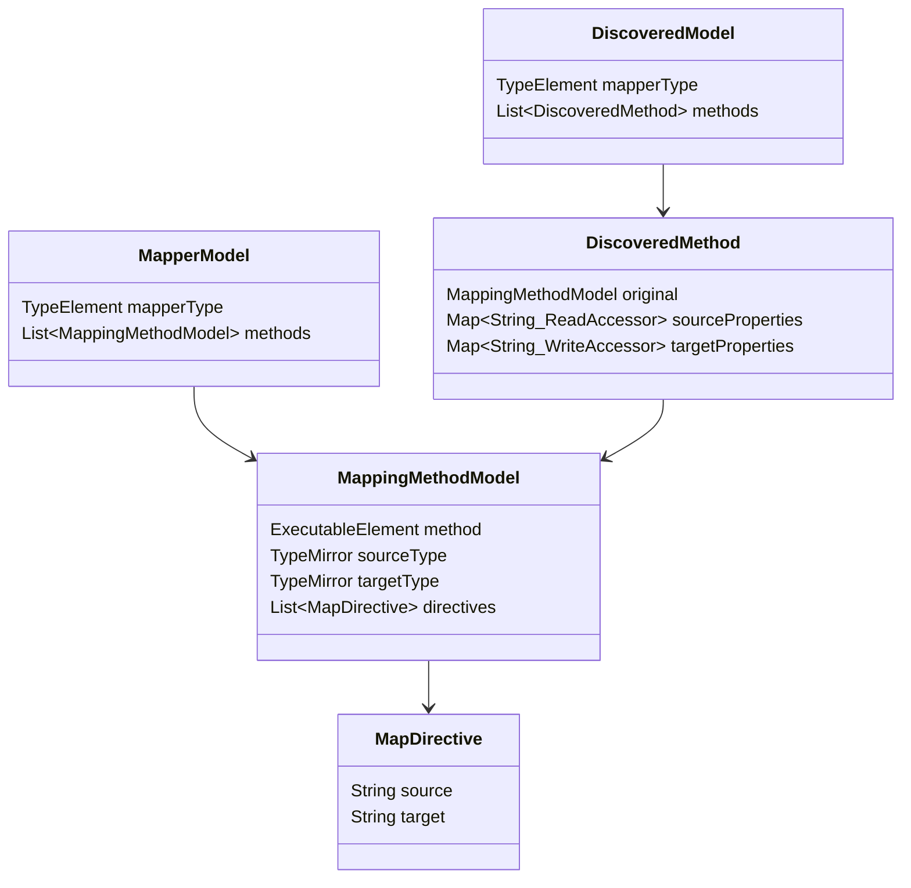
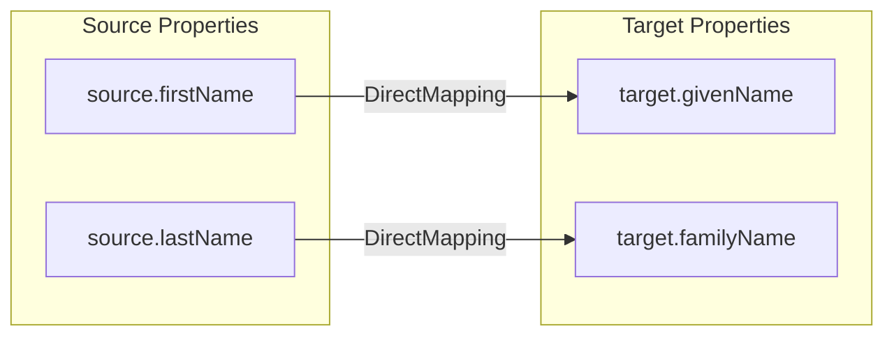
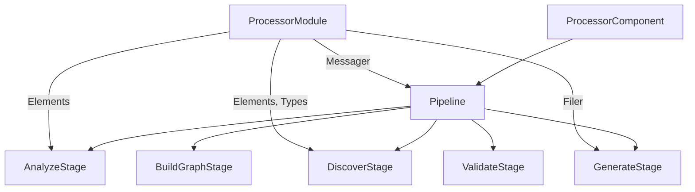

## Context

The `PercolateProcessor` annotation processor is wired with Dagger DI and delegates to a `Pipeline` that currently returns `null`. The annotations (`@Mapper`, `@Map`, `@MapList`) are defined and stable. The processor needs a concrete pipeline that transforms `@Mapper`-annotated types into generated implementation classes.

The processor runs inside `javac` using the `javax.annotation.processing` API. All type information is accessed via `TypeElement`, `TypeMirror`, `Elements`, and `Types` — no reflection available.

## Goals / Non-Goals

**Goals:**
- End-to-end processing: `@Mapper` type in → generated `*Impl` class out
- Per-mapper error isolation — one broken mapper does not prevent others from generating
- Pluggable property discovery via `ServiceLoader` SPI
- JGraphT-based mapping graph for validation and code generation
- Support explicit `@Map` directives (no auto-mapping yet)
- Constructor-based and field-based target construction
- Getter-based source property access
- Extensible design ready for nested submappings and auto-mapping

**Non-Goals:**
- Auto-mapping (matching properties by name without `@Map`) — deferred
- Nested submapping resolution (using other mapper methods) — deferred, but graph structure accommodates it
- Builder pattern target construction — deferred
- Setter-based target construction — deferred
- Type conversion (e.g., `int` → `String`) — deferred
- Abstract class mappers — deferred (interfaces only for now)
- Multiple methods per mapper — deferred, but pipeline structure supports it

## Decisions

### 1. Linear stage pipeline with StageResult

Each stage is a function `I → StageResult<O>`. The pipeline chains stages sequentially, stopping on first failure per mapper.


**`StageResult<T>`** — simple class with `@Nullable T value` and `List<Diagnostic> errors`. Provides `isSuccess()`, `success(T)`, and `failure(List<Diagnostic>)` factory methods.

**`Diagnostic`** — carries `Element` (for source location), `String message`, and `Diagnostic.Kind` (ERROR, WARNING, NOTE).

**Alternative considered:** Visitor pattern walking the element tree. Rejected — stages are easier to test in isolation and the linear flow matches the mental model.

**Alternative considered:** Sealed interface for StageResult. Rejected — Java 11 target has no sealed types.

### 2. Intermediate models between stages

Each stage transforms one model to the next. Models are immutable data carriers.



**ReadAccessor** and **WriteAccessor** are abstract types with concrete implementations per strategy (e.g., `GetterAccessor`, `ConstructorParamAccessor`, `FieldAccessor`). Each carries the element reference needed for JavaPoet code generation.

### 3. JGraphT directed graph for mapping representation

The `BuildGraphStage` constructs a `DefaultDirectedGraph<PropertyNode, MappingEdge>` from the discovered model.



**Nodes:** `PropertyNode` — either `SourcePropertyNode(name, type, ReadAccessor)` or `TargetPropertyNode(name, type, WriteAccessor)`.

**Edges:** `MappingEdge` — carries the mapping type (direct, future: auto, sub-mapping, conversion). Edge weight can be used for priority resolution when auto-mapping is added (Dijkstra shortest path for type conversion chains).

**JGraphT algorithms used:**
- `ConnectivityInspector`: detect unconnected target nodes (unmapped targets → error) and unconnected source nodes (unmapped sources → warning)
- `DOTExporter`: debug output of the mapping graph
- Future: `CycleDetector` for circular submappings, `TopologicalOrderIterator` for generation ordering, `DijkstraShortestPath` for type conversion path finding

**Alternative considered:** Custom graph implementation. Rejected — JGraphT provides algorithms (connectivity, cycle detection, topological sort, export) that would need to be reimplemented.

### 4. SPI-based property discovery with priority

Two SPI interfaces loaded via `ServiceLoader`:

```java
public interface SourcePropertyDiscovery {
    int priority();
    List<ReadAccessor> discover(TypeMirror type, Elements elements, Types types);
}

public interface TargetPropertyDiscovery {
    int priority();
    List<WriteAccessor> discover(TypeMirror type, Elements elements, Types types);
}
```

Built-in strategies registered via `META-INF/services`:
- `GetterDiscovery` (priority 100): discovers `getX()`/`isX()` methods → `ReadAccessor`
- `ConstructorDiscovery` (priority 100): discovers constructor parameters → `WriteAccessor`
- `FieldDiscovery` (priority 50): discovers public fields → `ReadAccessor` or `WriteAccessor`

When multiple strategies discover the same property name, highest priority wins. The `DiscoverStage` loads all strategies, runs them, and merges results by property name respecting priority.

**Alternative considered:** Dagger multibindings for strategies. Rejected — strategies must be pluggable by end users via `annotationProcessor` classpath, which is the `ServiceLoader` model.

### 5. Dagger integration for stages

All stages are constructor-injected by Dagger. The `Pipeline` receives all stages via `@Inject` constructor (Lombok `@RequiredArgsConstructor`). Stages receive `Elements`, `Types`, `Messager`, `Filer` as needed from the existing `ProcessorModule`.



`ServiceLoader` for discovery strategies lives outside Dagger — the `DiscoverStage` bridges the two worlds by loading SPIs in its constructor.

### 6. Code generation via JavaPoet

The `GenerateStage` walks the validated graph and produces a `JavaFile` using Palantir JavaPoet.

Generated class pattern:
- Class name: `<MapperName>Impl` in the same package
- Implements the mapper interface
- For constructor-based targets: gathers all mapped values, calls `new Target(arg0, arg1, ...)`
- For field-based targets: creates instance via no-arg constructor, assigns fields

The stage reads accessor metadata from graph nodes to emit the correct access pattern (getter call, field read, constructor param position, field write).

### 7. Package structure

```
io.github.joke.percolate.processor
├── PercolateProcessor.java        (existing)
├── Pipeline.java                  (modified)
├── ProcessorComponent.java        (existing)
├── ProcessorModule.java           (existing)
├── StageResult.java
├── Diagnostic.java
├── stage/
│   ├── AnalyzeStage.java
│   ├── DiscoverStage.java
│   ├── BuildGraphStage.java
│   ├── ValidateStage.java
│   └── GenerateStage.java
├── model/
│   ├── MapperModel.java
│   ├── MappingMethodModel.java
│   ├── MapDirective.java
│   ├── DiscoveredModel.java
│   ├── DiscoveredMethod.java
│   ├── ReadAccessor.java
│   ├── WriteAccessor.java
│   ├── GetterAccessor.java
│   ├── FieldReadAccessor.java
│   ├── ConstructorParamAccessor.java
│   └── FieldWriteAccessor.java
├── graph/
│   ├── PropertyNode.java
│   ├── SourcePropertyNode.java
│   ├── TargetPropertyNode.java
│   └── MappingEdge.java
└── spi/
    ├── SourcePropertyDiscovery.java
    ├── TargetPropertyDiscovery.java
    ├── GetterDiscovery.java
    ├── ConstructorDiscovery.java
    └── FieldDiscovery.java
```

## Risks / Trade-offs

- **ServiceLoader in annotation processor classloader** → Well-established pattern (AutoService, MapStruct SPI). The processor's classpath is the `annotationProcessor` configuration in Gradle. Mitigation: test with compile-testing framework which simulates the javac environment.

- **Constructor discovery relies on parameter names** → Java compilers don't always preserve parameter names. Mitigation: require `-parameters` flag or use `@ConstructorProperties` annotation on target types. Document this requirement.

- **Single method per mapper limits initial utility** → Acceptable for first iteration. The graph structure and pipeline architecture support multi-method mappers without redesign.

- **No auto-mapping may feel incomplete** → Explicit `@Map` for every property is verbose. Mitigation: auto-mapping is the natural next iteration and the priority-based discovery system is designed to support it (auto-mapped properties get lower precedence than explicit ones).
