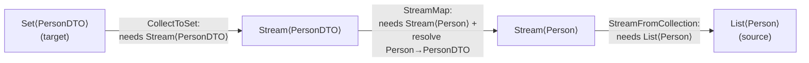

## Context

The `ResolveTransformsStage` currently uses a hardcoded if-else chain: check `isAssignable`, then search for a sibling method, then mark as unresolved. This works for flat property mapping but cannot handle container types like `List<Person>` → `Set<PersonDTO>` where multiple intermediate steps are needed (stream, map elements, collect).

The existing `MappingGraph` (JGraphT `DefaultDirectedGraph`) connects source properties to target properties. The transform resolution currently produces a single-step `TransformNode` per edge. Container mapping requires multi-step chains that compose intermediate type conversions.

JGraphT 1.5.2 is already a dependency, used in `BuildGraphStage` and `ValidateStage`.

## Goals / Non-Goals

**Goals:**
- Replace hardcoded transform resolution with a graph-based strategy system
- Support collection mapping: `List`/`Set`/`Collection`/`Iterable` (source) → `List`/`Set` (target) with element-level transformation
- Support Optional mapping: `Optional<T>` → `Optional<U>` with element-level transformation, plus wrap/unwrap
- Make the resolution algorithm extensible via SPI so developers can provide custom transformation strategies
- Each strategy owns its code generation template — `GenerateStage` only composes them
- Produce clear, goal-directed error messages when resolution fails

**Non-Goals:**
- `Map<K,V>` support
- Array support
- Nested containers (e.g., `List<List<T>>`, `Optional<List<T>>`)
- Nullability handling
- Mixing container families (Optional ↔ Collection)
- `Collection` or `Iterable` as target types (only as source)

## Decisions

### Decision 1: Uniform SPI — everything is a strategy

All transformations use the same `TypeTransformStrategy` interface, including direct assignability and method calls. No special-cased resolution logic.

```java
interface TypeTransformStrategy {
    Optional<TransformProposal> canProduce(
        TypeMirror sourceType,
        TypeMirror targetType,
        Context ctx
    );
}
```

**Rationale:** Uniform interface means the resolution algorithm is trivial (ask all strategies, collect edges). Each strategy is independently testable. New transformations (e.g., boxing, array conversion) are added by registering a new strategy — no changes to the resolver.

**Alternative considered:** Adding a `ContainerOperation` alongside `DirectOperation` and `SubMapOperation` in the existing if-else chain. Rejected because it doesn't scale — each new container type requires modifying the resolver and the code generator.

### Decision 2: Target-directed BFS resolution

Resolution works backward from the target type. Each iteration asks all strategies "can you produce this target type given this source type?" Strategies contribute edges to a JGraphT directed graph. Resolution completes when `BFSShortestPath` finds a path from source to target, or when no new edges are contributed (unresolved).



**Rationale:** Target-directed search produces clear error messages: "I need X to produce Y — provide a mapping method." Source-directed expansion creates intermediate types the developer didn't ask for, producing confusing errors. BFS naturally finds the shortest path without requiring priority configuration on strategies.

**Alternative considered:** Bidirectional search (expand from both source and target, meet in the middle). Rejected for added complexity with little benefit given the shallow depth of container transformations.

**Alternative considered:** Priority-based strategy ordering. Rejected because BFS shortest path achieves the same effect — `DirectAssignableStrategy` produces a 0-length path, `MethodCallStrategy` produces length-1, container chains are length-3+. Shorter paths win naturally.

### Decision 3: Type transformation graph as JGraphT `DefaultDirectedGraph`

Each property mapping edge gets its own type transformation graph. Nodes are `TypeNode` (wrapping a `TypeMirror`), edges are `TransformEdge` (carrying the contributing strategy and a `CodeTemplate`).

```java
@Value class TypeNode {
    TypeMirror type;
    String label;  // for debugging / DOT export
}

@Value class TransformEdge {
    TypeTransformStrategy strategy;
    CodeTemplate codeTemplate;
}
```

**Rationale:** Reuses JGraphT infrastructure already in the project. `BFSShortestPath`, `CycleDetector`, and `DOTExporter` are available out of the box. The `GraphPath<TypeNode, TransformEdge>` result is a first-class object that `GenerateStage` can walk directly.

### Decision 4: Code templates are `CodeBlock → CodeBlock` functions on strategy edges

Each strategy provides a `CodeTemplate` that transforms an input `CodeBlock` into an output `CodeBlock`. `GenerateStage` composes templates by walking the resolved path left-to-right.

```java
interface CodeTemplate {
    CodeBlock apply(CodeBlock innerExpression);
}
```

Examples:
- `StreamFromCollection`: `input → CodeBlock.of("$L.stream()", input)`
- `CollectToSet`: `input → CodeBlock.of("$L.collect($T.toSet())", input, Collectors.class)`
- `StreamMap` with SUBMAP inner: `input → CodeBlock.of("$L.map(e -> mapPerson(e))", input)`
- `DirectAssignable`: `input → input` (identity)

**Rationale:** Strategies own their code generation, so `GenerateStage` has zero knowledge of container types. Adding a new strategy automatically adds its code generation. Templates compose naturally via function application.

### Decision 5: Strategies registered via ServiceLoader SPI

`TypeTransformStrategy` implementations are registered via `@AutoService(TypeTransformStrategy.class)`, consistent with existing SPI usage for `SourcePropertyDiscovery` and `TargetPropertyDiscovery`.

**Rationale:** Consistent with existing project patterns. Developers can provide custom strategies by implementing the interface and registering via ServiceLoader.

### Decision 6: Max 30 expansion iterations as safety bound

The BFS expansion loop runs at most 30 iterations. In practice, the graph converges naturally because each strategy fires at most once per type pair. The bound is a safety net for pathological custom strategies.

**Rationale:** Container chains are 3-4 edges deep. 30 iterations provides ample room for deeply nested custom conversions while preventing infinite loops.

### Decision 7: Built-in strategy set

| Strategy | Source | Target | Codegen |
|---|---|---|---|
| `DirectAssignableStrategy` | any T | any T (assignable) | identity |
| `MethodCallStrategy` | method param type | method return type | `methodName($INPUT)` |
| `StreamFromCollectionStrategy` | `List`/`Set`/`Collection`/`Iterable` | `Stream<T>` | `.stream()` / `StreamSupport.stream(...)` |
| `CollectToListStrategy` | `Stream<T>` | `List<T>` | `.collect(Collectors.toList())` |
| `CollectToSetStrategy` | `Stream<T>` | `Set<T>` | `.collect(Collectors.toSet())` |
| `StreamMapStrategy` | `Stream<T>` | `Stream<U>` | `.map(e -> ...)` (recursive sub-resolution for T→U) |
| `OptionalMapStrategy` | `Optional<T>` | `Optional<U>` | `.map(e -> ...)` (recursive sub-resolution for T→U) |
| `OptionalWrapStrategy` | `T` | `Optional<T>` | `Optional.of($INPUT)` |
| `OptionalUnwrapStrategy` | `Optional<T>` | `T` | `$INPUT.get()` |

### Decision 8: `StreamMapStrategy` and `OptionalMapStrategy` trigger recursive sub-resolution

When `StreamMapStrategy` matches (`Stream<T>` → `Stream<U>`, T ≠ U), it adds the edge and triggers a sub-resolution for `T → U`. This sub-resolution uses the same algorithm (ask all strategies). The T→U conversion is typically resolved by `MethodCallStrategy` (developer-provided sibling method) or `DirectAssignableStrategy`.

**Rationale:** The stream/optional map strategy does not know about element conversion — it only knows about stream/optional semantics. The element conversion is a separate concern resolved by the same uniform mechanism.

## Risks / Trade-offs

- **[Breaking internal API]** `TransformOperation` and its subclasses (`DirectOperation`, `SubMapOperation`, `UnresolvedOperation`) are replaced by the graph-based model. → Internal to the processor, not a public API. Existing tests will need updating.

- **[Ambiguous paths]** Multiple valid paths could exist (e.g., two strategies both claim to produce `List<T>`). → BFS returns the first shortest path found. Strategy registration order within the same path length is deterministic via ServiceLoader ordering. If this becomes a problem, we can add explicit conflict detection later.

- **[Lambda variable naming in StreamMap/OptionalMap]** The `.map(e -> ...)` codegen introduces a lambda parameter `e`. Nested lambdas (not in scope) would shadow this. → Not a concern for single-level containers. Can be addressed with unique variable naming if nesting is added later.

- **[Annotation processing performance]** Building a graph and running BFS per property edge adds overhead vs. the current if-else. → The type graphs are tiny (3-5 nodes for container mapping). BFS on a 5-node graph is negligible compared to I/O and javac overhead.
