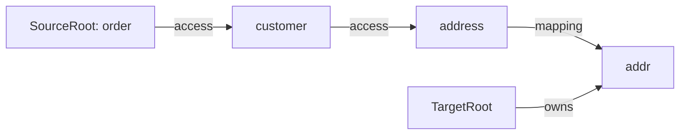

## Context

The current pipeline couples property structure with type resolution. `BuildGraphStage` receives a `DiscoveredModel` where source/target properties are already fully resolved (names, types, accessors). The graph nodes (`SourcePropertyNode`, `TargetPropertyNode`) carry `ReadAccessor`/`WriteAccessor` with `TypeMirror` — meaning the graph is inherently typed.

This makes nested source chains like `@Map(source = "customer.address.street", target = "street")` difficult: the graph construction stage would need to resolve intermediate types to discover accessors at each hop, blurring its responsibility with `ResolveTransformsStage`.

Current pipeline: `Analyze → Discover → BuildGraph → Validate → ResolveTransforms → ValidateTransforms → Generate`

Current data flow:
```
AnalyzeStage        → MapperModel (annotations + methods)
DiscoverStage       → DiscoveredModel (properties with types + accessors)
BuildGraphStage     → MappingGraph (typed graph with accessor-bearing nodes)
ValidateStage       → MappingGraph (validated completeness)
ResolveTransforms   → ResolvedModel (type transform chains)
ValidateTransforms  → ResolvedModel (verified all resolved)
GenerateStage       → JavaFile
```

## Goals / Non-Goals

**Goals:**
- Separate property structure (what maps to what) from type resolution (how to access and transform)
- Enable nested source property chains as a natural consequence of the graph structure
- Consolidate validation into `ValidateTransformsStage` with rich error messages
- Remove `DiscoverStage` and `ValidateStage` as separate pipeline stages
- Preserve the existing SPI contracts (`SourcePropertyDiscovery`, `TargetPropertyDiscovery`, `TypeTransformStrategy`)

**Non-Goals:**
- Multi-parameter mapper methods (the graph model supports them but parsing and API changes are out of scope)
- New transform strategies (Optional handling, container mapping etc. remain unchanged)
- Changes to the `@Map` annotation contract
- Performance optimization of the resolution algorithm

## Decisions

### Decision 1: Two distinct graph types — symbolic and resolved

The symbolic property graph contains only names and structural edges. No `TypeMirror`, no `ReadAccessor`, no `WriteAccessor`. The resolved transform graph (already exists as `GraphPath<TypeNode, TransformEdge>`) is produced by walking the symbolic graph.

**Symbolic graph node types:**

```
SourceRootNode(paramName: String)
SourcePropertyNode(name: String)
TargetRootNode
TargetPropertyNode(name: String)
```

**Symbolic graph edge types:**

```
AccessEdge: SourceRootNode → SourcePropertyNode
            SourcePropertyNode → SourcePropertyNode  (for chains)
MappingEdge: SourcePropertyNode → TargetPropertyNode
```

**Example — `@Map(source = "customer.address", target = "addr")`:**



**Why not a single graph?** The symbolic graph answers "what connects to what" (structure). The transform graph answers "how do I get from type A to type B" (resolution). Mixing them forces either early type resolution (current problem) or a graph with mixed typed/untyped nodes (confusing). Two graphs with a clear handoff is cleaner.

**Alternative considered:** Enriching the current typed graph with chain support. Rejected because it would require `BuildGraphStage` to do type-aware traversal for intermediate chain segments, violating the separation we want.

### Decision 2: BuildGraphStage does lightweight property name scanning

`BuildGraphStage` needs property names for auto-mapping (matching source and target properties by name). It performs its own name-only scan rather than depending on the full discovery SPI.

```java
// Lightweight: just extracts names from getters/fields
Set<String> scanPropertyNames(TypeMirror type, Elements elements, Types types)
```

This scans for `getX()`/`isX()` methods and public fields, extracts property names, returns a `Set<String>`. No `ReadAccessor` objects, no types, no priority resolution.

**Why not reuse the discovery SPI?** The discovery SPI returns `ReadAccessor`/`WriteAccessor` with types and element references — far more than needed. Having `BuildGraphStage` call it would either waste work or create a dependency on typed results in a stage that should be symbolic. A simple name scanner keeps the stage self-contained.

**Why not a separate DiscoverNamesStage?** The scan is trivial — a few lines of code. A whole stage adds pipeline complexity for no benefit.

**Alternative considered:** Moving auto-mapping into `ResolveTransformsStage`. Rejected because auto-mapping is a structural decision (which properties are connected) not a resolution concern (how to access/transform them). It belongs in graph construction.

### Decision 3: Nested chains are sequences of AccessEdges

`@Map(source = "customer.address.street", target = "street")` is parsed by `BuildGraphStage` into:

```
SourceRoot("order") --access--> "customer" --access--> "address" --access--> "street" --mapping--> Target("street")
```

Chain segments sharing a prefix share nodes:

```
@Map(source = "customer.address", target = "addr")
@Map(source = "customer.name", target = "name")

SourceRoot --access--> "customer" --access--> "address" --mapping--> "addr"
                                  \--access--> "name"    --mapping--> "name"
```

**Why a graph and not a list of chain segments?** The graph naturally deduplicates shared prefixes and makes fan-out explicit. `ResolveTransformsStage` can resolve `customer` once and reuse the result for both branches.

### Decision 4: DiscoverStage folds into ResolveTransformsStage

Full property discovery (accessors, types, priorities) moves into `ResolveTransformsStage`. When resolving an `AccessEdge`, the stage:

1. Determines the type of the source node (from the method parameter type for `SourceRoot`, or from the previous resolution step for intermediate nodes)
2. Runs `SourcePropertyDiscovery` / `TargetPropertyDiscovery` SPIs to discover accessors on that type
3. Looks up the named property from the symbolic edge
4. Records the accessor and type for code generation

This is a natural fit: the stage already resolves types via strategies. Property discovery is just another kind of resolution — "given a type and a name, how do I access it?"

### Decision 5: ValidateStage merges into ValidateTransformsStage

Today `ValidateStage` checks structural completeness (unmapped targets, duplicate mappings) on the typed graph. With the symbolic graph, meaningful validation requires types — "did you mean 'address'?" needs to know what properties exist on the type, which only `ResolveTransformsStage` knows.

`ResolveTransformsStage` annotates failures rather than reporting errors. `ValidateTransformsStage` inspects the resolved graph and produces all diagnostics:

- **Property not found:** `"Property 'adress' not found on type Customer (source chain 'customer.adress.street', segment 2). Did you mean 'address'?"`
- **Unmapped targets:** `"Target property 'zipCode' on OrderDTO has no source mapping."`
- **Duplicate target mappings:** `"Target property 'name' has conflicting sources: [firstName, lastName]"`
- **Unresolvable type gap:** `"No transform found from Address to AddressDTO. Consider adding a mapping method."`

The resolution stage captures context (available property names, attempted types) in failure annotations so validation can produce rich messages.

### Decision 6: ResolveTransformsStage has no knowledge of @Map annotations

`ResolveTransformsStage` receives a symbolic graph of property names and edges. It resolves each edge to produce a typed, accessor-bearing result. It does not know why the graph was constructed — the graph could come from annotations, a DSL, or test fixtures.

This gives us:
- Clean testability — construct symbolic graphs by hand in tests
- Clear contracts — `BuildGraphStage` owns annotation semantics, `ResolveTransformsStage` owns type resolution
- Future flexibility — other input sources without touching resolution logic

### Decision 7: Resolution output model

`ResolveTransformsStage` produces a new model that replaces both the current `MappingGraph` (typed property graph) and `ResolvedModel`:

Each resolved mapping carries:
- Source accessor chain: `List<ReadAccessor>` (one per chain segment)
- Target accessor: `WriteAccessor`
- Transform path: `GraphPath<TypeNode, TransformEdge>` (for the final source-type → target-type bridge)
- Resolution failures: annotated with context for validation

`GenerateStage` walks the source accessor chain to build the read expression, then applies the transform path's `CodeTemplate` chain, then writes via the target accessor. This replaces the current single `generateReadExpression()` call.

## Risks / Trade-offs

**[Risk] Name scanning in BuildGraphStage diverges from discovery SPI** → The name scanner applies the same `getX()`/`isX()` + public field patterns as `GetterDiscovery` and `FieldDiscovery`. If a custom SPI implementation adds a new discovery pattern (e.g., record components), auto-mapping won't pick it up until the scanner is updated. Mitigation: document that auto-mapping uses built-in patterns only; custom discoveries only affect resolution.

**[Risk] ResolveTransformsStage becomes complex** → It now handles accessor discovery, chain resolution, and type transform BFS. Mitigation: internal decomposition into helper methods/classes (chain resolver, accessor resolver) keeps the stage manageable. The public contract stays simple: symbolic graph in, resolved graph out.

**[Risk] Breaking change across all stages and tests** → Every stage's input/output changes. Mitigation: implement behind the existing test suite — update tests as each stage is rewritten. The SPI interfaces (`TypeTransformStrategy`, `SourcePropertyDiscovery`, `TargetPropertyDiscovery`) remain stable, limiting the blast radius to internal processor code.

**[Trade-off] Duplicate property scanning** → `BuildGraphStage` scans names, `ResolveTransformsStage` does full discovery. For the same type, property names are scanned twice. Acceptable: name scanning is cheap (no type resolution, no priority merging), and the duplication buys clean separation between stages.

**[Trade-off] Deferred validation** → Property existence errors are reported later in the pipeline (at `ValidateTransformsStage` instead of `BuildGraphStage`). This means more processing before the user sees an error. Acceptable: the processing is fast (annotation processor), and the error messages are richer because they have full type context.
