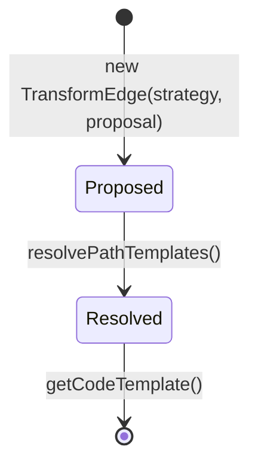

## Context

The `resolveTransformPath` method in `ResolveTransformsStage` builds a JGraphT directed graph of `TypeNode`/`TransformEdge` pairs via iterative BFS expansion. Currently, every time an edge is added to the graph, `resolveCodeTemplate` is called immediately — this recursively invokes `resolveTransformPath` for strategies with element constraints (e.g., `StreamMapStrategy`, `OptionalMapStrategy`). Only the edges on the final `BFSShortestPath` result are used; all other edges and their resolved code templates are discarded.

## Goals / Non-Goals

**Goals:**
- Defer `resolveCodeTemplate` to a post-BFS pass that only processes edges on the selected shortest path
- Eliminate wasted recursive resolution for dead-end edges in the type graph
- Keep the change internal to `ResolveTransformsStage` — no SPI or downstream API changes

**Non-Goals:**
- Splitting `TypeTransformStrategy.canProduce` into separate `canHandle`/`produce` methods
- Changing the `TransformProposal` structure or `TypeTransformStrategy` SPI interface
- Optimizing the BFS expansion itself (node-pair iteration, strategy ordering)

## Decisions

### Decision: Store `TransformProposal` on `TransformEdge` during expansion, resolve `CodeTemplate` after path selection

During BFS expansion, `TransformEdge` will carry the raw `TransformProposal` instead of a resolved `CodeTemplate`. After `BFSShortestPath` finds a path, a new method `resolvePathTemplates` walks the path's edge list and calls `resolveCodeTemplate` only for those edges.

**Alternative considered:** Split `TypeTransformStrategy` into `canHandle` + `produce`. Rejected because it forces strategies to recompute guard logic or cache intermediate state, adds a new type for the lightweight probe result, and the call site has no use case for checking applicability without the proposal.

**Alternative considered:** Cache `resolveCodeTemplate` results to avoid repeated computation for the same edge. Rejected as over-engineering — the graph is short-lived and the number of edges is small; deferring is simpler than caching.

### Decision: `TransformEdge` becomes mutable with a two-phase lifecycle

`TransformEdge` will hold both `TransformProposal` (set at construction) and `CodeTemplate` (set after path selection). The `@Value` annotation will be replaced with `@Getter` + explicit constructor. `getCodeTemplate()` will be available after resolution.

**Alternative considered:** Keep `TransformEdge` immutable and create new edges after resolution. Rejected because JGraphT edge identity matters for `GraphPath` — replacing edges would invalidate the path object.

### Decision: `resolvePathTemplates` as a private method in `ResolveTransformsStage`

The post-BFS resolution pass will be a private method `resolvePathTemplates(GraphPath, ResolutionContext)` that iterates the edge list, calls `resolveCodeTemplate` per edge, and sets the resolved template. This keeps the change localized to `ResolveTransformsStage`.

## Risks / Trade-offs

- **[TransformEdge becomes mutable]** Introduces a two-phase object lifecycle where `getCodeTemplate()` returns null before resolution. This is acceptable because `TransformEdge` is short-lived and only consumed within `ResolveTransformsStage`. The downstream `GenerateStage` receives the `GraphPath` after resolution is complete.
  - Mitigation: The `resolvePathTemplates` pass runs immediately after BFS, before the path is returned.

- **[Behavioral equivalence]** The resolved code templates must be identical to the eager approach. The same `resolveCodeTemplate` logic applies, just to fewer edges.
  - Mitigation: Existing tests cover the end-to-end transform resolution results and will validate equivalence.
