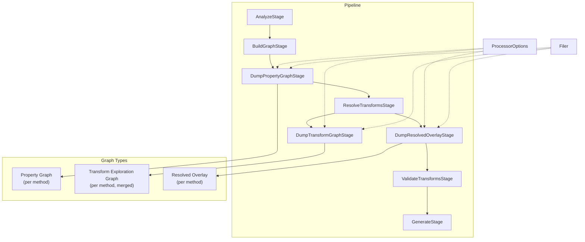
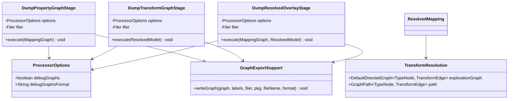

# Design: Debug Graph Output

## Context

Percolate's annotation processor builds two kinds of JGraphT directed graphs during compilation:

1. **Property mapping graphs** — one `DefaultDirectedGraph<Object, Object>` per mapping method, built in `BuildGraphStage`. Nodes are `SourceRootNode`, `SourcePropertyNode`, `TargetRootNode`, `TargetPropertyNode`; edges are `AccessEdge` and `MappingEdge`.

2. **Transform exploration graphs** — one `DefaultDirectedGraph<TypeNode, TransformEdge>` per source→target type resolution, built transiently inside `ResolveTransformsStage.resolveTransformPath()`. Currently discarded after BFS finds the shortest path.

The `jgrapht-io` module is already on the classpath (declared in `dependencies/build.gradle`) but unused. The processor has no debug output capabilities today.

## Goals / Non-Goals

**Goals:**
- Allow library users to inspect processor-internal graphs when mappings behave unexpectedly
- Preserve the full transform exploration graph (including "roads not taken") for debugging
- Output files alongside generated sources so they're easy to find
- Support multiple output formats (DOT for Graphviz, GraphML, JSON)
- Keep debug infrastructure off the hot path when disabled

**Non-Goals:**
- Interactive or runtime visualization tooling
- Graph output for `AnalyzeStage` (no graph exists) or `ValidateTransformsStage` (no new graph)
- Streaming graphs to compiler diagnostics via `Messager`
- Performance optimization of graph export (debug-only feature)

## Decisions

### 1. Debug stages as separate Dagger-injected classes

Debug dump logic lives in three dedicated stage classes, not inline in `Pipeline` or the real stages.

**Rationale:** Real stages remain pure (no debug concerns). Each dump stage is independently injectable and testable. Pipeline orchestrates the calls, keeping the sequence explicit.

**Alternatives considered:**
- *Decorator pattern wrapping real stages* — adds indirection and makes the stage sequence harder to read in Pipeline.
- *Dagger multibindings with a common `Stage<I,O>` interface* — fights the typed linear chain where every stage has distinct input/output types. Would require generic plumbing for no real benefit.

### 2. `ProcessorOptions` as a general-purpose config class

A single `@Value` class holding all processor option values, not a debug-specific config object. Provided by `ProcessorModule` reading from `processingEnvironment.getOptions()`.

**Rationale:** Future processor options (e.g., generated code style, warnings) have a natural home. One injection point, one place to parse options.

### 3. `TransformResolution` wraps exploration graph + path

`resolveTransformPath()` returns a new `TransformResolution` value type instead of a bare `GraphPath`. This carries the full `DefaultDirectedGraph<TypeNode, TransformEdge>` alongside the `@Nullable GraphPath`.

**Rationale:** The exploration graph is the primary debug value — it shows why a transform was chosen by revealing what else was considered. Without it, the dump stage can only show the winning path, which is already implicit in the generated code.

**Impact on `ResolvedMapping`:** Replace the `@Nullable GraphPath` field with `@Nullable TransformResolution`. The existing `getEdges()` and `isResolved()` methods delegate through to the path inside `TransformResolution`, preserving backward compatibility for `ValidateTransformsStage` and `GenerateStage`.

### 4. Fire-and-forget debug stages with warning-only error handling

Debug stages return `void`, not `StageResult`. If file writing fails (e.g., `IOException` from `Filer`), the stage logs a `WARNING` via `Messager` and returns. The pipeline continues.

**Rationale:** Debug output is a best-effort convenience. A file-system glitch during debug dumping must never prevent valid code generation.

### 5. Shared `GraphExportSupport` utility for format selection and file writing

All three dump stages need the same logic: pick the jgrapht-io exporter based on format string, configure label providers, write to `Filer`. Extract this into a package-private utility class rather than duplicating it.

**Rationale:** The three stages differ in what graph they build and how they label nodes/edges, but the format dispatch and file-writing boilerplate is identical.

## Architecture

### Class diagram

### Node and edge labeling strategy

| Graph | Node labels | Edge labels | Notes |
|---|---|---|---|
| Property | `node.toString()` (e.g., `SourceRootNode(order)`) | `"access"` / `"mapping"` by edge type | Source vs target nodes distinguished by shape in DOT |
| Transform | `TypeNode.getLabel()` (e.g., `Optional<String>`) | Strategy simple name (e.g., `OptionalUnwrap`) | Winning-path edges marked bold |
| Overlay | Same as property | Mapping edges annotated with transform summary | Combines both graph types into one view |

### Transform graph merging (per method)

Each mapping method may have multiple `ResolvedMapping` entries, each with its own `TransformResolution`. The `DumpTransformGraphStage` merges these into a single graph per method by adding all vertices and edges from each exploration graph into a fresh `DefaultDirectedGraph`. Duplicate `TypeNode` entries (same label) are deduplicated. Winning-path edges from any mapping are marked.

### File output via Filer

All files written through `Filer.createResource(StandardLocation.SOURCE_OUTPUT, packageName, fileName)`. This places debug files in the same output directory as `*Impl.java`. The Filer API is the standard mechanism — it works with all build tools (Gradle, Maven) and respects their output directory configuration.

## Risks / Trade-offs

**[Risk] Transform graph retention increases memory during resolution** → The exploration graphs are small (bounded by `MAX_ITERATIONS=30` and the number of strategies). The additional memory is a few hundred nodes/edges at most, held only for the duration of one mapper processing. Acceptable.

**[Risk] `Filer.createResource` may not support arbitrary file extensions** → The Filer spec allows any resource name. Tested with Gradle's annotation processing; non-Java files are written to the same output directory. If a specific build tool rejects it, the warning-only error handling ensures the build still succeeds.

**[Trade-off] Debug stages always injected, even when disabled** → Dagger constructs the three debug stage objects regardless of the `percolate.debug.graphs` flag. The cost is three lightweight object allocations. Conditional module binding would add complexity disproportionate to the savings.

**[Trade-off] `ResolvedMapping` API change** → Replacing `GraphPath` with `TransformResolution` touches `ValidateTransformsStage` and `GenerateStage` call sites. The `getEdges()` delegation method minimizes churn — existing consumers don't need to know about `TransformResolution`.

## Open Questions

None — all design decisions were resolved during exploration.
