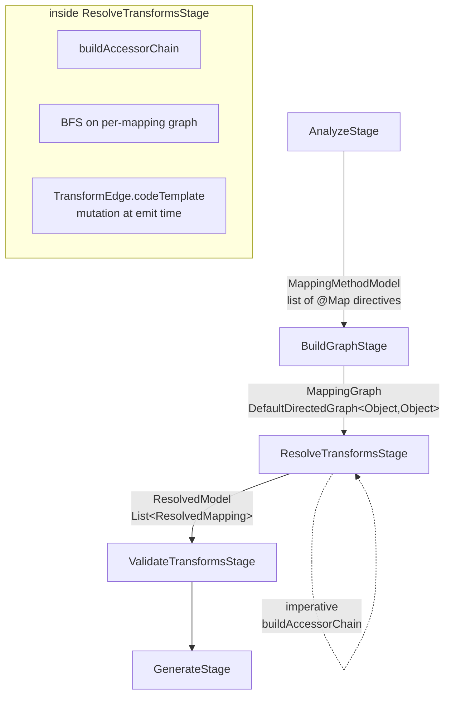
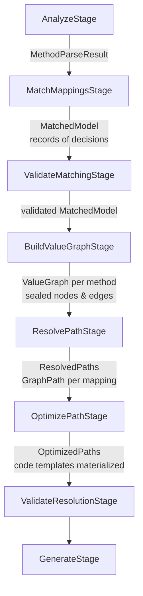
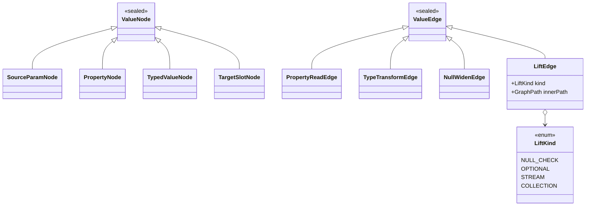

## Context

The percolate annotation processor today turns a `@Mapper` interface into a generated implementation class in eight logical steps, but those steps live inside three stages that each do too much and communicate through three different in-memory models.

Today's shape:



Three specific pain points drive this change:

1. **`MappingGraph` is `DefaultDirectedGraph<Object, Object>`.** The matching layer uses name-only nodes (`SourceRootNode`, `SourcePropertyNode`, `TargetPropertyNode`) connected by `AccessEdge`/`MappingEdge`, but the graph is untyped at the JGraphT level. Every consumer downcasts. `BuildGraphStage` is effectively a builder for a glorified `Map<String, Object>`.
2. **Resolution straddles two graphs.** `ResolveTransformsStage#buildAccessorChain` walks the symbolic graph imperatively to construct a `List<ReadAccessor>`, then `resolveTransformPath` builds a *second* JGraphT graph (the type/transform graph) per-mapping and runs BFS on it. These two graphs never meet. Lifting (`Optional`, `Stream`, null-check) is impossible to express because the accessor chain is not in a graph at all, and the transform graph does not know anything about property access.
3. **Mutation at emit time.** `TransformEdge.codeTemplate` is set lazily via `resolveTemplate()` called from `GenerateStage`. The field is mutable; the `@SuppressWarnings("NullAway")` warts in `ResolveTransformsStage` are symptoms of the same disease. Deferred template resolution lives where execution happens, not where decisions are made.

Target shape this change delivers:



Stakeholders: only the percolate processor module. No consumer-visible change. The `jspecify-nullability` change is the immediate downstream consumer of the seams introduced here.

## Goals / Non-Goals

**Goals:**
- One graph per mapping resolution. Property access, type transforms, widening, and lifting all live as sealed `ValueEdge` subtypes in one `ValueGraph`; one BFS finds the path.
- Matching is records, not a graph. `MatchedModel` holds the decisions of "which source paths flow to which target names" as plain records; there is no graph at the matching layer.
- Validation happens at its natural layer. Matching-level errors (unknown source path, duplicate target) surface before graph construction; resolution-level errors (no path, ambiguity, type mismatch) surface after path search.
- Template materialization happens once, in `OptimizePathStage`, eliminating the mutable `TransformEdge.codeTemplate` field.
- Strategies propose plain edges. `TransformProposal` drops `elementConstraint` and `templateComposer`; composition is a graph operation, not a closure.
- Byte-identical generated output for every existing Spock/Google Compile Testing golden fixture. This is the regression contract.

**Non-Goals:**
- No nullability support in this change. `NullWidenEdge` and `LiftEdge(NULL_CHECK)` are defined as types but used only in trivial "no lift needed" form. The follow-on `jspecify-nullability` change wires them up.
- No peephole rewrites in `OptimizePathStage` beyond template materialization. The stage exists as a shell so the seam is specified; actual optimizations land with the features that need them.
- No change to `@Mapper`/`@Map`/`@MapList`/`@MapOpt` annotation surface.
- No change to `SourcePropertyDiscovery` / `TargetPropertyDiscovery` ServiceLoader SPIs.
- No change to `ResolutionContext` fields.
- No new runtime dependencies. JGraphT stays at 1.5.2; no ASM, no ByteBuddy (that conversation belongs to `jspecify-nullability`).

## Decisions

### D1: Unified `ValueGraph` with sealed node/edge hierarchies

**Decision.** Replace both the symbolic `MappingGraph` and the per-mapping type/transform graph with a single `DefaultDirectedGraph<ValueNode, ValueEdge>` per mapper method, where `ValueNode` and `ValueEdge` are sealed Java types.



- `SourceParamNode` — the method parameter (root of reads).
- `PropertyNode` — an intermediate property on a source type (carries name + declared `TypeMirror`).
- `TypedValueNode` — an anonymous typed value in the middle of a transform chain (e.g. the `String` produced by `LocalDate::toString`).
- `TargetSlotNode` — a constructor argument or setter slot on the target type.
- `PropertyReadEdge` — invokes a getter / reads a field.
- `TypeTransformEdge` — contributed by a `TypeTransformStrategy`; carries the strategy, the input/output `TypeMirror`s, and (after `OptimizePathStage`) a materialized `CodeTemplate`.
- `NullWidenEdge` — type-identical edge that changes only the nullness tag. Defined as a type now; unused as anything but an identity edge until nullability lands.
- `LiftEdge(kind, innerPath)` — wraps a sub-path under a container/null scope. Carries the `GraphPath<ValueNode, ValueEdge>` it lifts. In this refactor, `OPTIONAL`, `STREAM`, and `COLLECTION` lifts are the only ones actually constructed (they absorb the current `OptionalMapStrategy` and container-strategy composers); `NULL_CHECK` is wired by the next change.

**Why sealed over open hierarchies?** A closed edge set lets `GenerateStage` switch exhaustively (no default branch, no `instanceof` ladder). It also bounds the graph's meaning: the set of things a path can express is exactly the set of edge subtypes, visible in one file.

**Alternative considered: keep two graphs, just type them.** Rejected. The current two-graph split is exactly what makes lifting impossible to express as a rewrite. Typing each graph separately would pay the refactor cost without the structural win.

**Alternative considered: JGraphT `Graph<V,E>` with interface edges but no sealing.** Rejected. Loses exhaustiveness in `GenerateStage`, keeps the door open for accidental new edge types, and doesn't catch misuse at compile time.

### D2: Matching layer as records, not a graph

**Decision.** Replace the symbolic property graph with:

```java
record MappingAssignment(
    List<String> sourcePath,     // ["customer", "address", "street"]
    String targetName,           // "street"
    Map<MapOptKey, String> options,
    @Nullable String using,      // @Map(using = "...") — empty → null
    AssignmentOrigin origin      // EXPLICIT_MAP | AUTO_MAPPED | USING_ROUTED
) { }

record MethodMatching(
    ExecutableElement method,
    MappingMethodModel model,
    List<MappingAssignment> assignments
) { }

record MatchedModel(
    TypeElement mapperType,
    List<MethodMatching> methods
) { }
```

**Why?** The symbolic graph's only structural contribution was "shared prefix `SourcePropertyNode`s are deduplicated." That dedup was leverage only for `ResolveTransformsStage` traversal. Once the access chain lives in `ValueGraph`, the matching layer no longer needs graph structure — it just needs the list of decisions. Records make the origin of each decision (explicit, auto, routed by `using=`) first-class and trivially inspectable by `ValidateMatchingStage`.

**Alternative considered: keep a typed symbolic graph.** Rejected. Pays for JGraphT machinery to represent what is essentially a flat list. Dedup is not a benefit at the matching layer; it's a concern of the resolution graph, which naturally dedups via `ValueNode` equality.

### D3: Split the pipeline into eight stages, split validation by layer

**Decision.** New stage order:

| # | Stage | Input | Output | Responsibility |
|---|---|---|---|---|
| 1 | `AnalyzeStage` | `TypeElement mapper` | `List<MethodParseResult>` | Parse annotations on the mapper interface. Unchanged behavior. |
| 2 | `MatchMappingsStage` | `List<MethodParseResult>` | `MatchedModel` | Expand auto-mapping, apply `using=` routing, produce `MappingAssignment` records. |
| 3 | `ValidateMatchingStage` | `MatchedModel` | `MatchedModel` | Unknown source root, duplicate target, conflicting `@Map` directives on the same target, `using=` with no matching method. |
| 4 | `BuildValueGraphStage` | `MatchedModel` | `Map<MethodMatching, ValueGraph>` | For each assignment, materialize `PropertyReadEdge`s from the source path, `TargetSlotNode`s from the target type, and proposals from `TypeTransformStrategy` implementations. Lift strategies contribute `LiftEdge`s here. |
| 5 | `ResolvePathStage` | `Map<MethodMatching, ValueGraph>` | `Map<MethodMatching, List<ResolvedAssignment>>` | One shortest-path BFS per assignment. Either returns a `GraphPath<ValueNode, ValueEdge>` or a resolution failure. |
| 6 | `OptimizePathStage` | `...ResolvedAssignment` | same | Materialize `CodeTemplate` on every `TypeTransformEdge` (and later: peephole rewrites). |
| 7 | `ValidateResolutionStage` | optimized resolutions | same | No path found, ambiguous candidates, type mismatch surfaced by resolution. |
| 8 | `GenerateStage` | optimized resolutions | `JavaFile` | JavaPoet emission. Exhaustive switch on `ValueEdge`. |

Debug dump stages re-point at the new types (`DumpMatchedModelStage`, `DumpValueGraphStage`, `DumpResolvedPathsStage`). They remain fire-and-forget between real stages.

**Why split `ResolveTransformsStage` into three?** Build / resolve / optimize have different failure modes and different invariants. Mixing them made `@SuppressWarnings("NullAway")` unavoidable: the stage was holding partial state across phases.

**Why split `ValidateTransformsStage` into two?** Matching-level errors ("there is no source field called `foo.bar`") and resolution-level errors ("no conversion path from `String` to `Temporal`") target different elements with different messages. Emitting them from one stage meant either running validation twice or carrying both concerns in one file. Splitting also lets matching-level errors abort the pipeline before graph construction — saves work on mapper types the user hasn't finished typing.

**Why `OptimizePathStage` as a shell?** To specify the seam. Template materialization has to live somewhere; putting it in `GenerateStage` preserves the mutation wart, putting it in `ResolvePathStage` conflates graph semantics with code-shape decisions. A dedicated stage is the right home, and it becomes the plug-in point for null-lift fusion without another pipeline reshape.

**Alternative considered: six stages, fold optimize into resolve.** Rejected. The follow-on `jspecify-nullability` change specifically needs a seam between path-exists and path-emission; collapsing them means re-splitting later.

### D4: Retire `ElementConstraint` and `templateComposer` on `TransformProposal`

**Decision.** `TransformProposal` becomes:

```java
record TransformProposal(
    TypeMirror requiredInput,
    TypeMirror producedOutput,
    CodeTemplate codeTemplate,
    TypeTransformStrategy strategy
) { }
```

Strategies contribute plain edges. Composition and lifting are graph operations in `BuildValueGraphStage` — e.g. `OptionalMapStrategy` contributes a `LiftEdge(OPTIONAL, innerPath)` wrapping the inner transform path, rather than returning a proposal with `templateComposer = lambda` that wraps the generated code string.

**Why?** The composer was a generic-code escape hatch that defeated the whole point of having a graph. It let strategies mutate the output code shape without any structural representation. Moving it to `LiftEdge` makes composition inspectable (it shows up in the dumped graph) and lets `OptimizePathStage` reason about it (e.g., fuse `LiftEdge(NULL_CHECK, [inner]) · LiftEdge(OPTIONAL, [inner])` into `Optional.ofNullable(...).map(...)` once nullability lands).

**Alternative considered: keep composer, just type it.** Rejected. Invisible to optimization, invisible to dumps, invisible to validation. A lambda in a field is not a graph.

### D5: Template materialization strategy

**Decision.** `TypeTransformEdge` holds `@Nullable CodeTemplate codeTemplate`, but it is set exactly once, in `OptimizePathStage`. `GenerateStage` reads it and panics if null (that's an invariant violation, not a runtime concern). No `resolveTemplate()` method on the edge.

For `LiftEdge`, the template is derived from the inner path's materialized templates composed via `LiftKind` — so lifts' code shapes also fall out of the optimize stage, not generate.

**Alternative considered: compute templates in `BuildValueGraphStage`.** Rejected. Many edges proposed during graph construction are discarded by the BFS; computing templates for edges never on a path is wasted work. `OptimizePathStage` only sees edges that survived path search.

**Alternative considered: immutable `TypeTransformEdge` with a sibling `MaterializedEdge` record.** Considered. Cleaner in theory but doubles the node/edge hierarchy for a one-field-sometimes-null cost. Deferred; can be revisited if mutation becomes painful.

### D6: Removed capabilities — what happens to their scenarios

`symbolic-property-graph` and `mapping-graph` specs are deleted. Their scenarios route as follows:

| Old scenario | New home |
|---|---|
| Nested source produces multi-segment chain | `value-graph`: `PropertyReadEdge` chain from `SourceParamNode` |
| Shared prefix `SourcePropertyNode` reuse | `value-graph`: `PropertyNode` equality (type + path segment) gives natural dedup during build |
| `SymbolicGraph` is per-method | `matching-model`: `MethodMatching` is per-method; `value-graph` is also per-method but derived |
| Unknown property name does not error in build | `value-graph`: `BuildValueGraphStage` emits nodes; resolution failure surfaces in `ValidateResolutionStage` |
| Node types have name only | Gone. `PropertyNode` carries name and type. |

## Risks / Trade-offs

- **[Golden output drift]** Byte-identical generated code is the regression contract. Refactoring the template composition path (D4) is the highest-risk item — any subtle ordering difference in how `LiftEdge` materializes code vs the old `templateComposer` chain shows up immediately.
  → **Mitigation:** run the full Spock + Google Compile Testing suite on every commit during implementation; add a golden-file diff test that fails on any `.class` or emitted `.java` delta for existing fixtures before touching strategy code. Do D1 + D2 (graph + matching types) before D4 (strategy reshape), so the strategy change happens in a known-green state.

- **[Deeper debugger cognitive load]** One graph with four edge subtypes is more to hold in your head than two specialized graphs.
  → **Mitigation:** the `DumpValueGraphStage` dumps every edge with its type; the sealed hierarchy means exhaustive switches catch missing cases at compile time. Net-negative cognitive load at the pipeline level even if per-graph density goes up.

- **[Scope creep into nullability]** The temptation to wire `NullWidenEdge` and `LiftEdge(NULL_CHECK)` "while we're here" is real.
  → **Mitigation:** explicit non-goal. `NullWidenEdge` exists as a declared subtype but is never constructed by any stage in this change. PRs touching nullness semantics get bounced to the `jspecify-nullability` change.

- **[Stage count]** Eight stages plus three debug dumps is a lot of Dagger wiring.
  → **Mitigation:** Pipeline receives stages as a list (or a handful of named injections — TBD in specs). Adding a stage remains one-line. The cost is flat once the wiring exists.

- **[SPI break for external strategies]** Dropping `elementConstraint`/`templateComposer` from `TransformProposal` breaks any out-of-repo `TypeTransformStrategy` that uses them.
  → **Mitigation:** none known to exist. The SPI is not published as stable. Release notes flag the change.

- **[Performance]** BFS over a graph that now includes property-access edges plus lift sub-paths is a larger graph than the old per-mapping type graph.
  → **Mitigation:** MAX_ITERATIONS budget moves with the BFS; the old budget (30) is measured per mapping today and there's no evidence mappings are shaped differently enough to blow it. Revisit if benchmarks show regression; the path to a bound is "cap lift nesting depth" not "shrink the graph."

## Migration Plan

Refactor-only, internal. No runtime migration, no deprecation cycle needed, no consumers to notify. The change lands in a single PR (or a small sequenced set), the golden fixtures pin the output, and the archived `defer-code-template-resolution` change serves as the precedent for how we restructure `TransformEdge` without breaking emission.

Rollback is `git revert`. There is no data migration, no persisted format, and no cross-service contract at play. The `jspecify-nullability` change is queued behind this one and does not begin until this lands green.

## Open Questions

- **OQ1 — Dagger wiring shape.** Pipeline currently takes eight stage arguments. Post-refactor it still takes eight (different) stages. Worth considering a `List<PipelineStage<?, ?>>` pattern? Probably not — the stages have heterogeneous input/output types and that list would be existentially typed. Staying with explicit constructor args unless specs decide otherwise.

- **OQ2 — Dump stage placement for `OptimizePathStage`.** Current design dumps *before* optimize (resolved paths pre-template) and implicitly relies on `DumpTransformGraphStage` for the graph itself. Do we want a separate post-optimize dump to see materialized templates? Specs decision.

- **OQ3 — `LiftEdge.innerPath` type.** JGraphT `GraphPath<ValueNode, ValueEdge>` references the parent graph. For sub-paths that live entirely within a lift, is the sub-path a full `GraphPath` or a lighter `List<ValueEdge>`? The former is uniform and searchable; the latter is smaller. Leaning `GraphPath` for uniformity unless specs show a reason to diverge.

- **OQ4 — `AssignmentOrigin` granularity.** The three values `EXPLICIT_MAP | AUTO_MAPPED | USING_ROUTED` cover current behavior. Does `@MapList` need its own origin? Probably not (it desugars to `EXPLICIT_MAP` per element), but specs should confirm.
