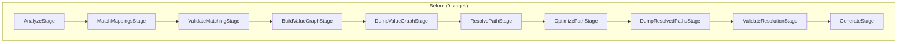
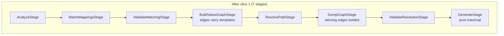
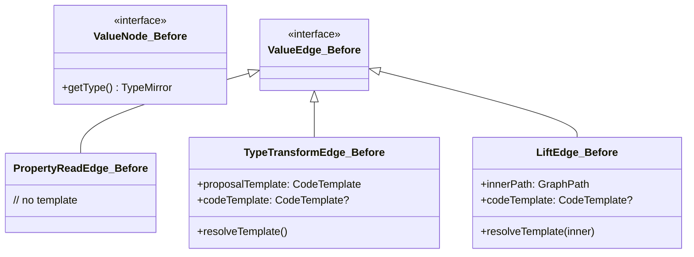
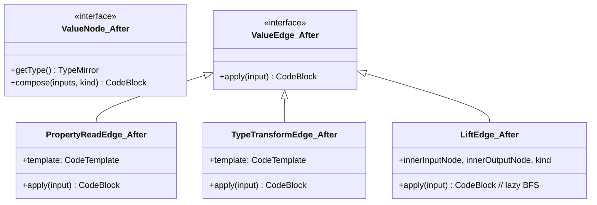

## Context

The processor pipeline today runs nine stages and carries a handful of structural asymmetries. The most visible ones:

- `BuildValueGraphStage` constructs `TypeTransformEdge`s with a `proposalTemplate` but a null `codeTemplate`. `OptimizePathStage` later walks the BFS-winning path and copies `proposalTemplate → codeTemplate`. This two-phase commit exists because the fixpoint speculatively proposes edges that may never be on a winning path, and we don't want to materialise templates for pruned edges.
- `LiftEdge`'s code template depends on which inner path BFS picks through its inner subgraph. The current code resolves that template in `OptimizePathStage` after inner BFS.
- `DumpValueGraphStage` and `DumpResolvedPathsStage` export the same graph at two observation points — before resolution (no highlighting) and after (with winning-edge bolding). The resolved dump is a strict superset: with zero winning edges, it carries the same signal as the pre-resolve dump.
- `PropertyReadEdge` carries no code template. `GenerateStage` rendering a property-read has to peek at `PropertyNode.accessor` to decide `.getFoo()` vs `.foo`. This is codegen logic inside the stage, reaching outside the graph.
- `GenerateStage` does multiple `instanceof` checks on node and edge types to dispatch rendering. Constructor assembly, property access, type transforms, and lift operations each take a separate code path.

These asymmetries are not bugs — they evolved as the pipeline grew. They become an obstacle now because slice 2 plans to unify the strategy SPI (`SourcePropertyDiscovery` + `TargetPropertyDiscovery` + `TypeTransformStrategy` → `ValueExpansionStrategy`), flip the fixpoint to demand-driven, and introduce compositional graph nodes (constructor/builder/bean-update sinks). Slice 2 will be a sizeable rewrite; landing it on top of the current asymmetries would entangle "the rewrite" with "cleanup that should have happened first."

This slice is the cleanup. It produces a self-describing graph: every edge knows how to generate its own code, every node knows how to compose its incoming expressions, and the code-generation stage is a pure traversal.

## Goals / Non-Goals

**Goals:**

- Retire `OptimizePathStage` without loss of functionality. Template materialisation moves to edge construction time (for `TypeTransformEdge`, `PropertyReadEdge`) or generation time (for `LiftEdge`).
- Collapse the two DOT dump stages into one `DumpGraphStage` that runs after `ResolvePathStage` and bolds winning edges.
- Make every `ValueNode` self-describing for composition: `compose(Map<ValueEdge, CodeBlock>, ComposeKind) → CodeBlock`.
- Move accessor-specific rendering off `GenerateStage` and onto `PropertyReadEdge`.
- Reduce `GenerateStage` to a recursive graph traversal with zero type-based branching on nodes or edges.
- Preserve generated-mapper output byte-for-byte against existing fixtures.

**Non-Goals:**

- Do **not** flip the fixpoint direction. Source-driven expansion stays in this slice.
- Do **not** unify discovery and transform SPIs. All three SPIs (`SourcePropertyDiscovery`, `TargetPropertyDiscovery`, `TypeTransformStrategy`) keep their current contracts.
- Do **not** promote target construction into the graph. `TargetSlotNode` remains a passive sink; `ConstructorDiscovery` still drives argument assembly inside `GenerateStage` (via a single helper; no `instanceof` on node/edge types).
- Do **not** introduce mapper-level graphs. One graph per method, as today.
- Do **not** introduce `@Routable`, dissolve `MethodCallStrategy`, or touch `ValidateResolutionStage`. All slice 2 concerns.
- Do **not** introduce expansion budgets or cycle guards. `MAX_ITERATIONS = 30` stays in this slice; revisited in slice 2.

## Decisions

### D1. Retire `OptimizePathStage` entirely

**Decision:** Fold template materialisation for `TypeTransformEdge` and `PropertyReadEdge` into the construction path in `BuildValueGraphStage`. Make `LiftEdge` lazy — it carries `(innerInputNode, innerOutputNode, kind)` and computes its template on first `apply(...)` call via on-demand BFS over the parent graph.

**Rationale:** The two-phase template commit pattern exists because the old model couldn't distinguish speculative proposals from committed ones. In practice, a strategy that proposes an edge already knows the template — the speculation is about whether BFS will pick that edge, not whether the template is known. Speculation is therefore a fiction we can drop. Committing templates at construction time is equivalent and simpler.

`LiftEdge` is the one genuine exception: its template depends on the inner BFS result, which is not known at construction. Laziness is the natural fit — the generation-time caller is the one that holds the parent graph and can run BFS.

**Alternatives considered:**

- **Keep `OptimizePathStage` as a no-op passthrough.** Rejected. Stages should earn their place; a rename to `MaterializeTemplatesStage` (proposed earlier in design discussion) was considered but still carries work we no longer need.
- **Eagerly compose `LiftEdge` inner template in `BuildValueGraphStage`.** Rejected. That would require running an additional BFS during construction, coupling construction to resolution and duplicating work BFS in `ResolvePathStage` already performs.
- **Two-pass `BuildValueGraphStage`: first build, then materialise.** Rejected. Equivalent to keeping `OptimizePathStage` but inside one stage; same work, same coupling, worse legibility.

### D2. Single dump stage after resolution

**Decision:** Remove `DumpValueGraphStage` and `DumpResolvedPathsStage`. Introduce `DumpGraphStage` that runs after `ResolvePathStage` and renders each method's graph with winning-path edges bolded (DOT) or flagged (GraphML/JSON). Failure cases (no resolved path for some assignment) render with zero bold edges on the affected subgraph — the same signal the pre-resolve dump carries today.

**Rationale:** The pre-resolve dump exists so that when resolution fails, the developer can still see what the fixpoint built. But the post-resolve dump of a failed resolution shows exactly the same thing (no bold edges). One artefact is sufficient; the only argument for two is "inspect before BFS to see all proposed edges," which the post-resolve dump already does — BFS doesn't remove edges from the graph.

**Alternatives considered:**

- **Keep both, one with a flag.** Rejected. The flag adds a surface without benefit — every failure scenario is expressible in the post-resolve dump.
- **Fold the dump into `DumpGraphStage` conditionally on `--debug-graphs`.** Accepted as part of the stage itself. The `ProcessorOptions.isDebugGraphs()` gate stays.

### D3. Uniform node composition contract

**Decision:** Extend `ValueNode` with:

```java
interface ValueNode {
    TypeMirror getType();
    CodeBlock compose(Map<ValueEdge, CodeBlock> inputs, ComposeKind kind);
}

enum ComposeKind { EXPRESSION, STATEMENT_LIST }
```

Implementations this slice:

- `SourceParamNode.compose(...)` → `CodeBlock.of("$N", paramName)` (inputs ignored)
- `PropertyNode.compose(...)` → single incoming edge's expression (forward)
- `TypedValueNode.compose(...)` → single incoming edge's expression (forward)
- `TargetSlotNode.compose(...)` → single incoming edge's expression (forward)

`ComposeKind.EXPRESSION` is the only value used in slice 1. `STATEMENT_LIST` is reserved for slice 2's `BeanUpdateSinkNode`.

**Rationale:** A uniform contract removes `instanceof` dispatch from `GenerateStage`. It also establishes the interface slice 2 will use for real compositional nodes (constructor, builder, bean-update), without requiring another breaking change to `ValueNode` then. Introducing `ComposeKind` now — even though only one case is used — pays the signature cost once rather than twice.

**Alternatives considered:**

- **Return `CodeBlock` without a `ComposeKind` argument.** Rejected. A bean-update sink in slice 2 needs to emit statement lists, not expressions; without the kind discriminator, either the node would need two methods or slice 2 would have to change the signature.
- **Use a sealed return type (e.g., `ComposedCode.Expression | ComposedCode.Statements`).** Rejected for now. More ceremony than the enum + `CodeBlock` pair, and `CodeBlock` already handles both forms at the JavaPoet layer.
- **Defer `ComposeKind` to slice 2.** Rejected. Would churn `ValueNode`'s interface twice; adding the parameter with a single unused value is essentially free.

### D4. `PropertyReadEdge` carries its own code template

**Decision:** Add a `CodeTemplate` field to `PropertyReadEdge`. `GetterDiscovery` constructs the edge with `input -> CodeBlock.of("$L.$N()", input, getterName)`. `FieldDiscovery.Source` constructs it with `input -> CodeBlock.of("$L.$N", input, fieldName)`.

**Rationale:** Every other edge type already carries its own template (or will after D1 for `LiftEdge`). `PropertyReadEdge`'s current lack of a template is the last structural asymmetry — forcing `GenerateStage` to peek at node state to render the edge. Moving the template onto the edge makes the edge self-describing, matching its siblings.

**Alternatives considered:**

- **Keep template on `PropertyNode.accessor`, make `ReadAccessor` implement a `render(input)` method.** Rejected. The render concern is about how the edge composes, not about what the node represents. Property-node identity is `(name, type)`; rendering belongs to the traversal, which happens along edges.

### D5. `GenerateStage` as topological-order evaluation over winning subgraph

**Decision:** `GenerateStage` extracts the winning-edge subgraph across all `ResolvedAssignment`s for a method, runs `org.jgrapht.traverse.TopologicalOrderIterator` over it, and accumulates a `Map<ValueNode, CodeBlock>` of computed node expressions. At each visited vertex, its `compose(...)` is called with its incoming winning edges' `apply(...)` results. Target-slot expressions are then read out of the map to feed constructor assembly.

```java
Map<ValueNode, CodeBlock> evaluateMethod(
        DefaultDirectedGraph<ValueNode, ValueEdge> graph,
        Set<ValueEdge> winningEdges) {

    var winningSubgraph = new AsSubgraph<>(graph, graph.vertexSet(), winningEdges);
    var exprMap = new LinkedHashMap<ValueNode, CodeBlock>();

    var it = new TopologicalOrderIterator<>(winningSubgraph);
    while (it.hasNext()) {
        var node = it.next();
        var inputs = new LinkedHashMap<ValueEdge, CodeBlock>();
        for (var edge : winningSubgraph.incomingEdgesOf(node)) {
            var sourceExpr = exprMap.get(winningSubgraph.getEdgeSource(edge));
            inputs.put(edge, edge.apply(sourceExpr));
        }
        exprMap.put(node, node.compose(inputs, EXPRESSION));
    }
    return exprMap;
}
```

Constructor assembly still runs through `ConstructorDiscovery`, but as a single localised call at the method root that reads each target-slot's final expression from `exprMap`. No `instanceof` on nodes or edges anywhere in the stage.

**Rationale:** The uniform `compose(Map<edge, CodeBlock>, kind)` contract's whole point is that a node receives *all* its incoming edge expressions together. Topological order guarantees predecessors are evaluated first, so every node sees fully-computed input expressions when its `compose(...)` runs. This exactly matches the semantic model — the implementation is the model.

The full `ValueGraph` is not a DAG (inverse-strategy 2-cycles are kept post-commit `61f1719`), so `TopologicalOrderIterator` cannot run on it directly. The **winning-edge subgraph** is a DAG by construction: BFS shortest paths are simple, and their union contains no cycle unless some assignment's path would revisit a vertex — which BFS prevents per path, and cross-assignment vertex reuse only adds new outgoing edges, not cycles. `AsSubgraph` provides the subgraph view without copying; `TopologicalOrderIterator` consumes it directly.

Sharing correctness falls out for free: a `TypedValueNode` reached by two assignments' winning paths appears once in the subgraph, so its `compose(...)` is called once and its `CodeBlock` is reused via `exprMap` — no recomputation, no duplicate expression emission.

**Alternatives considered:**

- **Manual per-assignment path walking.** Walk each `GraphPath` edge-by-edge, passing a running `CodeBlock` through `edge.apply(...)`. Rejected. Concrete and imperative; doesn't leverage JGraphT; doesn't handle shared vertices without extra bookkeeping; most importantly, it doesn't match the uniform-compose semantic model (which is about gathering all inputs at a vertex, not threading one expression along a chain).
- **Memoised recursion from target slots.** Recurse from each target slot, gathering incoming-edge expressions on the way up, memoised per node. Equivalent correctness. Rejected in favour of the iterator form: `TopologicalOrderIterator` is more explicit about graph structure, has no stack-depth concerns, and is more idiomatic JGraphT. Recursion also reads as "pull from target," which masks that compose is really a forward fold over the DAG.
- **`DepthFirstIterator` or `BreadthFirstIterator` from source params.** Rejected. Neither guarantees predecessors-before-successor, so `compose(...)` could fire with missing inputs. `TopologicalOrderIterator` is the purpose-built fit.
- **Lift constructor assembly into the graph this slice.** Rejected — scope creep. Slice 2's `ConstructorCallNode` subsumes this cleanly; the `exprMap` lookup at the method root is a single localised call in the meantime. Slice 2 will remove even that by making the root `compose(...)` return the full method body.

## Pipeline before and after





## Node / edge contract before and after





## Risks / Trade-offs

- **Risk:** Golden-output fixtures (`processor/src/test/...` pinned in commit `4e0c891`) drift due to subtle differences in `CodeBlock` assembly order.
  **Mitigation:** Tests run against the existing fixtures unchanged. Any byte-level drift is treated as a bug. Run the existing Spock suite before and after each task-level change.

- **Risk:** `LiftEdge.apply(...)` running BFS on every invocation becomes slow for mappers with many lift edges.
  **Mitigation:** Cache the resolved inner path on first call. A `LiftEdge` is called exactly once per assignment in `GenerateStage`, so caching is strictly optional — but the single call guarantees there's no quadratic cost.

- **Risk:** Introducing `ComposeKind` as unused scaffolding this slice may attract reviewer pushback ("YAGNI").
  **Mitigation:** The design doc names slice 2's `STATEMENT_LIST` need explicitly. If reviewers still object, defer the enum and add it in slice 2 — but that churns `ValueNode`'s signature twice. Call the trade-off out in the PR description.

- **Risk:** The single dump reduces visibility when debugging a fixpoint that produced an incomplete graph (some demands unfulfilled).
  **Mitigation:** `DumpGraphStage` still runs after `ResolvePathStage`, which records BFS-null paths as `ResolvedAssignment(path=null)`. Unresolved assignments can be annotated on the dump (e.g., the target slot highlighted in a distinct colour). This is an optional enhancement — if skipped, the post-resolve dump on failure still shows the whole graph with zero bolded edges, which matches the current pre-resolve dump's information content.

- **Trade-off:** Keeping `TargetSlotNode` as a passive forwarding node in this slice means `GenerateStage` still calls out to `ConstructorDiscovery` for argument assembly. The traversal isn't *fully* pure — it has one well-isolated external call at the method root. Slice 2 closes this.

## Migration Plan

No runtime migration required. This is a compile-time processor refactor; the processor artefact version bumps as usual, consumers recompile.

Internal test-suite migration:

1. Tests for `OptimizePathStage` move to cover:
   - Edge-template construction tested on `BuildValueGraphStage`.
   - `LiftEdge` template composition tested as a unit test on `LiftEdge.apply(...)`.
2. Tests for `DumpValueGraphStage` and `DumpResolvedPathsStage` consolidate into tests for `DumpGraphStage`. The golden-DOT fixtures for the resolved-dump shape survive; the pre-resolve DOT fixtures are deleted.
3. End-to-end tests via Google Compile Testing remain unchanged — they assert on generated mapper output, which is byte-identical.

## Open Questions

None blocking. One minor item to decide during implementation:

- Should `DumpGraphStage` annotate unresolved assignments on the dump (e.g., a distinct colour for target slots with null paths)? Recommended; falls under the capability requirements in `debug-graph-export`. If skipped, the post-resolve dump still degenerates cleanly to "all edges thin" on failure.
