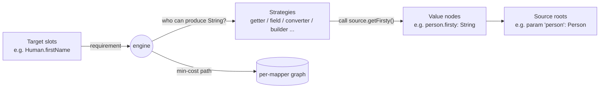

## Context

The processor is a Java annotation-processor that, in the long run, will generate MapStruct-style mapping implementations for `@Mapper`-annotated interfaces and abstract classes. Today the `Pipeline` is a stub. This change establishes the front of the pipeline (discovery + first validator) and the diagnostic infrastructure that every later stage will depend on.

A larger architectural shape — a per-mapper, demand-driven graph saturation with pluggable strategies — has been discussed and is sketched in **Future architecture (not implemented)** below. The decisions in this change are deliberately shaped to keep that path open without committing to it now.

Tech constraints: Java 11 release target (no records, no sealed types), JSpecify `@NullMarked`, Lombok available, Dagger 2 wiring, NullAway in jspecify mode, palantir-java-format, errorprone with `-Werror`. Tests use Spock + Google Compile Testing.

## Goals / Non-Goals

**Goals:**
- Move processor framework to `BasicAnnotationProcessor` so future cross-round element deferral is free when needed.
- Discover all unimplemented methods on a `@Mapper` type, including inherited and generic-substituted ones.
- Discover `@Map` directives on those methods while preserving `AnnotationMirror` and `AnnotationValue` for IDE-quality error positioning.
- Reject duplicate `target` directives on a single method, with errors that point at the exact offending literal.
- Establish a diagnostic side-channel and per-element "scarring" predicate that all later validators can use uniformly.
- Lock the pipeline shape: `@Inject`-constructed stages composed by `Pipeline`.

**Non-Goals:**
- Any code generation (`Pipeline.process` continues to return `null`).
- Any graph data structures, traversal, or saturation logic.
- Any strategy interface, registration, or implementations.
- Cross-mapper resolution (mapper A invoking mapper B).
- Structural validators (does `target=lastName` exist on the return type?) or semantic validators (is the conversion possible?).
- Buffered, sorted, or deduplicated diagnostics — direct-write to `Messager` only.
- ServiceLoader-style third-party SPI for strategies.
- Replacing the existing JGraphT dependency with anything (it stays declared but unused for now).

## Decisions

### D1. Adopt `BasicAnnotationProcessor` now, not later

**Decision:** Replace `extends AbstractProcessor` with `extends BasicAnnotationProcessor` and express `@Mapper` handling as a `Step`.

**Why:** `BasicAnnotationProcessor` provides automatic deferral of elements that reference yet-to-be-generated types and a `Step`-based dispatch model. Migrating later — once cross-mapper references and round-spanning state are in play — would be invasive. The migration cost now is a few dozen lines.

**Alternatives considered:**
- *Keep `AbstractProcessor`, hand-roll deferral.* Rejected: deferral logic is non-trivial and Dagger uses `BasicAnnotationProcessor` internally for the same reasons, so it's well-trodden.
- *Adopt only when needed.* Rejected for the migration cost above.

### D2. Adopt Google `auto-common` for helpers

**Decision:** Add `com.google.auto:auto-common` and use `MoreElements.getLocalAndInheritedMethods` for inheritance + generic substitution and `AnnotationMirrors.getAnnotationValue` for mirror walking.

**Why:** Reimplementing JLS §8.4.2 override-equivalence with generic substitution is a known time sink. `auto-common` is small, focused, and used by Dagger / AutoValue / AutoFactory.

**Alternatives considered:**
- *Hand-roll.* Rejected: weeks of work to match `MoreElements`'s correctness on edge cases (bridge methods, type-variable capture, default method shadowing).
- *Use proxy `element.getAnnotation(Map.class)`.* Rejected because it discards `AnnotationMirror`/`AnnotationValue` — we lose the ability to point IDE errors at the exact `target = "..."` literal.

### D3. Diagnostics is a side-channel, not a return value

**Decision:** Add a `@Singleton`-scoped `Diagnostics` class. Stages emit errors via `Diagnostics.error(...)` rather than via return values. `Diagnostics` calls `Messager.printMessage(Kind.ERROR, msg, element, mirror, value)` directly (no buffering).

**Why:**
- *Side-channel keeps stage signatures simple.* A stage's input/output types describe data; errors are an orthogonal concern.
- *Direct-write to `Messager`* is sufficient for now. Buffering would let us sort and dedupe, but that's premature.
- *`@Singleton` scope* lets every stage and every mapper share one accumulator within a round.

**Scarring:** `Diagnostics.hasErrorsFor(Element, tier)` returns `true` if any tier ≤ given tier emitted an error on that element (or a containing element). Later stages skip scarred elements rather than crashing on incomplete data.

**Round reset:** `Diagnostics.reset()` clears the per-round state. Called from `MapperStep` after each round, before returning deferred elements.

### D4. Specific carrier types per stage, immutable Lombok `@Value`

**Decision:** Each stage has its own input/output type:

```
DiscoverAbstractMethods : TypeElement     → MapperShape
DiscoverMappings        : MapperShape     → MapperMappings
ValidateNoDuplicateTargets : MapperMappings → (no return; emits diagnostics)
```

Carriers:
- `MapperShape { TypeElement type; List<ExecutableElement> abstractMethods; }`
- `MapperMappings { TypeElement type; List<MethodMappings> methods; }`
- `MethodMappings { ExecutableElement method; List<MappingDirective> directives; }`
- `MappingDirective { String target; String source; AnnotationMirror mirror; AnnotationValue targetValue; AnnotationValue sourceValue; }`

**Why:** Each stage's contract is obvious from the signature. `@Value` gives immutability, equals/hashCode, toString without ceremony. Java 11 forecloses records.

**Alternatives considered:**
- *One growing `MapperDescriptor` carried through all stages.* Rejected: nullable / partially-populated fields make validators hard to reason about.

### D5. Abstract-method discovery includes inherited methods with generic substitution

**Decision:** Use `MoreElements.getLocalAndInheritedMethods(typeElement, types, elements)`, then filter:
- Skip non-abstract methods (`!method.getModifiers().contains(ABSTRACT)`).
- Skip `Object` methods (`equals`, `hashCode`, `toString`) — these are never abstract on an interface and are not mappings.
- Skip static and private methods (excluded from `getLocalAndInheritedMethods` by design).

**Why:** A `@Mapper` may extend a generic super-interface (`interface Mapper<I,O>{ O map(I); }`) and the user expects the substituted abstract method (`Human map(Person)`) to be discovered. Default methods on a super-interface implement abstract methods from a parent and must NOT be re-discovered. `MoreElements` handles all of this.

### D6. `@Map` discovery walks `AnnotationMirror`s, not annotation proxies

**Decision:** For each method, iterate `method.getAnnotationMirrors()`, recognize `Map` directly and unwrap `MapList`'s `value` array (the `@Repeatable` container). Capture for each `@Map`: the string `target`, string `source`, the `AnnotationMirror`, and the `AnnotationValue` for each of `target` and `source`.

**Why:** Annotation proxies (`element.getAnnotation(Map.class)` and `getAnnotationsByType`) are convenient but discard mirror/value objects, which we need to make `Messager.printMessage` underline the exact `target = "..."` token in the IDE. Using mirrors is verbose; `AnnotationMirrors.getAnnotationValue` from `auto-common` keeps it readable.

### D7. Validator is diagnostic-style, not gating

**Decision:** `ValidateNoDuplicateTargets` does not stop the pipeline. It emits errors for every duplicate. Later stages still run on the same `MapperMappings`, but they consult `Diagnostics.hasErrorsFor(...)` to skip elements with prior-tier errors.

**Why:** A developer running `compile` should see *every* problem at once. MapStruct chose this and it's the right call. Combined with scarring at the smallest meaningful unit (per-directive / per-method / per-mapper), users get the maximum useful errors per compile cycle without follow-on noise from broken inputs.

### D8. Pipeline composition is straight-line

**Decision:** `Pipeline.process(TypeElement)` calls the three stages in sequence inside one method body. Each stage is `@Inject`-constructed. No fancy framework.

**Why:** The pipeline is deliberately not a `List<Stage>` indirection or a chain-of-responsibility yet — there's nothing variable about its shape. When the pipeline grows, splitting it into composable stages is a refactor of one method.

### D9. Carrier-class location and visibility

**Decision:** Put the four `@Value` carriers in a new `io.github.joke.percolate.processor.model` (or similar) sub-package, package-private. Stages and `Pipeline` live in `io.github.joke.percolate.processor`.

**Why:** Keeps the top-level package focused on flow while data shapes live elsewhere. Package-private restricts the surface area — these are not API.

### D10. Diagnostics buffer scope: per-round singleton with explicit reset

**Decision:** `Diagnostics` is `@Singleton`. `MapperStep.process(elementsByAnnotation)` calls `diagnostics.reset()` before processing the round's elements.

**Why:** `BasicAnnotationProcessor` constructs `Step`s once and re-uses them across rounds. Without `reset()`, scarring state would leak across rounds and the second round's freshly compiled mapper would inherit stale errors.

## Risks / Trade-offs

- **[Risk] auto-common version drift vs Dagger** → `auto-common` is widely used and stable; we pin via the BOM in `dependencies/build.gradle`.
- **[Risk] `MoreElements.getLocalAndInheritedMethods` does not include static or private interface methods, but neither do we want them** → confirmed in auto-common's contract; covered by the unit-test for the discovery stage.
- **[Risk] Annotation-mirror walking is verbose enough that someone may "fix" it by switching to proxies** → forbid in code review; the duplicate-target integration test will fail (no IDE-quality location) if proxies are used, which acts as a regression guard.
- **[Risk] Round reset of `Diagnostics` is easy to forget** → unit test for `MapperStep` that asserts `reset()` is called at the start of `process(...)`.
- **[Trade-off] Direct-write to Messager prevents sorting/dedup** → accepted; revisit when users complain. Adding a buffer later is a localized change inside `Diagnostics`.
- **[Trade-off] Scarring as a side query (rather than annotated descriptors)** → accepted; keeps carriers as pure data. If scarring queries become hot, we add memoization inside `Diagnostics`.
- **[Trade-off] No Pipeline indirection** → accepted; we'll refactor when there are 5+ stages.

## Migration Plan

1. **Add dependency** to `processor/build.gradle` (`implementation 'com.google.auto:auto-common'`). Update `dependencies` BOM if it pins the version.
2. **Introduce `Diagnostics`** — no callers yet, just the class + unit tests.
3. **Introduce carrier `@Value` types** — pure data, no behavior, unit tests not required (covered by stages that use them).
4. **Introduce stages one at a time**, each with its own unit spec, in order: `DiscoverAbstractMethods` → `DiscoverMappings` → `ValidateNoDuplicateTargets`.
5. **Wire `Pipeline`** to call the three stages. Update `PipelineSpec` accordingly.
6. **Convert `PercolateProcessor`** to extend `BasicAnnotationProcessor`. Introduce `MapperStep`. Update `PercolateProcessorUnitSpec` and add a `MapperStepSpec`.
7. **Add an integration spec** under Compile Testing covering the duplicate-target error-with-location scenario.
8. **Verify** existing integration tests (if any) still pass.

No rollback concern beyond reverting the change set — there's no runtime behavior to migrate.

## Open Questions

- *None for this change.* The cross-mapper annotation syntax, the strategy interface, and the graph data structures are deliberately deferred (see below).

---

## Future architecture (NOT implemented in this change)

Captured here so that the early stages don't paint us into a corner. None of this is in scope. None of these decisions are final — they describe the current intended direction, subject to revisit when each piece becomes concrete.

### Pull-driven, per-mapper graph saturation

Resolution from `@Map` directives + return-type slots back to source roots will be a per-mapper graph driven by *demand*, not by *push*. The engine picks unsatisfied requirements; strategies respond when asked. Termination is then trivial — no requirement, no expansion — and "wrap T in Optional" cycles are impossible because nothing demands `Optional<Optional<T>>`.



### Two node kinds with distinct identity rules

- **Requirement** node identity = `(Type, Slot)` — "we need a value of type `T` to fill slot `S`".
- **Value** node identity = `(Type, AccessPath)` — "a value of type `T` reachable via path `P` from a source root".

Carrying the access path / slot (not just the type) is what makes deduplication correct. Two requirements for `String` from different slots are distinct nodes; two values for `String` reached via the same access path are the same node.

### Strategies via Dagger `@Multibinds Set<Strategy>`

Each strategy is a Dagger-injected class with two responsibilities:
- `proposeFor(Requirement r, Set<ValueNode> currentValues) → Iterable<Candidate>` — return candidate edges that could satisfy `r`. On non-applicability, return a `RejectedCandidate` with a human-readable reason; the engine surfaces these in error messages when a requirement is unmappable.
- `emitCode(Edge e, VarNames vars) → CodeBlock` — produce the JavaPoet snippet for an edge during the final traversal.

The set is closed-world (compiled in). Third-party `ServiceLoader` SPI is deferred until someone asks.

### Weighted edges, Dijkstra, deterministic tiebreaker

Each candidate carries a cost = `strategyPriority + stepCost`. Path selection is Dijkstra (or A* with type-distance heuristic) on the per-mapper graph (JGraphT). When multiple paths have equal cost, tiebreak in this order:

1. Strategy priority
2. Strategy class FQN (lexicographic)
3. Source position of the producing element

Determinism is a hard requirement — generated code must be byte-identical across compiles given the same input.

### Cross-mapper references — explicit only

Mapper A using mapper B is *not* automatic. There is no global type-conversion registry and no global mapper-method index. When (in a future change) a mapper opts in to using another mapper, A re-reads B's `TypeElement` to derive B's contract — possibly cached per round. The barrier-based two-pass pipeline (scan-then-resolve) is deferred until profiling shows the re-read hurts.

A and B together do not form generated state; A uses only B's user-written contract (the unimplemented method signatures), so processing order doesn't matter.

### Validation tiers with scarring

- **Tier 1 — syntactic** (this change): annotations are well-formed in isolation. E.g., no duplicate `target` on a method.
- **Tier 2 — structural** (future): things referenced exist. E.g., `target=lastName` resolves to a field, setter, builder slot, or constructor parameter on the return type. Requires the seeded graph but not full saturation.
- **Tier 3 — semantic** (future): values can flow. E.g., a path exists from each requirement back to a source. Requires saturation.

A failure at Tier N "scars" the smallest meaningful unit (directive / method / mapper). Later tiers skip scarred units rather than emitting follow-on errors caused by broken inputs.

### Diagnostics evolution

The current direct-write-to-`Messager` model is sufficient for syntactic validation. When tier-3 errors accumulate, we may want buffered diagnostics that:
- sort by file/line so the user reads top-to-bottom;
- dedupe identical errors;
- summarize ("and N more like this").

Adding a buffer is a localized change inside `Diagnostics`; no caller needs to change.

### Why JGraphT is on the classpath but unused

JGraphT will be the carrier for the per-mapper graph and its shortest-path queries. It's declared now to avoid build-file churn later; this change adds no usages.
