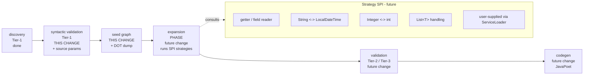

## Context

The processor pipeline currently ends at Tier-1 (syntactic) validation. After `ValidateNoDuplicateTargets`, the only artefact in hand is `MapperMappings` — a flat list of method-level `MappingDirective`s. Everything that comes next (structural validation, semantic resolution, code generation) needs a graph-shaped representation of the mapper, and a way for developers and tests to inspect that representation.

A previous iteration attempted multiple specialised graph types (a `ValueGraph`, a `MapperGraph`, separate per-stage graphs) and then tried to unify them. The reunification was too large a single change. That iteration was reset on the `rewrite2` branch. This change starts the graph story over with a single, unified per-mapper graph and an explicit debug surface from day one, so future expansion / validation / codegen work has both a stable target and a stable verification surface.

Tech constraints: Java 11 release target (no records, no sealed types), Lombok available, Dagger 2 wiring, NullAway in jspecify mode with `@NullMarked` packages, palantir-java-format, errorprone with `-Werror`. Tests use Spock 2.4 (Groovy 5.0) + Google Compile Testing. JGraphT 1.5.2 is already declared in `processor/build.gradle` and was previously unused; this change makes the first real use of it.

Stakeholders: the processor module only. Annotations module is unaffected. Downstream consumers are unaffected unless they explicitly pass `-Apercolate.debug.graphs=true`.

## Goals / Non-Goals

**Goals:**
- Establish the per-mapper graph data model (`Node`, `Edge`, `Location`, `MapperGraph`) that all future stages (expansion, structural / semantic validation, codegen) will consume.
- Establish a deterministic, debug-friendly DOT rendering of that graph, gated by `-Apercolate.debug.graphs=true`, written to `StandardLocation.SOURCE_OUTPUT` next to where future generated mappers will live.
- Encode the user's declared mapping intent (every `@Map` directive, including dotted `source` / `target` paths) as low-weight directive-seeded edges in the graph.
- Lock in stable node identity (`Node.id()`) and deterministic graph iteration so DOT output is byte-stable enough to support golden-file tests.
- Give tests a clean assertion surface via a Spock Groovy extension module — production classes carry no test-only API.
- Seed `Pipeline` with two new stages (`SeedGraph`, `DumpGraph`) whose contracts will not change as expansion / validation / codegen are added later.

**Non-Goals:**
- Any expansion of the seed graph (no strategies, no `Strategy` SPI, no `META-INF/services` loader, no expansion stage, no expansion passes).
- Any discovery of writeable slots on the return type (setters / public fields / builders / constructor parameters). These are explicitly **not** seeded; they will be discovered on demand during the future expansion phase by strategies.
- Any Tier-2 (structural — "does `target=lastName` resolve to a real slot?") or Tier-3 (semantic — "can this value flow?") validation.
- Any code generation. `Pipeline.process(...)` continues to return `null`.
- Any `<MapperFQN>.expanded.dot` file. Only `<MapperFQN>.seed.dot` is written, and only when there is content (non-empty mappers).
- Any priority semantics, cost semantics, or path-finding (Dijkstra) — the graph carries an `int weight` field per edge that future changes will use, but at seed time every edge's weight is the same low constant.
- Any `Origin`-style polymorphic edge provenance interface. This change uses a simple `Optional<AnnotationMirror>` "directive" field on `Edge`. Future expansion will widen this without breaking the seeded shape.
- Any cross-mapper resolution.
- Any buffering, sorting, or de-duplication of diagnostics (the existing direct-write `Diagnostics` channel is unchanged).

## Mental Model

This change is small but its mental model spans more than the change itself, because everything we put down has to fit cleanly with what comes next. The model below was reached through deliberate exploration; it is captured here so future contributors do not have to re-derive it.

### Pipeline phases



Expansion is a **phase** (a stage in the pipeline), not a strategy. Strategies are the leaf-level transformations that a developer can extend through SPI; they are consulted *inside* the expansion phase. None of the SPI machinery is in scope here — this change only produces the seed graph that the expansion phase will consume.

### One unified node kind

Earlier iterations distinguished `ValueNode` and `RequirementNode` (and added a `Kind` field for `ROOT` / `SLOT` / `DIRECTIVE`). The unified model collapses all of that:

> A node is a typed value at some location, scoped to a specific method (or to the mapper as a whole, in the future).

```
                    ┌────────────────────────┐
                    │ @Value Node            │
                    │   Optional<TypeMirror> │  ← may be unknown at seed
                    │       type             │     time for directive nodes
                    │   Location loc         │  ← Optional in spirit; see below
                    │   Scope scope          │
                    │   String id()          │  ← stable, deterministic
                    └────────────────────────┘
                                 △
              ┌──────────────────┼──────────────────┐
              │                  │                  │
        SourceLocation     TargetLocation    (no Location;
        AccessPath         TargetPath          intermediate value
        rooted at a        rooted at the       produced by an edge,
        parameter          return type         only after expansion)
```

What used to be a `ValueNode` is "a node whose `loc` is a `SourceLocation`". What used to be a `RequirementNode` is "a node whose `loc` is a `TargetLocation`". Intermediate values (the future `Optional<String>` produced by an `OptionalWrapStrategy`, for instance) have no `Location` — only a type. The distinction is data, not type identity.

### Edges describe connections, not snippets

```
                    ┌────────────────────────┐
                    │ @Value Edge            │
                    │   Node from            │
                    │   Node to              │
                    │   int weight           │
                    │   Optional<Annotation  │  ← present for directive-seeded
                    │     Mirror> directive  │     edges; empty for future
                    │                        │     strategy-seeded edges
                    └────────────────────────┘
```

Edges carry **structure**, not code. They say "there is a connection from this node to that node, contributed by this provenance, with this cost". They do **not** carry a snippet. Code generation happens later, by walking the chosen path and asking each edge's strategy (in the future) — or, for directive edges, the engine itself — for the snippet. Strategies will be stateless: re-callable with `(from, to, hint, vars)` to produce a `CodeBlock`.

This is the pivotal mental flip. An edge is information, not behaviour. Behaviour is in the strategy referenced by the edge (in the future); strategies are stateless services.

### What the seed graph looks like

For the example we used to align this model:

```java
@Map(target = "lastName",  source = "person.lastName")
@Map(target = "firstName", source = "person.first")
Human mapHuman(Person person);
```

The seed graph contains six nodes and six low-weight edges, all carrying the originating `@Map` mirror in their `directive` field:

```
              source side                                    target side
   ┌──────────┐  w=1   ┌────────────┐    w=1    ┌────────────┐  w=1   ┌────────┐
   │ Person   │ ─────▶ │ src        │ ────────▶ │ tgt        │ ─────▶ │ Human  │
   │ "person" │        │ ["person", │           │ ["lastName"]│        │ loc=   │
   │ src([])  │        │  "lastName"]│          │ type=?     │        │ tgt([])│
   │ scope=M  │        │ type=?     │           └────────────┘        │ scope=M│
   │          │        └────────────┘           ┌────────────┐  w=1   │        │
   │          │  w=1   ┌────────────┐          │ tgt        │ ─────▶ │        │
   │          │ ─────▶ │ src        │ ────────▶ │ ["firstName"]│      │        │
   │          │        │ ["person", │          │ type=?     │        │        │
   │          │        │  "first"]  │          └────────────┘        │        │
   │          │        └────────────┘                                   │        │
   └──────────┘                                                        └────────┘
```

Six things to note:
1. **Direction** is data flow: parameter → source path → target path → return type.
2. **Source-slot and target-slot nodes have `type=?`** at seed time. We know the *paths*, not the *types*. Type discovery is expansion's job (Tier-2 will eventually error on unresolvable paths).
3. **Edge weight is a single low constant** (initial value `1`). Weight semantics matter only when expansion adds higher-cost alternatives that compete for path selection.
4. **Every edge carries the `@Map` `AnnotationMirror`** in its `directive` field, so future Tier-2 errors can underline the exact `@Map` annotation in the IDE.
5. **Dotted paths fan out into chains.** `@Map(source = "person.address.street")` seeds nodes `src(["person","address"])` and `src(["person","address","street"])` connected by a directive edge; same on the target side.
6. **Empty mapper interfaces produce empty graphs** (zero nodes, zero edges). They emit no DOT file (the future codegen change can choose to emit an empty `Mapper` implementation if it wants).

### What the expanded graph will look like (forward-looking, NOT in this change)

This is the picture that the seed model has to fit into. None of it is implemented here; it is documented to make the seed-time decisions defensible.

```
   Person ───GetterRead, w=1─▶ String "lastName" ──DirectAssign, w=0─▶ tgt[lastName]:String ─SetterWrite/CtorArg, w=1─▶ Human
                                                                                ▲
   Person ───GetterRead, w=1─▶ String "first"   ─StringIdentity───▶ String ─DirectAssign, w=0─▶ tgt[firstName]:String ─┘
```

Expansion would:
- Realise each directive-seeded edge as one or more concrete strategy edges (or surface a Tier-2 error if no realisation exists).
- Add intermediate nodes for transformations that do not start or end at a known source/target (`Optional<String>`, etc.).
- Discover writeable slots on the return type lazily — a `ConstructorCallStrategy` proposes "to build `Human` I need a `String firstName` and a `String lastName`"; a `SetterWriteStrategy` proposes "to fill the bean `Human` I need to call `setFirstName` and `setLastName`"; a `BuilderWriteStrategy` proposes a builder chain. Each proposal contributes nodes and edges with strategy-specific weights.
- Run multiple passes until a fixed point. Determinism comes from a fixed strategy iteration order plus dedup by node/edge identity.

Strategies will not see the entire graph. They will inspect a single node (and possibly a small read-only query for matching nodes by type, used for direct-assign bridging) and propose new edges/nodes. This is what keeps the SPI surface small enough to extend safely.

### Why per-mapper, not per-method

The previous iteration first used one graph per method, then settled on one graph per mapper. The reason — recovered from this change's exploration — is **routable methods**: a method on the same mapper can be auto-routed to satisfy another method's requirement. With per-mapper graphs, routable mapper methods are first-class transformation edges available to all methods' resolutions; with per-method graphs, they have to be modelled as an external converter registry, which fragments the model.

The cost is that nodes have to carry a `scope` field and Dijkstra (in the future) has to honour it: a parameter of method `M` is not reachable from inside method `N`. We pay this cost up-front by giving every `Node` and every `Edge` a `Scope` field. At seed time `Scope` is always a `MethodScope(ExecutableElement)`. `MapperScope` exists in the type space for forward-compat (routable methods will use it) but is not produced by the seed stage.

### Forest invariant at seed time

Before any expansion, the seed graph is forest-shaped: each method contributes a small tree of source-side chains rooted at parameters and a small tree of target-side chains rooted at the return type. There are no cross-tree edges because cross-tree edges are a strategy concern. We assert this as a *runtime invariant in tests* via `org.jgrapht.GraphTests.isForest(...)` — not as a type-level discipline. The invariant is broken intentionally by future changes once strategies start adding edges.

JGraphT does not have a typed `Forest<V,E>` graph class; its tree support is algorithm-level. This change uses `DirectedMultigraph<Node, Edge>` and treats forest-ness as an assertion, not as a type contract.

### Directive nodes and directive edges

`@Map` directives are seed information and they are graph elements. We chose option (α) from exploration:

- A directive contributes **nodes**: the source-path chain ending in `src(targetPath)` and the target-path chain ending in `tgt(targetPath)`, plus the connecting edge between the deepest source node and the deepest target node.
- The directive's `AnnotationMirror` rides along on every edge it seeded (the `directive` field on `Edge`), so any future error pointing at that edge can underline the exact `@Map` annotation in the IDE.
- The directive is **not** a separate node kind — directive-driven nodes are just normal target/source nodes whose `type` happens to be unknown until expansion.

This choice keeps the node model minimal (no `Kind` enum) at the small cost of an `Optional<TypeMirror>` field on `Node`.

## Decisions

### D1. Single `Node` type with `Location`, `Optional<TypeMirror>` for type

**Decision:** `Node` is a Lombok `@Value` class with `Optional<TypeMirror> type`, `Location loc`, `Scope scope`, and a `String id()` derived deterministically from those fields.

**Why:** The mental-model section explains this in full. Collapses the prior Value/Requirement/Kind taxonomy into one type whose discriminator is data (`Location` shape). `Optional<TypeMirror>` is the smallest accommodation we have to make for directive-seeded nodes whose type is not known until expansion. Java 11 forecloses sealed types, so the `Location` interface is open by convention — review enforces the closed set.

**Alternatives considered:**
- *Two node types (`ValueNode` / `RequirementNode`).* Rejected: doubles the visitor / serializer / DOT-rendering surface and forces a `Kind` enum to express directive-seeded "in between" requirements.
- *A single sentinel `Type.UNKNOWN`.* Rejected: pollutes type-equality logic. `Optional<TypeMirror>` is the honest signal.

### D2. `Edge` carries `weight` and `Optional<AnnotationMirror> directive`; no polymorphic `Origin`

**Decision:** `Edge` is a Lombok `@Value` with `Node from`, `Node to`, `int weight`, `Optional<AnnotationMirror> directive`. No `Origin` interface yet.

**Why:** At seed time every edge is directive-seeded; a polymorphic `Origin` adds machinery without buying anything *now*. When the expansion change introduces strategy-seeded edges, it can either add a parallel `Optional<Strategy> strategy` field or refactor both into an `Origin` sum — that is a non-breaking change to the seeded shape.

**Alternatives considered:**
- *`interface Origin` with `DirectiveOrigin` / `StrategyOrigin` cases now.* Rejected as forward-design overhead with no current consumer.

### D3. JGraphT `DirectedMultigraph<Node, Edge>` as the underlying graph

**Decision:** `MapperGraph` wraps a `DirectedMultigraph<Node, Edge>`.

**Why:**
- *Directed* matches data-flow direction (source → target).
- *Multi-graph* leaves room for two strategies (or a strategy and a directive) to seed parallel edges between the same pair of nodes; a `SimpleDirectedGraph` would have to choose, which is a decision we should not pre-commit to.
- JGraphT is already on the classpath.

**Alternatives considered:**
- *A bespoke graph type.* Rejected: re-implementing what JGraphT provides for no clear advantage; we will need its algorithms (`isForest`, `DijkstraShortestPath`, traversal iterators) later.
- *`SimpleDirectedGraph`.* Rejected for the parallel-edge reason above.

### D4. Per-mapper graph, with `Scope` on every node and edge

**Decision:** One `MapperGraph` per `@Mapper` `TypeElement`. `Node.scope` and `Edge.scope` are mandatory. At seed time `Scope` is always a `MethodScope(ExecutableElement)`. `MapperScope` exists in the type space but is unused in this change.

**Why:** Routable mapper methods (in a future change) need to be first-class graph elements available to multiple methods' resolutions. Per-method graphs would force a side-channel converter registry. The cost — scope-aware traversal in Dijkstra later — is paid by carrying `Scope` on nodes/edges from day one.

**Alternatives considered:**
- *Per-method graphs.* Rejected for the routable-methods reason; this was the previous iteration's path before it was abandoned.
- *Two separate graphs (per-mapper and per-method).* Rejected: that was also tried in the previous iteration, and reunifying them is what this change is rebuilding from.

### D5. Stable `Node.id()` derived from data, not identity

**Decision:** `Node.id()` is a deterministic string derived from the node's `loc`, `type`, and `scope`. Encoding sketch:

```
   v::<methodSig>::<accessPath>          e.g. v::map(Person)::person
   r::<methodSig>::<targetPath>          e.g. r::map(Person)::lastName
   r::<methodSig>::<targetPath>::ROOT    e.g. r::map(Person)::ROOT (return-type root)
```

**Why:** DOT output and golden tests both depend on stable identity. Hash-codes and insertion order are non-deterministic. The id encoding is review-friendly so a developer reading a DOT file can immediately see what each node represents.

**Alternatives considered:**
- *UUIDs.* Rejected: kills determinism.
- *Hash of `toString()`.* Rejected: opaque in DOT output; defeats the human-readable goal.

### D6. Sorted iteration on the `MapperGraph` API and in the DOT exporter

**Decision:** `MapperGraph.nodes()` and `MapperGraph.edges()` return `Stream`s in sorted order (nodes by `id()`; edges lex-ordered by `(fromId, toId, weight, directive presence)`). The DOT exporter writes the same order. Attribute maps inside DOT lines are written in `TreeMap` key order.

**Why:** Without this, golden DOT files are flaky and structural specs that iterate over nodes are non-deterministic.

**Alternatives considered:**
- *Trust the underlying `LinkedHashSet` insertion order.* Rejected: insertion order depends on the order `SeedGraph` emits nodes, which depends on `Elements.getEnclosedElements(...)` ordering — not guaranteed across javac versions.

### D7. DOT clusters per method-scope

**Decision:** The DOT renderer groups nodes by `Scope`. Each `MethodScope` becomes a `cluster_<methodId>` subgraph. (`MapperScope` would render at top level; not produced in this change.)

**Why:** A two-method mapper renders as two clearly-bounded boxes in any DOT viewer, which is the difference between "I can debug this" and "I have a bowl of spaghetti".

**Alternatives considered:**
- *Flat layout.* Rejected: visually unusable beyond ~3 nodes.
- *One file per method.* Considered; rejected. Per-mapper file matches the per-mapper graph model and avoids file proliferation. Visual grouping via clusters gives us per-method readability inside one file.

### D8. `<MapperFQN>.seed.dot` written to `StandardLocation.SOURCE_OUTPUT`

**Decision:** Files are written via `Filer.createResource(SOURCE_OUTPUT, "", "<MapperFQN>.seed.dot", originatingElement)`. Empty mappers (zero abstract methods → zero graph nodes) write no file. The `.seed.dot` infix is reserved so the future expansion change can write `<MapperFQN>.expanded.dot` alongside.

**Why:**
- `SOURCE_OUTPUT` is where generated mappers will eventually live; placing the DOT alongside means a developer running an IDE compile finds them in the obvious place.
- The `.seed.` infix avoids ambiguity once expansion exists.
- Skipping empty mappers is the "file present means stage ran" convention.

**Alternatives considered:**
- *`StandardLocation.CLASS_OUTPUT` (resources next to `.class` files).* Rejected: less discoverable; not where a developer looks for generated source-shaped artefacts.
- *Always write a file, even for empty mappers (`digraph "..." {}`).* Rejected: clutter; the absence of a file is a meaningful signal.

### D9. Single boolean option `percolate.debug.graphs`, parsed once via `ProcessorOptions`

**Decision:** A new `ProcessorOptions` Lombok `@Value` with a single `boolean debugGraphs` field. Provided by Dagger via a `@Provides` method that reads `processingEnv.getOptions()` once. `PercolateProcessor.getSupportedOptions()` declares `"percolate.debug.graphs"`.

**Why:**
- A typed carrier prevents stringly-typed option lookups scattered across stages.
- Declaring options via `getSupportedOptions()` silences `-Werror` warnings about unknown processor options.
- Boolean parse rule: present-and-equal-to `"true"` (case-insensitive) → `true`; anything else → `false`. Standard javac convention.

**Alternatives considered:**
- *Each stage reads `processingEnv.getOptions()` directly.* Rejected: scatters option semantics across the codebase.
- *A multi-format option (`...graphs=DOT,JSON`).* Rejected as over-design for this change. Boolean now; the option name can grow without a breaking change later.

### D10. Failure during DOT dump warns; never breaks the compile

**Decision:** Any `IOException` from `Filer.createResource` or any other failure in `DumpGraph` is reported via `Diagnostics` with `Kind.WARNING` (note: the existing `Diagnostics.error(...)` API may need a sibling `warning(...)`; covered by the spec). The compile proceeds normally.

**Why:** Debug output is not load-bearing. A hostile filer (locked file, read-only output dir) must not turn into a user-visible compile failure.

**Alternatives considered:**
- *Silent failure.* Rejected: developers must be told if their `-Adebug.graphs` did not produce output.
- *Compile failure.* Rejected for the load-bearing reason.

### D11. Test surface: structural specs via Groovy extension module + small set of golden DOTs

**Decision:**
- Bulk of tests are *single-aspect* Spock specs that assert against the in-memory `MapperGraph` via a Groovy extension module (`MapperGraphExtensions`) registered through `META-INF/services/org.codehaus.groovy.runtime.ExtensionModule` in the `test` source set.
- A small handful of golden DOT files under `processor/src/test/resources/golden-graphs/` guard the *rendering* pipeline: escaping of special characters in DOT labels, label format, cluster boundaries, file-location, option-off-no-file, option-on-emits-file. Goldens are reviewed like code.

**Why:**
- One-aspect-per-spec localises failure to the rule that broke and keeps test-file growth proportional to feature growth, not multiplicative.
- An extension module keeps the test DSL out of production sources, addressing the constraint that production classes carry no test-only methods.
- Goldens stay small (one rendering concern at a time) so determinism remains honest. Updates are reviewable.

**Alternatives considered:**
- *Goldens for every aspect.* Rejected: golden churn explodes; one-aspect-per-golden mixes "did the rule break?" with "did the renderer change?" and makes diffs hard to read.
- *Test-only methods on `MapperGraph`.* Rejected: leaks test concerns into production.
- *A reflection-based DSL.* Rejected: extension modules are the idiomatic Groovy mechanism and play well with Spock.

### D12. Forest-shape invariant asserted in tests, not in the type system

**Decision:** `MapperGraph` is just a directed multigraph; "forest at seed time" is an invariant that test specs assert via `GraphTests.isForest(...)`.

**Why:** Java 11 has no sealed types and the invariant is broken on purpose by future expansion. A type-level "Forest" wrapper that flips to "Graph" later is forward-design.

### D13. Empty-mapper behaviour

**Decision:** `@Mapper` interfaces with zero abstract methods produce a `MapperGraph` with zero nodes and zero edges, and the `DumpGraph` stage writes no file. A future codegen change may still produce an empty `Mapper` implementation class for them.

**Why:** Consistent with "the file's presence is the signal that the stage ran with content".

## Risks / Trade-offs

- **[Risk] DOT determinism is fragile.** Vertex iteration order, attribute-map ordering, and JGraphT DOTExporter implementation details all affect byte-stability. → *Mitigation:* `MapperGraph` exposes pre-sorted streams; the DOT exporter is wrapped (or replaced) with a deterministic version that sorts vertices, edges, and attributes; goldens go through a canonicalising read step that normalises whitespace and trailing newlines.
- **[Risk] Golden updates rubber-stamping bugs.** The `updateGoldens` workflow can mask regressions if not reviewed. → *Mitigation:* the small number of goldens (one per *rendering* concern, not one per *aspect*) keeps each update visible; golden diffs are reviewed in PRs.
- **[Risk] `Optional<TypeMirror>` on `Node` looks weird.** Reviewers may try to "fix" it by inventing a sentinel `UNKNOWN` type or by splitting `Node` again. → *Mitigation:* the mental model section above is the canonical defence; any change to `Node` schema goes through the design-doc-update path.
- **[Risk] `BasicAnnotationProcessor` re-uses `Step`s across rounds; `MapperGraph` instances must not leak.** A graph from round 1 must not accidentally contribute to round 2's DOT dump. → *Mitigation:* `MapperGraph` is constructed fresh per `Pipeline.process(TypeElement)` call; nothing holds it after the per-mapper invocation. Covered by a `MapperStep` spec asserting no graph is retained between calls.
- **[Risk] `Filer` write failures on Windows / locked files.** Uncommon but easy to encounter on developer laptops. → *Mitigation:* D10 (warn-not-fail). Covered by a `DumpGraph` spec with a hostile filer fake.
- **[Risk] `ProcessorOptions` parse-once-per-round semantics surprises a stage that reads it across rounds.** → *Mitigation:* `ProcessorOptions` is `@Singleton` and recomputed by a `@Provides` method that consults `processingEnv.getOptions()` each round. The same key always returns the same boolean for the lifetime of the round.
- **[Trade-off] `<MapperFQN>.seed.dot` next to generated source.** Putting non-source artefacts in `SOURCE_OUTPUT` is mildly unconventional. → *Accepted:* discoverability beats cleanliness here; gating on the option means only opt-in users see the file at all.
- **[Trade-off] Edge `weight` is operationally inert at seed.** The field is present and uniformly `1`. → *Accepted:* a no-op field today is worth more than a refactor later when expansion comes.
- **[Trade-off] No `Strategy` interface in this change.** That delays the SPI conversation. → *Accepted:* the SPI is its own change; defining it without a consumer is forward-design that has burned us before.
- **[Trade-off] No `<MapperFQN>.expanded.dot` written, even as a stub.** A reader of the source-output directory might wonder where it is. → *Accepted:* "file presence = stage ran" is the rule; the future expansion change adds the file when it adds the stage.

## Migration Plan

1. **No external dependency changes.** JGraphT is already declared.
2. Add the `io.github.joke.percolate.processor.graph` sub-package with `Node`, `Edge`, `Location`, `SourceLocation`, `TargetLocation`, `AccessPath`, `TargetPath`, `Scope`, `MapperGraph`, and the deterministic DOT renderer. Each is package-private where possible.
3. Add `ProcessorOptions` and a `@Provides ProcessorOptions` in `ProcessorModule`. Declare `percolate.debug.graphs` in `PercolateProcessor.getSupportedOptions()`.
4. Add the `ValidateSourceParameters` validator. Wire it into `Pipeline.process(...)` after `ValidateNoDuplicateTargets`.
5. Add the `SeedGraph` stage. Wire it into `Pipeline.process(...)` after `ValidateSourceParameters`.
6. Add the `DumpGraph` stage. Wire it into `Pipeline.process(...)` after `SeedGraph`. It is a no-op when `ProcessorOptions.debugGraphs` is `false`.
7. Add the Spock Groovy extension module under `processor/src/test/groovy/io/github/joke/percolate/processor/graph/MapperGraphExtensions.groovy` and register it via `processor/src/test/resources/META-INF/services/org.codehaus.groovy.runtime.ExtensionModule` in the `test` source set.
8. Add unit specs for each new class (`SeedGraphSpec`, `DumpGraphSpec`, `ProcessorOptionsSpec`, `MapperGraphSpec`, `DotRendererSpec`, `ValidateSourceParametersSpec`, value-type specs).
9. Add single-aspect graph-shape specs.
10. Add the small set of golden DOT specs and the integration spec under Google Compile Testing.
11. Update affected existing specs (`processor`, `unit-testing`).

No rollback concern beyond reverting the change set. Compiled output is unaffected when the option is not set, which is the default.

## Future Plans (Concept Record)

This section captures the trajectory beyond this change so that future contributors do not have to re-derive it. None of this is in scope; none of these decisions are final.

### Phase 1 — this change (seed graph + debug dump)

Already covered above.

### Phase 2 — expansion

A new `ExpansionStage` runs after `SeedGraph` and before any further validation. It consumes the seed graph and produces a fully expanded graph by iteratively running strategies until a fixed point.

```
do {
  added = 0
  for strategy in strategies:                        // deterministic order
    snapshot = graph.nodeSnapshot()                  // do not iterate while mutating
    for node in snapshot:
      for proposal in strategy.proposeFor(node):
        added += graph.addIfAbsent(proposal)         // dedup by node/edge identity
} while (added > 0)
```

Strategy interface (sketch):

```java
interface ExpansionStrategy {
  Iterable<Proposal> proposeFor(Node node);   // local; small read-only graph query allowed
  CodeBlock emit(Node from, Node to,
                 Optional<DirectiveHint> hint,
                 VarNames vars);              // codegen-time, stateless
}
```

Strategies are *local*: they see one node and propose new edges/nodes based on it. A small read-only query API (`graph.findNodesByType(...)`) is allowed for type-match bridging strategies (`DirectAssign`). Strategies do not see the entire graph and do not know about other strategies.

Strategy weights drive Dijkstra path selection later; strategies have a stable priority used as the first tiebreaker for equal-cost paths.

A directive-seeded edge in the seed graph is "realised" during expansion: strategies add concrete edges that satisfy the directive's intent. If no strategy can realise a directive edge by the end of expansion, that surfaces as a Tier-2 / Tier-3 error in the next phase. Realised edges may either replace the directive edge (preferred — the engine sees only one route) or coexist (the directive edge becoming a higher-cost fallback that Dijkstra prefers to skip).

A second `<MapperFQN>.expanded.dot` file is written by a `DumpExpandedGraph` stage when the option is set, alongside the existing `<MapperFQN>.seed.dot`.

### Phase 3 — strategy SPI

Strategies are loaded via `ServiceLoader<ExpansionStrategy>` so a downstream user can ship strategies in their own JAR. Built-in strategies (likely set):

- `GetterReadStrategy` — reads a property via `getX()` / `isX()`.
- `FieldReadStrategy` — reads a public field.
- `SetterWriteStrategy` — writes via `setX(...)` on a bean target.
- `BuilderWriteStrategy` — writes through a `T.builder().x(...).build()` chain.
- `ConstructorCallStrategy` — produces `T` via a constructor with named parameters.
- `DirectAssignStrategy` — when source and target types are equal.
- `OptionalWrapStrategy`, `OptionalUnwrapStrategy`.
- `IntegerToIntStrategy`, `IntToIntegerStrategy`, and similar boxing pairs.
- `StringToTemporalStrategy` (`String → LocalDate`, etc.) and the reverse.
- `CollectionMapStrategy` (`List<T>`, `Set<T>` element-wise mapping, lifting the element strategy).

Built-ins live inside the processor module; user strategies are picked up via SPI.

The strategies will need a small typed helper layer (a `Types` adapter, a `KnownTypes` bundle for `String` / `Optional` / `Collection`, etc.) to keep individual strategies short.

### Phase 4 — validation (Tier-2, Tier-3)

After expansion, two validators run:

- **Tier-2 (structural):** every directive-seeded edge has been realised by at least one strategy edge; every directive `target` resolves to a known slot type; every directive `source` resolves to a known type. Errors point at the originating `AnnotationMirror` (carried on the directive edge from the seed phase).
- **Tier-3 (semantic):** every target node has at least one path back to a source root via strategy edges with finite cost. (Dijkstra from each target, fail if no path exists.)

Tier-2 and Tier-3 are diagnostic-style: they do not stop the pipeline, they emit per-element errors. The existing `Diagnostics` scarring lets later phases skip already-rejected elements.

### Phase 5 — code generation

Picks the cheapest path from each target node back to a source root (Dijkstra on the expanded graph), walks the path edge-by-edge, and asks each edge's strategy for a `CodeBlock` via `emit(from, to, hint, vars)`. Emissions are concatenated into a generated `Mapper` implementation written to `SOURCE_OUTPUT` via `JavaPoet` (already declared in `processor/build.gradle`).

Determinism is a hard requirement: byte-identical generated code across compiles given the same input. Path selection tiebreaks (in order): strategy priority → strategy class FQN (lexicographic) → source position of the producing element.

### Phase 6 — cross-mapper references

Mapper A using mapper B is *not* automatic. There is no global type-conversion registry and no global mapper-method index. When a future change opts a mapper into using another mapper, A re-reads B's `TypeElement` to derive B's contract. The barrier-based two-pass pipeline (scan-then-resolve) is deferred until profiling shows the re-read hurts.

### Phase 7 — buffered diagnostics

The current direct-write `Diagnostics` channel is sufficient for syntactic and structural errors. Once Tier-3 starts producing fan-out errors (one root cause, many follow-on errors), we may add a buffered version that sorts by file/line, dedupes identical errors, and summarises ("and N more like this"). The buffer is a localised change inside `Diagnostics`; no caller changes.

### What is deliberately not on the trajectory

- **Global type-converter registry.** All conversions are per-mapper via strategies; cross-mapper conversions are explicit (Phase 6).
- **Annotation-driven control over write-mode (`@Mapper(via = BUILDER)`).** Decided by strategies based on the return type's structural shape; no per-method override.
- **Buffered, mutable graphs that share state across rounds.** Each round starts with a fresh `MapperGraph` per `@Mapper`.
- **Reflective access to user types.** Everything goes through `javax.lang.model` mirrors.

## Open Questions

- **Do we need `Diagnostics.warning(...)`?** The current API is `Diagnostics.error(...)`. D10 needs a warning channel for non-fatal dump failures. Either we add `warning(...)` here (small, focused) or we leave dump failures silent. *Lean: add `warning(...)` in this change; it is a one-method addition.*
- **`Pipeline` wiring style for the new stages.** Today `Pipeline` is straight-line three-stage. Adding `SeedGraph` and `DumpGraph` makes it five stages. Do we keep straight-line, or refactor into a `List<Stage>` indirection now? *Lean: keep straight-line; the indirection refactor is a one-method change when we hit ~7 stages.*
- **Source-position attribution for nodes.** A node's `id()` does not include source position, but DOT clusters and tooltips might benefit from `// declared at Foo.java:42` comments next to nodes. *Lean: skip in this change; revisit when the expanded graph makes navigation matter.*
- **DOT label format for `Optional<TypeMirror>`.** When `type` is `?`, do we render `?` literally, or omit the type entirely? *Lean: render `?` so it is visually obvious that something is unresolved.*
