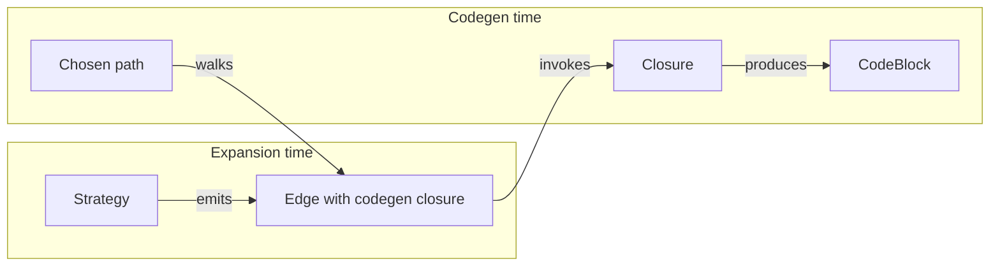
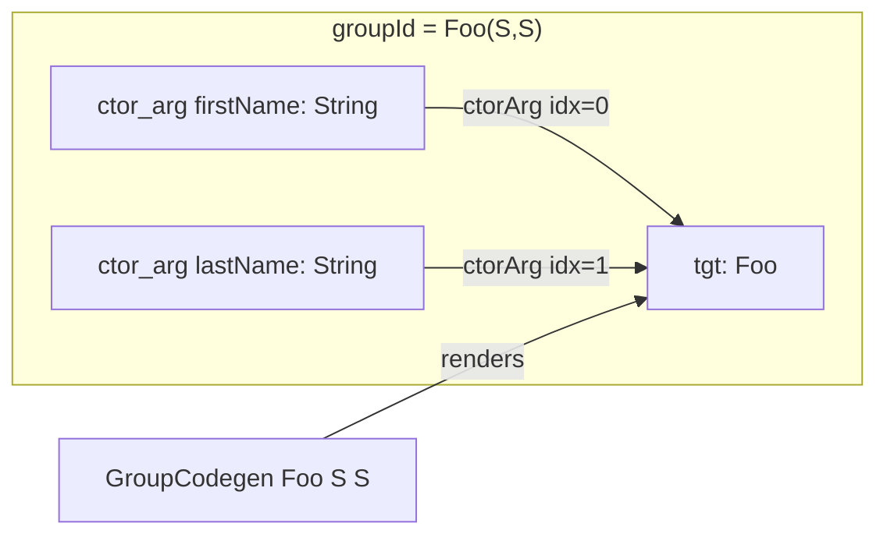

## Context

The graph schema shipped with `add-seed-graph-and-debug-dump` was sized for one use case: directive seeds. Phase 2 (expansion) — described in detail in `openspec/changes/explore-expansion-model/notes.md` — needs the same schema to carry several concepts that don't exist at seed time:

- realised edges (typed Java machinery: getter calls, setter calls, conversions)
- marker edges linking seed nodes to their realised counterparts
- sub-directive edges emerging mid-expansion when a strategy can do one step but not the rest
- group coordination for multi-edge constructs (constructor parameters, builder chains)
- codegen closures attached to realised edges
- strategy provenance for diagnostics and DOT inspection
- phantom container element nodes shared by `Optional<T>` / `List<T>` / `Set<T>` / `Stream<T>`

Adding any one of these inside Phase 2 would force a schema-touching change. Adding all of them in Phase 2 would interleave foundation work with strategy work and make review hard. This change separates concerns: the schema lands here, behaviour lands in Phase 2.

The notes already capture the shape of the expansion model in detail. This design's job is to record the **decisions** that turn the notes into a buildable schema, with their alternatives and rationale.

## Goals / Non-Goals

**Goals:**

- Ship every schema field, type, and SPI surface that Phase 2 strategies will consume.
- Keep `MapperGraph` / `Node` / `Edge` immutable and content-addressable.
- Preserve the forest invariant on the seed graph (still trivially true since no realised edges are added).
- Keep Phase 1 behaviour observably stable except for the documented weight flip (`1` → `∞`) on directive seed edges and the addition of `kind` labels.
- Preserve a record of decisions so Phase 2 can start without rediscovering the trade-offs.

**Non-Goals:**

- No `ExpansionStrategy` SPI lands here. The codegen-side interfaces (`EdgeCodegen`, `IncomingValues`, `VarNames`, `GroupCodegen`) ship because `Edge` references `EdgeCodegen`; the expansion-driver-side interface does not.
- No expansion driver, work queue, or fixed-point loop.
- No phantom-node emission. The schema supports phantoms (`ElementLocation`, `Node.parent`); no strategy creates them yet.
- No marker / sub-seed edge emission. Same shape: schema supports them, no producer.
- No Tier-2 walk via marker edges, no Tier-3 path-existence check.
- No DOT renderer change for `REALISED` / `MARKER` / `SUB_SEED` edge content beyond a styling table — the renderer is ready for them, but no edges of those kinds are emitted to render.
- No `ServiceLoader` / AutoService wiring. Lands with the SPI in Phase 2.

## Decisions

### D1 — Single `Edge` class with `kind` enum, no subclasses

`Edge` stays a single Lombok `@Value` class. `kind: EdgeKind` is a field. Per-kind invariants (e.g., "SEED edges must carry a directive mirror") are enforced by static factories: `Edge.seed(...)`, `Edge.realised(...)`, `Edge.marker(...)`, `Edge.subSeed(...)`. The all-args constructor is package-private; consumers go through the factories.

**Why:** The closure model (see D4) moves codegen dispatch off the edge type. The remaining wins of subclasses — DOT colouring and per-kind invariants — are achievable more cheaply.

**Alternatives considered:**
- *Sealed-style hierarchy with `@Value @NonFinal` abstract base + concrete subclasses.* Lombok supports it via `@NonFinal` and `@EqualsAndHashCode(callSuper = true)`. Rejected: doubles the type surface, forces `instanceof` chains (Java 11 has no `sealed`/exhaustive switches), and the closure model already collapses the dispatch case.
- *Keep subclasses but drop the kind enum.* Equivalent surface but introspection (DOT colour, debug logs) becomes `instanceof` checks instead of a switch on a small enum. Rejected on ergonomics.

### D2 — Closure-carrying codegen on realised edges

Strategies emit edges with an attached `EdgeCodegen` closure. The closure captures everything the strategy decided at expansion time (which getter, which builder method, which conversion). Codegen invokes the closure on the chosen path.



**Why this beats the obvious alternative:**

| Approach | Codegen lookup | Strategy state | New strategy cost |
|---|---|---|---|
| Closure-carrying *(chosen)* | `edge.codegen.render(...)` | captured in closure | ship one class, register via SPI |
| Strategy-class dispatch | `registry.lookup(edge.strategyFqn).emit(edge, vars)` | re-derived from edge fields | implement two methods on a class, ensure they agree |

The closure approach has three concrete advantages:
1. **No re-derivation.** A strategy that picked `getFirst()` over `getFirstName()` doesn't need to re-pick at codegen — the closure already captured the choice.
2. **Lazy by construction.** Closures on un-chosen paths never fire. Path selection only reads weights.
3. **User-extensible strategies are simpler.** A user strategy returns inline closures; no separate codegen-side method to keep in sync with expansion.

**Trade-off:** edges become heavier (a closure per realised edge). Acceptable — graphs are per-mapper, GC'd after each round, and only realised edges carry closures.

### D3 — `Edge.codegen` and `Edge.strategyClassFqn` are excluded from `equals` / `hashCode`

`Edge.equals` is structural: `(from, to, weight, kind, directive, groupId)`. The closure and FQN are metadata, not identity.

**Why:** `MapperGraph.addEdge` deduplicates structurally. If two strategies independently produce structurally-equal edges with different closures, the first one wins (deterministic by SPI iteration order). This stops "addEdge silently rejected because the closure object is different" mysteries.

**Lombok form:** `@Value @EqualsAndHashCode(exclude = {"codegen", "strategyClassFqn"})`.

### D4 — `EdgeCodegen` is a richer interface, not `Function<VarNames, CodeBlock>`

```java
public interface EdgeCodegen {
    CodeBlock render(VarNames vars, IncomingValues inputs);
}

public interface IncomingValues {
    CodeBlock single();                       // most edges have one upstream input
    CodeBlock byGroupPosition(int idx);       // ctor arg by position
    CodeBlock byName(String slotName);        // builder slot
}
```

**Why richer:** constructor and builder edges have multiple converging inputs; a single `Function<VarNames, CodeBlock>` can't address them. Adding inputs later would be a breaking SPI change. Better to ship the broader signature now even though no current consumer needs `byGroupPosition` / `byName`.

### D5 — Group closures live on `MapperGraph`, not on edges

Constructors and builders are *one expression* in the generated code (`new Foo(a, b)` or `Foo.builder().firstName(a).lastName(b).build()`), but the schema models them as N parallel edges sharing a `groupId`. The "outer" call has to come from somewhere.

**Decision:** `MapperGraph` carries `Map<String, GroupCodegen>` keyed by `groupId`. Codegen looks up the group closure once per group, passes the per-edge inputs in, and renders.

```java
public interface GroupCodegen {
    CodeBlock render(VarNames vars, IncomingValues inputs);
}
```

**Why not per-edge with convention** (e.g., "first edge by sort order owns the wrapping"):
- "First edge owns the call" is accidental — sort order is an implementation detail, not a contract.
- Makes group emission inseparable from the group's edge set; can't reason about the group as a unit.

**Trade-off:** `groupId` becomes load-bearing (typo loses the wrapping). Mitigated by strategies always producing `groupId` from the same source-of-truth (constructor signature, builder type FQN).

### D6 — `Node` owns id derivation; `Location` provides a segment

Previously `Node.id()` delegated to `Location.encode()`. With `ElementLocation` (phantom container element nodes), id derivation needs the *parent* node's id, which is a Node-level concept, not a Location-level one.

**Decision:** flip the responsibility:

```java
public interface Location {
    String segment();   // this location's contribution to the id
}

public final class Node {
    private final Optional<TypeMirror> type;
    private final Location loc;
    private final Scope scope;
    private final Optional<Node> parent;   // set only on phantoms

    public String id() {
        if (loc instanceof ElementLocation) {
            return parent.orElseThrow().id() + "::elem";
        }
        return scope.encode() + "::" + loc.segment() + "::" + typeEncode();
    }
}
```

**Why this over the alternatives:**

| Option | Circularity | Simplicity | DOT cluster grouping |
|---|---|---|---|
| `Location.encode()` does it all | n/a (current) | works for non-phantoms | n/a (no phantoms before) |
| `ElementLocation(Node parent)` | yes (Loc → Node) | minimal field count | grouping has parent ref |
| `ElementLocation(String parentId)` | no (snapshot) | minimal field count | grouping needs graph lookup |
| **`Node.parent: Optional<Node>` *(chosen)*** | no | one extra Node field, only used for phantoms | grouping has live parent ref |

`Node.parent` is the cleanest separation: identity is fully a Node concern; `Location` becomes pure data; phantom nodes get the live parent reference DOT cluster grouping needs.

**Trade-off:** every Node now has a (usually empty) `parent` field. Negligible memory overhead given the per-mapper, GC'd lifetime.

### D7 — Sub-directives are their own `EdgeKind`, not "SEED with empty directive"

Four `EdgeKind` values: `SEED`, `REALISED`, `MARKER`, `SUB_SEED`.

**Why:**
- DOT colouring is per-kind: distinguishing initial seeds from strategy-emitted sub-seeds visually is more useful than treating both as a single category.
- Reasoning about the work queue is clearer: "seed edges are user-authored directives; sub-seed edges are strategy-emitted continuations" reads better than "SEED edges, but with this caveat".
- Forest invariant tests can target `SEED` specifically without re-checking the directive presence rule.

**Alternative considered:** `EdgeKind.SEED` with `directive: Optional<...>` (empty ⇒ sub-directive). Rejected — encodes a structural distinction in a presence check.

### D8 — Strategy provenance is `Optional<String>`, not `Optional<Class<?>>`

`Edge.strategyClassFqn: Optional<String>` records which strategy emitted the edge. Populated by strategies via `getClass().getName()` at edge-construction time.

**Why string over class reference:**
- Pure metadata — never used for behaviour. Codegen dispatches via the closure.
- Lighter (one string vs. a `Class<?>` ref).
- Survives any future graph snapshot / serialisation story.
- DOT renders `Class.getName()` as a string anyway.

**Side-effect:** the question of "where does the strategy class live" (processor classpath vs. user JAR vs. AP-classpath) becomes irrelevant. The string is just a label.

### D9 — Flip directive seed weight from `1` to sentinel `∞` in this change

Phase 1 used weight `1` for directive seed edges. The notes' weight scale (§7) reserves `∞` as the unrealised-seed sentinel. This change flips the seed weight so Dijkstra on the full graph naturally prefers realised paths once they exist.

**Why now:** the whole point of this alignment change is to unblock Phase 2 cleanly. Half-flipping (keep `1` for seeds, flip later) leaves a pre-existing assumption to revisit. Tests update once.

**Sentinel value:** `Weights.SENTINEL_UNREALISED = Integer.MAX_VALUE / 2`. The `/2` margin avoids overflow if Dijkstra ever sums two sentinel weights along a pathological path before a non-seed alternative is discovered.

**Forest invariant:** still holds. No realised edges land in this change; the graph topology is identical to Phase 1 — only edge weights and labels change.

### D10 — `RealisedSubgraph` is a thin wrapper around a JGraphT mask view

`MapperGraph.realisedSubgraph()` returns a `RealisedSubgraph` exposing the same sorted-iteration contract: `nodes()`, `edges()`, `nodesByScope(Scope)`. Internally it wraps `org.jgrapht.graph.MaskSubgraph` filtered to `kind ∈ {REALISED}` (excludes `SEED`, `MARKER`, `SUB_SEED`).

**Why a wrapper:**
- No raw JGraphT types leak through the public seam (consistent with how `MapperGraph` already hides JGraphT).
- The sorted-iteration contract is preserved — JGraphT iteration is otherwise hash-based.
- Phase 2 codegen Dijkstra runs on this view; Phase 2 Tier-3 path-existence checks run on this view.

**Phase 1 reality:** the realised subgraph is empty in this change. The wrapper exists; tests assert it's empty for every seed-graph output.

### D11 — Edge construction goes through factories; the all-args constructor is package-private

```java
public final class Edge {
    Edge(/* all-args */) { ... }                 // package-private

    public static Edge seed(Node from, Node to, AnnotationMirror directive) {
        return new Edge(from, to, Weights.SENTINEL_UNREALISED, EdgeKind.SEED,
                        Optional.of(directive), Optional.empty(),
                        Optional.empty(), Optional.empty());
    }

    public static Edge realised(Node from, Node to, int weight,
                                Optional<String> groupId,
                                EdgeCodegen codegen,
                                String strategyClassFqn) { ... }

    public static Edge marker(Node from, Node to, String strategyClassFqn) {
        return new Edge(from, to, Weights.NOOP, EdgeKind.MARKER,
                        Optional.empty(), Optional.empty(),
                        Optional.empty(), Optional.of(strategyClassFqn));
    }

    public static Edge subSeed(Node from, Node to) { ... }
}
```

**Why factories:**
- "SEED edges always have a directive" / "REALISED edges always have a codegen" / "MARKER edges have weight 0" become construction-time invariants instead of runtime asserts.
- Code-reviewing a strategy's edge emission reads cleanly: `Edge.realised(...)` not `new Edge(from, to, 1, REALISED, empty(), empty(), of(closure), of(fqn))`.

## Risks / Trade-offs

- [DOT golden tests churn] → seed-graph DOT outputs change (weight `∞`, `kind = SEED` label). One-time cost; updated alongside the schema flip.
- [Edge field count grows substantially] → `Edge` goes from four fields to eight. Mitigation: factory methods hide construction; equality stays structural; the closure / FQN slots are mostly empty in this change.
- [Closure-carrying realised edges hold strategy-captured state] → closures may capture references they shouldn't (e.g., `TypeMirror` instances tied to a closed processing round). Mitigation: documented in the strategy SPI when it lands; closures are short-lived (per-round) in practice.
- [`Node.parent` introduces a partial field] → only set on phantom nodes; empty everywhere else. Mitigation: `Optional<Node>` is the existing idiom for partial fields on `@Value` types.
- [`groupId` is a stringly-typed key] → typos in strategies would lose the group's wrapping closure silently. Mitigation: strategies derive `groupId` from a single source (constructor signature, builder type FQN) so collisions / typos are constructor / compile-time issues.
- [Sentinel `∞` arithmetic in Dijkstra] → adding two sentinels could overflow `int`. Mitigation: `Integer.MAX_VALUE / 2` keeps a 2× headroom; in practice no path includes two sentinels because once a realised edge exists, Dijkstra prefers it.
- [Schema lands without behavioural producers] → the new fields and types could rot if Phase 2 stalls. Mitigation: tests pin "no edges of kind X are emitted yet" so the absence is asserted, not assumed.

## Future Expansion Reference

This section preserves concepts clarified during the design conversation that don't ship in this change but inform Phase 2 work. Treat it as a continuation of `explore-expansion-model/notes.md`, narrowed to the decisions that affected this alignment change.

### Closure model — full picture

The closure model resolves several open questions from the notes:

- **Q1 collapsed.** `EdgeKind` granularity doesn't affect codegen dispatch. Coarse kinds suffice because the closure renders the edge.
- **No two-phase strategy contract.** A strategy implements `proposeFor` only. Codegen invokes the captured closure; strategies don't need to keep `proposeFor` and `emit` in sync because there's no separate `emit`.
- **Strategies can be stateful within a single expansion.** What they capture in the closure is whatever they had at expansion time. They don't need to be re-runnable at codegen.

### Group closure mechanics

Worked example for `Foo(String firstName, String lastName)`:



At codegen time the chosen path includes both edges; the codegen walker:

1. Renders each edge's upstream input (the source value flowing into `firstName`, the source value flowing into `lastName`).
2. Looks up `MapperGraph.groupCodegen("Foo(S,S)")`.
3. Calls `groupCodegen.render(vars, IncomingValues)` where `IncomingValues.byGroupPosition(0)` returns the rendered firstName input, `byGroupPosition(1)` returns the lastName input.
4. The group closure returns `CodeBlock.of("new Foo($L, $L)", inputs.byGroupPosition(0), inputs.byGroupPosition(1))`.

The individual ctor-arg edges' own closures are typically a no-op `single()` passthrough (the input already represents the arg's value). They exist so that path selection sees the edges; codegen wrapping happens at the group level.

### Strategy SPI sketch (Phase 2)

For reference — not shipping in this change. The SPI shape that falls out of the closure model:

```java
public interface ExpansionStrategy {
    Set<SeedEdgeFlavor> handles();   // ① SOURCE_STEP, ② BRIDGE, ③ TARGET_STEP

    Stream<Edge> proposeFor(Edge seedEdge, GraphContext ctx);

    default int priority() { return 0; }
}
```

Note the absence of an `emit` method. Codegen uses `Edge.codegen`. `priority()` provides tiebreak when two strategies emit structurally-equal edges.

### Uniform SPI loading

All strategies — built-in and user-supplied — load via `ServiceLoader<ExpansionStrategy>` with `@AutoService` registration. No distinction in the loading mechanism: a built-in strategy in the processor JAR and a user strategy in a downstream JAR are registered the same way.

This collapses two questions:
- Strategy class FQN as `Optional<Class<?>>` vs `Optional<String>` becomes irrelevant — `String` is fine because all strategy classes are loaded uniformly anyway.
- Tiebreaking order is deterministic and stable: lexicographic by FQN, with `priority()` taking precedence.

### Three flavors of seed edge

Phase 2 strategy dispatch will route seed edges to strategies based on their flavor:

| Flavor | Endpoints | Strategies (planned) |
|---|---|---|
| ① source-step | typed → `?` | GetterRead, FieldRead |
| ② bridge | `?` → `?` | DirectAssign, OptionalWrap, MethodCall, conversions |
| ③ target-step | `?` → typed | SetterWrite, ConstructorCall (group), BuilderCall (group) |

`SeedEdgeFlavor` is a Phase 2 enum on the `ExpansionStrategy` SPI side; it's *not* shipped in this change. Strategies declare `Set<SeedEdgeFlavor> handles()` so the driver can pre-filter dispatch.

### Phantom container element nodes

Container types (`Optional<T>`, `List<T>`, `Set<T>`, `Stream<T>`, etc.) get unified treatment via phantom element nodes:


`Node.parent` carries the live ref to the container node. `ElementLocation` is a marker only — no payload. `Node.id() = parent.id() + "::elem"`.

The element-wise edge between two phantoms is just an ordinary edge fired by ordinary strategies (e.g., a conversion strategy). No special "lift" machinery; the phantom shape *is* the lift.

This change ships the schema (Node.parent, ElementLocation, Node.id() rule). No strategy emits phantoms yet; tests assert that.

### Tier-2 walk via marker edges

Once Phase 2 emits realised edges, every realisation also emits a `MARKER` edge from the seed to its realised counterpart:

```
src[person.first]: ?  ──realises (kind=MARKER, w=0)──▶  src[person→getFirst()]: String
```

The Tier-2 check walks every directive seed node's outgoing markers. A seed with no outgoing markers is unrealised; Tier-2 emits an error referencing the seed's incoming directive edge's `AnnotationMirror`.

This change ships `EdgeKind.MARKER` and the `realisedSubgraph()` filter (which excludes markers). No marker edges land yet; the Tier-2 checker is Phase 2 work.

### Weight scale

Documented in `Weights`:

| Constant | Value | Meaning |
|---|---|---|
| `Weights.NOOP` | 0 | reference / view / no-op (markers, container `extract`, identity) |
| `Weights.STEP` | 1 | single Java operation (getter, setter, method call, optional wrap, conversion) |
| `Weights.COPY` | 2 | full structural copy / O(n) op (collect, materialise stream) |
| `Weights.EXPENSIVE` | 3 | reserved for unusually costly operations |
| `Weights.SENTINEL_UNREALISED` | `Integer.MAX_VALUE / 2` | directive seed / sub-seed |

Strategies SHOULD use these constants exclusively. Drift across strategies (one author uses `1`, another uses `7` for "the same kind of op") would make Dijkstra incoherent.

### What we explicitly chose NOT to decide here

- The exact shape of `VarNames`. It's a typed handle to the codegen's local-variable scope; the concrete API can land with the first realised-edge-emitting strategy. This change ships the type as an abstract placeholder.
- Whether `IncomingValues.byName` and `byGroupPosition` are both populated for every group (they could converge — builder steps are positional too, but named is more readable). The interface ships both; usage decides.
- `MapperScope` cross-method edges. The notes' `MethodCallStrategy` is the only edge that crosses cluster boundaries, deliberately. This change makes no decision about it; the schema already supports cross-scope edges trivially because `Edge.from` and `Edge.to` are typed `Node` (no scope-pair check).
- `Map<K,V>` and `Either<L,R>` SPI shape. Multi-type-parameter containers don't fit `ContainerKind`; deferred per the notes.
- DOT colour table per `EdgeKind`. Cosmetic; design.md for Phase 2 will pin the colours when there are non-SEED edges to render.
