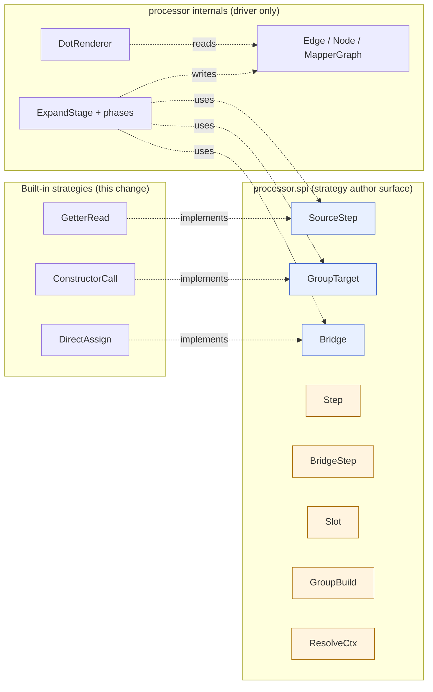
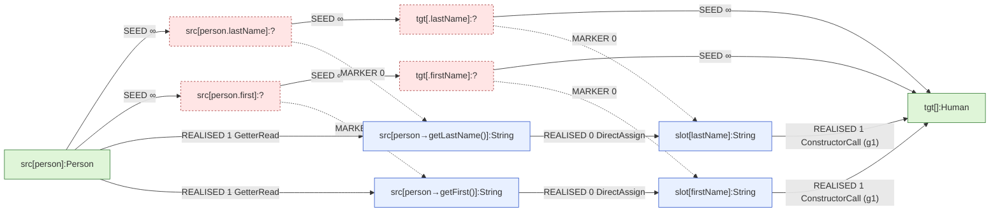

## Context

The processor pipeline currently ends at the seed-graph stage. After
`SeedGraph` populates per-mapper `MapperGraph`s with directive-seed edges
(carrying the `@Map` `AnnotationMirror`, sentinel `∞` weight, and
`EdgeKind.SEED`), the graph sits idle: nothing realises seeds into typed
Java machinery, nothing reports unresolvable directives back to the user,
nothing produces code.

Phase 1 (`add-seed-graph-and-debug-dump`, archived 2026-05-02) shipped the
graph data model and the seed-time debug DOT renderer. Phase 1.5
(`align-graph-for-expansion`, archived 2026-05-03) shipped schema
additions sized for the expansion phase: the `EdgeKind` enum
(`SEED`, `REALISED`, `MARKER`, `SUB_SEED`), `groupId`, `Edge.codegen`,
`strategyClassFqn`, `Node.parent`, `ElementLocation`, `Weights` constants,
`MapperGraph.realisedSubgraph()`, `EdgeCodegen` / `IncomingValues` /
`VarNames` / `GroupCodegen` interfaces. None of those edge kinds are
produced anywhere yet.

The design space for this change was explored over several thinking
sessions captured in `openspec/changes/explore-expansion-model/notes.md`
and the final proposal-shaping conversation. This design records the
outcomes so future contributors do not have to re-derive them.

Tech constraints unchanged from prior phases: Java 11 release target
(no records, no sealed types, no pattern matching), Lombok available,
Dagger 2.59.1, NullAway in jspecify mode with `@NullMarked` packages,
palantir-java-format, errorprone with `-Werror`, Spock 2.4 + Groovy 5.0
+ Google Compile Testing for tests, JGraphT 1.5.2 in use. New external
dependency: Google `auto-service` (annotation + processor) for uniform
strategy registration.

Stakeholders: processor maintainers (this change), future strategy
authors (the new SPI surface), the codegen change (Phase 3 — consumes
the realised subgraph this change populates).

## Goals / Non-Goals

**Goals:**
- Establish the per-mapper expansion engine that turns SEED edges into
  REALISED + MARKER edges, in a way that makes future strategy work
  purely additive (no platform changes).
- Establish a strategy SPI so narrow that an author can write a new
  strategy without importing any graph internals — types, weights, and
  codegen lambdas only.
- Establish per-phase validation (Tier-2 markers walk; Tier-3
  bidirectional gap walk) that anchors errors at the originating `@Map`
  annotation and emits both shoulders of an unrealisable bridge.
- Lock in driver-side marker emission, sub-directive emission, and group
  coordination so strategies stay stateless and trivially testable.
- Refactor `Pipeline` to a `List<Stage>` indirection so future phases
  drop in without re-touching the orchestrator.
- Always emit the expanded DOT when debug is on — including on
  validation failure — so a developer can post-mortem any failure.

**Non-Goals:**
- Code generation. The realised subgraph this change populates is the
  *input* to a future codegen change; no `Mapper` implementation is
  produced by this change.
- `TargetStep` SPI interface and any setter / builder / field-write
  strategy. Dotted target paths are an explicit v1 limitation.
- `OptionalWrap`, `ContainerKind` SPI and container `extract`/`collect`
  edges, conversion strategies (`String ↔ LocalDateTime`, boxing
  pairs, …).
- `MethodCallStrategy` for routable mapper methods or cross-mapper
  composition.
- Sub-directive *emission* by built-in strategies. The driver supports
  sub-directives forward-compat (cycle / budget guards live in the
  driver) but no v1 strategy emits them.
- Configurable expansion budget (hardcoded at 100; a future change can
  expose it via `processor-options`).
- Buffered diagnostics (existing direct-write `Diagnostics` channel
  unchanged — Tier-2 / Tier-3 errors emit one entry per failing
  directive).
- Cross-mapper composition. A mapper using another mapper is deferred —
  this change handles intra-mapper expansion only.

## Architecture Overview

### The refined picture, end-to-end

```mermaid
flowchart TB
    subgraph outer["Pipeline (List&lt;Stage&gt;)"]
        D[discovery]
        T1[validate-tier-1]
        S[seed-graph]
        DS[dump-seed-graph]
        E[ExpandStage]
        V[ValidateRealisationStage]
        DE[dump-expanded-graph]
        D --> T1 --> S --> DS --> E --> V --> DE
    end
    subgraph expand["ExpandStage (List&lt;ExpansionPhase&gt;)"]
        P1[ResolveSourceChainsPhase]
        P2[ResolveTargetChainsPhase]
        P3[BridgeSourceToTargetPhase]
        P1 --> P2 --> P3
    end
    subgraph validate["ValidateRealisationStage (List&lt;ValidationPhase&gt;)"]
        V1[ValidateMarkersPhase&nbsp;Tier-2]
        V2[ValidatePathsPhase&nbsp;Tier-3]
        V1 --> V2
    end
    E -.contains.-> expand
    V -.contains.-> validate
```



Two-level nesting: the outer `Pipeline` runs `Stage`s; two of those
stages (`ExpandStage`, `ValidateRealisationStage`) are themselves
orchestrators of inner `Phase`s. Each phase is a pure transformation of
the `MapperGraph` (or a pure query producing `Diagnostics`) and is
independently testable.

### The strategy SPI surface



The hard line is between `processor.spi` and everything else.
Strategy authors import only `processor.spi`. They never see `Edge`,
`Node`, `MapperGraph`, `EdgeKind`, `MARKER`, `SUB_SEED`, `groupId`,
`Weights` (constants in spi, but the field type is plain `int`), or the
phase classes. Everything they need is type-system-level (`TypeMirror`,
`ExecutableElement`, `Element`) plus the four pure-data result types and
`ResolveCtx`.

### The graph after expansion (worked example)

For the v1 demo mapper:

```java
@Mapper
interface PersonMapper {
    @Map(target = "lastName",  source = "person.lastName")
    @Map(target = "firstName", source = "person.first")
    Human map(Person person);
}
```

with `Human` declaring `Human(String firstName, String lastName)` (e.g.
via Lombok `@AllArgsConstructor`):



Five edge kinds visible:
1. **SEED** (red, dashed) — the directive-seeded skeleton. Sentinel `∞`
   weight. Carries the `@Map` `AnnotationMirror`. Untouched by expansion.
2. **REALISED** typed → typed (blue, solid) — produced by strategies via
   the driver. Carries weight from the `Weights` scale (0/1/2/3),
   `strategyClassFqn`, and `EdgeCodegen` lambda. Group `g1` shared by
   the two `ConstructorCall` edges converging on `tgt[]:Human`.
3. **MARKER** SEED → REALISED (dotted) — driver-emitted weight `0`
   marker linking each `?`-typed seed node to its realised counterpart.
   Used by Tier-2 (existence check) and Tier-3 (path walk).

The realised subgraph (REALISED edges only — MARKER and SEED filtered
out by `MapperGraph.realisedSubgraph()`) is the input the future codegen
change will walk.

### Author-burden retrospective

```
┌──────────────────────────────────────┬────────────┐
│ What strategy authors must touch     │            │
├──────────────────────────────────────┼────────────┤
│ Edge / Node / MapperGraph types      │     no     │
│ EdgeKind enum                        │     no     │
│ MARKER / SUB_SEED edge construction  │     no     │
│ Node id derivation                   │     no     │
│ groupId field                        │     no     │
│ Sub-directive protocol               │     no     │
│ Fixed-point loop / readiness logic   │     no     │
│ Bridge ordering vs flavor ① / ③      │     no     │
│ Marker emission                      │     no     │
│ Parallel edge emission               │     no     │
│ Diagnostics                          │     no     │
├──────────────────────────────────────┼────────────┤
│ Types (javac model)                  │    yes     │
│ Elements (javac model)               │    yes     │
│ TypeMirror / ExecutableElement       │    yes     │
│ Weights constants (from int field)   │    yes     │
│ Step / BridgeStep / Slot / GroupBuild│    yes     │
│ EdgeCodegen lambda (CodeBlock)       │    yes     │
│ priority() override (optional)       │    yes     │
└──────────────────────────────────────┴────────────┘
```

Everything in the "no" half is driver responsibility. Refactoring the
"no" half does not break user strategies — the boundary is enforced by
package visibility (`processor.spi` vs `processor.expand` /
`processor.graph`).

## Decisions

### D1. Demand-driven *phased* expansion (no interleaving in v1)

**Decision:** `ExpandStage` runs three sequential phases —
`ResolveSourceChainsPhase`, `ResolveTargetChainsPhase`,
`BridgeSourceToTargetPhase` — each a pure
`MapperGraph → MapperGraph` transformation. No back-jumping between
phases. Within a phase, internal iteration is bounded by chain depth
(dotted source paths) or directive-set size (group strategies).

**Why:** With v1's three strategies, none of which auto-recurse and
none of which emit sub-directives, no later phase produces work that
an earlier phase needs to handle. Source-side and target-side
realisations are graph-disjoint (different node-id namespaces).
Bridges only run after both endpoints have markers, by construction.
A phased pipeline is therefore strictly more testable and reviewable
than a unified work-queue driver, at no behavioural cost.

**Alternatives considered:**
- *Single FIFO work queue with strategy.handles() dispatch and
  flavor-aware routing.* This was the leading design through several
  iterations of the conversation. Rejected as harder to test in
  isolation (the FIFO loop intermingles work) and requiring more
  in-strategy ordering knowledge unless the driver carries flavor
  awareness anyway — at which point a phased driver is simpler.
- *Phased with internal fixed-point per phase plus an outer
  fixed-point loop.* The outer loop is needed only when sub-directives
  cross phase boundaries. v1 doesn't have that. The loop wrapper can
  be added when (and if) future strategies need it; existing phases
  are left untouched.

### D2. SPI design: four small interfaces, results are pure data

**Decision:** Three SPI interfaces ship in v1
(`SourceStep`, `GroupTarget`, `Bridge`). The fourth slot —
`TargetStep` — is reserved by package convention and ships with
`SetterWrite` in a follow-up change. Strategy methods return one of
four immutable result records: `Step`, `BridgeStep`, `Slot`,
`GroupBuild`. The only context object is `ResolveCtx` exposing
`Types` and `Elements`.

**Why:** A strategy answers a single question: "given this input, can I
produce this output?" The answer is a structural description (what type,
what cost, how to render code), not a graph mutation. Pushing graph
mutation into the driver means strategies are pure functions of
`(TypeMirror, hint, ResolveCtx)` and can be unit-tested without any
graph fixture. The package boundary
(`processor.spi` ↔ `processor.expand` / `processor.graph`) makes the
"strategies see no internals" invariant *enforceable*, not aspirational.

**Alternatives considered:**
- *One unified `ExpansionStrategy` interface with `handles()` returning
  flavors and `proposeFor(Edge seed, GraphContext ctx)` returning
  `Stream<Edge>`.* Rejected after live-comparing strategy code under
  both designs (see exploration notes). The unified interface forces
  every strategy to reach into `Edge`, `Node`, marker construction, and
  potentially sub-directive emission — exactly the leaks the
  package-boundary design is meant to prevent.
- *Two interfaces (`PerEdgeStrategy` for ① / ② / ③, `GroupStrategy`
  for grouped ③).* Rejected as ambiguous: source-step, target-step,
  and bridge have meaningfully different inputs (path-tail vs
  target-tail vs type-pair). Three interfaces match the three flavors
  exactly and read naturally.

### D3. Driver owns marker emission, sub-directive emission, group coordination

**Decision:** When a strategy returns a `Step` / `BridgeStep` /
`GroupBuild`, the driver constructs the corresponding REALISED `Edge`,
allocates the new typed `Node`(s) with derived ids, emits the MARKER
edge from the originating SEED node, registers any `GroupCodegen`
closure on the `MapperGraph`, and stamps `groupId` on coordinated
edges. If the driver detects an unfilled typed slot with no source-side
candidate, it emits a SUB_SEED edge that re-enters the work for that
phase.

**Why:** Marker / sub-directive / group plumbing is bookkeeping the
strategy author has no useful opinion about. Centralising it keeps
strategies stateless and trivially testable. It also means a future
internal restructure (e.g., changing how node ids are derived, or
swapping the underlying graph implementation) does not break user
strategies — the public surface they import is unchanged.

**Alternatives considered:** strategy emits markers and sub-directives —
rejected for the reasons above.

### D4. Uniform registration: ServiceLoader + @AutoService for built-ins and user strategies

**Decision:** Both built-in strategies and user-supplied strategies are
discovered the same way: `ServiceLoader<SourceStep>`,
`ServiceLoader<GroupTarget>`, `ServiceLoader<Bridge>`. Built-ins
declare `@AutoService(SourceStep.class)` (etc.) so the
auto-service annotation processor generates their
`META-INF/services/...` entries at compile time. The `ExpandStage`'s
Dagger `@Module` produces `@Singleton List<SourceStep>` (etc.) by
loading once via `ServiceLoader` and sorting by FQN.

**Why:** A single discovery path is one fewer concept to learn and one
fewer place a bug can hide. Sorting by FQN gives deterministic strategy
ordering across compile runs (ServiceLoader's iteration order is not
guaranteed by spec). Determinism matters for the future codegen change,
where strategy order is a tiebreak in path selection.

**Alternatives considered:**
- *Dagger for built-ins, ServiceLoader for users.* Rejected as
  asymmetric — testing user-strategy registration would need a
  different fixture than testing built-in registration.
- *Custom registry annotation (`@PercolateStrategy`).* Rejected as
  reinventing what `ServiceLoader` already standardises in the JDK.

### D5. Driver normalises same-side `?→?` edges and bare-parameter sources

**Decision:** Same-side `?→?` SEED edges (the inner segments of a
dotted source path, e.g.
`src[person.address]:? → src[person.address.street]:?`) are processed
in `ResolveSourceChainsPhase` after their FROM node has been realised.
The driver pulls the realised counterpart of the FROM (via existing
MARKER edges), then invokes `SourceStep.stepsFrom(realisedType,
pathTail, ctx)` — the strategy never sees the `?→?` shape. Bare-
parameter sources (`@Map(source = "person", target = "name")` with no
dotted path) seed as `src[person]:Person → tgt[.name]:?` (typed → ?
crossing source/target). The driver treats these as ② bridges where the
FROM is already typed at seed time; bridge invocation is uniform.

**Why:** Strategy authors see a flat `(typed, hint, ctx)` shape
regardless of whether the underlying seed edge was directly attached to
a typed root or buried inside a chain. The driver carries every shape
quirk.

**Alternatives considered:** introduce a fourth seed flavor for
same-side `?→?` and / or for typed → ? cross-side. Rejected — adds
SPI surface for what is purely a normalisation concern.

### D6. ConstructorCall: exact-match in v1; subset deferred

**Decision:** `ConstructorCall.buildFor(returnType, targetTails, ctx)`
returns `Optional<GroupBuild>`. A ctor matches iff the set of its
parameter names equals `Set.copyOf(targetTails)`. No subset-matching,
no per-arg fallback to other strategies, no hybrid construction +
setter assembly.

**Why:** Subset matching pulls temporal-ordering codegen complexity
forward into v1 (the chosen path has at most one ctor group plus N
setters; codegen must order ctor before setters). Until codegen ships,
we cannot meaningfully validate subset-matching end-to-end. Exact match
is enough for the v1 demo (Lombok `@AllArgsConstructor` value objects)
and trivially extends to subset later by changing the return type to
`Stream<GroupBuild>`. Source-compatible.

**Alternatives considered:** subset matching with parallel groups and
codegen-side temporal ordering. Deferred to a follow-up change that
ships alongside or after `SetterWrite`.

### D7. TargetStep deferred to follow-up; v1 supports single-segment target paths only

**Decision:** Three SPI interfaces ship: `SourceStep`, `GroupTarget`,
`Bridge`. `TargetStep` lands when `SetterWrite` does. Single-segment
target paths (`@Map(target = "lastName", ...)`) are fully supported.
Dotted target paths (`@Map(target = "address.street", ...)`) fail
Tier-2 in v1 with an explicit "no strategy can realise
`tgt[.address.street]:?`" diagnostic.

**Why:** `SetterWrite` is the natural first `TargetStep`. Shipping the
interface without an implementor would be YAGNI inconsistency given
that subset-matching was deferred for the same reason. The dotted-
target failure mode is documented, the diagnostic points at the user's
`@Map` annotation, and the migration story is "wait for the next
change or use a flat target path".

**Alternatives considered:** ship `TargetStep` interface now with no
v1 implementor — rejected as YAGNI.

### D8. Cycle detection + per-seed budget

**Decision:** After each phase completes, the driver runs JGraphT
`CycleDetector` over the SEED + SUB_SEED subgraph. Any cycle ⇒
`Diagnostics.error` keyed to one seed's `AnnotationMirror`, scarred
mapper. Independently, each seed has a per-seed expansion budget of
100; any seed whose lineage produces > 100 sub-directive expansions ⇒
budget-exhausted error keyed to that seed. The 100 is a hardcoded
constant in v1; a future change can expose it via `processor-options`.

**Why:** Defensive against malformed user strategies. v1's three
built-ins emit no sub-directives, so neither guard fires for our test
mappers; the guards exist so a future user strategy that misbehaves
fails with a clear diagnostic rather than a stack overflow or an
infinite compile.

**Alternatives considered:**
- *No guards in v1.* Rejected — even without v1 strategies emitting
  sub-directives, the guards' presence forms part of the SPI contract
  ("your strategy will be aborted if it loops"). Documenting the
  contract requires shipping the implementation.
- *Cycle detection on the realised subgraph.* Rejected — cycles in
  the realised subgraph are not always errors (a recursive type's
  self-edge is fine). Cycle on SEED + SUB_SEED captures the real
  pathology (sub-directive lineage looping back).

### D9. Tier-2 scars; Tier-3 emits a bidirectional gap diagnostic

**Decision:** `ValidateMarkersPhase` walks every SEED node; any node
with no outgoing MARKER edge yields one error keyed to its incoming
SEED edge's `AnnotationMirror`, and the failing mapper is scarred via
the existing `Diagnostics` scarring mechanism. `ValidatePathsPhase`
runs only on un-scarred mappers. For each unrealised seed bridge edge,
it walks REALISED edges forward from the source-side realised
counterpart (until no more outgoing realised edges) and backward from
the target-side counterpart (until no more incoming realised edges).
The final source-side type and the initial target-side type form the
"gap" — the diagnostic reports both shoulders of the walk plus the
missing type pair.

**Why:** A "no path" error is uninformative — the user knows there's
no path; what they need to know is *where* the path broke. Walking
both shoulders gives the smallest helpful trace: the chain that *did*
realise on each side, and the type pair the user (or future strategy
author) has to bridge. The shoulders fall naturally out of the dual-
graph view that the alignment change shipped.

**Alternatives considered:**
- *Single Dijkstra "is there a path" check.* Rejected — error is too
  vague.
- *Full path enumeration in the diagnostic.* Rejected — for non-
  trivial graphs the message becomes unreadable.

### D10. Always write `<MapperFQN>.expanded.dot` when debug option is on

**Decision:** `DumpExpandedGraph` runs after `ValidateRealisationStage`
and writes `<MapperFQN>.expanded.dot` whenever
`-Apercolate.debug.graphs=true`, including for mappers where Tier-2 or
Tier-3 emitted errors. The full graph (SEED + REALISED + MARKER +
SUB_SEED) renders, with sentinel `∞` weights and edge-kind styling
already shipped by the alignment change.

**Why:** Debug output is most valuable on failure. Skipping the dump on
error is the opposite of helpful. A failed expansion's DOT is exactly
what someone would attach to a bug report.

**Alternatives considered:** skip the dump when the mapper has any
errors. Rejected — defeats the debug option's purpose.

### D11. Strategy `priority()` shipped now; codegen change consumes it later

**Decision:** Each SPI interface declares
`default int priority() { return 0; }`. The driver does not consult
priority during expansion (parallel REALISED edges from multi-match
results are emitted unconditionally). The future codegen change uses
priority as a tiebreak when Dijkstra finds equal-cost paths.

**Why:** Adding `priority()` is one default method per interface and
costs nothing. Not shipping it forces a future SPI change for what is
obviously a forward-compat hook.

**Alternatives considered:** wait until codegen ships to add priority.
Rejected — guaranteed SPI churn.

### D12. Pipeline refactor to `List<Stage>` lands in this change

**Decision:** `Pipeline.process(...)` becomes
`stages.forEach(s -> s.run(ctx))`, with `Stages` provided as a Dagger
`@Multibinds Set<Stage>` that is sorted by an explicit declared order.
The seven stages of v1 (`Discovery`, `ValidateTier1`, `SeedGraph`,
`DumpGraph`, `ExpandStage`, `ValidateRealisationStage`,
`DumpExpandedGraph`) wire through the multibinding.

**Why:** Phase 1's design.md flagged this as the right move at ~7
stages. We are at 7. Bundling the refactor into this change costs ~150
LoC and makes future stage additions a single-file change.

**Alternatives considered:** keep straight-line, refactor later.
Rejected — the refactor's first beneficiary is *this* change (three new
stages).

### D13. The four result records are immutable Lombok `@Value` types

**Decision:** `Step`, `BridgeStep`, `Slot`, `GroupBuild` are Lombok
`@Value` types in `processor.spi`. Each carries the minimum fields
needed for the driver to translate to graph edges:
`Step(TypeMirror produces, int weight, EdgeCodegen codegen)`,
`BridgeStep(int weight, EdgeCodegen codegen)`,
`Slot(String name, TypeMirror type, int weight)`,
`GroupBuild(List<Slot> slots, GroupCodegen codegen)`. `EdgeCodegen` and
`GroupCodegen` are the codegen lambdas shipped by the alignment
change — re-exported from `processor.spi` so authors don't import the
graph package.

**Why:** Immutable, equality-by-value, trivially testable. Functional
style consistent with the project's stated paradigm preference. Re-
exporting the codegen interfaces keeps `processor.spi` self-contained.

## Risks / Trade-offs

- **[Risk] Driver thickness.** The driver concentrates marker emission,
  sub-directive emission, group coordination, flavor dispatch, cycle
  guards, and budget guards. A bug there affects every strategy.
  → *Mitigation:* per-phase tests run the actual driver against
  fixture graphs and assert exact edge / marker output. Each driver
  responsibility has its own focused spec.
- **[Risk] Phased pipeline locks us out of cross-phase iteration.**
  Future strategies that need back-jumping (auto-recursion, container
  cascades) cannot fit the linear shape.
  → *Mitigation:* the linear list is honest for v1. When iteration is
  needed, wrap the relevant prefix in a `RepeatUntilFixedPointPhase`
  (per the exploration notes); existing phases are untouched.
- **[Risk] ServiceLoader determinism across module path / classpath
  changes.** A future move to JPMS could change discovery semantics.
  → *Mitigation:* sort strategies by FQN at load time; this masks any
  underlying iteration-order change. Document the contract.
- **[Risk] Tier-3 bidirectional walk's complexity.** The "walk forward
  / walk backward / find the gap" algorithm is more involved than a
  single Dijkstra "no path".
  → *Mitigation:* dedicated unit spec for the walk with curated test
  graphs. Algorithm is bounded by the realised subgraph's size, which
  is bounded by the seed graph's size — no combinatorial explosion.
- **[Risk] Hardcoded budget of 100 surprises a user with an unusually
  large mapper.** A 50-directive mapper won't hit it, but a synthetic
  generator might.
  → *Mitigation:* the budget is per-seed (not per-mapper). 100 sub-
  directive expansions for a single seed is pathological; if hit, the
  diagnostic suggests reducing scope or filing a bug. Future
  configurability via `processor-options` keeps the door open.
- **[Trade-off] Three SPI interfaces, not one.** Slight cognitive cost
  on first encounter — author has to pick the right interface.
  → *Accepted:* the three interfaces map exactly to the three flavors;
  each is small and self-evident; the package boundary it protects is
  worth more than the unification.
- **[Trade-off] Strategies cannot query the graph.** A "is there
  already a path from A to B?" question cannot be answered from inside
  a strategy.
  → *Accepted:* strategies are local by design (per the exploration
  notes' explicit constraint). If a future strategy genuinely needs
  graph-shaped context, the SPI gains a fifth interface or a query
  helper on `ResolveCtx`. Easier to add than to remove.
- **[Trade-off] Always-write expanded.dot on error.** The DOT for a
  half-realised mapper can look chaotic (lots of red dashed seeds with
  no markers).
  → *Accepted:* chaotic is honest; the failing mapper *is* chaotic.
  Edge-kind styling makes the chaos navigable.

## Migration Plan

1. Add `auto-service` dependencies to `processor/build.gradle` (compile
   + annotation-processor configurations).
2. Create `io.github.joke.percolate.processor.spi` package with the
   three interfaces, four result records, `ResolveCtx`, and re-exports
   of `EdgeCodegen` / `GroupCodegen` / `IncomingValues` / `VarNames`.
   Each `package-info.java` declares `@NullMarked`.
3. Create `io.github.joke.percolate.processor.expand` package with
   `ExpandStage`, `ExpansionPhase` interface, and the three phase
   classes. Wire each phase's `List<Strategy>` via Dagger
   `@Provides`-method that calls `ServiceLoader` once and sorts.
4. Create `io.github.joke.percolate.processor.validate` package (or
   extend an existing validation package) with
   `ValidateRealisationStage`, `ValidationPhase` interface, and the
   two phase classes.
5. Implement the three built-in strategies under
   `processor.expand.builtins`, each annotated `@AutoService(...)`.
   Verify `META-INF/services/...` files generate at compile time.
6. Add `DumpExpandedGraph` stage mirroring `DumpGraph` (the existing
   seed-dump stage).
7. Refactor `Pipeline` to `List<Stage>` Dagger injection. Wire all
   seven stages in the declared order.
8. Extend `DotRenderer` to handle real REALISED / MARKER / SUB_SEED
   edges with the kind-styled rendering shipped by the alignment
   change. Verify the parent-aware phantom cluster grouping is
   exercised even though no phantom node is emitted in v1 (a unit spec
   constructs a phantom node manually and asserts the renderer).
9. Add per-phase Spock specs (one spec class per phase). Add per-
   strategy unit specs (one per built-in). Add a Compile Testing
   integration spec for the v1 demo mapper end-to-end.
10. Add golden DOT spec for one expanded mapper (the v1 demo). Add
    one golden for a deliberately-failing mapper to lock in the
    "always write on error" behaviour.
11. Update `MapperGraph` extensions in the test-only Groovy module to
    expose the new traversal helpers used by phase specs (incoming /
    outgoing markers, realised subgraph view, group lookup).

No rollback concern beyond reverting the change set. Generated output
is unaffected — codegen is still future. Existing seed-graph tests
remain green.

## Future Plans (Concept Record)

This section captures the trajectory beyond this change so future
contributors do not have to re-derive it. None of this is in scope.
None of these decisions are final.

### Phase 3 — codegen

A `CodegenStage` after `ValidateRealisationStage` (only when no errors
have been emitted on the mapper) walks the realised subgraph using
JGraphT `DijkstraShortestPath` from each `tgt[]:R` root back to a
source root, picking the cheapest path. Path edges are visited in
dependency order; for each edge the codegen lambda
(`EdgeCodegen.render(VarNames, IncomingValues)`) produces a
`CodeBlock`; group-coordinated edges are assembled via the registered
`GroupCodegen`. Results compose into a generated `Mapper`
implementation written to `SOURCE_OUTPUT` via JavaPoet.

Tiebreak rules when Dijkstra finds equal-cost paths:
1. Strategy `priority()` (higher wins).
2. Strategy class FQN (lexicographic).
3. Source position of the producing element.

Determinism is a hard requirement — byte-identical generated code
across compiles given the same input.

The `<MapperFQN>.realised.dot` file (showing only realised + group
edges, the codegen view) might land alongside `seed.dot` and
`expanded.dot` for debugging.

### Phase 4 — TargetStep + SetterWrite (and BuilderWrite)

`TargetStep` adds a fourth SPI interface mirroring `SourceStep`:

```
public interface TargetStep {
    Stream<Step> stepsInto(TypeMirror returnType, String targetTail, ResolveCtx ctx);
    default int priority() { return 0; }
}
```

`SetterWrite` is the canonical implementor — finds `setX(...)` methods
on the target type matching the directive tail and emits a `Step`
whose `produces` is the setter's parameter type.

`BuilderWrite` follows shortly after — detects a `T.builder()` /
`x().y().build()` pattern, emits `GroupTarget`-style group of edges
using a hint-driven match against the directive-target set.

`ResolveTargetChainsPhase` then runs both `GroupTarget` and `TargetStep`
strategies, which unblocks dotted target paths (`address.street`).

### Phase 5 — sub-directive emitting strategies

The first plausible sub-directive emitter is a future
`HybridConstructorSetter` strategy that matches a ctor's parameter set
as a *subset* of directive targets and emits a sub-directive for the
remaining targets, which `SetterWrite` then fills. This pulls
subset-matching forward as well (`ConstructorCall.buildFor` returns
`Stream<GroupBuild>`).

Sub-directive emission also unlocks auto-recursion: a future
`AutoRecurseBridge` for two structurally-similar types (`Person.Address`
→ `Human.Address`) emits sub-directives for each pair of like-named
fields, which the existing pipeline picks up. With cycle detection and
budget already in place from this change, the loop is bounded.

### Phase 6 — ContainerKind SPI

`Optional<T>`, `List<T>`, `Set<T>`, `Stream<T>`, `Iterable<T>`,
`Collection<T>` collapse onto one SPI:

```
public interface ContainerKind {
    boolean matches(TypeMirror type);
    TypeMirror elementType(TypeMirror containerType);
    EdgeCodegen extractCodegen();
    EdgeCodegen collectCodegen(TypeMirror containerType);
    default int priority() { return 0; }
}
```

A new `ResolveContainersPhase` (or extension of the existing phases)
introduces phantom element nodes and `extract` / `collect` edges per
the exploration notes' container model. Built-in `ContainerKind`s ship
for the JDK's container types; users provide their own via
`ServiceLoader`. Phantom node rendering already works in `DotRenderer`
(parent-aware clustering shipped in alignment).

### Phase 7 — conversion strategies

Boxing pairs (`Integer ↔ int`), temporal pairs
(`String ↔ LocalDateTime`, `LocalDateTime ↔ Instant`), `Optional`
wrap / unwrap, and similar value-translation strategies ship as
`Bridge` implementors. Each has a fixed pair of types and a fixed
codegen template.

### Phase 8 — MethodCallStrategy + cross-mapper composition

Per the exploration notes' §4, a single `MethodCallStrategy`
(implementing `Bridge`) handles three concentric scopes:

1. Same-mapper `default` methods — `this.userMethod(...)`.
2. Same-mapper other generated methods — `this.otherGeneratedMethod(...)`.
3. Cross-mapper composition — `this.injectedMapper.method(...)`.

Routable mapper methods become first-class graph elements available to
multiple methods' resolutions. Cross-mapper composition needs an
opt-in (a per-`@Mapper` parameter or a processor option); same-mapper
scopes are on by default.

### Phase 9 — Tier-2 / Tier-3 buffering and dedup

The current direct-write `Diagnostics` channel produces one error per
failing seed. Once auto-recursion lands, a single missing type-pair
bridge can fan out into many same-shaped errors. A buffered
`Diagnostics` variant sorts by file/line, dedupes identical messages,
and summarises ("…and 12 more like this"). The buffer is a localised
change inside `Diagnostics`; no caller changes.

### Phase 10 — configurable expansion budget

`percolate.expand.budget` joins `percolate.debug.graphs` in
`ProcessorOptions`. Default 100. Documented as "raise only if a user
strategy legitimately needs deeper expansion".

### What is deliberately not on the trajectory

- **Global type-converter registry.** All conversions are per-mapper
  via `Bridge` strategies. Cross-mapper conversions are explicit
  (Phase 8).
- **Annotation-driven control over write-mode** (`@Mapper(via = BUILDER)`).
  Strategies decide based on the return type's structural shape; no
  per-method override.
- **Reflective access to user types.** Everything goes through
  `javax.lang.model` mirrors.
- **Mutable graphs shared across rounds.** Each round constructs fresh
  `MapperGraph`s per `@Mapper` via `MapperStep`.
- **Strategies seeing the entire graph.** Strategies are local by
  design. The closest the SPI gets is `ResolveCtx.types() / .elements()`.

## Open Questions

- **Should `DumpGraph` and `DumpExpandedGraph` share a base class
  or factor through a single `DumpGraph` stage parameterised by view
  and filename suffix?** Lean: refactor lazily — the second dump stage
  is small enough that early generalisation is premature.
- **Where does `ResolveCtx` come from in tests?** A `FakeResolveCtx`
  helper in the test-only Groovy module that wraps `Compile Testing`'s
  `Types` / `Elements` is the obvious shape, but should it live in
  `processor/src/test/groovy/...spi/` or get re-published as a
  `processor-test-support` module for downstream user-strategy
  authors? Lean: keep it in-tree for v1; productise when a downstream
  consumer asks.
- **Stage-list ordering: explicit list or `@Order(N)` annotation?**
  Explicit `List<Stage>` injection (one Dagger module declaring the
  order) is more visible than scattered `@Order` annotations. Lean:
  explicit list.
