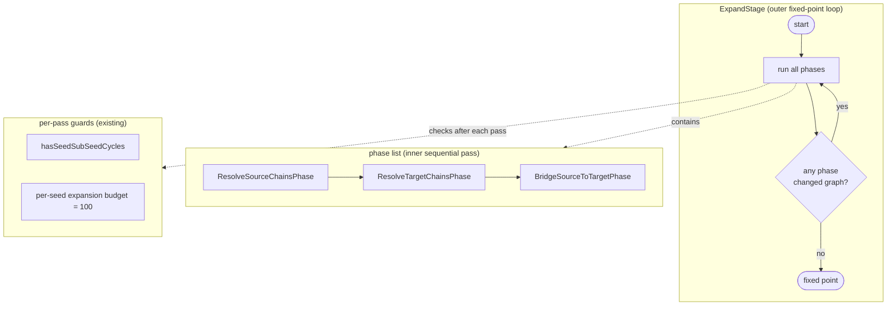
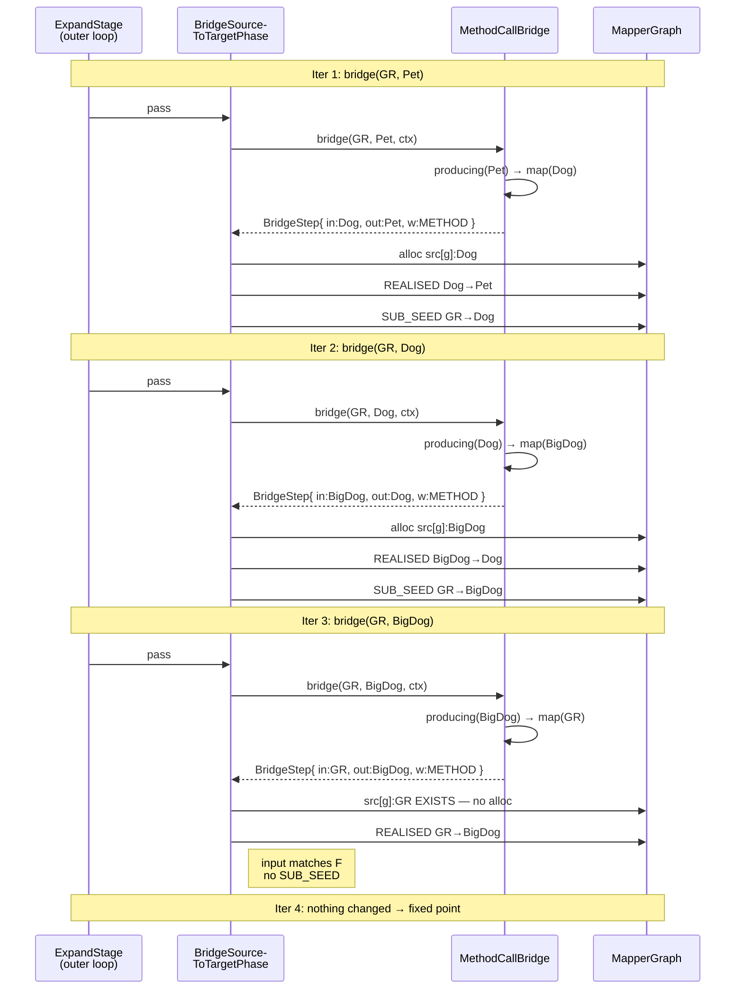

## Context

The processor's expansion engine, shipped by `add-graph-expansion`,
realises directives via three phase classes operating on a per-mapper
`MapperGraph`. Each phase runs once and produces a fixed set of REALISED
edges from a fixed set of SEED edges. There is no mechanism by which
mapping methods on a `@Mapper` interface can serve as conversions
between user types: when one method's expansion needs to convert
`Address → HumanAddress`, it cannot reach for a sibling
`HumanAddress mapAddress(Address)` even though that method is right
there in the same interface.

This change adds method-call bridges. The user-visible feature is small:
a built-in strategy that emits a `Bridge` candidate per matching method
on the enclosing `@Mapper`. The architecture cost is larger: to support
chains (`GoldenRetriever → BigDog → Dog → Pet`), the expansion engine
must run iteratively, materialise intermediate nodes for each chain hop,
and re-enter phase work as new SEEDs emerge. These primitives are not
method-call-specific. They are the same primitives container,
conversion, and cross-mapper strategies will need.

Tech constraints unchanged from prior phases: Java 11 release target,
Lombok, Dagger 2.59.1, NullAway in jspecify mode with `@NullMarked`
packages, errorprone, JGraphT 1.5.2, Spock 2.4 + Groovy 5.0 + Google
Compile Testing. Google `auto-service` is already on the classpath from
the prior expansion change. No new dependencies.

Stakeholders: processor maintainers (this change); future authors of
container, conversion, and cross-mapper strategies (whose infrastructure
prerequisites are unblocked here); strategy authors generally (who see
a wider Bridge SPI surface).

## Goals / Non-Goals

**Goals:**

- Ship a `MethodCallBridge` built-in strategy that turns sibling
  `@Mapper` methods into conversion candidates, including transitive
  chains across multiple methods.
- Establish iterative target-driven expansion (outer fixed-point loop,
  intermediate-node materialisation, SUB_SEED iteration) as a generic
  capability, not as method-call-specific machinery.
- Widen the `Bridge` SPI to express multi-emission and chain steps
  without introducing a second strategy type or context type.
- Make method-call discovery a discrete pipeline stage so future
  strategies can read the same index without re-walking the
  `@Mapper`'s members.
- Plan ahead for cross-mapper composition through a `Receiver`
  abstraction in the discovery output, at zero implementation cost
  today.

**Non-Goals:**

- Multi-parameter method calls. A method `R combine(A, B)` is
  GroupTarget-shaped, not Bridge-shaped. Single-param only in v1.
- Cross-mapper composition (`@Mapper(uses = …)`). The receiver
  abstraction makes the future change possible without SPI churn, but
  no linking mechanism, field injection, or cross-mapper discovery
  walks are part of this change.
- Static methods, generic / type-parameter methods.
- Container strategies (`Optional`, `List`, `Set`, `Map`).
- Codegen of any kind. The realised subgraph this change populates
  remains an input for a future codegen change.
- Tier-3 diagnostic enrichment for chain-failure cases. The existing
  bidirectional gap walk reports at the level of types involved in the
  realised subgraph; with chain intermediates a gap may sit at a type
  the user did not author. The diagnostic remains correct; only the
  message text could be friendlier in a follow-up.
- Detection of degenerate self-recursion (a method whose realised path
  is a single edge calling itself with the bare formal parameter). A
  malformed user directive that produces this shape will compile
  successfully and stack-overflow at runtime. A future Tier-3 path-
  shape check can detect it; not part of this change.

## Mental Model

The graph this expansion populates is a directed multigraph of values
and transformations. Each node represents a value at some point in the
computation; each edge represents a typed function from one value to
another.

```
   Node     ≡  a value in the computation         (an object instance)
   Edge     ≡  a typed function call              (transformation)
   Path     ≡  a composition of transformations   (a chain of calls)
```

The single load-bearing rule of the model is **node identity**:

```
   Node.id() = (scope, location, type)
```

Two transformations producing the same `(scope, location, type)` triple
land on the **same** node — not on duplicate nodes. They become parallel
edges. This rule has three consequences that drive the rest of the
design:

1. **Strategies converge automatically.** When two strategies emit edges
   that produce equivalent values, they collide on identity and the
   graph deduplicates. There is no inter-strategy coordination protocol
   to design. The graph topology is the protocol.
2. **Codegen has a search space, not a script.** Multiple parallel edges
   into a node represent alternative computations of the same value.
   The choice of which one to render is a future codegen-time concern
   (Dijkstra over weights), not an expansion-time choice.
3. **Identity is structural, not historical.** A node's id depends on
   *what the value means* (its location and type in the conversion),
   not on *which strategy produced it*. This makes new strategies
   composable without modifying existing ones.

Three earlier scope kinds anchor `scope`:

- `MapperScope` — values at the mapper-wide level
- `MethodScope(method)` — values inside a specific mapping method's
  expansion (most nodes live here)
- `(future)` — strategies that need to introduce new scope-like
  vocabulary will widen this

Two location kinds anchor `location`:

- `SourceLocation(path)` — values reached from a source parameter
- `TargetLocation(path)` — values feeding into the return type
- `ElementLocation` (parent + role-discriminator) — synthetic
  intermediate values introduced by a strategy that must allocate

For method-call chains, every intermediate value sits at the **same
location as the originating from-node**, varying only in `type`. This
keeps the chain visible (a column of typed values at one location) and
keeps the id rule structural.

## How Graph Expansion Works

The expansion engine runs in two nested loops.



The outer loop is the new piece. The phases themselves are unchanged in
purpose. What is new is that each phase now reports "did I change the
graph this pass?" and the outer loop re-runs the list until no phase
reports a change. The cycle detector and budget guard already exist
from the prior change; they fire on each pass and abort expansion if a
pathological condition is reached.

### The driver's edge-emission rule

Every realised edge produced by every Bridge implementor is materialised
by the same rule. The rule is the load-bearing simplification this
change introduces.

For a seed `F → T` (the from-side and to-side nodes of a SEED or
SUB_SEED edge), and a `BridgeStep(inputType, outputType, weight, codegen)`
emitted by some strategy:

```
inputNode  ← F  if step.inputType == F.type
              else find or allocate Node(scope = F.scope,
                                         loc   = F.loc,
                                         type  = step.inputType)

outputNode ← T  if step.outputType == T.type
              else find or allocate Node(scope = F.scope,
                                         loc   = F.loc,
                                         type  = step.outputType)

emit  REALISED edge  inputNode ──▶ outputNode
                     (weight, codegen, strategy fqn)

if inputNode != F:
    emit SUB_SEED edge  F ──▶ inputNode
    (drives next outer-loop iteration to find a path to inputNode)
```

Two consequences worth naming:

- **Bridges no longer "never allocate."** The earlier expansion change
  carried an implicit invariant that bridges connected pre-existing
  endpoints. With chain steps, intermediate values must materialise.
  The unified rule handles both cases through one mechanism: existing
  endpoints are *found*, new ones are *allocated*. The strategy is not
  aware of which case it is in.
- **The strategy stays myopic.** Strategies emit single-hop steps and
  declare what input type they need. The driver decides whether to
  materialise an intermediate node, whether to emit a SUB_SEED, and
  whether the resulting edge is part of a longer chain — all via local
  rules.

### Iterative target-driven expansion, walked end-to-end

Given the worked example from exploration:

```java
@Mapper interface DogMapper {
    BigDog map(GoldenRetriever g);
    Dog    map(BigDog b);
    Pet    map(Dog d);

    Pet getPet(GoldenRetriever g);   // ◀── generating this
}
```

The seed graph for `getPet` produces `src[g]:GoldenRetriever ──SEED──▶
tgt[]:Pet`. Expansion proceeds:



The chain emerges across three outer-loop iterations. Strategies stay
local (each call answers a single `(from, to)` query). Intermediates
appear at `src[g]:BigDog` and `src[g]:Dog`, naming the chain visibly in
the graph. Cycle detection on SEED + SUB_SEED would catch a malformed
mutual-recursion in the method index; the per-seed budget guards
combinatorial blow-up.

The same iteration mechanism carries cooperation between *different*
strategies — for example, when a future container strategy ships, an
expansion query like `bridge(GR, Pet)` against a mapper whose chain
threads through `Optional<BigDog>` will alternate emissions from
`MethodCallBridge` and the future container strategy on successive
outer-loop iterations, each strategy answering only its local question.
The outer loop is what closes the chain across strategy boundaries; no
strategy needs to know any other strategy exists.

## Decisions

### D1. Iterative target-driven expansion, not strategy-side search

**Decision:** Strategies emit one-hop edges in response to local
`(from, to)` queries. They do not perform their own graph search. The
driver iterates the phase list under an outer fixed-point loop, with
SUB_SEED edges driving each subsequent iteration's work.

**Why:** Pushing search into individual strategies forces every chain-
producing strategy to duplicate Dijkstra-shaped logic and prevents
chains from crossing strategy boundaries (a chain from
`Optional<X> → Y` involving both container unwrap and a sibling method
cannot be seen by either strategy in isolation). Putting iteration in
the driver makes the graph itself the coordination point, which the
node-identity rule already supports.

**Alternatives considered:**

- *Strategy bundles a whole chain into one edge with cumulative
  codegen.* Rejected. Bundled chains cannot mix strategies; the chain
  is opaque in DOT; logically equivalent to in-strategy BFS.
- *Strategy emits adjacent-only edges and graph traversal alone finds
  chains.* Insufficient — the target-driven case requires intermediate
  nodes that don't exist before the strategy emits. Without driver-side
  allocation the graph has no way to grow.

### D2. Driver materialises intermediates by a single unified rule

**Decision:** The driver emits a REALISED edge for every `BridgeStep`
the strategy returns. Endpoints are found if they already exist with
the right `(scope, loc, type)` id, allocated otherwise. When the input
endpoint had to be allocated (i.e., the strategy required an upstream
value of a type not yet in the graph from this seed's perspective), a
SUB_SEED edge from the original from-node to the new intermediate is
also emitted, driving the next iteration.

**Why:** A single rule covers direct bridges (length-1, no allocation),
chain bridges (length-N, allocations along the way), and any future
strategy that introduces synthetic intermediate values. The "Bridges
don't allocate" invariant is replaced by "every REALISED edge follows
the same identity rule; allocation happens automatically when the id
is new."

**Alternatives considered:** A separate code path for chain edges (e.g.,
a new edge kind, or a separate phase). Rejected as needless duplication —
the unified rule is simpler and admits future strategy types without
new vocabulary.

### D3. ExpandStage outer fixed-point loop

**Decision:** `ExpandStage.run` runs its phase list inside a `do … while
(changed)` loop. Each phase's `apply` widens to return a `boolean`
indicating whether it modified the graph this pass. Existing cycle and
budget guards run between iterations.

**Why:** The iterative model needs an iteration mechanism. The
alternative (intra-phase fixed points) doesn't compose: a SUB_SEED
emitted in phase 3 must re-enter phases 1–2 in case its intermediate
type produces source-side or target-side work. The outer loop is the
smallest change that captures this.

**Alternatives considered:**

- *Per-phase internal fixed-point only.* Rejected — doesn't handle
  cross-phase emergence of new SEED/SUB_SEED.
- *RepeatUntilFixedPointPhase wrapping a prefix of phases* (per the
  prior change's risk-mitigation note). Rejected — chains can need
  re-entry across the *entire* phase list, not a prefix.

### D4. `Bridge.bridge()` returns `Stream<BridgeStep>`

**Decision:** Breaking change. Existing implementors (`DirectAssign`)
update to `Stream.of(step)` / `Stream.empty()`.

**Why:** Two unrelated requirements both need multi-emission. Method
overloading rules (JLS §15.12.2.5) admit multiple methods with
different specificities for the same `(from, to)` query — each becomes
a parallel edge with a different weight. Chain steps may legitimately
emit multiple candidates whose chains close at different intermediate
types. A single SPI shape covers both.

**Alternatives considered:** Keep `Optional<BridgeStep>` and add a
sibling `bridges()` method returning `Stream<BridgeStep>`. Rejected —
two methods doing essentially the same thing is confusing; the existing
`Optional` form is no easier to implement than a degenerate Stream.

### D5. `BridgeStep` carries `inputType` and `outputType`

**Decision:** The result record is widened from `(weight, codegen)` to
`(inputType, outputType, weight, codegen)`. The driver consults these
fields to apply the materialisation rule.

**Why:** Without explicit input/output types the driver cannot
distinguish a direct bridge from a chain hop, and cannot allocate
intermediate nodes correctly.

**Alternatives considered:**

- *Infer types from the emitted codegen lambda.* Rejected — codegen
  lambdas operate on `CodeBlock` strings, not `TypeMirror`s; this would
  require parsing rendered code.
- *Pass the strategy's intent through a separate side-channel.*
  Rejected — fields on the result record are simpler and self-
  documenting.

### D6. Strategy is target-driven; `CallableMethods` exposes
`producing()` only

**Decision:** The discovery output exposes `Stream<MethodCandidate>
producing(TypeMirror to)`. No `accepting(TypeMirror from)` is shipped.

**Why:** The iterative model walks backward from each unfilled target
toward source. The strategy never needs to ask "what can I do with this
input?" — only "what can produce this output?" Shipping `accepting()`
would create a method without a caller.

**Alternatives considered:** Ship both `producing()` and `accepting()`
for symmetry. Rejected — YAGNI. Adding `accepting()` later if a forward-
walk strategy ever appears is a purely additive change.

### D7. Discovery scoped to the current `@Mapper`'s linearisation

**Decision:** `DiscoverCallableMethods` walks the same `@Mapper`
interface that `MapperShape` is built around, including methods
inherited from super-interfaces. Cross-mapper discovery
(`@Mapper(uses = …)`) is a future change.

**Why:** The graph already walks the same linearisation for
`MapperShape` and `MapperMappings`. Reusing the same scope for callable-
method discovery costs nothing extra. Cross-mapper composition needs an
opt-in mechanism that this change deliberately leaves out of scope.

**Alternatives considered:** Eagerly discover methods on every `@Mapper`
the compiler can see. Rejected — couples discovery to global state and
silently gives one mapper access to another mapper's methods.

### D8. Receiver abstraction in `MethodCandidate`

**Decision:** `MethodCandidate` carries a `Receiver` whose
`asExpression()` returns a `CodeBlock`. The strategy renders codegen
through the candidate's `Receiver`, never hardcoding `this`.

The v1 implementation ships exactly one `Receiver`: `ThisReceiver`.

**Why:** When cross-mapper composition lands, the only change required
is a new `Receiver` impl (e.g., `FieldReceiver(name)` rendering
`this.fieldName`) plus a discovery sub-stage that walks `uses = {…}`.
The strategy does not change. The codegen lambda does not change. SPI
churn is avoided.

**Alternatives considered:** Hardcode `this` in the strategy and rewrite
later. Rejected — a known future need is cheap to plan around now.

### D9. JLS-style specificity weights with a `Weights.METHOD` constant

**Decision:** Each emitted method-call step's weight is
`Weights.METHOD + supertypeDistance(method.paramType, fromType) +
subtypeDistance(toType, method.returnType)`. Methods exactly matching
both sides have weight `Weights.METHOD`. Looser matches cost more in
proportion to type-hierarchy distance.

**Why:** Java's overload resolution rules already specify "more specific
is better." Encoding this as weight rather than priority lets Dijkstra
naturally prefer exact matches at codegen time, with no special-case
tiebreak logic.

**Alternatives considered:**

- *Equal weights for all method-call edges, tiebreak via `priority()`
  and FQN.* Rejected — exact matches and supertype-fallback matches are
  not equivalent under Java's own dispatch model; the weight ought to
  reflect that.
- *Reuse `Weights.STEP`.* Acceptable but loses the semantic distinction
  between getter-based property access and method-based conversion.

### D10. Object-inherited methods filtered at discovery

**Decision:** `DiscoverCallableMethods` excludes any method whose
enclosing element is `java.lang.Object`. The filter applies to
`toString`, `hashCode`, `equals`, `getClass`, `clone`, `wait`, `notify`,
`notifyAll`, `finalize`.

**Why:** Without the filter, the strategy would silently match
`Object.toString()` for any `bridge(X, String)` query, generating
nonsense conversions. `GetterRead` already applies the same filter
(`isInObjectClass`); reusing the convention keeps the discovery
behavior consistent.

**Alternatives considered:** Filter at the strategy level rather than
discovery. Rejected — the filter is a general property of "what counts
as a callable method," not strategy-specific.

### D11. Self-call edges emitted freely (no `currentMethod` filter)

**Decision:** `MethodCallBridge` does not exclude the currently-
expanding method from emission. If a method's directives produce a sub-
seed whose `(from, to)` pair matches the method's own signature, a
self-call edge is emitted.

**Why:** Recursion in generated code is not inherently a bug. A method
mapping `Dog` to `Pet` with a directive `@Map(target = "buddy", source =
"d.companion")` legitimately recurses on a structurally smaller value,
producing correct code. Filtering the candidate would block this
legitimate case. The only pathological shape is "method body trivially
calls itself with the bare formal parameter" — that requires a
degenerate user directive (whole-input → whole-output) and is treated
as a runtime concern at the user's authorship layer.

**Alternatives considered:**

- *Filter `candidate.method() == ctx.currentMethod()`.* Rejected — too
  broad; blocks legitimate recursion.
- *Tier-3 path-shape check at validation time* (option β in
  exploration). Deferred — the pathology is rare and produces a clear
  runtime stack overflow.
- *Driver-level rule* refusing to emit a self-call edge when the input
  matches the from-root. Rejected — the driver shouldn't reason about
  whether recursion is "progressive."

### D12. `ResolveCtx` widening, not a new `BridgeCtx` type

**Decision:** `ResolveCtx` gains three accessors: `mapperType()`,
`currentMethod()`, `callableMethods()`. No second context type is
introduced.

**Why:** Strategies that don't need the new accessors simply ignore
them. A second context type would force two parallel SPI surfaces and
push the strategy author to choose between them — needless complexity
for a one-time widening.

**Alternatives considered:** Introduce `BridgeCtx extends ResolveCtx`
and route only Bridge strategies through it. Rejected — YAGNI; widen
later if container or future strategies need yet more context.

### D13. Multi-parameter method calls deferred

**Decision:** `MethodCallBridge` emits only for methods with exactly
one parameter. Methods with two or more parameters are not eligible
in this change.

**Why:** A multi-parameter method `R combine(A, B)` is structurally a
`GroupTarget` (multiple converging slots → one output), not a `Bridge`
(single input → single output). Adding a sibling `MethodCallGroupTarget`
strategy is a small follow-up that reuses the same discovery output
and the same iteration infrastructure. Keeping it out of scope here
narrows the change surface.

**Alternatives considered:** Ship `MethodCallGroupTarget` together with
`MethodCallBridge`. Rejected for scope; the infrastructure is shared,
the strategy is separate; either piece can land first without blocking
the other.

### D14. Symmetric strategy back-edges accepted (option A)

**Decision:** When a future strategy emits a step in one direction
(e.g., container wrap `T → Optional<T>`) and a sibling strategy emits
the symmetric direction (`Optional<T> → T`), both edges land in the
graph as parallel REALISED options. The graph carries both directions;
codegen prunes via Dijkstra at path-selection time.

**Why:** Pruning back-edges at strategy-emission time would force
strategies to inspect graph state, breaking the "myopic single-hop"
contract. The cost of denser DOT output is acceptable; the back-edges
are real, alternative valid conversions.

**Alternatives considered:** Strategies check the graph and skip
emitting back-edges. Rejected — violates myopic contract.

## Risks / Trade-offs

- **[Risk] SPI breaking change ripples to existing implementors.**
  `DirectAssign` is the only current implementor; updating it is one
  line. Future external implementors (none today) would have to
  migrate.
  → *Mitigation:* the change is scoped to one signature
  (`Optional<BridgeStep>` → `Stream<BridgeStep>`) and one record-shape
  widening; both are mechanical migrations.

- **[Risk] Combinatorial fan-out from over-eager method emission.**
  The strategy emits a candidate per method whose return type is
  assignable to `to`, regardless of whether that candidate's input is
  reachable from `from`. Dead-end branches accumulate as SUB_SEEDs.
  → *Mitigation:* the per-seed expansion budget (100, hardcoded from
  the prior change) bounds the worst case. Dead-end branches do not
  affect realised-subgraph correctness; they only consume budget.

- **[Risk] Driver thickness.** The new edge-emission rule concentrates
  marker-emission, intermediate-allocation, SUB_SEED-emission, and
  identity-checking into one driver path. A bug in this rule affects
  every Bridge strategy, current and future.
  → *Mitigation:* the rule is small and exercised by every test case;
  the per-strategy and per-phase Spock specs cover the rule's behavior
  via concrete fixture graphs.

- **[Risk] Outer fixed-point termination.** The loop terminates when no
  phase changes the graph. Cycles in the method index would otherwise
  loop forever.
  → *Mitigation:* `hasSeedSubSeedCycles` already runs after each phase
  pass and aborts with an error if any cycle is detected in
  SEED+SUB_SEED. The per-seed budget catches non-cyclic blow-up. Both
  guards predate this change.

- **[Risk] Tier-3 diagnostic clarity with chain intermediates.** A
  failing chain produces "no path" gaps at synthetic intermediate
  types the user did not author (e.g., "no path from `BigDog` to
  `Optional<BigDog>`"). The diagnostic remains correct but may confuse
  users.
  → *Mitigation:* deferred. The current Tier-3 walk is structurally
  sound; only the message could be enriched to render the chain trace.
  Out of scope for this change.

- **[Risk] Self-call recursion at runtime.** A user authoring
  `@Map(target = "", source = "d")` for a method whose realised path
  becomes a single self-call edge will compile successfully and stack-
  overflow at runtime.
  → *Mitigation:* accepted (option α). Documented as a known gotcha;
  optional Tier-3 path-shape check is a future opt-in.

- **[Trade-off] Realised graph density grows with chain expansion.**
  Each chain hop adds one node and one or more edges. DOT output for
  expanded mappers becomes larger. Codegen-time Dijkstra cost grows
  linearly with edge count.
  → *Accepted.* The growth is bounded by the budget guard. Codegen is
  not part of this change; if Dijkstra cost becomes a concern in the
  future codegen change, the realised-subgraph filter already trims
  unrealised branches.

- **[Trade-off] Method-call strategies allocate; the previous "Bridges
  don't allocate" invariant is replaced.** Existing mental models held
  by future strategy authors must update.
  → *Accepted.* The new invariant is more general and simpler:
  "REALISED edges follow one identity rule; allocation falls out
  automatically." Documented in the SPI spec.

## Migration Plan

1. Update `processor.spi.Bridge` signature to `Stream<BridgeStep>`.
   Update `DirectAssign` builtin to the new shape.
2. Widen `processor.spi.BridgeStep` to carry `inputType` and
   `outputType`; update construction sites and tests.
3. Widen `processor.spi.ResolveCtx` with three accessors. Provide the
   in-tree `ResolveCtxImpl` (or equivalent) with values from
   `MapperContext`.
4. Add `processor.spi.CallableMethods`, `processor.spi.MethodCandidate`,
   `processor.spi.Receiver`, `processor.spi.ThisReceiver`. Each
   `package-info.java` declares `@NullMarked`.
5. Add `processor.spi.Weights.METHOD`.
6. Add `processor.stages.discover.DiscoverCallableMethods` stage. Wire
   it into the Pipeline declared-stage list, after `DiscoverAbstractMethods`
   and before `SeedGraph`. Populate `MapperContext` with the produced
   `CallableMethods` instance.
7. Update `processor.stages.expand.ExpandStage.run` to wrap the phase
   list in an outer `do … while (changed)` loop. Widen the
   `ExpansionPhase` interface so `apply` returns `boolean`.
8. Update `processor.stages.expand.BridgeSourceToTargetPhase` to apply
   the unified edge-emission rule (find or allocate intermediates;
   emit SUB_SEED when input differs from from).
9. Add `processor.spi.builtins.MethodCallBridge` annotated
   `@AutoService(Bridge.class)`. Emit one BridgeStep per matching
   candidate, weighted by JLS-specificity distance.
10. Update specs:
    - `expansion-strategy-spi`: SPI shape changes; BridgeStep widening;
      ResolveCtx widening; MethodCallBridge contract; Weights.METHOD.
    - `graph-expansion`: outer fixed-point loop; intermediate-node
      materialisation rule; SUB_SEED emission rule.
    - new `callable-method-discovery` spec for the discovery stage.
    - `mapper-discovery`: cross-reference for the discovery additions
      if needed.
11. Add Spock specs:
    - per-builtin spec for `MethodCallBridge` (direct match, supertype-
      param match, subtype-return match, chain hop, Object-inherited
      filter, multi-parameter filter).
    - per-stage spec for `DiscoverCallableMethods`.
    - phase-level spec exercising chain expansion across iterations.
    - integration spec via Compile Testing for an end-to-end mapper
      with sibling-method conversions.

No rollback concern beyond reverting the change set. Generated output
is unaffected — codegen is still future. Existing seed-graph and
expansion tests remain green.

## Open Questions

- **Should `MethodCallBridge` consult `ctx.currentMethod()` for any
  purpose at all?** It does not need it for self-call filtering (D11).
  No other use case has emerged. Currently the accessor exists for
  diagnostics. Lean: ship the accessor as part of the SPI widening and
  let it remain unused by `MethodCallBridge`; future strategies (or
  Tier-3 enrichment) may pick it up.
- **Where does the `CallableMethods` test fixture live?** The Spock
  module ships a `FakeResolveCtx` (or equivalent) for prior strategy
  tests. A `FakeCallableMethods` is the parallel addition. Lean: keep
  in-tree under `processor/src/test/groovy/...spi/`; productise to a
  separate `processor-test-support` artifact when a downstream consumer
  asks.
- **Should the proposed `Weights.METHOD` equal `Weights.STEP`, or be
  positioned as a slightly-heavier band?** Both are defensible. Equal
  weights make method-call vs. getter-call indistinguishable at
  codegen-time tiebreak; a heavier METHOD makes getters preferred when
  both produce the same value. Lean: `METHOD = STEP` for v1 — there is
  no realistic ambiguity in the v1 strategy set (getters and method
  calls almost never compete).
