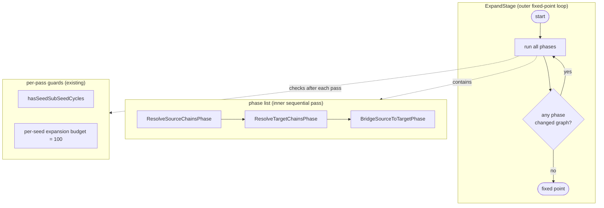
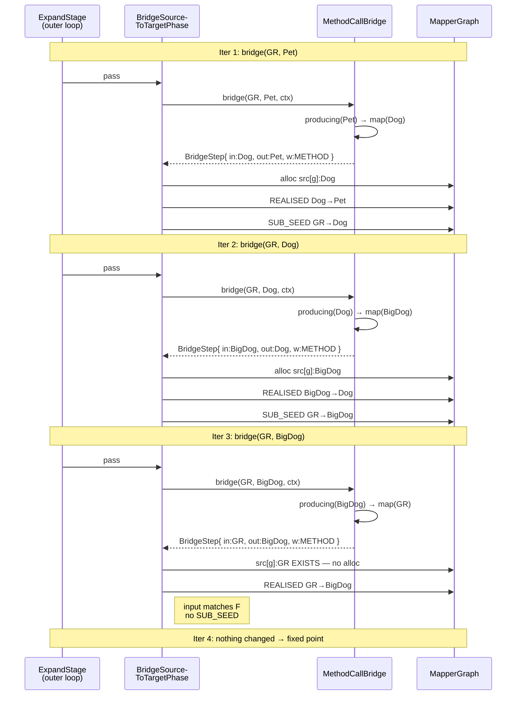

## Mental Model

The graph this expansion populates is a directed multigraph of values
and transformations. Each node represents a value at some point in the
computation; each edge represents a typed function from one value to
another.

```
   Node     ≡  a value in the computation         (an object instance)
   Edge     ≡  a typed function call              (transformation)
   Path     ≡  a composition of transformations   (a chain of calls)
```

The single load-bearing rule of the model is **node identity**:

```
   Node.id() = (scope, location, type)
```

Two transformations producing the same `(scope, location, type)` triple
land on the **same** node — not on duplicate nodes. They become parallel
edges. This rule has three consequences that drive the rest of the
design:

1. **Strategies converge automatically.** When two strategies emit edges
   that produce equivalent values, they collide on identity and the
   graph deduplicates. There is no inter-strategy coordination protocol
   to design. The graph topology is the protocol.
2. **Codegen has a search space, not a script.** Multiple parallel edges
   into a node represent alternative computations of the same value.
   The choice of which one to render is a future codegen-time concern
   (Dijkstra over weights), not an expansion-time choice.
3. **Identity is structural, not historical.** A node's id depends on
   *what the value means* (its location and type in the conversion),
   not on *which strategy produced it*. This makes new strategies
   composable without modifying existing ones.

Three earlier scope kinds anchor `scope`:

- `MapperScope` — values at the mapper-wide level
- `MethodScope(method)` — values inside a specific mapping method's
  expansion (most nodes live here)
- `(future)` — strategies that need to introduce new scope-like
  vocabulary will widen this

Two location kinds anchor `location`:

- `SourceLocation(path)` — values reached from a source parameter
- `TargetLocation(path)` — values feeding into the return type
- `ElementLocation` (parent + role-discriminator) — synthetic
  intermediate values introduced by a strategy that must allocate

For method-call chains, every intermediate value sits at the **same
location as the originating from-node**, varying only in `type`. This
keeps the chain visible (a column of typed values at one location) and
keeps the id rule structural.

## How Graph Expansion Works

The expansion engine runs in two nested loops.



The outer loop is the new piece. The phases themselves are unchanged in
purpose. What is new is that each phase now reports "did I change the
graph this pass?" and the outer loop re-runs the list until no phase
reports a change. The cycle detector and budget guard already exist
from the prior change; they fire on each pass and abort expansion if a
pathological condition is reached.

### The driver's edge-emission rule

Every realised edge produced by every Bridge implementor is materialised
by the same rule. The rule is the load-bearing simplification this
change introduces.

For a seed `F → T` (the from-side and to-side nodes of a SEED or
SUB_SEED edge), and a `BridgeStep(inputType, outputType, weight, codegen)`
emitted by some strategy:

```
inputNode  ← F  if step.inputType == F.type
              else find or allocate Node(scope = F.scope,
                                         loc   = F.loc,
                                         type  = step.inputType)

outputNode ← T  if step.outputType == T.type
              else find or allocate Node(scope = F.scope,
                                         loc   = F.loc,
                                         type  = step.outputType)

emit  REALISED edge  inputNode ──▶ outputNode
                     (weight, codegen, strategy fqn)

if inputNode != F:
    emit SUB_SEED edge  F ──▶ inputNode
    (drives next outer-loop iteration to find a path to inputNode)
```

Two consequences worth naming:

- **Bridges no longer "never allocate."** The earlier expansion change
  carried an implicit invariant that bridges connected pre-existing
  endpoints. With chain steps, intermediate values must materialise.
  The unified rule handles both cases through one mechanism: existing
  endpoints are *found*, new ones are *allocated*. The strategy is not
  aware of which case it is in.
- **The strategy stays myopic.** Strategies emit single-hop steps and
  declare what input type they need. The driver decides whether to
  materialise an intermediate node, whether to emit a SUB_SEED, and
  whether the resulting edge is part of a longer chain — all via local
  rules.

### Iterative target-driven expansion, walked end-to-end

Given the worked example from exploration:

```java
@Mapper interface DogMapper {
    BigDog map(GoldenRetriever g);
    Dog    map(BigDog b);
    Pet    map(Dog d);

    Pet getPet(GoldenRetriever g);   // ◀── generating this
}
```

The seed graph for `getPet` produces `src[g]:GoldenRetriever ──SEED──▶
tgt[]:Pet`. Expansion proceeds:



The chain emerges across three outer-loop iterations. Strategies stay
local (each call answers a single `(from, to)` query). Intermediates
appear at `src[g]:BigDog` and `src[g]:Dog`, naming the chain visibly in
the graph. Cycle detection on SEED + SUB_SEED would catch a malformed
mutual-recursion in the method index; the per-seed budget guards
combinatorial blow-up.

The same iteration mechanism carries cooperation between *different*
strategies — for example, when a future container strategy ships, an
expansion query like `bridge(GR, Pet)` against a mapper whose chain
threads through `Optional<BigDog>` will alternate emissions from
`MethodCallBridge` and the future container strategy on successive
outer-loop iterations, each strategy answering only its local question.
The outer loop is what closes the chain across strategy boundaries; no
strategy needs to know any other strategy exists.
