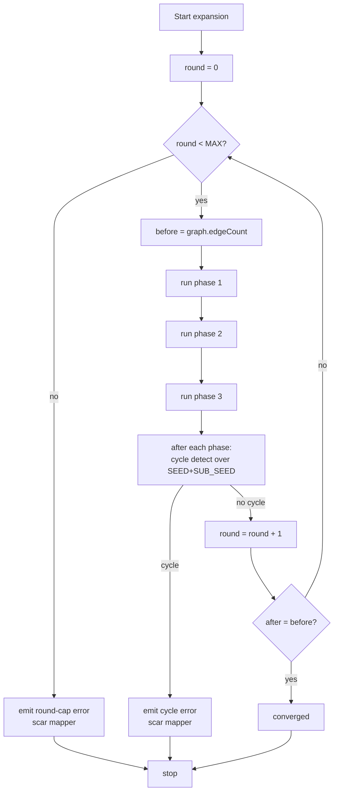
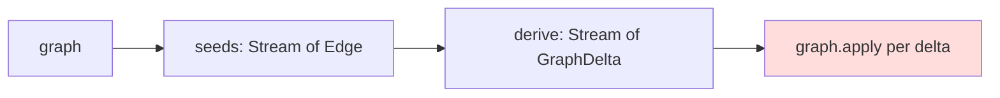

## Context

`ExpandStage` runs three `ExpansionPhase`s in a fixed-point loop. Today, each phase signature is `boolean apply(MapperGraph)` — phases mutate the graph (calling `addNode` / `addEdge` mid-iteration) and return a boolean reporting whether they changed anything. The driver aggregates these booleans for two purposes:

1. **Termination** — the outer loop runs until a complete pass returns `false` from every phase.
2. **Budget** — `totalAdditions` is incremented when a phase reports `true`, capped at `EXPANSION_BUDGET = 100`.

A recent change introduced a phase that mutated the graph but reported `false`. The outer loop never observed termination, the budget never ticked (because the tick was conditioned on the same lying signal), and javac hung. Both safeguards collapsed because both depend on phase cooperation through one boolean — there is no defense-in-depth.

The algorithmic core is also imperative inside each phase: helpers interleave reads of the graph (`graph.edges().filter(...)`) with writes (`graph.addEdge(newEdge)`), threading `boolean anyAdded` accumulators through method signatures. Helpers that both query and mutate cannot be tested without constructing a `MapperGraph` fixture, and any new helper that forgets to OR its local change-flag back up reintroduces the same fault class.

## Goals / Non-Goals

**Goals:**
- Remove cooperation from termination and budget tracking. Both must be observable from outside any `ExpansionPhase` implementation.
- Move every phase to a "derive then apply" discipline: pure helpers compute candidate nodes and edges as values, the phase commits them in a single call.
- Concentrate the only mutation surface available to phases on `MapperGraph.apply(GraphDelta)`.
- Collapse internal per-phase fixpoint loops: the outer `ExpandStage` round is the only fixpoint.
- Preserve cycle detection's existing directive-specific diagnostic; replace the addition-budget diagnostic with a generic mapper-level one.
- Stay on Java 11. No new dependencies.

**Non-Goals:**
- Making `MapperGraph` immutable (still wraps mutable JGraphT).
- Making `MapperContext` immutable (stages still set fields on it).
- Replacing JGraphT or introducing persistent collection libraries (e.g., vavr).
- Changing the `processor.spi.*` strategy interfaces — those are already value-returning.
- Refactoring stages outside the expansion pipeline (`DiscoverMappings`, `SeedGraph`, validate stages, dump stages).
- Bumping the Java release target.

## Decisions

### D1: Phase signature becomes `void apply(MapperGraph)`

Phases no longer return a change signal. Termination is observed externally by the driver via `MapperGraph.edgeCount()` taken before and after each pass.

**Why over alternatives:**
- *Keep `boolean` but add a separate guard*: still lets the boolean drive the budget; the trust boundary remains exactly where it failed.
- *Return `GraphDelta` from `apply`*: tempting, because it would let the driver inspect the delta. Rejected because it forces every phase to materialise a delta even when the natural code path is a stream of deltas folded in via `apply`. The cost (wider, less local API) outweighs the marginal gain.

The chosen signature is the smallest API change that severs the trust dependency.

### D2: Single mutation entry point — `MapperGraph.apply(GraphDelta)`

`MapperGraph` gains `apply(GraphDelta)`. Phases call `apply` once (or once per stream-folded delta) per invocation. Phases SHALL NOT call `addNode` or `addEdge` directly. The check is mechanical: a grep across `processor.stages.expand` for those method names should return zero hits after the refactor.

`addNode` / `addEdge` remain on `MapperGraph` because `SeedGraph` (out of scope for this change) still uses them, and `apply` is implemented on top of them internally.

**Why over alternatives:**
- *Remove `addNode`/`addEdge` entirely*: clean, but drags `SeedGraph` into the change unnecessarily.
- *Make phases call `addNode`/`addEdge` but require deltas computed first*: lets phases drift back to mid-loop mutation. Less robust against the next bug.

### D3: `GraphDelta` as a Lombok `@Value` carrying `List<Node>` and `List<Edge>`

The simplest data shape. No tagged union, no separate "add node" / "add edge" command types — phases always know which they're producing.

`GraphDelta.empty()` exists for stream operations that may fold to nothing.

**Why over alternatives:**
- *Sealed `Add(Node) | Add(Edge)` ADT*: more flexible (could grow new ops later) but Java 11 has no sealed types and the visitor encoding is heavier than the problem warrants.
- *`Consumer<MapperGraph>` lambda*: re-introduces hidden mutation behind a value-shaped facade. Defeats the purpose.

### D4: Convergence via `edgeCount()` delta, not `nodeCount()` delta or both

A round counts as "did something" if and only if `edgeCount()` grew. Node-only growth without edge growth doesn't represent productive expansion in this engine — every realised node is allocated as part of a REALISED/MARKER edge emission. A node-only delta in practice means a strategy emitted dead nodes, which we should treat as no-progress (and which would cause a hang under a node-OR-edge convergence rule).

If a future strategy needs node-only deltas, the spec can be re-evaluated. For now, edge count is sufficient and unambiguous.

### D5: Round budget, not addition budget; mapper-level, not per-seed

The new budget caps the **number of outer-loop iterations**, not the number of additions across the run. The counter increments unconditionally inside `ExpandStage.run`, before checking convergence.

Mapper-level rather than per-seed because the per-seed bookkeeping in the old design existed to attribute the budget diagnostic back to a specific directive. With the cheap-diagnostic decision (D6), there is no longer a need to attribute, so per-seed bookkeeping has no consumer.

Initial constant: `MAX_EXPANSION_ROUNDS = 64`. With single-pass phases and bounded chain depths in practical mappers, real expansions converge in well under 10 rounds; 64 is generous enough that the cap firing strongly indicates a defect (cycle or pathological strategy) rather than legitimate complexity.

### D6: Cheap round-cap diagnostic

When the round cap fires, `ExpandStage` emits one `Diagnostics.error(mapperType, message)` — no directive `AnnotationMirror`, no per-seed attribution. Cycle detection retains its existing directive-specific diagnostic and remains the informative path for the diagnosable case.

**Why over alternatives:**
- *Keep the per-seed blame heuristic*: requires reconstructing seed lineage, which is brittle (the heuristic in the current code picks the first seed regardless of cause). The information conveyed is misleading more often than helpful.
- *Print the round count in the message*: yes, included. Cheap and useful for debugging.

### D7: Internal phase fixpoints collapse

`ResolveSourceChainsPhase.processUntypedEdges` currently runs a `while (changed)` loop because resolving one node's type unblocks another. With the phase as a single pass and the outer loop as the only fixpoint, the next outer round picks up the newly-typed nodes naturally.

**Cost:** more outer rounds for a chain of length `k` (each round resolves one prefix). On a v1 mapper with a few short chains, expected round count rises from ~2 to ~5 — well within the round budget. The win is one fewer place that can hang.

**Why this is safe:** every productive resolution still happens, just split across rounds. The only observable difference for callers is convergence time per mapper, which is bounded by `MAX_EXPANSION_ROUNDS` and dominated by javac itself.

### D8: Helpers return values, never mutate

The discipline applies recursively: any helper called by a phase, directly or transitively, that produces edge or node candidates SHALL return them (typically via `Stream<GraphDelta>` or `GraphDelta`). The phase top-level looks like:

```
seeds(g)
  .flatMap(seed -> derive(seed, g))   // pure
  .forEach(g::apply)                  // single mutation
```

A reviewer can verify the discipline by reading the phase top to bottom — if any helper signature returns `boolean` or `void` while taking `MapperGraph`, that's a smell to investigate.

## Diagrams

### Outer fixed-point loop with round budget



The round counter ticks on path `I` regardless of `J`, so the budget cannot be evaded by any phase or strategy behaviour.

### Phase shape



The single red node is the only place the graph mutates. Everything upstream is a pure value computation.

## Risks / Trade-offs

- **[Round budget too small]** A pathological-but-legitimate mapper exceeds 64 rounds and emits a spurious "did not converge" error. → Mitigation: 64 is generous given single-pass phases and real-world chain depths. Constant is a single-line change if needed; revisit after running the existing test corpus.
- **[Generic round-cap diagnostic loses information]** Users who hit the cap don't know which directive caused it. → Mitigation: deliberate, per D6. Cycle detection still produces directive-specific diagnostics; the round cap is the catch-all where attribution is unreliable. Round count is included in the message for debugging.
- **[More outer rounds = slower expansion]** Collapsing internal fixpoints into outer rounds increases iteration count for chains. → Mitigation: each round runs only the work needed for that round; no redundant per-iteration cost. Annotation-processor time is dominated by javac, not graph traversal.
- **[Stream-based phases harder to step through in the debugger]** Refactoring `for`-loops to `flatMap` chains can hide intermediate state. → Mitigation: helper functions get names (`seeds`, `derive`, `deltaFor`); breakpoints set on the named helpers reveal the same state as before.
- **[Duplicate-delta idempotence]** `MapperGraph.apply` may be handed deltas that overlap with existing graph state across rounds. → Mitigation: `addNode` is already idempotent on equal nodes; `addEdge` rejects duplicates by structural equality. `apply` delegates to those, so duplicate deltas are silently discarded — exactly the behaviour the spec requires for the outer loop to converge.
- **[Phase author bypasses the discipline]** Nothing at the type-system level prevents a future phase author from calling `graph.addNode` directly. → Mitigation: spec mandates the discipline (`ExpansionPhase contract` scenario "Phase mutates the graph only via apply(GraphDelta)"). Enforcement is by review and by the phase-test pattern (see Migration Plan).

## Migration Plan

1. **Add `GraphDelta`** to `processor.graph` (no callers yet) and `MapperGraph.apply(GraphDelta)`. Test in isolation. No existing behaviour changes.
2. **Refactor `BridgeSourceToTargetPhase`** to derive→apply (smallest of the three). Existing tests must still pass. Pilot the helper-naming convention.
3. **Refactor `ResolveTargetChainsPhase`** the same way.
4. **Refactor `ResolveSourceChainsPhase`** including removal of the internal `while (changed)` loop. Verify with the chain-depth scenarios.
5. **Update `ExpansionPhase` interface** to `void apply(MapperGraph)`.
6. **Update `ExpandStage.run`**: round counter, `edgeCount()`-delta convergence, generic round-cap diagnostic. Remove `totalAdditions`, `findSeedEdge` heuristic, and the addition-counted budget. Keep cycle detection as-is.
7. **Update tests**: drop `boolean` assertions on phase returns; add a synthetic round-cap test fixture; add a unit test for the generic mapper-level diagnostic.

Each step is independently shippable and testable. After step 1, `addNode`/`addEdge` are still the primary mutation surface; after step 5, `apply` is the only mutation surface used by phases.

Rollback strategy: each step is a single commit on a feature branch. Reverting individual commits restores the previous behaviour without touching adjacent ones.

## Open Questions

None at this time. The exploration thread settled the major design questions (drop vavr, keep mutable graph, drop state monad, derive→apply, round budget, cheap diagnostic).
