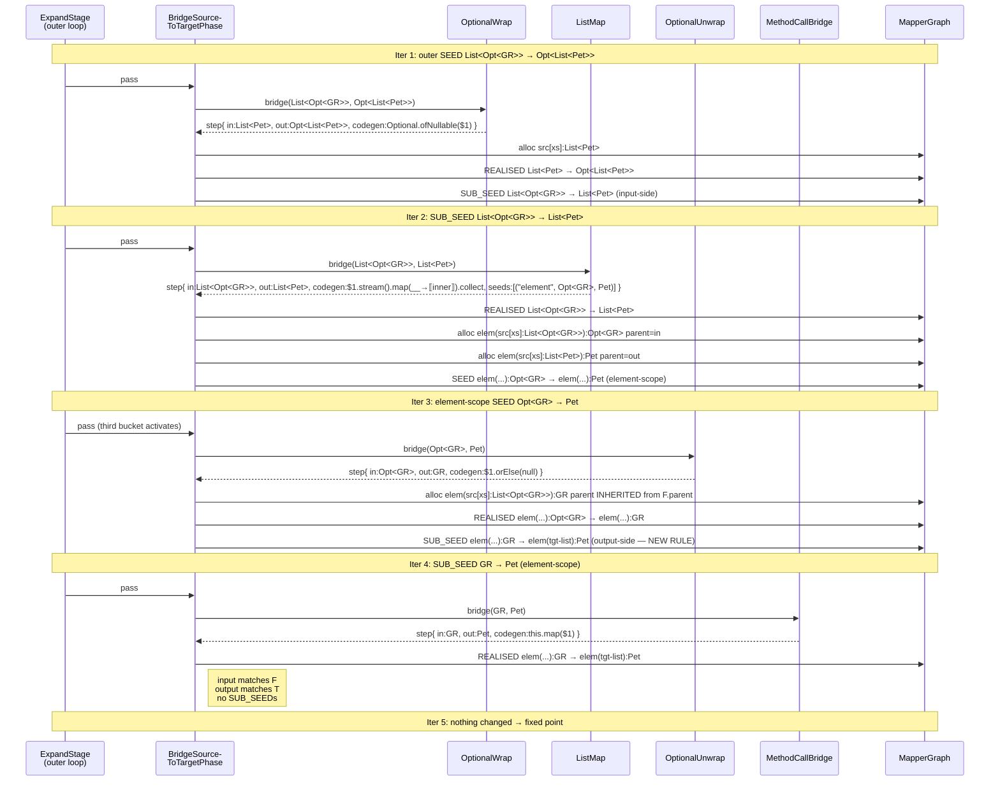

## Context

The processor's expansion engine, shipped by `add-graph-expansion` and
widened by `add-method-call-bridge`, runs an outer fixed-point loop
over three phases, materialises intermediate nodes on demand, and lets
strategies emit one-hop `BridgeStep`s in response to local `(from, to)`
queries. Today every emitted edge stays at the same `(scope, location)`
as the seed it derives from — values only vary in type along the chain.

Containers break that flatness. A `List<Dog>` does not hold a `Dog` at
the same location; it holds many `Dog`s at synthetic positions
*beneath* itself. An `Optional<Pet>` holds zero-or-one `Pet` at a
single sub-position. A `Map<K,V>` holds pairs at *two* sub-positions
per entry. The expansion model anticipated this — `ElementLocation`
and `Node.parent` were introduced earlier so phantom element nodes
could attach beneath their container — but nothing has used them yet.

This change is `ElementLocation`'s first consumer. It ships seven
container `Bridge` built-ins (Optional/List/Set wrap, unwrap where
meaningful, and map), widens the driver with three small rules
(output-side SUB_SEED, parent inheritance for element-location
allocation, element-seed emission), and fixes one latent bug in
`Node.id()` for element nodes (today's id drops type, causing element-
scope chain intermediates to collide).

Tech constraints unchanged from prior phases: Java 11 release target,
Lombok, Dagger 2.59.1, NullAway in jspecify mode with `@NullMarked`
packages, errorprone, JGraphT 1.5.2, Spock 2.4 + Groovy 5.0 + Google
Compile Testing. Google `auto-service` is already on the classpath.
No new dependencies.

The processor module is pre-publication. There are no external
implementors of `Bridge`, `BridgeStep`, or any other expansion SPI
type. Breaking changes are accepted; the in-tree implementors
(`DirectAssign`, `MethodCallBridge`) are updated in this same change.

Stakeholders: processor maintainers (this change); future authors of
`Map<K,V>`, key/value-shaped, and otherwise multi-role container
strategies (whose infrastructure prerequisites are unblocked here);
strategy authors generally (who see a richer `BridgeStep` and the new
`Containers` helper); the future codegen capability (which inherits
the element-scope graph shape and must widen `EdgeCodegen` to render
through element scopes).

## Goals / Non-Goals

**Goals:**

- Ship seven built-in container strategies (`OptionalWrap`,
  `OptionalUnwrap`, `OptionalMap`, `ListWrap`, `ListMap`, `SetWrap`,
  `SetMap`) under the existing `Bridge` SPI, registered via
  `@AutoService(Bridge.class)`.
- Generalise the graph vocabulary so a container edge carries with
  it a synthetic element-scope sub-conversion that resolves through
  the same fixed-point machinery. Element-scope nodes are parent-
  linked to their container endpoints and identified by
  `(parent.id() + "::elem(role)::type)"`.
- Widen the driver in three minimal rules: output-side SUB_SEED,
  parent inheritance on element-location allocation, and element-seed
  emission. Existing strategies (`DirectAssign`, `MethodCallBridge`,
  `GetterRead`, `ConstructorCall`) keep working unchanged.
- Support cross-container conversions (`List<A> → Set<B>`,
  `Set<A> → List<B>`, `Optional<A> → List<B>`, etc.) via input-shape
  acceptance in the `*Map` strategies — no N×N matrix of strategies.
- Leave the model Map-ready: `ElementLocation` gains a `role`
  discriminator with default `"element"`; `BridgeStep` carries a
  `List<ElementSeed>` not a single element; `Map<K,V>` ships in a
  later change as additive `MapMap` + role expansion.

**Non-Goals:**

- `Map<K,V>` and other multi-role / key-value containers. Future
  change. The role discriminator and the List-of-ElementSeed shape
  reserve the option; nothing else is needed today. See `notes.md`.
- Codegen rendering of element-scope inlining. Container `Map`
  strategies emit a codegen lambda that throws
  `UnsupportedOperationException`. The graph shape is correct and
  testable now; rendering is a codegen-capability concern.
- `EdgeCodegen` SPI widening. The future codegen change will extend
  the render contract to pass inner-path resolution; this change
  does not pre-shape that seam.
- Null / empty policy beyond v1 defaults. `OptionalUnwrap` emits
  `.orElse(null)`; `OptionalWrap` emits `Optional.ofNullable(...)`.
  Future changes drive policy from `@Nullable`/`@Default` enrichment.
- Raw-container or wildcard-element diagnostics. `ListMap` and
  friends silently decline to match a raw `List` or `List<?>`; a
  Tier-3 diagnostic enrichment is a follow-up.
- Stream / array as target types for own `Wrap`/`Map` strategies.
  Streams and arrays are *input-shape* acceptors in `ListMap` /
  `SetMap` only.
- Multiple parallel paths optimisation. The graph holds all candidate
  paths; Dijkstra-at-codegen-time picks. v1 does not prune.

## Mental Model

A container edge brings its own miniature subgraph. The outer edge
connects two container-typed nodes (e.g., `List<Dog>` →
`List<Pet>`); the inner subgraph lives at element scope (under
`ElementLocation`) and holds the per-element conversion path. Both
levels participate in the same fixed-point expansion.

```
   Outer level:
   ─────────────────
   src[xs]:List<Dog>  ── REALISED (ListMap) ──▶  tgt[]:List<Pet>
        │                                              ▲
        │                          ELEMENT_OF          │
        │   (parent of elem node)                      │  ELEMENT_OF
        ▼                                              │
   elem(parent=src):Dog ── SEED ──▶ elem(parent=tgt):Pet
   ────────────────────────────────────────────
   Inner element scope (expanded by the same loop)
```

The single load-bearing rule remains: **node identity** is
`(scope, location, type)`. For element nodes the location *includes*
the parent (because `Node.id()` recurses through parent), and the
type is added back — fixing the prior `parent.id() + "::elem"` form
that lost type information.

```
   Node.id() for non-element node:
       scope.encode() + "::" + loc.segment() + "::" + typeEncode()

   Node.id() for element node:
       parent.orElseThrow().id() + "::" + loc.segment() + "::" + typeEncode()
       └─ where loc.segment() == "elem(<role>)"
```

The `role` discriminator on `ElementLocation` defaults to
`"element"`. `Map<K,V>` will introduce `"key"` and `"value"` roles
without further SPI work.

### How container strategies emit

Each container strategy is a `Bridge`. There is no new strategy SPI.
A strategy pattern-matches the `(from, to)` types it cares about and
emits one or more `BridgeStep`s. The `BridgeStep`'s
`List<ElementSeed>` field is the only structural addition.

```
  Wrap strategy  (bare → container):
      step( in = element-type,
            out = container-type,
            weight = CONTAINER,
            codegen = ContainerCtor.of($1) | Optional.ofNullable($1) | ... ,
            elementSeeds = [] )

  Unwrap strategy  (container → bare; Optional only):
      step( in = container-type,
            out = element-type,
            weight = CONTAINER,
            codegen = $1.orElse(null),
            elementSeeds = [] )

  Map strategy  (container → container, possibly different shapes):
      step( in = source-container-type,
            out = target-container-type,
            weight = CONTAINER,
            codegen = THROWS until codegen capability lands,
            elementSeeds = [ ElementSeed("element", inputElement, outputElement) ] )
```

`Wrap` and `Unwrap` ride the existing driver rule unchanged. Only
`Map` strategies trigger the new element-seed emission rule.

### How the driver materialises a step

```
applyUnifiedEmissionRule(F, T, step, strategyFqn):

    inputNode  ← F if step.in == F.type
                  else allocate( scope = F.scope,
                                 loc   = F.loc,
                                 type  = step.in,
                                 parent = (F.loc instanceof ElementLocation) ? F.parent : empty )

    outputNode ← T if step.out == T.type
                  else allocate( scope = F.scope,
                                 loc   = F.loc,
                                 type  = step.out,
                                 parent = (F.loc instanceof ElementLocation) ? T.parent : empty )

    REALISED   inputNode ──▶ outputNode      (weight, codegen, strategyFqn)

    if inputNode  != F: SUB_SEED F → inputNode         (existing rule)
    if outputNode != T: SUB_SEED outputNode → T        (NEW — closes unwrap chains)

    for each (role, inType, outType) in step.elementSeeds:
        eFrom ← allocate( scope = F.scope,
                          loc   = ElementLocation(role),
                          type  = inType,
                          parent = inputNode )
        eTo   ← allocate( scope = F.scope,
                          loc   = ElementLocation(role),
                          type  = outType,
                          parent = outputNode )
        SEED  eFrom ──▶ eTo
```

Three deltas vs. today: **parent inheritance** on element-location
allocation, **output-side SUB_SEED** when output is allocated, and
**element-seed emission** when `step.elementSeeds` is non-empty.

### How the phase consumes seeds

`BridgeSourceToTargetPhase` has three buckets:

```
   work-list = source→target SEEDs       (existing)
             ∪ SUB_SEEDs                  (existing)
             ∪ element-scope SEEDs        (NEW — both endpoints at ElementLocation)
```

The element-scope bucket is required to drive Iter 3+ of any
container-map expansion. Without it, the inner SEED emitted by the
element-seed rule sits unprocessed and the chain never closes.

## How Graph Expansion Works (worked example)

```java
@Mapper interface DogMapper {
    Pet map(GoldenRetriever g);

    Optional<List<Pet>> convert(List<Optional<GoldenRetriever>> xs);
}
```

Initial seed:
`src[xs]:List<Optional<GR>>  ──SEED──▶  tgt[]:Optional<List<Pet>>`.



Final realised subgraph:

```
   src[xs]:List<Optional<GR>>
       │
       │ REALISED  (ListMap)             codegen: $1.stream().map(__→elem).collect(toList())
       ▼
   src[xs]:List<Pet>
       │
       │ REALISED  (OptionalWrap)        codegen: Optional.ofNullable($1)
       ▼
   tgt[]:Optional<List<Pet>>

   ─── element scope attached to the ListMap edge ───
   elem(src[xs]:List<Optional<GR>>):Optional<GR>
       │
       │ REALISED  (OptionalUnwrap)      codegen: $1.orElse(null)
       ▼
   elem(src[xs]:List<Optional<GR>>):GR              ◀── parent INHERITED from F.parent
       │
       │ REALISED  (MethodCallBridge)    codegen: this.map($1)
       ▼
   elem(src[xs]:List<Pet>):Pet
```

Two observations worth naming:

- **Decomposition direction is forced** by which strategies match.
  Only `OptionalWrap` matches Iter 1's outer pair; only `ListMap`
  matches Iter 2's SUB_SEED; only `OptionalUnwrap` matches Iter 3's
  element-scope SEED. The graph naturally peels containers from the
  outside in. No nondeterminism at the outer level.
- **Parallel paths** materialise whenever multiple strategies match
  the same pair. If `DogMapper` also declared
  `List<Pet> convertAll(List<Optional<GR>> xs)`, `MethodCallBridge`
  would emit a parallel REALISED edge for Iter 2's SUB_SEED in
  addition to `ListMap`'s container-map edge. Both edges land in the
  graph; Dijkstra-at-codegen picks. The graph is the protocol.

## Decisions

### D1. Per-shape, per-container strategy decomposition

**Decision:** v1 ships seven `Bridge` implementations under
`processor.spi.builtins`: `OptionalWrap`, `OptionalUnwrap`,
`OptionalMap`, `ListWrap`, `ListMap`, `SetWrap`, `SetMap`. One class
per (container, shape) pair. No `List`/`Set` unwrap (no single-
element "take first" policy is defensible as a built-in).

**Why:** Each shape has a different codegen template, different
weight semantics, and a different mental model. Custom container
authors (`Result<T>`, `Try<T>`) write a single narrow class instead
of a single big switch. Per-strategy Spock tests stay focused.
Future extensions (e.g. `Optional → null-check fallback`) become a
new strategy rather than a new branch.

**Alternatives considered:**

- *One `OptionalStrategy` with internal switch on shape.* Rejected —
  combines unrelated concerns and is harder to extend incrementally.
- *Per-target-container-type strategy that handles all shapes for
  that container type.* Same as above with a different cut; same
  problem.

### D2. `BridgeStep` widens with `List<ElementSeed>`; no new SPI

**Decision:** Add a single field `List<ElementSeed> elementSeeds` to
`BridgeStep`. Same-location bridge steps emit `List.of()`. Container
`Map` steps emit one entry per role. No separate `ContainerStrategy`
SPI; no separate `ContainerStep` record.

**Why:** Container "map" steps need *additional* graph emission
beyond a single REALISED edge, but the input-output framing is the
same: a step says "I consume `inType`, I produce `outType`, and
along the way I require inner conversions at these roles." The
existing `Bridge` SPI already takes types and returns steps; adding
one optional field is the minimum widening that captures the
structural difference. A second SPI would force every strategy
author to choose between two parallel surfaces.

**Alternatives considered:**

- *Separate `ContainerStrategy` SPI with `ContainerStep` record.*
  Rejected — duplicates SPI surface; complicates the "graph identity
  is the protocol" story.
- *Strategy emits inner element seeds via a ctx callback (side-
  effect).* Rejected — strategies become side-effecting, harder to
  test in isolation.

### D3. Output-side SUB_SEED rule

**Decision:** When an emitted step's `outputType` differs from
`T.type`, the driver emits `SUB_SEED outputNode → T` (mirror of the
existing input-side rule).

**Why:** Container "unwrap" cases produce a bare value at an output
location whose type does not yet match `T`. The next-iteration
expansion of `outputNode → T` is required for the chain to close.
Without the rule, `Optional<Dog> → Pet` never resolves: Iter 1
emits `Optional<Dog> → Dog`, Iter 2 has no work, fixed point reached
without a path to `Pet`.

**Alternatives considered:**

- *Strategies emit a pair of steps (one for unwrap, one for the
  follow-on conversion).* Rejected — pushes graph-topology logic
  into every strategy; defeats the "myopic single-hop" contract.
- *Allow the strategy to emit a SUB_SEED directly.* Rejected — same
  as above; the driver owns graph mutation.

### D4. Parent inheritance on element-location allocation

**Decision:** When the driver allocates an intermediate node at
`loc instanceof ElementLocation`, the new node's `parent` is
inherited from the anchor node being allocated against (F for
inputNode allocation, T for outputNode allocation). For non-element
locations the rule is unchanged (`parent = Optional.empty()`).

**Why:** `Node.id()` for element nodes recurses through `parent`.
Without parent inheritance, an intermediate allocated inside an
element-scope chain has `parent = empty` and `id()` throws on
`parent.orElseThrow()`. The natural semantic is "the new node sits
at the same element scope as the anchor, just at a different chain-
hop type"; carrying the anchor's parent forward expresses exactly
that.

**Alternatives considered:**

- *Make `Node.parent` non-optional with a top-level sentinel.*
  Rejected — invasive and noisy for the 99% of nodes that have no
  parent.
- *Have the strategy supply the parent in the step.* Rejected —
  strategy doesn't know graph state.

### D5. Element-seed emission rule

**Decision:** For each `ElementSeed(role, inType, outType)` on an
emitted step, the driver allocates two element nodes
(`parent = inputNode`, `parent = outputNode` respectively) at
`ElementLocation(role)` typed `inType` / `outType` and emits one
SEED edge between them. The SEED carries no directive
(`Optional.empty()`) and the emitting strategy's FQN.

**Why:** Container "map" strategies need to express a sub-conversion
without rendering it. The emitted SEED is processed by the same
phases on subsequent outer-loop iterations — the inner expansion
uses the existing engine in full. Element-scope chains compose with
all other strategies (method-call, getter, constructor, direct
assign) without coordination.

**Alternatives considered:** Driver pre-renders the inner sub-
conversion at emission time. Rejected — couples expansion to
codegen.

### D6. `ElementLocation` gains a `role` field

**Decision:** `ElementLocation` becomes a Lombok `@Value` carrying
`String role` (default `"element"`). Its `segment()` returns
`"elem(<role>)"`. A no-arg constructor — preserved for backward
compatibility with existing test fixtures — sets role to
`"element"`.

**Why:** Map's two element scopes (key and value) need to be
distinguishable. Adding the discriminator now means `MapMap` ships
later with zero SPI churn. The cost is one field on a value type
already exercised by tests; the migration is mechanical.

**Alternatives considered:**

- *Defer until Map ships.* Rejected — would force a migration of
  every element-node identity at that time. Cheap now is cheaper
  than expensive later.
- *Use a sealed hierarchy of `ElementLocation` (KeyLocation,
  ValueLocation, ItemLocation).* Rejected — heavier than a
  discriminator string; Java 11 has no sealed types; the role text
  is what DOT renders anyway.

### D7. `Node.id()` for element nodes includes type

**Decision:** Element-node id becomes
`parent.orElseThrow().id() + "::" + loc.segment() + "::" + typeEncode()`.
Today it is `parent.id() + "::elem"`, dropping type.

**Why:** Two element nodes with the same parent but different types
(chain intermediates inside an element scope) must have distinct
ids. The current rule causes id collision; the equals fallback
masks it for some constructions but not all. The fix is required
for container-map chains where intermediates are allocated within
the element scope.

**Alternatives considered:** *Patch only `equals`/`hashCode` not
`id()`.* Rejected — `id()` is the authoritative identity in
`MapperGraph` and DOT. Inconsistency is worse than the migration.

### D8. Single weight band `Weights.CONTAINER`

**Decision:** All seven container strategies use a single constant
`Weights.CONTAINER`. Numerical value: `2` (slightly heavier than
`STEP = 1` / `METHOD = 1`, cheaper than `EXPENSIVE = 3`).

**Why:** v1 has no need to distinguish wrap from unwrap from map at
codegen-tiebreak time — Dijkstra-time path selection is future,
and realistic scenarios rarely have multiple container strategies
competing for the same edge. Per-shape weight bands are an additive
change later if needed.

**Alternatives considered:** *Three bands `WRAP < UNWRAP < MAP`.*
Rejected — premature optimisation; no consumer.

### D9. Cross-container conversions via input-shape acceptance

**Decision:** `ListMap` and `SetMap` accept multiple input shapes —
`List<X>`, `Set<X>`, `Collection<X>`, `Iterable<X>`, `X[]`,
`Optional<X>` (via `Optional.stream()`). The strategy emits a
codegen template per input shape; the element-seed entry carries the
inner conversion request regardless. `OptionalMap` accepts only
`Optional<A> → Optional<B>` (cross-container into Optional from
multi-element sources requires a policy decision).

**Why:** A single `ListMap` covers `List→List`, `Set→List`,
`Collection→List`, `Iterable→List`, `T[]→List`, `Optional→List`.
Cross-container conversions fall out for free. The N×N matrix of
strategies that "List → Set, Set → List, …" would imply never
materialises.

**Alternatives considered:** *One strategy per source-target shape
pair.* Rejected — combinatorial; nothing distinguishes them at the
strategy level.

### D10. Codegen seam deferred

**Decision:** Container `Map` strategies emit an `EdgeCodegen` lambda
that throws `UnsupportedOperationException` with a message naming
the future codegen change. The lambda is never invoked by current
code (no renderer exists yet). `Wrap` and `Unwrap` strategies emit
working codegen lambdas using only same-location values, identical
to existing strategies.

**Why:** The graph shape for container expansion is testable today
without rendering. The renderer (a future capability) will widen
`EdgeCodegen` to a form that accepts inner-path resolution. Widening
that SPI now without a consumer is YAGNI.

**Alternatives considered:** *Widen `EdgeCodegen` now with a default-
throws inner-path method.* Rejected — touches every existing
implementor's contract; provides nothing today; the future codegen
change will revisit the SPI anyway.

### D11. `BridgeSourceToTargetPhase` adds a third seed bucket

**Decision:** The phase's seed work-list adds a third bucket
collecting `EdgeKind.SEED` edges whose `from.loc instanceof
ElementLocation` and `to.loc instanceof ElementLocation`. Processed
identically to source→target SEEDs.

**Why:** Element-scope SEEDs are emitted by container `Map` steps
and must drive subsequent expansion. Today's bucket filter
(`from.loc instanceof SourceLocation && to.loc instanceof
TargetLocation`) excludes them.

**Alternatives considered:** *Process ALL SEEDs regardless of
location.* Rejected — the existing filter is load-bearing for
`ResolveSourceChainsPhase` and `ResolveTargetChainsPhase` (which
exhibit source/target asymmetry). The third-bucket addition is
targeted.

### D12. Element-scope SUB_SEEDs may span different parents

**Decision:** A SUB_SEED whose endpoints have different parent
nodes (e.g., `elem(src-list):GR → elem(tgt-list):Pet` in Iter 3 of
the worked example) is structurally valid. The driver does not
enforce parent equality on SUB_SEED endpoints.

**Why:** Element-scope chains threading between source-anchored and
target-anchored element nodes are normal — the intermediate
"belongs to" the per-element computation, which conceptually has
both ends. Forbidding cross-parent edges would force the driver to
allocate a synthetic "per-element computation root" that adds no
information.

**Alternatives considered:** *Allocate a synthetic per-element
parent.* Rejected — adds graph noise without clarifying anything;
DOT visualisation works fine as-is.

### D13. `Containers` helper lives in `processor.spi`

**Decision:** A new utility class `processor.spi.Containers` exposes
`isOptional`, `isList`, `isSet`, `isCollection`, `isIterable`,
`isArray`, `typeArgument`, `arrayComponentType`. Public so external
custom-container strategy authors can reuse it.

**Why:** All seven built-in strategies need these checks. Without a
shared helper, each strategy re-implements `TypeMirror`-vs-
`TypeElement` comparison. External authors writing their own
container strategies (e.g., `Result<T>`) will need
`typeArgument`-equivalent code anyway; making it public is one-line
"copy this idiom" guidance for them.

**Alternatives considered:**

- *Internal package-private helper.* Rejected — pushes copy-paste
  burden onto external authors.
- *Methods on `ResolveCtx`.* Rejected — bloats the strategy context
  with container-specific concerns.

## Risks / Trade-offs

- **[Risk] `Node.id()` change has a test-fixture cost.** One Spock
  spec (`NodeSpec.groovy:180`) asserts the literal element-node id
  string; one full spec file (`ElementLocationSpec.groovy`) asserts
  `segment() == "elem"`. Both move in lockstep.
  → *Mitigation:* the id change is part of the same change that
  exercises element nodes for the first time in production. The
  affected tests update mechanically.

- **[Risk] Output-side SUB_SEED could explode existing graphs.**
  Pre-container, no strategy emits steps with `outputType != T.type`
  (the output side was always either the seed target or assignable
  to it). Adding the rule means existing strategies' behaviour does
  not change — but a strategy bug that produces an out-typed step
  would now emit a SUB_SEED rather than failing fast.
  → *Mitigation:* the rule is conditional on
  `outputNode != T`. Existing strategies (`DirectAssign`,
  `MethodCallBridge`, `GetterRead`, `ConstructorCall`) by construction
  do not trigger it. Tests confirm no SUB_SEED appears for non-
  container traces.

- **[Risk] Element-scope chains can grow deeper than the per-mapper
  expansion-round budget anticipates.** The existing budget
  (`MAX_EXPANSION_ROUNDS = 64`) bounds outer iterations. Nested
  containers (`List<Optional<List<Optional<X>>>>`) add iterations.
  → *Mitigation:* nesting depth in practice is tiny (≤ 3 layers).
  The budget can be revisited if a real workload approaches the cap.
  Cycle detection on `SEED + SUB_SEED` continues to protect against
  unbounded loops.

- **[Risk] DOT density grows with element-scope subgraphs.** A
  mapper with five list mappings produces five element-scope sub-
  conversions in the realised subgraph, each with its own chain.
  → *Accepted.* DOT clarity is a feature of element-scope
  visibility, not a bug; element scopes already render as nested
  clusters via `DotRenderer`'s existing `instanceof ElementLocation`
  checks.

- **[Risk] Codegen-lambda-throws for `Map` strategies leaves a
  loaded gun.** If any current code path invokes an edge's codegen
  lambda (e.g., a future debug-tool walks all REALISED edges), it
  will throw on container-map edges.
  → *Mitigation:* no current code invokes edge codegen lambdas
  (codegen is not yet implemented). The exception message names the
  capability that will land the renderer. Tests assert the throwing
  behaviour explicitly.

- **[Risk] `Optional` IS iterable since Java 9 (`Optional.stream()`).
  Allowing `Optional` as input to `ListMap` creates surprise paths:
  `Optional<Dog> → List<Pet>` becomes valid.** Whether this is
  desirable is a policy call; v1 accepts it as a useful default.
  → *Accepted.* A future `@StrictContainer` flag could disable
  cross-container coercions if a user reports it as a footgun.

- **[Trade-off] Per-shape strategies × 3 containers = 7 classes.**
  The repository gains seven small files plus the `Containers`
  helper. Each file is ~25 LoC; total ~200 LoC of strategy code.
  → *Accepted.* The trade is "many small focused files vs. a few
  larger switches"; the former is friendlier for future custom
  containers.

## Migration Plan

1. Widen `processor.graph.ElementLocation` with `String role`
   (default `"element"`). Update `segment()` to return
   `"elem(<role>)"`. Preserve a no-arg constructor for fixture
   compatibility.
2. Widen `processor.graph.Node.id()` for element nodes to include
   `loc.segment()` and `typeEncode()` after `parent.id()`.
3. Update `NodeSpec.groovy` and `ElementLocationSpec.groovy` to the
   new id and segment forms.
4. Add `processor.spi.ElementSeed` Lombok `@Value`.
5. Widen `processor.spi.BridgeStep` with `List<ElementSeed>
   elementSeeds` (Lombok `@Value`).
6. Update `processor.spi.builtins.DirectAssign` and
   `processor.spi.builtins.MethodCallBridge` to construct steps with
   `List.of()` for the new field.
7. Add `processor.spi.Weights.CONTAINER = 2`.
8. Add `processor.spi.Containers` helper.
9. Add the seven built-in strategies: `OptionalWrap`,
   `OptionalUnwrap`, `OptionalMap`, `ListWrap`, `ListMap`, `SetWrap`,
   `SetMap`. Each `@AutoService(Bridge.class)`.
10. Widen `processor.stages.expand.BridgeSourceToTargetPhase`:
    - Add element-scope SEED bucket to the work-list.
    - Update `applyUnifiedEmissionRule` to inherit parent on
      element-location intermediate allocation.
    - Emit output-side SUB_SEED when `outputNode != T`.
    - Emit element-seed SEEDs and parent-linked element nodes per
      step's `elementSeeds`.
11. Update specs:
    - `graph-model`: ElementLocation role; Node.id() for element
      nodes.
    - `expansion-strategy-spi`: BridgeStep field; ElementSeed type;
      Weights.CONTAINER.
    - `graph-expansion`: phase work-list; emission rule additions.
    - new `container-expansion` spec covering each strategy and the
      `Containers` helper.
12. Add Spock specs:
    - Per-strategy specs for each of the seven built-ins.
    - Driver spec covering parent inheritance, output-side SUB_SEED,
      and element-seed emission.
    - Phase spec covering the three-bucket work-list.
    - Integration spec via Compile Testing for the worked example
      (`List<Optional<GR>> → Optional<List<Pet>>` with sibling
      `Pet map(GR)`).
13. Verify existing seed-graph and expansion specs remain green
    after the SPI / phase / id changes.

No rollback concern beyond reverting the change set. Generated
output is unaffected — codegen is still future.

## Open Questions

- **Should `Optional` be accepted as an input shape by `ListMap` /
  `SetMap`?** Pro: completeness, useful default. Con: surprising
  reachable paths. Lean: yes for v1 (Java's own `Optional.stream()`
  endorses the semantic).
- **Should `T[]` be accepted as an input shape by `ListMap` /
  `SetMap`?** Lean: yes — `Arrays.stream(t)` is the obvious codegen.
- **Default codegen for `OptionalUnwrap` when the source is empty:
  `.orElse(null)` vs. `.orElseThrow()`.** Lean: `.orElse(null)` for
  v1, consistent with the deferred null-handling policy.
- **`Weights.CONTAINER` numerical value: 2 vs. ≥ METHOD.** Lean: 2 —
  slightly heavier than direct/method, cheaper than EXPENSIVE. v1
  has no Dijkstra-time consumer; the value is documentary.
- **Should `Containers.isOptional` use `Optional.class.getName()`
  string-compare or look up the `TypeElement` once?** Lean: look up
  once via `ctx.elements().getTypeElement(...)` and cache per-call;
  same idiom as `MethodCallBridge.subtypeDistance`.
