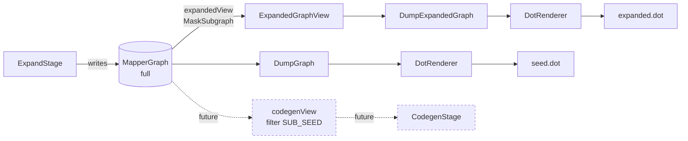

## Context

`expanded.dot` exists today as a debug artifact produced by the `DumpExpandedGraph`
stage. The stage renders the full post-expansion `MapperGraph` — every SEED,
SUB_SEED, REALISED, and MARKER edge — via the shared `DotRenderer`. The same
renderer also produces `seed.dot` from `DumpGraph`, so the rendering code path is
unified by design.

Three observations from current usage drive this change:

1. The expanded file reproduces the entire seed graph verbatim before adding any
   expansion content, and SEED edges render with the strongest visual weight
   (`solid`, black) while REALISED edges render `dashed`, thin. The eye lands on
   what was input, not on what expansion produced.
2. Multiple nodes can share the same location string while differing only in
   their type segment (e.g. four `src[person.addresses]` nodes at types `?`,
   `Person.Address`, `List<Optional<Person.Address>>`, `Set<Human.Address>`).
   The current node label is just the location, so they render identically in
   the SVG and cannot be told apart.
3. MARKER edges and `::?` placeholder nodes are pure expansion bookkeeping —
   they encode "this typed slot was allocated by strategy X" rather than any
   transformation. They contribute clutter without information once expansion
   has reached its fixed point.

The codebase already contains a precedent for filtered views over `MapperGraph`:
`realisedSubgraph()` returns a `RealisedSubgraph` backed by a JGraphT
`MaskSubgraph`, and `hasSeedSubSeedCycles()` does the same inline for cycle
detection. This change reuses that pattern.

## Goals / Non-Goals

**Goals:**

- Produce an `expanded.dot` file in which the visual hierarchy matches the
  semantic hierarchy: REALISED edges are loudest, SUB_SEED edges are visible
  but secondary, expansion scaffolding (SEED, MARKER, `?` nodes) is absent.
- Make same-location-different-type nodes distinguishable on sight by including
  a simple type name in the rendered label.
- Establish a reusable operational view over `MapperGraph` that the future
  codegen stage can also consume (with an additional SUB_SEED filter on top).
- Keep the full graph available in memory so a future `expanded.full.dot` and
  diagnostic enrichment that walks SEED edges remain unblocked.

**Non-Goals:**

- Shipping `expanded.full.dot`. Deferred until a concrete use case appears.
- Improving compiler-error diagnostics for unreachable paths. Separate change.
- Introducing the codegen view itself or wiring Dijkstra path selection.
- Changing the `seed.dot` output. `DumpGraph` continues to render the full
  raw `MapperGraph` (which at the seed stage contains only SEED edges anyway).
- Changing the `Node.id()` encoding. Fully-qualified types stay in the id;
  the simplification is only in the rendered `label` attribute.

## Decisions

### D1 — Filter as a JGraphT `MaskSubgraph` view, not a graph transformation

The operational filter is implemented as a pure-function view backed by JGraphT
`MaskSubgraph`. The underlying `DirectedMultigraph` in `MapperGraph` is not
modified, copied, or rebuilt. This follows the established
`MapperGraph.realisedSubgraph()` / `hasSeedSubSeedCycles()` pattern.

Alternatives considered:

- *Promote to a new graph.* Build a new `MapperGraph` instance containing only
  the surviving nodes and edges. Rejected — wastes allocation, loses the
  reference to the full graph for future debug/diagnostics use, and offers no
  benefit beyond what the mask already provides.
- *Predicate-pair on the renderer.* Pass `nodeFilter` and `edgeFilter` predicates
  directly to `DotRenderer.render(...)`. Rejected — splits the filter policy
  between consumer and renderer; codegen (which won't go through the renderer)
  would re-implement the same predicates.

### D2 — View lives on `MapperGraph` as a named accessor

A new method `MapperGraph.expandedView()` returns an `ExpandedGraphView` wrapper
analogous to `RealisedSubgraph`. The wrapper exposes:

```
public Stream<Node> nodes();
public Stream<Edge> edges();
public Stream<Node> nodesByScope(Scope scope);
```

Same shape and ordering guarantees as `MapperGraph.nodes()` / `.edges()`. The
wrapper class is `final`, package-constructible.

The vertex mask hides any node whose type segment is the untyped placeholder
(`?`) **iff** another node exists in the graph with the same `(scope, location)`
pair and a non-placeholder type. Untyped nodes that have no typed counterpart
are kept — they are diagnostic evidence ("expansion never produced a type for
this slot") and would be confusing to lose.

The edge mask hides `EdgeKind.SEED` and `EdgeKind.MARKER` edges
unconditionally.

### D3 — `DotRenderer` is refactored to accept any "node/edge source"

`DotRenderer.render(...)` is widened to accept either a `MapperGraph` or an
`ExpandedGraphView`. The least invasive way is to introduce a small internal
abstraction — a `GraphSource` (or similar) interface exposing
`Stream<Node> nodes()` and `Stream<Edge> edges()` — and have both classes
implement it. `DumpGraph` continues to pass the raw `MapperGraph`; the new
`DumpExpandedGraph` passes `graph.expandedView()`.

Alternative considered:

- *Two renderer classes.* `SeedDotRenderer` + `ExpandedDotRenderer`. Rejected —
  the rendering rules (cluster grouping, node shapes, ordering, escaping) are
  identical; duplication would be 90% of the code.

### D4 — Node label format: two-line, simple type names

Each node renders with a `label` of the form:

```
<location-segment>\n<short-type-name>
```

`<location-segment>` is the existing `src[…]` / `tgt[…]` / element-role string.
`<short-type-name>` is the type segment from the node id, with:

- `java.lang.` prefixes stripped from class names (`java.lang.String` →
  `String`). Other packages are preserved verbatim
  (`io.github.joke.testing.Person.Address` stays as-is). Rationale:
  `java.lang` is implicitly imported in Java source, so reading
  unqualified is natural; other packages carry meaningful provenance and
  shortening them would risk same-simple-name collisions across user
  packages.
- Generic type arguments recursively rewritten under the same rule
  (`java.util.List<java.util.Optional<java.lang.String>>` →
  `java.util.List<java.util.Optional<String>>`).
- Untyped placeholder rendered as `?` (only appears for nodes the type-mask
  intentionally retained — see D2).

Fully-qualified types remain in `Node.id()` for graph determinism and
uniqueness — only the visible label is simplified.

The label format applies uniformly to `seed.dot` and `expanded.dot`. In
`seed.dot`, all nodes are untyped, so the second line is `?` for every node
(uniform; not a regression).

### D5 — Edge styling table revised

| Kind     | Style (current) | Style (proposed)                    | Visible in expanded.dot? |
| -------- | --------------- | ----------------------------------- | ------------------------ |
| REALISED | dashed          | `solid`, `penwidth=2.0`             | yes — primary            |
| SUB_SEED | bold            | `solid`, `penwidth=1.0`, gray45     | yes — secondary          |
| SEED     | solid (black)   | `solid` (kept as-is for seed.dot)   | **no** — masked out      |
| MARKER   | dotted          | (no rule needed)                    | **no** — masked out      |

REALISED is the heaviest visible stroke. SUB_SEED is visible but de-emphasised
in colour and weight. SEED styling is unchanged because it still appears in
`seed.dot`. MARKER styling drops out because masked edges never reach the
renderer.

### D6 — Edge label content revised

| Kind     | Current label                          | Proposed label                   |
| -------- | -------------------------------------- | -------------------------------- |
| REALISED | `REALISED \| 1 \| <strategy fqn>`      | `<StrategyShortName> (1)`        |
| SUB_SEED | `SUB_SEED \| ∞ \| directive \| <fqn>`  | `SUB_SEED`                       |
| SEED     | `SEED \| ∞ \| directive`               | (unchanged — appears in seed.dot)|

Rationale for SUB_SEED simplification:

- The `directive` token is misleading on SUB_SEED edges, since SUB_SEEDs are
  emitted by strategies, not by user directives.
- The strategy FQN is recoverable from the REALISED edge that the same strategy
  emits on the same node — see Decision D8 below.
- Weight on SUB_SEED is always `∞`; omitting it loses nothing.

Rationale for REALISED simplification:

- The `REALISED` token is redundant once the visual style is loud and unique.
- Strategy short name (no package) is enough for human reading; the FQN can be
  recovered from the source code if needed.
- Weight stays — it carries Dijkstra-relevant information for the future
  codegen view.

### D7 — Untyped node retention rule

An `::?` node is retained iff no node with the same `(scope, location)` pair
and a concrete type exists in the full graph. This preserves a diagnostic
artifact: a `?` node that survives expansion is an unresolved slot, and seeing
it in the expanded view is informative.

Detection is a one-pass index built when the view is constructed:

```
Set<(Scope, Location)> typedSlots = graph.nodes()
    .filter(n -> !isPlaceholderType(n))
    .map(n -> (n.scope(), n.loc()))
    .collect(toSet());

isMasked(node) = isPlaceholderType(node) && typedSlots.contains((node.scope(), node.loc()));
```

The index is built once per view construction. Cost is `O(V)`.

### D8 — SUB_SEED strategy attribution is intentionally dropped, recoverable from REALISED

Every strategy that emits a SUB_SEED also emits a REALISED edge — otherwise the
strategy is asking for an input it never uses. So the strategy's identity is
always present somewhere in the same neighbourhood as the SUB_SEED. Dropping
the attribution from the SUB_SEED label removes label noise without losing
diagnostic information for healthy graphs.

The remaining case — an orphaned SUB_SEED whose REALISED never materialised —
is genuinely a diagnostic loss. The mitigation paths are:

- A future `expanded.full.dot` (with strategy attribution preserved) for the
  rare cases this matters.
- Better compiler diagnostics (separate change) covering the same scenario at
  a higher level.

This is an accepted trade-off; the visual win on healthy graphs is the
priority.

## Architecture



The full `MapperGraph` is the single source of truth. Views are pure functions
over it. `DotRenderer` becomes view-agnostic; it accepts any node/edge source.

## Risks / Trade-offs

- **Risk:** the existing `graph-debug-output` spec explicitly requires
  `DumpExpandedGraph` to write "the *full* graph (including SEED, REALISED,
  MARKER, and SUB_SEED edges)". This change deliberately weakens that contract.
  **Mitigation:** the spec delta in this change rewrites the requirement to
  reflect the filtered view as the new contract; reviewers see the contract
  change explicitly during spec review.

- **Risk:** orphaned SUB_SEED edges lose their strategy attribution and become
  harder to diagnose. **Mitigation:** noted in design rationale; recoverable via
  a future `expanded.full.dot` or via improved compiler diagnostics. The
  trade-off is consciously accepted in favour of the visual hierarchy fix on
  the common case.

- **Trade-off:** the renderer's `GraphSource` abstraction adds a small interface
  inside the `graph` package to support two callers. The alternative (two
  renderer classes) was rejected for duplication. The interface is internal —
  no public-API surface change.

- **Risk:** golden DOT files (`expanded-trivial.dot`, `expanded-tier2-failing.dot`)
  must be regenerated. **Mitigation:** the project already has a
  `:processor:updateGoldens` Gradle task documented in
  `processor/src/test/resources/golden-graphs/README.md`. Regeneration is part
  of the implementation tasks.

- **Trade-off:** labels remain verbose for user-package types (e.g.,
  `io.github.joke.testing.Person.Address` appears in full). The
  collision-risk alternative — stripping all packages — was rejected in D4
  because same-simple-name types across user packages would render
  identically and reintroduce the very indistinguishability problem this
  change exists to fix. Verbosity for non-`java.lang` types is the
  conservative default.

## Migration Plan

This change is purely additive at the in-memory level (the full graph is
unchanged; a new view is added) and modifies only debug-output rendering.
There is no runtime or generated-code impact.

1. Add `ExpandedGraphView` and `MapperGraph.expandedView()` (D1, D2, D7).
2. Refactor `DotRenderer` to accept the new view via a `GraphSource`
   abstraction; update label format (D3, D4) and edge styling/labels (D5, D6).
3. Wire `DumpExpandedGraph` to use `graph.expandedView()`.
4. Regenerate golden DOT files via `./gradlew :processor:updateGoldens`.
5. Update Spock specs whose assertions reference the dropped MARKER edge or
   the flipped REALISED / SUB_SEED styles.

No rollback strategy required — the change is contained to a debug artifact
and its tests; reverting the commit is safe.

## Open Questions

_None — Q1 and Q2 resolved before implementation:_

- **Q1 (resolved)**: Type-name simplification strips `java.lang.` only;
  other packages are preserved verbatim. Captured in D4.
- **Q2 (resolved)**: The new view accessor is named `expandedView()`.
  Captured in D2.
