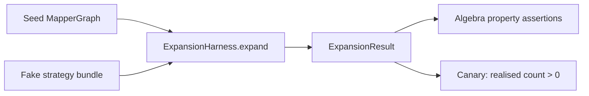

## Context

The previous change, archived as `2026-05-14-add-graph-expansion-tests`, established the `processor-test-support` module — a published framework hosting `SeedDsl`, `ExpansionHarness`, `ExpansionAssertions`, `TypeUniverse`, `GraphFixtures`, `MapperSpec`, `StrategyBundle`, `PropertyTestBase`, plus the build-time rules (`checkNoInternalJavacImports`, the no-SPI rule, a per-module Jacoco override). The module passed `./gradlew check` with 60 % branch coverage on its own classes and shipped seven jqwik property tests plus two Spock specs that exercise the harness end-to-end.

Two flaws surfaced once we asked harder questions:

1. **The `SeedDsl` produces malformed seed graphs.** A method's return-type node is placed at path `""`, while every directive creates a separate, untyped target node at the directive's path. Strategies match on `(sourceType, targetType)`; with untyped targets they never fire. The harness runs to completion and reports `converged=true` with zero realised edges, and every property test holds trivially on an empty pipeline.
2. **The framework's audience is theoretical.** External strategy authors realistically write mapper-level integration tests in their downstream project — adding their `@AutoService(Bridge.class)` implementation, writing a mapper, running the processor, inspecting the generated code. They do not, in practice, build seed graphs against an internal DSL to verify their strategy participates in the algebra. The framework has no concrete consumer; maintaining it (as a published surface that has to evolve coherently with the engine) is uncompensated overhead.

The combination is corrosive: the framework exists to enable a kind of testing nobody asked for, the tests we wrote against it validate nothing, and the published surface keeps growing. The honest move is to collapse the framework into processor's test sources, drive the engine algebra against strategies we fully control (fakes), and dog-food the harness on the few built-in strategies that actually exist today.

The production refactor from the prior change — `ProcessorModule.assembleExpansionPipeline(...)` as the single source of truth for `ExpandStage` composition — stays. It was the real value of that change and is unrelated to the test-layer reshuffle.

## Goals / Non-Goals

**Goals:**

- Engine algebra tests that actually exercise `ExpandStage` and would fail on a meaningful regression (loss of determinism, broken idempotence, dropped strategy contribution, etc.).
- Drive the algebra against **fake strategies we control**, so test pass/fail is decoupled from the correctness of any specific production strategy.
- Dog-food the inlined harness on at least one built-in production strategy (`DirectAssign`) via real `reachable(...)` assertions in the Spock layer.
- Reduce build complexity: one fewer module, fewer per-module Gradle overrides, one fewer published API surface to evolve.
- Preserve the public-`JavacTask`-based `TypeUniverse` and the `assembleExpansionPipeline` factory — both still useful regardless of where tests live.

**Non-Goals:**

- A `StrategyContractTest` base class for external strategy authors. Deferred until a real external strategy module exists. Premature.
- Harness-side auto-invariant assertion (the originally proposed strong-D6 behaviour where the harness throws on convergence/identity-collapse/orphan-realised violations and tests opt out per call). The prior change's revised D6 — "expose checks on `ExpansionResult`; tests opt in" — is retained as the design contract here. This implicitly resolves the prior change's task 7.3 ("opt out of convergence auto-invariant"): with explicit opt-in, there is nothing to opt out of, so the task is closed by design rather than deferred. See D7 for how cycle/round-cap failure-mode tests express their intent under this model.
- Production-side changes beyond what falls naturally out of the test-layer cleanup. `ExpandStage`, the SPI interfaces, and the strategy implementations are untouched.
- Restoring or rewriting the `percolate-integration` sandbox — still a personal mapper-level workshop, still out of CI.
- A formal SPI conformance test kit. The fakes in this change exist to drive the engine; they are not a published contract for external authors.

## Decisions

### D1. Collapse the framework into `processor/src/test/`

The module `processor-test-support/` is deleted in its entirety. Every test helper that was published lives instead under `processor/src/test/java/io/github/joke/percolate/processor/test/`. Test infrastructure is co-located with the tests that use it, with no published surface and no inter-module classpath plumbing.

What survives the inlining:

- `TypeUniverse` — unchanged behaviour; just moves.
- `GraphFixtures` — direct `MapperGraph` builders (`seedAndRealisedPath()`, `subSeedCycle()`, `orphanRealisedEdge()` plus new builders this change introduces for engine-algebra fixtures).
- `ExpansionAssertions` — the AssertJ-style fluent assertions and `DiagnosticKind` enum.
- `ExpansionHarness` — thin wrapper around `ProcessorModule.assembleExpansionPipeline(...)`. Only the explicit-mode entry point survives in any load-bearing form (see D4).
- A `HarnessResolveCtx`-equivalent and a `HarnessScope`-equivalent — internal, package-private.

What does not survive: `SeedDsl`, `MapperSpec`, `StrategyBundle`, `PropertyTestBase`, the published `META-INF/services` rule task, the no-internal-javac-imports rule task (or it migrates if processor still needs the protection), the per-module Jacoco override, the README, the `build.gradle` file.

**Alternative considered**: Keep `processor-test-support` as a thin "helpers exposed to other modules" module on the bet that strategy authors emerge. Rejected — no consumer exists today, and the cost of maintaining a published API contract is real (versioning, deprecation discipline, README drift). If a future external strategy module appears, the helpers extract cleanly back into a module at that point, driven by the actual consumer's needs.

### D2. Drop `SeedDsl` and the value types that depend on it

`SeedDsl` is dropped. With it go `MapperSpec` (whose `toGraph()` called `SeedDsl.seed()...`), `StrategyBundle` (a published value type that has no use outside SPI-mode generators), and `PropertyTestBase` (the jqwik base class whose `@Provide` generators produced `MapperSpec`s and `StrategyBundle`s).

In their place, engine-algebra tests construct `MapperGraph` instances directly:

```java
final var graph = new MapperGraph();
final Scope scope = new EngineTestScope("convert(int)");
final var source = new Node(Optional.of(INT), new SourceLocation(AccessPath.of("p")), scope, Optional.empty());
final var target = new Node(Optional.of(LONG), new TargetLocation(TargetPath.of("out")), scope, Optional.empty());
graph.addNode(source);
graph.addNode(target);
graph.addEdge(Edge.elementSeed(source, target, "test.seed"));
```

For common shapes — single-method identity seeds, two-method disjoint seeds, etc. — `GraphFixtures` grows small parametric builders so individual tests stay readable.

**Why this is acceptable**: the verbosity of direct construction is bounded (six to ten lines per shape) and the shapes are reused via fixtures. A fluent DSL would hide what's going on; that hiding was load-bearing only when the DSL also did type-propagation magic, which it failed to do correctly. Honest construction is preferable to fluent obscurity.

**Alternative considered**: Keep `SeedDsl` and fix the type-propagation bug. Rejected — `SeedDsl`'s value depends on a strategy-author audience that does not exist. Without that audience, it is internal test infrastructure that competes with `GraphFixtures` for the same job; one of them should go.

### D3. Fake strategies as the engine-algebra input alphabet

The seven jqwik property classes are rewritten to draw strategy bundles from **fake** implementations of `Bridge`, `SourceStep`, and `GroupTarget` rather than from `ServiceLoader`-loaded production strategies. The minimum set is:

- `IdentityBridge(inType, outType)` — emits a single realised step when `(from, to)` matches the configured pair.
- `ChainBridge(in, mid, out)` — emits a two-step chain via an intermediate type.
- `NoOpBridge` — never emits anything; covers degenerate cases.

Each fake is parameterised over `TypeUniverse`, returns deterministic streams, and produces a no-op `EdgeCodegen` (`(vars, inputs) -> CodeBlock.of("")`). Property tests treat the fakes as the alphabet over which the algebra is quantified: "for any seed `g` and any subset `S` of these fakes, the laws hold."

**Why this matters**: with production strategies, a broken or absent strategy implementation would silently invalidate the property tests (as it does today). With fakes, the engine's behaviour is testable independently of any production strategy's correctness. A refactor that, say, makes `ExpandStage` iterate phases in nondeterministic order will be caught — `IdentityBridge` plus a fixed seed produces a specific expected expansion, and `DeterminismProperty` fails on the first non-matching run.

**Alternative considered**: Mock-based fakes via Mockito. Rejected — strategy methods are typed pure functions; a 15-line concrete fake is clearer than a configured mock and easier to reason about.



### D4. Explicit-mode harness for engine tests; SPI mode reserved for capability dog-food

The harness retains both entry points (`expand(seed)` SPI mode and `expand(seed, bridges, sourceSteps, groupTargets)` explicit mode), but the engine-algebra property tests use **only the explicit mode** with fake bundles. SPI mode is used only by the Spock `ExpansionCapabilitiesSpec` for dog-fooding the actual production strategies.

This split is the contract:

- Explicit mode + fakes → engine algebra. Decoupled from strategy correctness.
- SPI mode + real seeds → capability documentation. Decoupled from engine internals (anything the engine does that produces the expected reachability is fine).

**Why**: mixing the two — running properties against SPI-loaded strategies — entangles "did my refactor break the engine" with "did some unrelated strategy regress." The previous change demonstrated the failure mode: with the seed-DSL bug, no production strategy fired, and the properties passed because the engine had nothing to do. Separating the concerns prevents this exact silent failure.

### D5. Dog-fooded capability rows for built-in strategies

`ExpansionCapabilitiesSpec` (Spock, `processor/src/test/groovy/.../`) is rewritten with real reachability assertions for each built-in strategy that produces realised edges today. The minimum is `DirectAssign` for an identity pair (`String → String`, `Integer → Integer`). Strategies that don't yet produce realised edges (because they're stubs, incomplete, or require setups the harness can't replicate) are noted in `tasks.md` as **work for future incremental changes**, not blockers for this one.

The dog-fooding has two purposes:
- Validates that the inlined harness actually works end-to-end with a real strategy.
- Validates the built-in strategy: if `DirectAssign` ever silently regresses (stops emitting a realised step), this spec catches it.

### D6. Canary test against the silent-no-op regression

A single test asserts that on a known-solvable seed plus an `IdentityBridge` fake, `result.expandedGraph().edges().anyMatch(e -> e.getKind() == EdgeKind.REALISED)` returns `true`. If it ever returns `false`, either the engine stopped wiring fakes through phases or the harness stopped delegating to `assembleExpansionPipeline` — both are catastrophic and silent under the previous change's test setup.

The canary lives alongside the property specs in `processor/src/test/groovy/.../properties/` as `RealisedEdgeCanarySpec.groovy`.

### D7. Failure-mode coverage: cycle (retained) + round-cap (added via `DivergentBridge`)

`ExpansionFailureModesSpec` retains the cycle test from the prior change (constructs a graph with a SUB_SEED cycle via `GraphFixtures.subSeedCycle()`, asserts the `Cycle detected` diagnostic fires). It is rewritten to use **explicit-mode harness with a no-op fake bundle**, so the cycle detection is exercised independently of any production strategy.

The change adds a **round-cap test**. The diagnostic to assert is `Expansion did not converge after N rounds`, emitted by `ExpandStage` when `graph.edgeCount()` keeps growing past `MAX_EXPANSION_ROUNDS = 64`. To trigger it deliberately, the test uses a new fake — `DivergentBridge` — whose `bridge(from, to, ctx)` introduces a *fresh synthetic intermediate node* on every invocation, so identity-based dedup never collapses the additions and the engine never reaches a fixed point.

```java
final class DivergentBridge implements Bridge {

    @Override
    public Stream<BridgeStep> bridge(final TypeMirror from, final TypeMirror to, final ResolveCtx ctx) {
        // synthesize a step through a fresh intermediate; uniqueness comes from a path counter,
        // so every round adds at least one edge the engine has not seen before
        return Stream.of(stepThroughFreshIntermediate(from, to));
    }
}
```

**Why this is fair**: a divergent bridge intentionally violates the engine's convergence assumption — that is the exact scenario the round-cap diagnostic exists to catch. The test asserts the safety net works. The fake is not held out as a realistic strategy; it lives in `processor/src/test/groovy/.../properties/fakes/` next to the other engine-test fakes and is documented as pathological.

**Why both failure modes use explicit mode**: the cycle test wants the SUB_SEED cycle to be the cause of the diagnostic, not interaction with whatever SPI-loaded strategy happens to be installed. The round-cap test wants `DivergentBridge` to be the cause. Explicit mode + a controlled bundle pins both.

**Alternative considered for round-cap**: construct a seed graph with > 64 directives that each independently take a round to resolve. Rejected — `ExpandStage`'s round counter is about *unconverged* iterations across the whole graph, not per-directive count. Edge count must keep growing across rounds, which a single divergent bridge achieves naturally.

This decision **closes** the prior change's deferred tasks 7.1 (cycle test — relocated) and 7.2 (round-cap test — newly added). Task 7.3 (opt-out) is closed by the Non-Goals decision above: under explicit opt-in there is no auto-invariant to opt out of.

### D8. Build infrastructure cleanup

Removed:
- `include 'processor-test-support'` from `settings.gradle`.
- `processor-test-support/build.gradle` and `processor-test-support/README.md`.
- `testImplementation project(':processor-test-support')` from `processor/build.gradle`.
- The per-module Jacoco override that disabled verification on `processor` (kept) and enforced it on `processor-test-support` (gone — the module is gone).
- The `META-INF/services` rule task (it lived in `processor-test-support/build.gradle`).

Migrated or kept:
- The `checkNoInternalJavacImports` Gradle task migrates to `processor/build.gradle` only if `processor` itself acquires `com.sun.tools.javac.*` imports. Otherwise it disappears with the module that needed it (the rule was specifically that `processor-test-support` must not depend on internal javac).
- The project-wide PMD exclusion of `AtLeastOneConstructor` (added in the previous change) stays — it's still needed for empty test classes.
- `dependencies/build.gradle` keeps its `api` constraints for `jqwik` and `assertj-core`; processor's `testImplementation` already references them directly.
- `com.palantir.javapoet:javapoet` may need to be added as `testImplementation` on `processor` (it's currently `implementation` for production codegen, but the test fakes need it for `CodeBlock.of("")`). If `implementation` deps from a module are visible to its own test classpath in Gradle, no change is needed; otherwise add the explicit `testImplementation` declaration.

## Risks / Trade-offs

[**Lost work — the framework module gets deleted within days of being built**] → Mitigation: the work that retains value (`TypeUniverse` via public `JavacTask`, `GraphFixtures` patterns, `ExpansionAssertions` shape, `assembleExpansionPipeline` factory) is inlined and kept. The deleted code (`SeedDsl`, `MapperSpec`, `StrategyBundle`, `PropertyTestBase`) addressed a hypothetical consumer that does not exist; deleting it is a correction, not a loss. The lessons from building it are captured in the previous change's archived design.md and in feedback memory.

[**Future external strategy author has no framework**] → Mitigation: when one shows up, extract the helpers back into a module driven by the real consumer's needs. Designing the API surface speculatively is the failure mode we're correcting.

[**Direct `MapperGraph` construction is verbose**] → Mitigation: `GraphFixtures` grows parametric builders for common shapes. Each individual test stays one to five lines of helper invocation plus assertions. The verbosity hit is bounded and traceable.

[**Property tests with fakes prove less than property tests with real strategies**] → Mitigation: this is intentional. Property tests prove the **engine** holds the algebra; capability tests prove **strategies** behave. Confusing the two was the original sin we're correcting. Strategy correctness is asserted by `ExpansionCapabilitiesSpec`, incrementally per strategy, separately from the algebra.

[**Inlined helpers risk re-duplication if a future module legitimately needs them**] → Mitigation: when extraction is needed, do it on demand. The cost of premature publication exceeded the cost of post-hoc extraction in our case; trust that judgment.

[**Coverage drop on processor's tests**] → Mitigation: the inlined helpers (`TypeUniverse`, `GraphFixtures`, `ExpansionAssertions`, `ExpansionHarness`) carry tests with them. They land in `processor/src/test/groovy`; the per-module Jacoco rule on `processor` is currently disabled (deliberately, per the previous change's design), so this change does not regress coverage gates.

## Migration Plan

This change is test-layer-only. No production behaviour changes. No public APIs change (the only "public" API was `processor-test-support` itself, which is deleted). No consumers exist.

Sequence:

1. Inline the helpers from `processor-test-support/src/main/java` into `processor/src/test/groovy/io/github/joke/percolate/processor/test/` (converted to Groovy). Adjust package names. Delete the helpers that don't survive (`SeedDsl`, etc.).
2. Move the tests from `processor-test-support/src/test/java` into `processor/src/test/groovy` (renamed `*Test` → `*Spec` for the canary; `*Property` → `*Spec` for the algebra specs) and adjust them to use the inlined helpers.
3. Add `FakeStrategies` in `processor/src/test/groovy/.../properties/fakes/`.
4. Rewrite the seven property specs (Groovy + jqwik `@Property`) to use fakes via explicit mode.
5. Rewrite `ExpansionCapabilitiesSpec.groovy` with real reachability assertions for `DirectAssign` (and any other built-in that produces realised edges today).
6. Update build files: drop `include`, drop `testImplementation project(':processor-test-support')`, fold any retained build-time rules into `processor/build.gradle`.
7. Delete `processor-test-support/` directory.
8. Update `CLAUDE.md` / docs.
9. Run `./gradlew check`; iterate until green.

Rollback: `git revert`. No data, no consumers, no migration risk.

## Open Questions

- **Which built-in strategies produce realised edges today?** Needs a probe early in implementation. From the prior change's diagnostic capture, `DirectAssign` did not fire for a typed `String → String` seed — but that seed was malformed by the DSL bug. With a manually constructed typed seed, the answer may differ. The probe result drives how many `ExpansionCapabilitiesSpec` rows are populated vs deferred.
- **Should `processor`'s `jacocoTestCoverageVerification` stay disabled?** The previous change disabled it on the rationale "no real tests yet." After this change, the property tests, the canary, and the capability spec all live in `processor/src/test`. We could re-enable a modest threshold (e.g., 40 % branch on `processor`) to lock in the gain. Defer the decision until coverage numbers are known post-implementation; do not block this change on it.
- **Does any built-in production strategy `import com.sun.tools.javac.*`?** If yes, the `checkNoInternalJavacImports` task migrates to `processor/build.gradle` to guard against regression. If no, the task is dropped with the module.
