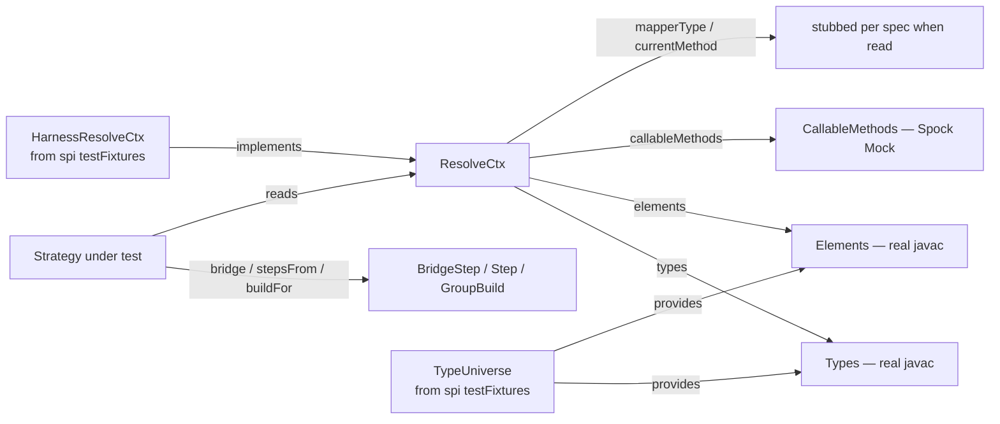

## Context

After `extract-spi-and-builtins` lands, `percolate-strategies-builtin` houses eleven `@AutoService` implementations and ships with three kinds of test coverage *from above*:

1. The algebraic property suite in `percolate-processor`, which uses fakes (`IdentityBridge`, `ChainBridge`, …) and never instantiates any real builtin. Proves the *algorithm* is correct against arbitrary strategies.
2. `ExpansionFailureModesSpec`, which also uses fakes.
3. `BuiltinServiceRegistrationSpec`, which proves `ServiceLoader` discovers the right classes.

What none of those test is whether each individual strategy honours its own contract: does `ListMap` actually return an empty stream when the target is not a `List`? Does `OptionalUnwrap` emit `inputs.single() + ".orElse(null)"` as codegen, not something else? Does `GetterRead` find an `isFlag` accessor when looking for `flag`?

These contracts are real and surprisingly easy to break. They are also annoyingly hard to debug from a property-spec failure — a divergent expansion graph names the seed, not the strategy that misfired. Pinning them at the level of the strategy itself is what unit tests do.

This change introduces that level. The intermediate concept — "test a strategy in isolation" — exists only after the SPI extraction, because before extraction the strategies share a package with the engine and "isolation" is a fiction. After extraction, isolation is *structural*: the strategies depend on `percolate-spi` only; the engine is invisible to them at compile time. Unit tests just need a compatible substrate (real `Types` / `Elements`, a configurable `ResolveCtx`) and direct strategy instantiation.

Constraints:
- Java 11; Spock 2.4 + Groovy 5.0 for tests; Mockito on the classpath but per discussion not the right tool for the type-system surface.
- `percolate-spi` `testFixtures` ships `TypeUniverse` and `HarnessResolveCtx`.
- The strategies' contracts are already documented (in `container-expansion`, `expansion-strategy-spi`, `callable-method-discovery`). Unit tests verify against those existing requirements; they do not introduce new behavioural requirements on the strategies.

## Goals / Non-Goals

**Goals:**
- For each built-in strategy, a Spock spec that calls the strategy directly and verifies its contract: empty-stream preconditions, happy-path step shape (input/output types, weight), branches the strategy distinguishes, and element seeds where applicable.
- A single test-time mocking pattern, reused across all eleven specs: real javac substrate from `TypeUniverse` / `HarnessResolveCtx`; Spock `Mock()` for `CallableMethods` and any other true collaborator surfaces; nothing else stubbed.
- A `ResolveCtxBuilder` helper so per-spec setup is one fluent expression, not five lines of boilerplate per scenario.
- Real Java shape fixtures (record, JavaBean, boolean accessor, positional ctor + named fields) that `ConstructorCall` and `GetterRead` can introspect at test time.
- A copyable pattern — including the helper and the fixture layout — that third-party strategy authors can mirror.
- Specs serve as executable documentation for each strategy's contract at the metadata level (which inputs produce which step shape).

**Non-Goals:**
- Changing any strategy's behaviour. Two known oddities (`ListMap`'s acceptance of `Optional` inputs, `MethodCallBridge.subtypeDistance`'s ambiguous return) are pinned by scenarios that document the current behaviour; fixes belong in separate changes filed as follow-ups.
- Asserting on rendered codegen output (`CodeBlock.toString()`). Codegen pinning is a sensible *next* layer of safety but mixes concerns with metadata testing and is deferred to a follow-up change (`pin-builtin-strategy-codegen` or similar).
- Changing the algebraic property suite or `ExpansionHarness`. Pipeline-level testing stays where it is.
- Mocking `Types` / `Elements`. The substrate is real javac through `TypeUniverse`.
- Raising the SPI's abstraction above `javax.lang.model` (see Open Questions). Strategies continue to operate on raw `TypeMirror` for now.
- Per-strategy specs for the *upcoming* (not-yet-written) builtins. This change covers the eleven that exist after the extraction.
- A shared abstract base class for strategy specs. Helpers and fixtures yes; inheritance no — the strategies are too different for shared scenarios.

## Decisions

### D1. Direct strategy invocation, no harness

Each spec instantiates the strategy directly and calls its method:

```groovy
def 'returns step for same-type assignment'() {
    given:
    def ctx = new ResolveCtxBuilder().build()

    when:
    def steps = new DirectAssign().bridge(STRING, STRING, ctx).toList()

    then:
    steps.size() == 1
    steps[0].inputType == STRING
    steps[0].outputType == STRING
    steps[0].weight == Weights.NOOP
}
```

No `ExpansionHarness`. No `MapperGraph`. No pipeline. The strategy is the unit; the test only cares about its observable output.

**Alternatives considered:**
- *Per-strategy harness that runs a one-node seed graph through the pipeline*. Defeats isolation, drags engine internals onto the test classpath, and adds latency for no diagnostic gain. Rejected.
- *Property-style fuzzed inputs (jqwik)*. Useful for the algebraic suite where input space is irregular; per-strategy preconditions are deterministic and enumerable. Rejected for this change; reconsider later if a strategy has a genuinely large input space.

### D2. Real javac substrate; mock only true collaborators



`Types` and `Elements` are not collaborators of the strategy under test; they are the platform substrate. Mocking them faithfully reimplements a tiny javac in stubs and couples the test to the strategy's internal call order. Real javac is faster, simpler, and verifies real behaviour.

`CallableMethods` *is* a collaborator — it represents the universe of user-supplied mapping methods, which is exactly the variable the test wants to control. Spock's native `Mock(CallableMethods)` is sufficient; no Mockito needed for these SAM-ish interfaces.

**Single-substrate invariant.** All `TypeMirror` instances flowing through any one spec come from the *same* `JavacTask` — the one held inside `TypeUniverse`. This includes JDK types (`java.lang.String`, `java.util.List<…>`) AND user-defined fixture types under `src/test/java/.../fixtures/` (see D6), because the fixture classes land on the test JVM's classpath at build time and javac's default file manager resolves them through that classpath the same way it resolves JDK types. There is no second javac instance anywhere in the test setup; `Types.isSameType(a, b)` therefore behaves consistently across every type a strategy might see.

This mirrors production: when the annotation processor runs, exactly one javac compilation owns one `Elements`/`Types` pair, and user types, JDK types, and library types all live in the same element table. Compile-testing integration tests in this project work for the same reason — one compilation, one substrate.

If `TypeUniverse.element('…fixtures.PersonRecord')` ever fails in a future build configuration (classpath visibility quirk in a different test runner), the fix is to make `TypeUniverse`'s file manager explicit (wire a `StandardJavaFileManager` with the test classpath) — *not* to introduce a second javac task. A second task would re-create the very identity-mismatch problem this design avoids.

**Alternatives considered:**
- *Full Mockito stubbing of `Types` / `Elements`*. Brittle, expensive in setup code, couples to implementation order. Rejected.
- *Build types from source via `com.google.testing.compile`* or a per-spec `FixtureCompiler`. Either path introduces a second `JavacTask` and the identity-mismatch problem described above. Rejected on those grounds. (Compile-testing remains the right tool for **integration**-shaped tests that exercise the whole processor through a real compilation — one task, one substrate. It's not the right tool for **unit**-shaped strategy tests, where there is no compilation to test, only a strategy method to call.)

### D3. `ResolveCtxBuilder` helper

A single fluent builder at `strategies-builtin/src/test/groovy/io/github/joke/percolate/spi/builtins/test/ResolveCtxBuilder.groovy`:

```groovy
def ctx = new ResolveCtxBuilder()
    .withCallableMethods(Mock(CallableMethods) { ... })
    .withMapperType(TypeUniverse.element('com.acme.AcmeMapper'))
    .build()
```

Defaults: real `Types` / `Elements` from `TypeUniverse`; `CallableMethods` returns empty streams; `mapperType()` and `currentMethod()` return null. Each `with*` overrides one surface.

**Alternatives considered:**
- *Per-spec hand-rolled `ResolveCtx` anonymous classes*. Tolerable for one or two specs; eleven specs is enough to amortise a builder. Rejected.
- *Extend `HarnessResolveCtx`*. `HarnessResolveCtx` is a singleton with zero configurability — extending it for per-spec variation defeats its design. Builder is the right shape. Rejected.
- *Spock helper trait + `@Stepwise` setup*. More magical, less searchable. Rejected.

The builder lives in this module's `src/test/groovy`, not in `spi` `testFixtures`. Promotion is non-breaking and trivially deferrable; a hypothetical second consumer (the first third-party strategy author) is the trigger.

### D4. Codegen assertions deferred — out of scope for this change

Specs assert on **metadata only**: returned types, weights, element seeds, presence/absence of a returned step, and `Optional.isPresent()` for `GroupTarget`. They do **not** invoke `EdgeCodegen` / `GroupCodegen` instances and do **not** assert on `CodeBlock.toString()` output.

**Rationale.** Pinning rendered code shape is a sensible *next* layer of safety, but it mixes two concerns: "did the strategy decide to handle this case?" (metadata) and "did the strategy render the right Java?" (codegen). The two layers test different failure modes and break in different ways; bundling them inflates each spec, drags JavaPoet formatting into the test surface, and forces awkward exception clauses for strategies whose codegen currently throws (e.g. `ListMap`'s `UnsupportedOperationException`).

The follow-up change `pin-builtin-strategy-codegen` (not yet authored) will cover codegen pinning across the eleven strategies on top of the metadata foundation this change establishes.

**Consequences for the known oddities.** `ListMap`'s codegen-throws behaviour is not exercised by this change at all. The other two findings (`ListMap` accepting `Optional` inputs; `MethodCallBridge.subtypeDistance` ambiguity) sit entirely in the metadata layer and are pinned by metadata scenarios with `// FOLLOW-UP:` markers as planned.

**Alternatives considered:**
- *Include codegen assertions in this change*. Doubles each spec's surface area and forces awkward exception clauses. Rejected.
- *Skip strategy unit tests entirely until codegen assertions can be done together*. Loses immediate value; metadata regressions are the most common strategy bugs. Rejected.

### D5. One Spock spec per strategy, mirroring main-source package

```
strategies-builtin/src/test/groovy/io/github/joke/percolate/spi/builtins/
  DirectAssignSpec.groovy
  ListMapSpec.groovy
  ListWrapSpec.groovy
  SetMapSpec.groovy
  SetWrapSpec.groovy
  OptionalMapSpec.groovy
  OptionalUnwrapSpec.groovy
  OptionalWrapSpec.groovy
  MethodCallBridgeSpec.groovy
  GetterReadSpec.groovy
  ConstructorCallSpec.groovy
  test/
    ResolveCtxBuilder.groovy
    Inputs.groovy            (optional helper for codegen invocation)
```

**Alternatives considered:**
- *One mega-spec per SPI family (`BridgesSpec`, `SourceStepsSpec`, `GroupTargetsSpec`)*. Bigger files, less readable, forces unified imports across unrelated strategies. Rejected.
- *Tabular `where:`-block scenarios across multiple strategies*. Couples unrelated strategies in one source file; failures point at "row 3" instead of a named strategy. Rejected.

Per-strategy spec naming maps 1:1 onto the main-source class name, which makes navigation trivial in any IDE.

### D6. Shape fixtures as real Java classes under `src/test/java`

`ConstructorCall` and `GetterRead` introspect `TypeElement` members. They need real Java types on the classpath:

```
strategies-builtin/src/test/java/io/github/joke/percolate/spi/builtins/fixtures/
  PersonRecord.java            // record Person(int age, String name) {}
  PersonBean.java              // class with getName/setName, getAge/setAge
  BooleanBean.java             // class with isActive()
  PersonByFieldOrder.java      // ctor params positional, fields named
```

Specs resolve them via `TypeUniverse.element('io.github.joke.percolate.spi.builtins.fixtures.PersonRecord').asType()`.

**Alternatives considered:**
- *Synthesise types dynamically with `com.google.testing.compile`*. Real classes are simpler, easier to read, and version-controlled alongside the test that consumes them. Rejected for the introspection-heavy strategies; reserve compile-testing for strategies whose inputs span a large enumerable set if any appear later.
- *Use existing JDK types creatively (`java.awt.Point` has named fields…)*. Reads as a hack; the fixture set's intent should be explicit. Rejected.

### D7. `@spock.lang.Tag('unit')` on every spec

Matches the existing convention in `ExpansionFailureModesSpec` and `ExpansionCapabilitiesSpec` (now deleted). Memory note explicitly warns against using `org.junit.jupiter.api.Tag`, which silently breaks Spock test discovery.

**Alternatives considered:**
- *No tag*. Loses the ability to filter by test layer (`unit` vs `integration`) in CI. Rejected.

### D8. Findings policy

While writing the eleven specs, expect to surface oddities. Two relevant to the metadata layer are already known (a third, `ListMap`'s codegen-throws behaviour, sits in the codegen layer and is therefore not exercised here — see D4):

- `ListMap.isAcceptedInputShape` accepts `Optional` as an input shape (Optional → List?). Pinned with a "current behavior" scenario; follow-up to decide intent.
- `MethodCallBridge.subtypeDistance` returns `0` both for "same type" and "not assignable". Pinned by `MethodCallBridgeSpec`; follow-up to clarify or change.

Each finding's spec includes a brief `// FOLLOW-UP: <one-line>` comment near the pinning scenario, so the audit trail is in the source where the next maintainer will see it.

**Alternatives considered:**
- *Fix in this change*. Violates scope; mixes additive testing with behavioural change. Rejected.
- *Skip writing tests until the behavior is decided*. Leaves the strategy untested. Rejected — pinning current behavior is better than no test, and the comment makes the follow-up discoverable.

## Risks / Trade-offs

| Risk | Mitigation |
|---|---|
| `TypeUniverse` is a JVM-singleton (one `JavacTask` per JVM). Parallel test execution may surface visibility quirks. | Gradle's default test parallelism uses separate JVMs per worker; intra-fork concurrency is not enabled. The existing algebraic suite already relies on `TypeUniverse` without trouble. If we later parallelise within a fork, revisit. |
| `TypeUniverse.element('…fixtures.PersonRecord')` requires the test classpath to be visible to `TypeUniverse`'s `JavacTask`. Default file-manager visibility *should* cover this (the test JVM's classpath includes compiled test classes the same way it includes JDK), but is not yet exercised in the codebase. | First spec that resolves a fixture type confirms the path works. If it fails, fix is local to `TypeUniverse`: wire an explicit `StandardJavaFileManager` with the test classpath. Do NOT introduce a second `JavacTask`. |
| Pinning current-behavior scenarios for known oddities means we will need to update those tests when the fixes land. | This is by design — a failing pinning scenario is the signal that a follow-up shipped. The follow-up change owns the spec update. |
| Real Java shape fixtures under `src/test/java/.../fixtures/` may be picked up by other test classpaths transitively if they ever get exposed via testFixtures. | They live under `src/test/java`, *not* `src/testFixtures/java`. They are private to this module's tests. If a future change promotes them, it does so deliberately. |
| Eleven specs is a lot of files; some are small (`DirectAssign` has maybe four scenarios), some are large (`ConstructorCall` has many distinct branches). The asymmetry can look unbalanced. | The asymmetry is honest: a strategy with more branches has more scenarios. No artificial balancing. |
| The `ResolveCtxBuilder` is in `src/test/groovy` rather than promoted to `spi` `testFixtures`, so third parties cannot use it directly today. | Acceptable per the design discussion (recorded in `extract-spi-and-builtins`/`design.md`). Promotion is non-breaking the day a second consumer appears. |
| Tests verify implementation behaviour rather than spec requirements only — e.g. codegen `CodeBlock.toString()` strings are not in the existing capability specs as scenarios. | Intentional. Codegen output is part of the strategy contract that the existing specs underspecify; pinning it in tests is how we add safety without rewriting the behavioural specs in this change. |

## Migration Plan

This change is purely additive in test scope; no production code moves and no contract changes. "Migration" here is the in-PR order of work:

1. **Prerequisite check.** `extract-spi-and-builtins` has been applied. `percolate-strategies-builtin` exists; `testFixtures(project(':spi'))` is wired into its `testImplementation`; Spock + Mockito + byte-buddy + junit-platform-launcher are on the test classpath.
2. **Author the helpers.** Add `ResolveCtxBuilder` (and any small `Inputs`/`VarNames` helper used by codegen assertions) under `strategies-builtin/src/test/groovy/io/github/joke/percolate/spi/builtins/test/`. Build the test classpath.
3. **Author the shape fixtures.** Add the four-ish fixture types under `strategies-builtin/src/test/java/io/github/joke/percolate/spi/builtins/fixtures/`. Build.
4. **Per-strategy specs, in dependency order.** Start with the simplest (`DirectAssign`), proceed through container bridges (`ListMap`, `ListWrap`, `SetMap`, `SetWrap`, `OptionalMap`, `OptionalUnwrap`, `OptionalWrap`), then the introspection-heavy ones (`GetterRead`, `ConstructorCall`), and finish with `MethodCallBridge` (which uses the `CallableMethods` mock most extensively). Each spec lands in its own commit for reviewability.
5. **Findings.** As scenarios pin current behavior on the three known oddities, add `// FOLLOW-UP: …` markers and capture each as an entry in a follow-up tracking note (or open a separate `opsx:new` change per finding once the desired behavior is decided).
6. **Run full `./gradlew test`.** All specs green; no regressions in the existing algebraic suite or in `BuiltinServiceRegistrationSpec`.

**Rollback strategy.** Pure test additions: `git revert <merge commit>` removes them with zero downstream effect.

## Open Questions

None blocking. Three items recorded here as deferred to future changes so they are not lost:

- **Promote `ResolveCtxBuilder` to `spi` `testFixtures`** — non-breaking. Triggered the day a second consumer (the first third-party strategy author) materialises.
- **Codegen pinning** (`pin-builtin-strategy-codegen` or similar) — adds rendered-code assertions on top of the metadata layer this change establishes. Independent change, no prerequisite besides this one landing.
- **Raise the SPI's abstraction above `javax.lang.model`** — strategies today operate on raw `TypeMirror` through `ResolveCtx.types()` / `ResolveCtx.elements()`. A future `TypeOracle`-shaped contract could let strategies be tested without any javac at all, and would shrink the surface area third parties need to learn. This is a much bigger refactor of the SPI contract and is explicitly out of scope here. Worth exploring separately when the SPI's stability story warrants it.
