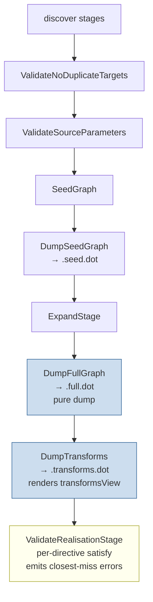

## Context

The percolate annotation processor today runs the per-mapper pipeline **discover → validate-directives → seed → expand → validate-realisation → dump**. The expansion engine builds an over-eager graph in which every strategy emits hopeful single-hop edges (with promises captured as `SUB_SEED` edges and `BridgeStep.elementSeeds`); the outer fixpoint loop iterates until no phase adds edges. `ValidatePathsPhase` then walks `EdgeKind.SEED` edges between `SourceLocation` and `TargetLocation` and confirms a `REALISED` path exists for each user directive. `DumpExpandedGraph` writes `<MapperFqn>.expanded.dot` via `MapperGraph.expandedView()`, which strips `SEED` and `MARKER` edges from the live graph.

Three structural problems compound:

1. **`ValidatePathsPhase` audits only top-level user directives.** `SUB_SEED` edges (strategy-internal promises) and element-seed edges (per-element conversion promises spawned by container strategies) are never inspected. An orphan element seed silently passes validation.
2. **`BridgeSourceToTargetPhase.applySubSeedEmissionRule` drops `step.getElementSeeds()`.** The sibling rule `applyUnifiedEmissionRule` processes them. The two rules are accidentally asymmetric, and the SUB_SEED path is the one strategies hit in nested-container scenarios (`List<Optional<X>> → Optional<Set<Y>>`), where the per-element promise is most consequential.
3. **`ExpandedGraphView` filters by `EdgeKind`, conflating element-seed edges with user-directive seed edges.** Both are encoded as `EdgeKind.SEED`, so the filter strips both.

The integration project at `/home/joke/Projects/joke/percolate-integration` exhibits all three: with `mapAddress` commented out, `PersonMapper` emits a `.expanded.dot` that *looks* successful (a `REALISED` path exists from `List<Optional<Person.Address>>` to `Optional<Set<Human.Address>>` via `SetMap → OptionalWrap`), but the per-element conversion `Optional<Person.Address> → Human.Address` is never producible and there is no record in the graph that anyone promised it.

**Constraints.**
- Strategy SPI (`Bridge`, `BridgeStep`, `ElementSeed`, `SourceStep`, `GroupTarget`) must not change. Existing strategies (`SetMap`, `ListMap`, `OptionalWrap`, …) must work unmodified.
- The convergence-by-node-identity invariant (see `project_expansion_mental_model.md`) must be preserved.
- `MapperGraph` is the single source of truth, and is append-only after construction. `SeedGraph` and `ExpandStage` grow it; no stage ever removes edges or nodes. `MARKER` edges (and any other expansion artifacts) survive into the post-expansion graph and are filtered out only at the view level. This invariant is what makes views safe to share across consumers without lifetime concerns.
- Pre-1.0, single-user project; BREAKING changes to processor-internal types and to debug-output filenames are acceptable.

**Stakeholders.** Solo project. Future third-party strategy authors are an implicit downstream — they will rely on the model the engine implements, including that promises (element seeds, SUB_SEEDs) are honoured by the driver.

## Goals / Non-Goals

**Goals:**
- Realisation validation answers the same question codegen will answer (does a satisfying assignment of `REALISED` edges exist for this directive?), using the same algorithm shape (search with promise-following).
- When a directive is unsatisfiable, the compile error names the strategy whose promise could not be closed and suggests the likely missing piece.
- Debug outputs split into three files that each mean exactly one thing (`what you asked for`, `what we tried`, `what we will pick from`).
- The architecture stays as data + thin views. No global "alive" state, no aliveness fixpoint, no precomputed filter caches. Each consumer asks the question it has.
- Strategy code is unchanged.

**Non-Goals:**
- Code generation itself is still out of scope (the project has none yet); this change prepares the input to a future codegen capability.
- No changes to the seed-graph contract (`SeedGraph` stage), to directive validation (`ValidateNoDuplicateTargets`, `ValidateSourceParameters`), or to discovery stages.
- No changes to the `Bridge`/`BridgeStep`/`ElementSeed`/`SourceStep`/`GroupTarget` SPI signatures or semantics.
- No global "is this node useful?" computation. Whether a node ends up on a codegen-chosen plan is a Dijkstra question and lives in the (future) codegen capability.
- No fourth `.plan.dot` dump in this change. A post-Dijkstra dump can be added when codegen lands.
- No performance optimisation. Per-mapper graphs are tiny; correctness over speed.
- No deprecation window for the `.expanded.dot → .transforms.dot` rename. Single-user project, hard break.

## Decisions

### D1. Architecture is data + thin views + per-directive search

`MapperGraph` is the single source of truth. Three thin filter views serve the three debug dumps:

```
MapperGraph (the data)
   │
   ├── (pass-through)              → DumpFullGraph       → .full.dot
   ├── seed view (untyped SEED edges between SourceLocation and TargetLocation)
   │                               → DumpSeedGraph       → .seed.dot   (existing)
   └── transforms view (REALISED edges + their endpoints,
                        including ElementLocation phantoms used as endpoints)
                                   → DumpTransforms      → .transforms.dot
```

Validation is **not** a view consumer. It is a separate stage running a per-directive `satisfy()` search on the underlying `MapperGraph`. There is no precomputed aliveness, no global filter, no shared cache.

*Alternative considered:* a `PlannedView` that filters by a precomputed aliveness `Set<Node>`. Rejected: validation only needs per-directive answers; computing aliveness for every node is a more general problem than any consumer asked. The aliveness cache would also be invalidated by any post-expansion mutation (which we forbid by convention), creating a lifetime risk for a property nobody requires.

*Alternative considered:* run dumps after validation so failures gate file emission. Rejected: dumps are diagnostic artifacts; their value is highest when validation fails. All three dumps run before validation in the pipeline; validation is the final gate.

### D2. `EdgeKind.ELEMENT_SEED` is a new enum constant, not a discriminator field

Element-seed edges currently use `EdgeKind.SEED`; they connect two `ElementLocation` phantom nodes. The new constant separates them from user-directive seeds (which connect `SourceLocation` to `TargetLocation`). The `satisfy()` search (D3) distinguishes promises (`SUB_SEED`, `ELEMENT_SEED`) from directives by edge kind. `DotRenderer` switches on the new kind for distinct rendering. `MapperGraph.transformsView()` filters on edge kind to determine what `.transforms.dot` contains.

*Alternative considered:* keep `EdgeKind.SEED` and add an `Edge.isElementSeed()` discriminator. Rejected: every view, mask, and renderer already pattern-matches on `EdgeKind` (via JGraphT's `MaskSubgraph` predicate); a new kind is a single-line change at the boundary, while a discriminator method ripples through every consumer. The two semantics are sufficiently different (directive seeds have a `directive` annotation mirror and no `strategyClassFqn`; element seeds have a `strategyClassFqn` and no directive) that a structural distinction is honest.

### D3. Realisation as a per-directive `satisfy()` search

For each user directive, `ValidateRealisationStage` runs:

```
satisfy(targetNode N, visited Set<Node>) -> SAT | UNSAT(closestMiss):
    if N is a source-parameter node:
        return SAT
    if N in visited:
        return UNSAT (cycle; the recursive case is handled per directive — each
                      mapper method is its own directive root with its own search)
    visited' = visited ∪ {N}
    deepestMiss = null
    for each incoming REALISED edge E into N:
        outcome = satisfyEdge(E, visited')
        if outcome is SAT:
            return SAT                          ← first satisfying assignment wins
        if outcome.miss is deeper than deepestMiss:
            deepestMiss = outcome.miss
    return UNSAT(deepestMiss)                   ← or "no incoming REALISED" if none

satisfyEdge(edge E, visited Set<Node>) -> SAT | UNSAT(closestMiss):
    sourceOutcome = satisfy(E.source, visited)
    if sourceOutcome is UNSAT:
        return UNSAT(miss at E: "source not producible: " + E.source)
    for each promise P rooted in E:
        # P is a SUB_SEED edge with from = E.source
        #   or an ELEMENT_SEED edge whose source's parent = E.source
        promiseOutcome = satisfy(P.target, visited)
        if promiseOutcome is UNSAT:
            return UNSAT(miss at E: "promise unsatisfied: " + P.target,
                         strategy = E.strategyClassFqn)
    return SAT
```

"Deeper" miss means farther from the directive's realised target (closer to the source-side leaves). Tie-broken by strategy FQN for stable diagnostics.

*Alternative considered:* a global aliveness fixpoint. Rejected (see D1).

*Alternative considered:* memoise `satisfy()` results across directives within a single run. Deferred — for realistic mapper sizes the recomputation cost is microseconds. Memoise only if profiling demands it.

### D4. `MapperGraph.transformsView()` filters by edge kind and endpoint participation

`transformsView()` returns a `GraphSource` exposing:
- every `REALISED` edge
- every node that is an endpoint of any `REALISED` edge (typed `SourceLocation` and `TargetLocation` nodes, plus `ElementLocation` phantom nodes when they are endpoints of a per-element strategy's `REALISED` edge)

It does **not** expose `SUB_SEED`, `ELEMENT_SEED`, `MARKER`, or directive `SEED` edges. It does not filter by reachability. A `REALISED` edge whose source is not produced by anything (e.g. `SetWrap`'s `Human.Address → Set<Human.Address>` when nothing produces `Human.Address`) still appears — this is the menu of transformations, dead ends included.

Implementation: JGraphT `MaskSubgraph` with two predicates (edge kind == REALISED; vertex is an endpoint of some kept edge).

*Alternative considered:* expose `ELEMENT_SEED` edges in `transformsView` so the per-element decomposition is visible. Rejected for v1: element seeds are promises (bookkeeping), not transformations. The `.full.dot` shows them for diagnosis; the transforms view shows only what codegen will actually walk.

### D5. Symmetric SUB_SEED emission via shared helper

`applyUnifiedEmissionRule` and `applySubSeedEmissionRule` in `BridgeSourceToTargetPhase` collapse into a single private helper that both top-level-seed and SUB_SEED-driven expansion paths invoke. The helper handles `step.getElementSeeds()` once; both paths inherit the behaviour.

*Alternative considered:* keep two methods and add the missing element-seed loop to `applySubSeedEmissionRule`. Rejected: future divergence is the failure mode we just lived through. Collapsing into one helper is the same code-size delta and eliminates the asymmetry-by-construction.

### D6. Three debug outputs, each with exactly one meaning

```
<MapperFqn>.seed.dot         — user directives only; types `?`; "what you asked for"
<MapperFqn>.full.dot         — pure dump of MapperGraph: every kind of edge and node;
                               "what we tried"
<MapperFqn>.transforms.dot   — REALISED edges + endpoints (including ElementLocation
                               phantoms); dead ends included; "what we will pick from"
```

`.full.dot` is produced by `DumpFullGraph` rendering the underlying `MapperGraph` directly. `.transforms.dot` is produced by `DumpTransforms` rendering `MapperGraph.transformsView()`. No styling tricks, no aliveness colouring; the renderer's job is to render what it is given.

A future fourth dump — `.plan.dot`, the Dijkstra-chosen subset — is anticipated when codegen lands. Out of scope for this change.

*Alternative considered:* alive/dead styling in `.full.dot` to help the eye focus on the useful subgraph. Rejected: requires computing aliveness, which we deliberately do not compute. The eye can follow `REALISED` edges in `.transforms.dot` for the useful subset.

### D7. Render styling for `EdgeKind.ELEMENT_SEED`

`ELEMENT_SEED` edges get a distinct color in `DotRenderer` (proposal: `#3366aa`, a muted blue distinct from the existing `#666666` grey used for `SUB_SEED`). All other rendering rules are unchanged from today. No alive/dead distinction; no node-state styling.

### D8. Closest-miss diagnostic is a by-product of `satisfy()` failure

When `satisfy(directive.realisedTarget)` returns UNSAT, the result carries the deepest miss seen during the search: the `REALISED` edge whose source was satisfiable but whose promise was not, along with the strategy that emitted that edge and the type of the unclosable promise. The diagnostic uses this directly.

Format (one line headline, multi-line detail):

```
error: no plan for tgt[addresses] in method mapHuman
  considered SetMap's REALISED List<Optional<Person.Address>> → Set<Human.Address>,
  but its element conversion Optional<Person.Address> → Human.Address was not producible.
  Likely missing: a @Map-annotated method producing Human.Address from Person.Address
                  (or from Optional<Person.Address>).
```

If no `REALISED` incoming edge exists for the directive's realised target at all, the error is the simpler "no realised path."

When multiple deepest misses tie, sort by strategy FQN for stable diagnostic output.

### D9. Pipeline ordering



All three dump stages run before validation so the files are on disk regardless of validation outcome — they are the substrate for diagnosing whatever validation reports. `DumpTransforms` replaces today's `DumpExpandedGraph`; `DumpFullGraph` is new.

### D10. Test infrastructure changes

- `ExpansionFailureModesSpec` (in `processor`) keeps its name and most of its scenarios. Existing scenarios that passed green only because validation didn't audit promises are expected to flip — these are the bug fixes — and either get pinned under `// FOLLOW-UP:` or updated to assert the new error messages.
- A new `SatisfyAlgorithmSpec` (in `processor/src/test/groovy/.../stages/validate/`) covers the `satisfy()` contract directly: SAT cases (parameter, single-hop, multi-hop, with SUB_SEED promises, with ELEMENT_SEED promises), UNSAT cases (no incoming REALISED, source unproducible, single promise unsatisfied, deepest-miss selection across alternatives), tie-breaking (multiple unsatisfiable edges at the same depth → sorted by strategy FQN).
- A new `RealisationErrorMessagesSpec` (in `processor/src/test/groovy/.../stages/validate/`) pins the closest-miss compile-error message shape for representative scenarios (canonical `mapAddress`-missing case; no-incoming-REALISED case; multiple-tie case).
- The property tests under `stages/expand/properties/` get a new property: *every directive target either succeeds `satisfy()` or produces exactly one error diagnostic*.
- The per-strategy specs added by `unit-test-builtin-strategies` (the in-progress change) are unaffected — strategies do not change.

## Risks / Trade-offs

[Risk] **`satisfy()` may revisit the same node across directives**, doing redundant work. For mappers with N directives, worst case is `O(N · |edges|)` per directive.
→ Mitigation: per-mapper graphs are tiny (typically <100 nodes, <300 edges); even worst-case is microseconds. If profiling later shows it matters, memoise within a single per-mapper run (cache `satisfy(node)` results across directives). Premature today.

[Risk] **`satisfy()` cycles via recursive `MethodCallBridge`** edges. A self-recursive REALISED chain (rare but possible) would loop without the `visited` guard.
→ Mitigation: the `visited` set in `satisfy()` treats cycles as UNSAT. This is correct for the common case (no `mapAddress` → can't be satisfied at all) and conservative for legitimate recursion (each mapper method is its own directive with its own search root — a recursive call into a directive that itself fails will be reported per-directive). If we later need transitive recursive aliveness, add a strategy-emitted "local-only" flag on the edge for the search to honour; out of scope here.

[Risk] **Closest-miss messages may be confusing** when multiple strategies competed for the same node and all failed for different reasons.
→ Mitigation: D8 deterministically picks the deepest miss with FQN tie-breaking. `RealisationErrorMessagesSpec` (D10) pins the message shape for canonical scenarios so regressions are caught.

[Risk] **`.full.dot` becomes too noisy** for large mappers with many failed branches.
→ Mitigation: the user has `.transforms.dot` for a clearer view of the transformation menu, and `.seed.dot` for the directive scaffolding. `.full.dot` is intentionally everything; if the volume becomes a problem in practice, a future option can filter to a single failing directive.

[Risk] **Existing `ExpansionFailureModesSpec` scenarios may flip** from green to red.
→ Mitigation: D10 covers the test audit. Pin under `// FOLLOW-UP:` if a scenario was a genuine false-positive (uncloseable graph that should always have been an error), otherwise update assertions to match the new error shape.

[Risk] **BREAKING rename `.expanded.dot → .transforms.dot`** breaks any CI script or developer tool that greps the old name.
→ Mitigation: announced in `proposal.md`. No deprecation window — pre-1.0, single user, breakage is acceptable.

[Trade-off] **`satisfy()` returns the first SAT it finds, not the cheapest one.** Cheapest-path selection is a codegen concern (Dijkstra). For validation, "at least one exists" is the right question.
→ Acceptance: this matches the future codegen division of labour. Validation says SAT/UNSAT; codegen picks the witness.

[Trade-off] **Closest-miss messages are longer** than a one-line "no path" error. For users familiar with mapstruct/dagger compile messages, the length is consistent with prior art; for users new to percolate, the verbosity helps onboarding. Accepted.

## Migration Plan

Single-user, pre-1.0 project. No deprecation window. Sequence the work as a single change landing atomically:

1. `EdgeKind.ELEMENT_SEED` constant + update `Edge.elementSeed(...)` factory to use it.
2. Make `BridgeSourceToTargetPhase`'s emission rules symmetric via shared helper (D5).
3. Rewrite `ValidateRealisationStage` as per-directive `satisfy()` with closest-miss mining (D3, D8). Delete `ValidateMarkersPhase`. `ValidatePathsPhase` either evaporates into `ValidateRealisationStage`'s body or becomes a thin helper.
4. Add `MapperGraph.transformsView()` (and rename / repurpose the old `expandedView`); rename `ExpandedGraphView` accordingly. The new view is a JGraphT `MaskSubgraph` filtering by `EdgeKind.REALISED` and endpoint participation (D4).
5. Rename `DumpExpandedGraph` → `DumpTransforms`; add sibling `DumpFullGraph` (renders the underlying `MapperGraph` as a pass-through).
6. Update `DotRenderer` for `ELEMENT_SEED` kind (distinct color); remove any remaining alive/dead styling assumptions.
7. Wire pipeline order in `ProcessorModule` (D9): `…ExpandStage → DumpFullGraph → DumpTransforms → ValidateRealisationStage`.
8. Restructure tests per D10.

Rollback: change is self-contained; `git revert` of the single change commit suffices.

## Open Questions

**OQ1.** Should the `satisfy()` algorithm be factored into a small dedicated capability (e.g. `directive-satisfiability`) so future codegen can share it? Tentative answer: keep it inside `realisation-validation` for now. Codegen's search will need to pick concrete edges and emit code, so it likely subclasses or generalises `satisfy()` rather than calling it directly. Extract when the shared shape becomes clear.

**OQ2.** Should `satisfy()` memoise results within a single per-mapper run? Tentative answer: no for v1 — the cost without memoisation is microseconds. Add memoisation only if profiling shows it matters or if codegen ends up calling `satisfy()` thousands of times per mapper.
