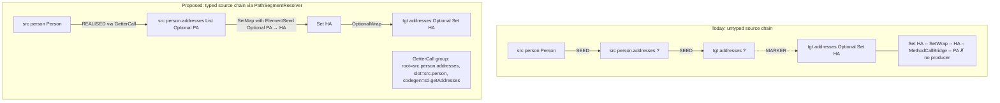
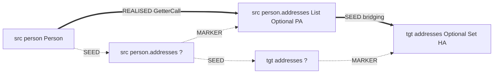

## Context

After `target-to-source-expansion` landed, the expansion engine walks from typed target slots toward source candidates using `Bridge`s and `GroupTarget`s. `SeedGraph` produces an untyped seed source chain (e.g., `src[person.addresses] : ?`) that is preserved for diagnostic origin tracking via `MARKER` edges but never typed by any stage. The deleted `ResolveSourceChainsPhase` previously walked these chains with a `SourceStep` SPI; it was removed on the assumption that `GetterRead`-as-`Bridge` would derive source typing on demand during expansion.

Integration on `~/Projects/joke/percolate-integration/mappers/PersonMapper` shows the assumption is wrong on two axes:

1. **Container chains dead-end.** `tgt[addresses] : Optional<Set<Human.Address>>` expands via `OptionalWrap` → `SetWrap` → `Human.Address`, then `MethodCallBridge` (with its filter relaxed in the parent branch) emits `mapAddress(Person.Address) → Human.Address`. The chain stops at `Person.Address` because no candidate in `mapHuman`'s scope is `Person.Address` and no `Bridge` can manufacture one — `SetMap`/`OptionalUnwrap` need an iterable/optional `from` candidate that only exists if the source path `person.addresses` is typed.
2. **Scalar source pick is wrong.** When two parameters share a type (`Person person, Person person2`), `GetterRead`-as-`Bridge` at frontier `String` picks whichever `Person` candidate sorts first by id, ignoring `@Map(source = "person.lastName")` vs `@Map(source = "person2.first")`. The code compiles, but reads from the wrong receiver.

Both stem from the engine not honoring the seed-chain's source-root commitment. The seed graph already encodes the directive's intent (`src[person] → src[person.lastName] → tgt[lastName]`); the expansion ignores it.



## Goals / Non-Goals

**Goals:**

- Type every directive's source-path segments at seed time, using a pluggable SPI so that getters, record components, and direct field reads each have their own resolver with distinct codegen.
- Bake the resolved source chain into `ExpansionGroup`s (one 1-slot group per segment), with the **specific** receiver source node as the slot — eliminating type-ambiguous candidate selection.
- Fix the two integration regressions described in the proposal: `tgt[addresses]` compiles via `mapAddress`; `tgt[firstName]`/`tgt[lastName]` read from the directive-named receiver.
- Keep the new SPI in `spi/`, the built-in implementations in `strategies-builtin/`, and confine engine awareness of source-path resolution to `processor/stages/seed/`. No leakage of engine internals into the SPI.
- Preserve the seed-leaf untyped source nodes and their `MARKER` edges (origin tracking remains intact for diagnostics).

**Non-Goals:**

- Automatic same-name mapping (no `@Map` directive needed). Architecture allows it as a future directive-synthesis pre-pass, but it is not implemented here.
- Multi-segment target paths (`target = "person.address.street"`). Architecture allows it via existing `GroupTarget` recursion + marker-bookkeeping extension; not implemented here.
- Removal of `GetterRead`-as-`Bridge`. Once seed-time resolution is in, the Bridge becomes redundant for source typing, but ripping it out in the same change risks regressing scenarios outside the integration target. Deferred to a follow-up change.
- Changes to the `MethodCallBridge` filter relaxation already applied in this branch. It is orthogonal and stays.

## Decisions

### Decision 1: `PathSegmentResolver` SPI is pure-value-typed

The SPI surface:

```java
public interface PathSegmentResolver {
    Optional<ResolvedSegment> resolve(
        TypeMirror parentType,
        String segment,
        ResolveCtx ctx);
}

public final class ResolvedSegment {
    private final TypeMirror returnType;
    private final EdgeCodegen codegen;
    private final int weight;
}
```

**Why a value-typed return rather than direct graph mutation:**

- Mirrors `Bridge` → `BridgeStep` and `GroupTarget` → `GroupBuild`. Established pattern in the codebase.
- Keeps the SPI free of `processor.graph` types (`Node`, `Edge`, `ExpansionGroup`, `MapperGraph`). The module compile graph already forbids `strategies-builtin` from depending on `processor` internals; this preserves that boundary.
- Lets the caller (`SeedGraph`) decide where to allocate nodes, which scope to use, and how to register the group — caller has all the context.

**Alternatives considered:**

- *Resolver builds the `ExpansionGroup` directly.* Rejected: forces SPI to import `processor.graph`, breaks module isolation.
- *Resolver returns a list of mutations / `GraphDelta`.* Rejected: `GraphDelta` lives in `processor.graph`; same boundary issue.

### Decision 2: Three independent resolvers, no shared base class

Built-ins ship as separate `@AutoService(PathSegmentResolver.class)` classes:

- `GetterPathResolver`: probes `get<Segment>()` then `is<Segment>()` (boolean-returning only); falls back to a no-prefix `<segment>()` method. Codegen renders `s0.<methodName>()`.
- `RecordPathResolver`: probes for the canonical record accessor `<segment>()` whose enclosing element is a `RECORD`. Codegen renders `s0.<segment>()`.
- `FieldPathResolver`: probes for a non-static, non-private field literally named `<segment>`. Codegen renders `s0.<segment>` (field read, no parens).

**Why three classes instead of one with a chain of probes:**

- Each resolver is independently testable (matches `builtin-strategy-unit-tests` capability conventions).
- Priority becomes a simple `ServiceLoader` ordering concern, settled by class-name sort in `ProcessorModule` (same convention as `bridgeStrategies()` and `groupTargets()`).
- New mechanisms (e.g., a future `KotlinPropertyPathResolver`) are added as one file, not a modification of an existing class.

**Why not a base class:**

- Lookup logic differs substantively (method-name conventions vs. record-component constraints vs. field rules). Sharing a base would either thin out to a single abstract `findMember` method (negligible code save) or force inheritance to model orthogonal differences (anti-pattern).
- Codegen differs (`()` vs. `.field`); a base class would parameterize that, adding indirection for two lines saved.

**Alternatives considered:**

- *Single `MemberPathResolver` with a discriminator enum.* Rejected: enum-switch over discriminator is exactly what separate classes encode more cleanly.
- *Composition: one resolver delegates to internal probe strategies.* Rejected: over-engineered for three implementations; revisit if the count grows past five or six.

### Decision 3: `SeedGraph` walks source paths and registers `GetterCall`-style groups

For each directive's source path `param.segA.segB`:

1. Start with the parameter-root source node `src[param]` (already typed by `SeedGraph`).
2. For each non-root segment `seg`:
   - Iterate resolvers (sorted by class name); take the first `Optional.of(ResolvedSegment)`.
   - Allocate a typed source node `src[param.<...>.seg]` with `returnType` from the `ResolvedSegment`.
   - Register a 1-slot `ExpansionGroup`:
     - `root` = new typed node
     - `slot` = previous (parent) typed node
     - `codegen` = resolved codegen
     - `strategyClassFqn` = resolver's class name
   - Add a `REALISED` edge `slot → root` carrying the resolved codegen (matches the standing `Edge.realised` contract — slot-incoming for the group).
   - Add a `MARKER` edge from the original untyped seed-leaf source node to the new typed node, for diagnostic origin tracking (symmetric with how target seed-leaves connect to typed slots).
   - The new typed node becomes the parent for the next segment.
3. Replace the directive's "bridging" seed edge — currently `deepestUntypedSource → deepestTarget` — with `deepestTypedSource → deepestTarget` so downstream expansion connects to the typed chain. (The untyped chain stays for diagnostics, but the bridge from source to target now lands on a typed node.)



**Why register `ExpansionGroup`s rather than just edges:**

- Uniformity with `ConstructorCall` (also a group). Both `ResolveTargetChainsPhase` and `ExpandGroupsPhase` already iterate `graph.groups()` and respect group views — no special-casing.
- The dot renderer renders one cluster per group; getter calls show up as labeled boxes in `*.full.dot`, improving readability.
- Group registration tracks the per-segment codegen and strategy FQN consistently with how other call sites are tracked.

**Why bake the parent node into the slot (not "any node of parent type"):**

- This is the core fix for the wrong-getter problem. The slot is a specific `Node` instance (e.g., `src[person]`), not a type. When `ExpandGroupsPhase` resolves the slot, it consults `slotReachable(slot, graph, sourceRoots)` — slot reachability is checked on the specific node, so the only way the slot is satisfied is via `src[person]`, not `src[person2]`.

### Decision 4: Resolver priority via `ServiceLoader` class-name sort

`ProcessorModule.pathSegmentResolvers()` collects via `ServiceLoader`, sorts by `Class.getName()`, returns an immutable `List`. Iteration order in `SeedGraph` is the sort order.

This means a directive segment that could match a getter *and* a field resolves the same way every run. Today's class-name sort yields `FieldPathResolver < GetterPathResolver < RecordPathResolver` — fields would win when both apply. If we want a different default (e.g., prefer getters over fields), that's a single-line change in the sort comparator, not an SPI change.

**Alternatives considered:**

- *Annotation-based priority (`@Priority(int)`).* Rejected: adds a `spi` dependency for one knob we don't yet need. Class-name sort is deterministic and overrideable in `ProcessorModule` if priorities ever matter.
- *First-resolver-wins per call.* Today's outcome — fine.

### Decision 5: Untyped seed chain stays

The untyped seed source chain (`src[person] → src[person.addresses] → tgt[addresses-leaf]`) is preserved. The new typed chain runs in parallel:

- Untyped chain: pure `SEED` edges, never participates in realisation.
- Typed chain: `REALISED` edges (slot-incoming for GetterCall groups), drives expansion.
- Bridge: `MARKER` edges from untyped seed-leaves to their typed counterparts, used only by diagnostics.

This matches how target seed-leaves coexist with typed constructor slots today.

### Decision 6: Bridging seed edge lands on the typed source

`SeedGraph.seedDirective` currently ends with:

```java
graph.addEdge(Edge.seed(deepestUntypedSource, deepestUntypedTarget, ...));
```

After this change, when source-path resolution succeeds, the bridge seeds:

```java
graph.addEdge(Edge.seed(deepestTypedSource, deepestUntypedTarget, ...));
```

The untyped target leaf still exists; what changes is that the directive's "source feeds target" SEED edge originates from the typed source. Downstream `ResolveTargetChainsPhase` and `ExpandGroupsPhase` see a typed node feeding the seed-leaf target, which connects via MARKER to the typed slot.

If source-path resolution fails for any segment (no resolver matches), the bridge edge falls back to the untyped chain (current behavior). The expansion will then dead-end at the untyped node and produce the existing closest-miss diagnostic — no silent code regression.

## Risks / Trade-offs

[**Risk**] Diamond-shape access conflict: a Lombok `@Value` Person has both a generated `getLastName()` getter and a `private final String lastName` field. `FieldPathResolver` rejects private fields (one of its filters), so this resolves cleanly. But a `public final String lastName` would match both `FieldPathResolver` *and* `GetterPathResolver`. → **Mitigation:** class-name sort makes the outcome deterministic; document it in the spec scenario; revisit priority only if user feedback demands it.

[**Risk**] Resolver match for the wrong overload: a parent type might have `getName(String suffix)` and `getName()` simultaneously. `GetterPathResolver` must require zero parameters (matches today's `GetterRead`-as-`Bridge` semantics). → **Mitigation:** pinned in the `GetterPathResolverSpec` scenarios; rejection of parameterized overloads is non-negotiable.

[**Risk**] Path traversal collision: directive `source = "p"` (1-segment) is already a parameter root and is *not* processed by path resolution (no segments beyond the root). The current `SeedGraph` already creates a separate empty-typed `src[p]` node alongside the parameter root for single-segment directives — that path stays untouched. → **Mitigation:** path resolution runs only when `sourceSegments.size() > 1`. Single-segment directives behave exactly as today.

[**Risk**] `GetterRead`-as-`Bridge` still fires during expansion and may pick wrong getters for cases where source resolution didn't run (e.g., scenarios without `@Map` directives, if any survive in tests). → **Mitigation:** Audit `processor` and `strategies-builtin` tests for cases that depend on `GetterRead`-as-`Bridge` behavior; either pin the dependency explicitly or update the test to seed a directive. Defer removal of `GetterRead`-as-`Bridge` to a follow-up change after integration is green, so this risk has time to surface.

[**Risk**] Untyped path mid-chain (e.g., parent is a generic type variable). `GetterPathResolver` probes via `Elements.getAllMembers(typeElement)` and needs `parentType.getKind() == DECLARED`. For generic / type-variable / array parents, no resolver will match and the chain fails to type. → **Mitigation:** SeedGraph treats unresolved segments as a hard failure for *that segment* and stops typing the chain; downstream expansion dead-ends with the existing diagnostic. A future enhancement could handle generics, but it's outside this change's goals.

[**Risk**] Two directives target the same source path (`source = "person.addresses"` appears twice). Path resolution registers a GetterCall group on the first walk; on the second walk, the typed node already exists. → **Mitigation:** `SeedGraph` keeps a per-scope cache `Map<List<String>, Node>` of typed source paths; lookups within the same method scope reuse the existing typed node and skip re-registering the group. Cache lifetime is per-method (scope-keyed).

## Migration Plan

This is a pure addition for source-path typing; the existing untyped seed chain remains intact in parallel. No persisted state, no runtime data migration. Deployment plan:

1. Land SPI in `spi/` module.
2. Land built-in resolvers in `strategies-builtin/` with `@AutoService` + unit specs.
3. Wire `pathSegmentResolvers()` provider in `ProcessorModule`.
4. Extend `SeedGraph` to inject and use resolvers.
5. Run `./gradlew check` (all modules); verify no spec regressions.
6. Run integration build at `~/Projects/joke/percolate-integration` with `mapAddress` present and absent (success / closest-miss diagnostic).
7. Inspect generated `PersonMapper.java` to confirm getters call the directive-named receiver.

Rollback: revert the `SeedGraph` change. The SPI and resolvers can stay (unused); the engine reverts to pre-change behavior immediately.

## Open Questions

- Should `GetterPathResolver` accept JavaBean-style `getXxx()` even when the parent type is not annotated as a JavaBean or `@Value`? Current decision: yes, by member-name match only (no annotation check). Aligns with the existing `GetterRead`-as-`Bridge` semantics.
- For a future auto-mapping pre-pass, do we want to lock the resolver iteration order across the synthesis pass and the seed pass? Likely yes (same `ProcessorModule`-provided list), but the auto-mapping change can answer this.
- Should the resolver SPI expose a way to *enumerate* all matching members on a parent (for auto-mapping discovery) versus the current segment-name-based lookup? Deferred to the auto-mapping change; this change ships only `resolve(parent, segment, ctx)`.
