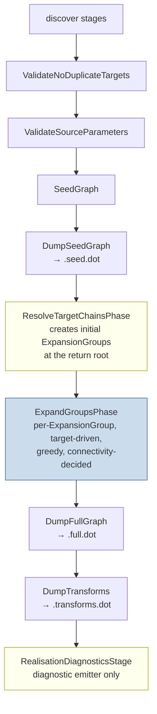

## Context

After `expansion-pruning`'s in-flight work, the bridge phase still drives **forward**: `BridgeSourceToTargetPhase` iterates `SEED` / `SUB_SEED` / `ELEMENT_SEED` edges and asks bridges `bridge(F.type, T.type, ctx)`, applying the unified emission rule with input- and output-side intermediate allocation, `SUB_SEED` re-seeding, and `ELEMENT_SEED` emission. This is wrong, and has regressed multiple times across implementation rounds without being caught — see `feedback_never_forward_expansion` in conversational memory. The intended model is per-expansion-group target-driven expansion.

Forward expansion's costs are visible in `~/Projects/joke/percolate-integration`'s `PersonMapper.full.dot` (with the latest `expansion-pruning` snapshot): dead `H.A` intermediates from `SetWrap`-style speculation, orphan `elem(parent=…)` clusters with no graph edge to their parent containers, and `satisfy()` workarounds (same-strategy SUB_SEED filtering, source-parameter-root checks, deeper-miss propagation) that exist only to compensate for forward-emission debris.

Two earlier iterations of this change explored alternatives that turned out structurally inadequate:

- **Per-SEED-edge target-driven driver.** Each SEED edge defined its own subgraph; expansion ran independently per directive. This failed to express AND-join semantics (a constructor needs every slot reached simultaneously) and stumbled on source-side untyped SEED endpoints lacking a MARKER counterpart. A SEED-chain-walk fallback in `resolveTypedCounterpart` was needed just to find a typed boundary for source-chain seeds.
- **Exhaustive multigraph search with Dijkstra at codegen.** Conceptually clean — keep every offered producer, let codegen pick the cheapest. But the AND-join at a constructor fan-in requires per-group cost summation rather than vanilla shortest-path, and the multigraph machinery is unjustified by current mapper sizes.

The accepted model is **per-expansion-group, greedy, target-driven** expansion. The unit of work is the `ExpansionGroup`: a strategy's contribution (one root, N slots, codegen) made into a persistent JGraphT subgraph object. Groups link naturally via shared nodes when one group's slot is filled by another group's root.

**Stakeholders.** Solo project. Future strategy authors are an implicit downstream — under this design, the only SPI for expansion work is `Bridge` (for single-input transformations) and `GroupTarget` (for multi-input grouped transformations), a simpler contract than the current `Bridge` + `SourceStep` split.

**Constraints.**
- The user has corrected forward-direction regressions 3+ times. Any review of expansion-related code MUST verify direction upfront.
- `MapperGraph` is append-only after construction.
- Pre-1.0, single-user project; BREAKING processor-internal changes acceptable.
- `expansion-pruning` is archived without final integration application; its committed code is the baseline this change rewrites.

## Goals / Non-Goals

**Goals:**

- Expansion is per-group, target-driven, greedy. Each `ExpansionGroup` is one work item; the driver walks back from the group's slots through `Bridge` queries until each slot reaches a source-parameter-root (SAT) or termination conditions are reached (UNSAT).
- Expansion groups are persistent subgraph objects. `ExpansionGroup` carries an `AsSubgraph<Node, Edge>` view over the shared `MapperGraph` plus its root, slots, codegen, and strategy class FQN. Group membership is structural — "is this edge in the group's edge set?" — not metadata on the edge.
- Groups link via shared nodes. A slot of an outer group is the root of an inner group when a multi-input strategy fills the slot. No `parent`-pointer or back-reference is needed; node identity at the boundary connects the subgraphs.
- One SPI for single-input expansion work: `Bridge`. `SourceStep` is deleted. Source-side reach (today's `GetterRead`) is rewritten as a `Bridge` implementation.
- Multi-input strategies remain `GroupTarget` (constructor calls, builder chains). `GroupTarget` returns a `GroupBuild` which the driver lifts into an `ExpansionGroup`.
- Greedy commit. Each slot is filled exactly once with the first matching `Bridge` step (deterministic tie-break by `strategyClassFqn`). Alternative producers are not retained.
- Connectivity is intrinsic. For each group, after slot resolution, `ConnectivityInspector` over the group's REALISED-only view confirms every slot is reached by a path from a source-parameter-root.
- All failing groups are reported in a single compile. The driver never bails on the first UNSAT.
- SEED edges describe the directive framing; they do not drive expansion. They survive in the graph for `.seed.dot` rendering and for diagnostic origin-tracking.

**Non-Goals:**

- No code generation work. This change prepares the graph shape and the `ExpansionGroup` registry codegen will consume.
- No changes to `SeedGraph`, `ValidateNoDuplicateTargets`, `ValidateSourceParameters`, or discovery stages.
- No changes to `Bridge` / `BridgeStep` / `ElementSeed` / `GroupTarget` / `GroupBuild` / `Slot` SPI signatures.
- No performance optimisation. Per-mapper graphs are tiny.
- No multigraph picking heuristic for codegen. Under greedy expansion no picking is needed — each slot has exactly one producer.

## Decisions

### D1. Per-group, greedy, target-driven

The new driver — `ExpandGroupsPhase` — iterates `ExpansionGroup` objects from a work list and fills each:

```
ExpandGroupsPhase.apply(MapperGraph graph):
    workList = [every group already in graph.groups()]
    outcomes = {}
    while workList not empty:
        G = workList.removeFirst()
        outcome = fillGroup(G, graph, workList)
        outcomes[G] = outcome
    record outcomes in MapperContext for the diagnostic stage.

fillGroup(ExpansionGroup G, MapperGraph graph, Deque workList):
    realisedView = MaskSubgraph(graph, edgePredicate = (e -> e.kind == REALISED))
    inspector = new ConnectivityInspector(realisedView)
    sourceRoots = graph.nodes()
        .filter(n -> n.loc instanceof SourceLocation
                  && ((SourceLocation) n.loc).path.size() == 1
                  && n.type.isPresent())
        .collect(toSet)
    for slot in G.slots:
        outcome = resolveSlot(slot, graph, inspector, sourceRoots, workList)
        if outcome != SAT:
            return UNSAT(slot, outcome.reason)
    return SAT

resolveSlot(Node slot, MapperGraph graph, ConnectivityInspector inspector, Set<Node> sourceRoots, Deque workList):
    if any sourceRoot in sourceRoots: inspector.pathExists(sourceRoot, slot):
        return SAT  // already reachable (e.g., a sibling group filled the producer)
    frontier = {slot}
    for round in 1..MAX_SLOT_ROUNDS:
        newNodes = []
        for F in frontier:
            for B in registered Bridges (deterministic order by class FQN):
                for candidate in candidateInputs(F, graph) (deterministic order by id):
                    for step in B.bridge(candidate.type, F.type, ctx):
                        committed = commit(graph, F, candidate, step, B, workList)
                        if committed != null:
                            newNodes.add(committed)
                            break  // greedy: first matching step per (F, B, candidate) wins
                    if first match committed for F via B: break candidate loop
                if first match committed for F via any B: break B loop
        // re-check connectivity after each round
        if any sourceRoot in sourceRoots: inspector.pathExists(sourceRoot, slot):
            return SAT
        if newNodes is empty:
            return UNSAT(no-plan)
        frontier = newNodes
    return UNSAT(did-not-converge)
```

`commit(graph, F, candidate, step, B, workList)`:

1. Look up the `BridgeStep`'s input requirements. A `BridgeStep` is single-input by contract; multi-input is signalled by the strategy returning a `GroupBuild` via the `GroupTarget` SPI (not via `Bridge`).
2. If `candidate.type` matches `step.inputType`, the input endpoint is `candidate` (existing typed node). Otherwise allocate a fresh `Node` for `step.inputType` at the candidate's location.
3. Emit one `REALISED` edge from the input node to `F`, carrying `step.weight`, `step.codegen`, and `B.class.fqn`.
4. For each `ElementSeed es` in `step.elementSeeds`, allocate two element-location nodes (typed `es.inputType` and `es.outputType`) and register a nested `ExpansionGroup` rooted at the element-output node with one slot (the element-input node). Append the new group to `workList`. (This is how container bridges like `SetMap` propagate their per-element conversion requirement.)
5. Return the freshly-allocated input node (or `null` if the input was an existing candidate — meaning expansion has reached a typed source-side node).

**Multi-input bridges via `GroupTarget`.** When a strategy is fundamentally multi-input (a hypothetical `StringConcat(prefix, body) → String`, or `ConstructorCall`'s constructor), it implements `GroupTarget`, not `Bridge`. `GroupTarget` is queried at target-chain time (for return-rooted groups) or — for non-return roots — through a dedicated query during slot resolution: when no `Bridge` step matches a frontier slot, the driver asks each `GroupTarget` "can you build this slot's type?" A non-empty `GroupBuild` answer creates a nested `ExpansionGroup` on the slot and the slot defers; the new group joins the work list.

This unifies "constructor at return root" (today's `ResolveTargetChainsPhase`) and "constructor as a multi-input bridge inside expansion" under one `GroupTarget` SPI. The target-chain phase remains a separate pre-expansion step for the return root specifically, because the return type is special (it anchors the whole mapper).

*Alternative considered:* per-SEED-edge subgraph (the previous iteration). **Rejected**: doesn't express AND-join semantics; required SEED-chain-walk fallback in `resolveTypedCounterpart`; bridging seeds with untyped source endpoints couldn't be expanded.

*Alternative considered:* exhaustive multigraph with Dijkstra at codegen. **Rejected**: the AND-join requires per-group cost summation, more complex than vanilla shortest-path, and current mapper sizes don't justify the complexity. Can be revisited if strategy multiplicity grows.

### D2. `Bridge` and `GroupTarget` are the only SPIs; `SourceStep` is deleted

- `Bridge`: single-input, single-output transformations. Queried during slot resolution.
- `GroupTarget`: multi-input, single-output groups. Queried (a) by `ResolveTargetChainsPhase` for the return root, and (b) by `ExpandGroupsPhase` for non-return slots when no `Bridge` step matches.

Today's `GetterRead` (the only `SourceStep` implementation) is rewritten as a `Bridge`:

```
class GetterRead implements Bridge:
    Stream<BridgeStep> bridge(TypeMirror from, TypeMirror to, ResolveCtx ctx):
        return findGetter(from, to, ctx)
            .map(getter -> new BridgeStep(from, to, Weights.STEP, getterCodegen(getter), []));
```

Multi-hop access (`person.address.street`) emerges from the recursive slot expansion: the driver walks back from a `String` slot, asks `Bridge`s with each candidate, gets a match from `GetterRead(Person, String, ctx)` if Person has a String getter directly. If not, the round adds an intermediate frontier node typed `Address` (via some other bridge or via the candidate enumeration when `Address` is in scope), and the next round resolves `Person → Address` via `GetterRead`.

*Alternative considered:* a dedicated source-side SPI (`SourceReach`). **Rejected**: more SPI surface, more engine logic, more regression-prone direction split. One SPI per input multiplicity.

### D3. `EdgeKind` is `{SEED, REALISED, MARKER}`

`SUB_SEED` and `ELEMENT_SEED` collapse into `SEED` at the appropriate scope. The driver doesn't need to distinguish "user-emitted" from "strategy-emitted" — both are framing. Strategy-emitted nested seeds are no longer needed because nested expansion work is expressed via `ExpansionGroup`, not via new SEED edges.

`Edge.groupId : Optional<String>` is **removed**. Group membership of a REALISED edge is determined by membership in an `ExpansionGroup`'s edge set:

```java
public Optional<ExpansionGroup> groupOf(final Edge edge) {
    return groups.stream().filter(g -> g.view().containsEdge(edge)).findFirst();
}
```

For small group counts (typical mapper has 1–5 groups) this linear scan is trivial. A reverse `Map<Edge, ExpansionGroup>` cache may be built if profiling shows it matters.

`Edge.directive : Optional<AnnotationMirror>` is retained on SEED edges (for diagnostic anchoring) and absent on REALISED and MARKER edges.

`Edge.strategyClassFqn : Optional<String>` is retained on REALISED, MARKER, and strategy-emitted SEED edges (the latter for tie-break determinism in diagnostics).

### D4. Instance identity; no `Node.parent`; no dedup

`Node` becomes a Lombok-free JVM-identity class:

- `scope`, `loc`, `type` are **presentation attributes** consumed by the renderer and the diagnostic formatter. They do not participate in `equals` / `hashCode`.
- `parent` field is deleted. Element-scope nodes' "belongs to that container" relationship is encoded by their participation in a nested `ExpansionGroup` whose root is the container's output node.
- `id()` returns `"node@" + System.identityHashCode(this)` for stable-per-run debug output.
- `Node` equality is reference equality.

The "always allocate fresh" rule applies in the expansion driver: every `commit(...)` that needs an intermediate input node allocates a fresh `Node` instance. Slots of nested groups likewise are fresh allocations created by the strategy's `GroupBuild`.

Multi-directive convergence on a shared boundary (e.g., `tgt[]:Human` constructed once even with multiple directives targeting its slots) is handled by `ResolveTargetChainsPhase` building the shared scaffolding **once** before expansion runs. Expansion never *creates* `tgt[]:Human` or its constructor slot nodes — it references them as the root and slots of the constructor's `ExpansionGroup`. No dedup is needed because there is nothing to dedup against.

### D5. Greedy commit; the graph is a recipe, not a search space

Each slot is filled by **exactly one** REALISED-emitting bridge step. The driver iterates bridges and candidates in deterministic order (lexical by `strategyClassFqn`, then by `Node.id()` for candidates) and commits the first matching step. Subsequent matches for the same slot are skipped.

This is a deliberate change from the earlier exhaustive-multigraph proposal. Consequences:

- The transforms view is a DAG (or forest of group-joined DAGs), not a multigraph.
- Codegen reads the graph and emits — no Dijkstra at codegen time.
- Dead REALISED edges do not appear under greedy commit, because alternatives are never committed.
- If a slot has no producer, the slot's outcome is UNSAT; its containing group's outcome is UNSAT; the diagnostic identifies the failing slot.

*Trade-off:* if two strategies could produce the same slot's type at different costs, the determinism is "first by FQN wins" — not "cheapest wins." Strategy authors who care about ordering can rely on the alphabetical tie-break; for practical mappers the situation is uncommon. If multi-producer cost selection becomes important, the design can be revisited (re-add exhaustive commit + Dijkstra later); the migration would be local to `ExpandGroupsPhase` plus `transformsView`.

### D6. Termination: per-slot, per-group

Per-slot resolution terminates on the first of:

- **Connectivity achieved.** `ConnectivityInspector` on the REALISED-only view finds a path from some source-parameter-root to the slot. → SAT.
- **Fixed point.** A round adds no new nodes. → UNSAT(no-plan).
- **Max rounds exceeded.** `MAX_SLOT_ROUNDS = 64`. → UNSAT(did-not-converge).

A group terminates SAT when **all** its slots terminate SAT. A group terminates UNSAT on the **first** slot that terminates UNSAT (the failing slot is recorded for diagnostics). Subsequent slots of the same group are not resolved.

The work list ordering matters because nested groups may share a slot's input chain with previously-filled siblings. Processing the work list FIFO ensures earlier groups' slot chains are visible to later groups via the shared graph. This is structurally important under greedy commit — a later group should reuse the producer chain that an earlier sibling already committed.

### D7. Closest-miss diagnostic: walked once per UNSAT group's failing slot

When a group's slot terminates UNSAT, the diagnostic stage walks back from the slot through `REALISED` edges to find the deepest reachable node `M`. The closest-miss explanation names:

- The slot's target path (`tgt[<path>]`) from the slot's `Location`.
- The method name from the originating directive's mirror (looked up via the chain of SEED framing edges).
- `M`'s incoming `REALISED` edges (if any): strategies that did offer producers reaching `M`.
- The first missing producer beyond `M`: strategies that should have offered producers but didn't.

The message shape is preserved verbatim from `expansion-pruning`'s `Closest-miss diagnostic` requirement.

*Walked at report time, not commit time.* Closest-miss runs in `RealisationDiagnosticsStage`, not in `ExpandGroupsPhase`. The expansion driver records only the group + failing-slot + reason triple; diagnostic formatting is decoupled.

### D8. Pipeline ordering



`ResolveSourceChainsPhase` is **removed** from this pipeline. Source-side typing happens implicitly inside `ExpandGroupsPhase` when `GetterRead`-as-`Bridge` queries traverse from source parameter roots toward each slot.

`ExpandStage.run(...)` invokes each phase exactly once. No outer fixpoint loop.

### D9. Codegen view

`MapperGraph.transformsView()` returns a `MaskSubgraph` filtering only `REALISED` edges. Codegen iterates `MapperGraph.groups()` to emit code in execution order: each group's `codegen` is invoked with the slot values bound to expressions derived from the group's slot-incoming-edge chains.

Under greedy commit, the codegen substrate is unambiguous — every slot has exactly one producing path, and every group's codegen function unambiguously names how to combine slot values into the root value. No Dijkstra-style decision is needed at codegen time.

`MARKER` edges do not appear in `transformsView` (the mask is `kind == REALISED`). They remain in the underlying graph for `.full.dot` rendering and for diagnostic origin-tracking.

### D10. `ExpansionGroup` value type and `MapperGraph` registry

```java
public final class ExpansionGroup {
    private final Node root;
    private final List<Node> slots;
    private final GroupCodegen codegen;
    private final String strategyClassFqn;
    private final AsSubgraph<Node, Edge> view;

    // factory: built when a strategy returns a GroupBuild
    public static ExpansionGroup of(Node root, List<Node> slots, GroupCodegen codegen,
                                    String strategyClassFqn, Set<Edge> initialEdges,
                                    MapperGraph mapperGraph) { ... }

    public boolean contains(Edge e) { return view.containsEdge(e); }
    public boolean containsRealisedChainForSlot(Node slot, ConnectivityInspector inspector,
                                                Set<Node> sourceRoots) { ... }
}
```

`MapperGraph` carries `List<ExpansionGroup> groups`. The list is append-only (like nodes and edges). `addGroup(ExpansionGroup)` validates that the group's root and slots are nodes of the underlying graph and that the group's initial edges are REALISED edges already added to the underlying graph.

The `AsSubgraph` view is constructed from the group's `(initialNodes, initialEdges)` and tracks subsequent additions: when the expansion driver adds REALISED edges that connect into the group's slot-incoming chain, those edges live in the underlying graph and are *not* automatically members of the group's subgraph. Group membership stays at the strategy-emitted-edge level (the codegen's direct inputs); deeper chain edges are visible via the underlying graph or the `transformsView`. This keeps each group focused on "my codegen's direct inputs" and avoids the nested-group transitive-closure ambiguity.

*Trade-off considered:* widen group subgraph to transitive closure backward from root. **Rejected**: makes nested groups overlap (a parent group would contain its child group's interior), complicates rendering, and conflates "my codegen's inputs" with "everything I depend on." The narrow boundary is cleaner.

## Risks / Trade-offs

[Risk] **Forward-direction regression.** The engine has flipped back to forward expansion 3+ times across implementation rounds. The driver's tests must include an assertion that bridges are queried with frontier-node-type as `outputType` (not as `inputType`), and reviewers must verify direction before accepting any patch that touches `ExpandGroupsPhase`.
→ Mitigation: a `@Tag('direction-invariant')` Spock test that mocks a Bridge, runs expansion, and asserts the bridge was called with `outputType == slot.type`. Plus `feedback_never_forward_expansion` in conversational memory for AI-assisted reviews.

[Risk] **Greedy commit may hide cheaper alternatives.** A registered bridge that's lexically earlier than a cheaper alternative wins the slot. If later strategy authors rely on this behaviour, they must be aware of the FQN-tie-break determinism.
→ Mitigation: documented in D5. Can be revisited if multi-producer cost selection becomes important (re-add exhaustive commit + Dijkstra later; the migration is local to `ExpandGroupsPhase`).

[Risk] **Nested group registration during slot expansion is a new control-flow path.** When a `GroupTarget` matches a non-return slot, the driver must create the group, register it on `MapperGraph`, and append it to the work list — all while the parent group's slot resolution is in progress.
→ Mitigation: the work-list semantics make this safe — the slot defers, the nested group is processed as its own work item, and when it's done (SAT or UNSAT), processing returns to the parent slot's resolution via connectivity check. Tests verify this with at least one multi-level nested example.

[Risk] **Removing `Node.parent` breaks the existing `id()` scheme** and any test that compared nodes by `id()`.
→ Mitigation: a test audit during implementation. Tests that compared `node.id()` to a literal string get replaced with attribute-based assertions.

[Risk] **`Edge.groupId` removal changes serialisation surface.** Tests asserting on `Edge.groupId` are revisited and migrated to `MapperGraph.groups()`-based assertions.
→ Mitigation: explicit task in the test audit.

[Risk] **Per-group connectivity check has O(nodes × edges) cost per slot.** `ConnectivityInspector.pathExists(...)` is roughly that. With per-slot retries each round, the cost is `O(rounds × slots × ConnectivityCost)`.
→ Mitigation: practical bounds: <50 nodes, <10 slots, <10 rounds per mapper. Even worst-case is microseconds. Profile if mapper sizes grow.

[Trade-off] **Greedy commit removes the multigraph-as-search-space property.** Under D5 the graph is a recipe, not a search space. Strategy authors cannot register parallel producers expecting Dijkstra to pick the cheapest.
→ Acceptance: simplifies codegen and the runtime. Multi-producer scenarios are uncommon in current mappers. Revisitable if it becomes important.

[Trade-off] **`SourceStep` removal is a breaking SPI change.** No third-party consumers exist today, so the break is internal-only.
→ Acceptance: documented in proposal. Implementation work includes the `GetterRead` rewrite as a `Bridge`.

## Migration Plan

Pre-1.0, single-user; no deprecation window. Sequence:

1. **Archive `expansion-pruning` unimplemented.** Already done.
2. **Restructure `EdgeKind`.** Delete `SUB_SEED` and `ELEMENT_SEED`. Already done.
3. **Restructure `Node`.** Delete `parent` field; switch to JVM-identity equality. Already done.
4. **Drop `Edge.groupId`.** Remove the field; remove the `groupId` parameter from `Edge.realised(...)`. Update every caller.
5. **Introduce `ExpansionGroup`.** Create the class with `AsSubgraph` view; add `MapperGraph.addGroup` and `MapperGraph.groups()`; deprecate then remove `MapperGraph.groupCodegens` / `addGroupCodegen`.
6. **Update `ResolveTargetChainsPhase`** to emit `ExpansionGroup` objects via `addGroup(...)` instead of edges-with-groupId.
7. **Implement `ExpandGroupsPhase`.** Replace `ExpandSeedSubgraphPhase` (this iteration's earlier implementation). Per-group, greedy, per-slot frontier walk, connectivity check.
8. **Delete `SourceStep` and `ResolveSourceChainsPhase`.** Already done.
9. **Rewrite `GetterRead`** as a `Bridge`. Already done.
10. **Rename `ValidateRealisationStage` → `RealisationDiagnosticsStage`** and update it to read per-group outcomes from `MapperContext`. Closest-miss formatting (D7) lives here.
11. **Update views and renderer.** `transformsView` mask becomes `kind == REALISED`. `DotRenderer` iterates `graph.groups()` to emit group clusters; drops `groupId` edge attribute rendering.
12. **Test audit.** `ExpansionFailureModesSpec`, the property tests, `MapperGraphAppendOnlySpec`, `TransformsViewSpec`, `DumpFullGraphSpec`, `DumpTransformsSpec`, `RealisationErrorMessagesSpec` revisited per the new driver. Add new `ExpansionGroupSpec` covering group construction and the `AsSubgraph` view.
13. **Integration acceptance.** In `~/Projects/joke/percolate-integration`: `mapAddress` present → green compile, three dot files with clean group clusters and no dead intermediates. `mapAddress` commented out → canonical closest-miss diagnostic for the failing slot. All three dot files present; no `*.expanded.dot`.
14. **Run `./gradlew check`** from repo root; all green.

Rollback: `git revert` of the change commit. Restore `expansion-pruning`'s archived state if the rollback predates its archival.

## Open Questions

- **OQ1 — `GroupTarget` querying inside `ExpandGroupsPhase`.** Resolved: when no `Bridge` step matches a slot, query each registered `GroupTarget` with `(slot.type, [], ctx)`. A non-empty `GroupBuild` answer registers a nested `ExpansionGroup` and defers the slot. The empty `targetTails` argument distinguishes "build this typed value" from "build at the return root with these slot tails."
- **OQ2 — Element-scope `ExpansionGroup`s.** Resolved: container bridges (e.g., `SetMap`) implementing `Bridge` may return a `BridgeStep` whose `elementSeeds` list is non-empty. Each `ElementSeed` triggers the driver to allocate element-location nodes and register a nested `ExpansionGroup` rooted at the element output. The element group is queried like any other group; its slot is the element-input node typed `ElementSeed.inputType`.
- **OQ3 — Group narrow vs. wide boundary.** Resolved (narrow): each group's `AsSubgraph` contains only the strategy-emitted REALISED edges (slot → root) plus the root and slot nodes. Deeper source-side chain edges live in the underlying graph but not in the group's subgraph. This keeps groups focused on "my codegen's direct inputs."
- **OQ4 — Single shared `transformsView` vs. per-group view for codegen.** Resolved: codegen iterates `MapperGraph.groups()` and uses `transformsView` to walk slot chains. Per-group views are sufficient for the codegen function's direct input lookup (the slot list).
