## Context

This change retires the fused container-map bridge pattern that has been in `strategies-builtin` since `target-to-source-expansion` (2026-05-17). The current pattern — `SetMap`, `ListMap`, `OptionalMap` each declare a single `BridgeStep` carrying an `ElementSeed(role, inputType, outputType)` — was introduced to encode "iterate the container, transform each element, collect into a new container" as one bridge match. The processor's `ExpandGroupsPhase.registerElementSeedGroup` materialises a four-edge diamond per match: outer container-map edge `candidateContainer → frontierContainer`, iteration edge `candidateContainer → elemFrom`, inner per-element chain (filled by ordinary bridges), and collect edge `elemTo → frontierContainer` (the latter added by `bind-seed-chain-realisation`).

The diamond works but accumulates four irritants:

1. **Asymmetry with the Optional pair.** `OptionalUnwrap`/`OptionalWrap` are one-hop bridges with no `ElementSeed`. The container pair (`*Map`) is a fused multi-step bridge needing an SPI extension (`ElementSeed`) and engine machinery (`registerElementSeedGroup`, the iteration/collect edges, the lone-exception SAT rule in `[[project-group-sat-rule]]`).
2. **Load-bearing redundant outer edge.** It lets the parent group SAT without synchronising on the nested element-seed group's processing, and is structurally redundant with the iterate→inner→collect path. Its `BridgeStep.codegen` is a `throw new UnsupportedOperationException(...)` stub.
3. **SAT carve-out.** Element-seed groups register with `initialEdges = Set.of()`, the only registration path that does, forcing `fillGroup` to explicitly `resolveSlot(group.getRoot())` after the slot loop.

```mermaid
graph TD
  subgraph current["Today: fused container-map, diamond"]
    A1["List&lt;Opt&lt;PA&gt;&gt;"]
    B1["Set&lt;HA&gt;"]
    C1["elem Opt&lt;PA&gt;"]
    D1["PA"]
    E1["elem HA"]
    A1 -- "SetMap outer" --> B1
    A1 -- "SetMap iterate" --> C1
    C1 -- OptionalUnwrap --> D1
    D1 -- MethodCallBridge --> E1
    E1 -- "SetMap collect" --> B1
  end

  subgraph proposed["After this change: linear chain"]
    A2["List&lt;Opt&lt;PA&gt;&gt;<br/>(regular)"]
    C2["elem Opt&lt;PA&gt;"]
    D2["elem PA"]
    E2["elem HA"]
    B2["Set&lt;HA&gt;<br/>(regular)"]
    A2 -- IterableUnwrap --> C2
    C2 -- OptionalUnwrap --> D2
    D2 -- "MethodCallBridge<br/>(mapAddress)" --> E2
    E2 -- SetCollect --> B2
  end
```

4. **Closed to user containers.** A Spring user wanting `Mono<T>` / `Flux<T>` support has to author a multi-step `Bridge` declaring an `ElementSeed`, then trust the engine's `registerElementSeedGroup` to materialise the diamond correctly. A vanilla one-hop `Bridge` cannot express scope-entering behaviour today.

The fix is to mirror the Optional pattern at every container arity — each container type ships a one-hop scope-enter (`*Unwrap`) and a one-hop scope-exit (`*Collect`). The diamond dissolves into a linear chain. The SPI shrinks. The engine's element-seed machinery is deleted. User-authored containers (`Mono`, `Flux`, RxJava `Maybe`/`Single`, Vavr `Try`, custom `MyTree<T>`, …) plug in as two ordinary one-hop bridges.



## Goals / Non-Goals

**Goals:**

- Replace `SetMap`, `ListMap`, `OptionalMap` with one-hop bridges: `IterableUnwrap` (scope-enter, accepts `Iterable<T>` and arrays), `OptionalUnwrap` keeps its name but switches to scope-enter, `SetCollect` / `ListCollect` / `ArrayCollect` / `OptionalCollect` (scope-exit).
- Remove `ElementSeed` from the SPI. `BridgeStep` becomes a single-hop record with an added `ScopeTransition` field declaring the bridge's scope behaviour.
- Remove `registerElementSeedGroup` and all element-seed-group machinery from `ExpandGroupsPhase`. The driver's existing per-group greedy expansion handles linear chains directly.
- Preserve every locked-in invariant: target-to-source direction, per-group greedy commit, instance-identity nodes, strategies stay myopic ([[project-expansion-direction]], [[project-expansion-mental-model]], [[feedback-strategies-stay-myopic]]).
- Open the SPI cleanly to user-defined container types. Authoring `Mono<T>` support becomes two ordinary `Bridge` implementations (`MonoUnwrap` + `MonoCollect`), each one hop, each declaring its scope transition.
- Integration acceptance: `~/Projects/joke/percolate-integration/mappers` compiles green; `PersonMapper.transforms.dot` shows a linear chain `src[person] → src[person.addresses]:List<Opt<PA>> → elem:Opt<PA> → elem:PA → elem:HA → src[person.addresses]:Set<HA> → tgt[addresses]:Optional<Set<HA>> → tgt[]:Human`; no dot file contains edges labelled `SetMap`, `ListMap`, or `OptionalMap`.

**Non-Goals:**

- **Iteration style codegen.** How an element scope is materialised at codegen time (`for` loop / `stream().map(...).collect(...)` / reactive pipeline / `IntStream.range(...).forEach(...)`) is a *separate concern* belonging to a future codegen capability. This change keeps the structural model loop-style-agnostic. The new bridges' codegen lambdas remain pass-through placeholders (consistent with today's `SetMap` etc. throwing `UnsupportedOperationException`). When the codegen capability lands it will add an iteration-strategy SPI that reads the chain and emits the surrounding loop/stream/pipeline; users will be able to pick between styles via mapper annotation or generator option. Designing this change to leave that door open is in scope; designing the iteration-strategy SPI itself is not.
- **Empty-handling for scope-exit-to-nullable.** Cases like `Optional<String> → String` (a hypothetical target wanting the unwrapped nullable value) compose to `OptionalUnwrap` + a scope-exit-with-default bridge. Whether that scope-exit-with-default is one bridge (`NullDefault`) or a family (`NullDefault`, `ThrowOnEmpty`, `OrElseGet(supplier)`) is deferred — the integration mapper doesn't exercise that combination today.
- **Nested element scope semantics.** When the same element scope already contains a value of type `Optional<X>` (because an outer iteration's element type was itself an Optional), the engine treats a further `OptionalUnwrap` match as a "flatMap-like" stay-in-the-same-scope operation — see Decision 2. Designing for *nested* element scopes (where the inner Optional/Iterable starts a fresh sub-scope) is not in scope; v1 always reuses the outer scope. If a real mapper exercises true nesting, revisit.
- **Change `Bridge` or `GroupTarget` SPI shapes beyond what's needed to drop `ElementSeed`.** The only structural addition is one enum field on `BridgeStep`.
- **Change `SeedGraph` or any `PathSegmentResolver`.** Seed-time path resolution and the typed-source chain remain unchanged.

## Decisions

### Decision 1: Optional and collections are structurally unified under element scope

The user's framing: Optional is a 0-or-1 container; collections are 0-or-more containers; the multiplicity differs but the operation is the same — "extract elements from `Container<T>` to yield `T` values in an iteration region" on the unwrap side, "collect 0+ `T` values into `Container<T>`" on the collect side. The materialisation choices (`opt.orElse(null)` vs `iter.stream().collect(...)` vs `flux.collectList()`) are codegen concerns, not structural ones.

Under this model, **all** container types have the same shape of bridge pair:

| Container | Unwrap (ENTERING) | Collect (EXITING) |
|---|---|---|
| `Iterable<T>` / `T[]` | `IterableUnwrap` | `SetCollect`, `ListCollect`, `ArrayCollect` |
| `Optional<T>` | `OptionalUnwrap` | `OptionalCollect` |
| `Mono<T>` (user) | `MonoUnwrap` | `MonoCollect` |
| `Flux<T>` (user) | `FluxUnwrap` | `FluxCollect` |
| `MyTree<T>` (user) | `MyTreeUnwrap` | `MyTreeCollect` |

`OptionalUnwrap` now produces element-scope output (today it produces regular-scope `T?` via `orElse(null)`). The chain that used to be `Optional<X> → X` (regular) for `tgt[firstName]:String ← src[person.first]:Optional<String>` becomes:

```
src[person.first]:Optional<String>  (regular)
  │ OptionalUnwrap (ENTERING)
  ▼
elem:String
  │ a scope-exit-with-default bridge (NullDefault, OrElseThrow, …)
  ▼
tgt[firstName]:String  (regular)
```

The scope-exit-with-default bridge is **out of scope for this change** (see Non-Goals); the integration mapper doesn't exercise it. When it lands, codegen can materialise the chain as `opt.orElse(null)`, `opt.stream().findFirst().orElse(null)`, `opt.orElseGet(...)`, etc., according to the iteration-strategy choice.

`OptionalCollect` (EXITING) consumes element-scope `T` and produces `Optional<T>` at the surrounding scope. For `tgt[firstName]:Optional<String> ← src[person2.first]:String`, the engine uses the same-scope `OptionalWrap` (PRESERVING) which renders as `Optional.ofNullable(t)` — no element-scope detour is needed for the regular-T → regular-Optional<T> case.

**Why not keep `OptionalUnwrap` scope-preserving (today's behaviour):**

Tempting because it would make the `Optional<String> → String` case a one-hop with no scope dance. Rejected because:

- It makes Optional a structural special case among containers. User-defined `Maybe`/`Try`/`Mono` wanting "0-or-1" semantics would either also be special (engine support per type) or get unified treatment without Optional joining them. Asymmetric SPI is the worst of both worlds.
- It bakes the `orElse(null)` codegen choice into the bridge. Under the unified model, that codegen choice belongs to a scope-exit-with-default bridge that the user/engine picks (today's behaviour: always `orElse(null)`; future: maybe `orElseThrow` for non-null targets, `orElseGet` for defaulted targets).
- It blocks the natural flatMap composition where `Optional<X>` inside an outer iteration just continues the same iteration. Today the diamond hides this; with the unified model it's a direct chain edge.

**Why not keep both `OptionalWrap` (regular) AND introduce `OptionalCollect` (scope-exit):**

Considered — two ways to construct an Optional, engine picks via tie-break. Rejected because:

- Two bridges doing the same logical operation (T → Optional<T>) duplicate the SPI surface and force the engine to disambiguate. With the multi-fire model, both edges can land in the graph and slot reachability picks the alive chain — but only one is alive in any given mapper. We keep both for now because the asymmetric regular-T → regular-Optional case is too common to drop and `OptionalCollect` is needed for the scope-exit cases.

### Decision 2: Element-scope role inheritance — same scope for nested unwraps

When `IterableUnwrap` matches against a regular-scope candidate `src[person.addresses]:List<Opt<PA>>`, it allocates a fresh element scope with role `"element"` (or another role declared by the bridge — see Decision 4). The frontier becomes `elem:Opt<PA>` at that role.

When `OptionalUnwrap` then matches against `elem:Opt<PA>`, the resulting element value `elem:PA` lives in the **same** element scope as `elem:Opt<PA>` — not in a fresh nested scope. Conceptually: the outer iteration's body produces `Opt<PA>` values, and the inner unwrap operates inside that same body, yielding `PA` values in the same body. Codegen materialises this as a flatMap (or a nested `if (opt.isPresent()) { … }` inside the for-loop body, depending on iteration style).

The engine implements this by extending fresh-node allocation to recognise "frontier is at ElementLocation(R)" and prefer same-scope candidates when looking for the bridge's input:

```java
private InputAllocation allocateOrReuseInputNode(graph, frontier, candidate, step) {
    final var wantsElementInput = step.getScopeTransition() == EXITING;
    final var frontierIsElement = frontier.getLoc() instanceof ElementLocation;

    // Prefer same-scope candidate first (covers flatMap-like cases where
    // the input lives in the same element scope as the output).
    if (frontierIsElement && candidate.getLoc().equals(frontier.getLoc())
            && candidate.typeMatches(step.getInputType(), resolveCtx)) {
        return new InputAllocation(candidate, false);
    }

    // Otherwise the standard candidate-or-fresh logic, with the right location.
    // EXITING bridges always allocate input at ElementLocation (fresh role if
    // there's no existing element scope to inherit).
    // ENTERING bridges allocate input at the candidate's scope.
    // PRESERVING bridges allocate input at the frontier's scope.
    ...
}
```

For ENTERING bridges (`IterableUnwrap`, `OptionalUnwrap`, user-authored `*Unwrap`s), the engine's allocation order is:

1. If frontier is at `ElementLocation(R)` and a same-scope candidate of the right type exists, use it (flatMap composition).
2. Otherwise, allocate fresh input at regular scope (the typical case: scope-entering from outside).

This gives us, for `tgt[addresses]:Optional<Set<HA>> ← src[person.addresses]:List<Opt<PA>>`, the following linear chain when expanded target-to-source:

```
tgt[addresses]:Optional<Set<HA>>  (regular)
  │ OptionalCollect (EXITING)            allocate fresh elem:Set<HA> @ role R
  ▼
elem:Set<HA>  @ R
  │ SetCollect (EXITING)                 allocate fresh elem:HA @ same role R
  ▼
elem:HA  @ R
  │ MethodCallBridge (PRESERVING)        same scope as frontier
  ▼
elem:PA  @ R
  │ OptionalUnwrap (ENTERING)            try same-scope first: elem:Opt<PA> @ R (no candidate yet → fresh)
  ▼
elem:Opt<PA>  @ R
  │ IterableUnwrap (ENTERING)            try same-scope first: elem:List<Opt<PA>> @ R (no candidate)
  ▼                                       fallback: regular-scope candidate src[…]:List<Opt<PA>>
src[person.addresses]:List<Opt<PA>>  (regular)
  │ GetterPathResolver
  ▼
src[person]:Person  (source-parameter-root)
```

The chain uses a single element scope role (R) across the OptionalCollect, SetCollect, and the inner unwraps. The flatMap-composition rule lets the engine reuse the same scope when an inner unwrap operates on a value already produced by an outer unwrap or collect.

For codegen, the engine emits the role distinction in `*.dot` output and codegen reads it to pick iteration-style materialisation. v1 codegen lambdas are pass-through placeholders.

**Why prefer same-scope first, fall back to regular:**

- Same-scope first is the flatMap case (`Optional` inside iteration → continue in iteration). It's the common case in real mappers.
- Regular fallback is the scope-entering case (outermost unwrap). Without it, every chain would be stuck looking for non-existent same-scope candidates.
- This rule is local to `allocateOrReuseInputNode` and one paragraph of spec; no new SPI surface.

**Alternatives considered:**

- *Always allocate fresh-element-scope input for ENTERING bridges (nested scopes).* Rejected for v1: nested scopes complicate codegen and the integration mapper doesn't exercise true nesting. Revisit if a mapper actually needs it.
- *Make the bridge SPI declare "I am flatten-eligible" explicitly.* Rejected: the same-scope-first rule is uniform across all ENTERING bridges; an explicit flag would be redundant.

### Decision 3: (Withdrawn) Singleton lift bridge

Originally this decision introduced a universal `Singleton` (T → T, ENTERING) bridge to lift a regular-scope value into element scope so a downstream `*Collect` could match. Withdrawn because:

- `Singleton` doesn't represent a call-site transformation; it's a structural fiction. Every other bridge in the model is a real `f(input) → output` operation.
- The `tgt[firstName]:Optional<String> ← src[person2.first]:String` case is already covered by `OptionalWrap` (PRESERVING, regular T → regular Optional<T>). Element scope is unnecessary.
- The `tgt[primaryAddresses]:Set<HA> ← src[person.primaryAddress]:HA` "single-value-into-collection" case isn't exercised by the integration mapper today; if a real mapper needs it, a per-container Wrap bridge (which already exists as `SetWrap`/`ListWrap`) handles it directly without going through element scope.

### Decision 4: `BridgeStep` carries a `ScopeTransition` enum

The SPI change replacing `ElementSeed`:

```java
// Before:
public final class BridgeStep {
    private final TypeMirror inputType;
    private final TypeMirror outputType;
    private final int weight;
    private final EdgeCodegen codegen;
    private final List<ElementSeed> elementSeeds;  // REMOVED
}

// After:
public final class BridgeStep {
    private final TypeMirror inputType;
    private final TypeMirror outputType;
    private final int weight;
    private final EdgeCodegen codegen;
    private final ScopeTransition scopeTransition;  // NEW; default PRESERVING
    private final String elementRole;               // NEW; default "element"; only consulted when scopeTransition != PRESERVING
}

public enum ScopeTransition {
    PRESERVING,  // input and output at same scope (MethodCallBridge, DirectiveBinding, conversion bridges)
    ENTERING,    // output at ElementLocation; input typically regular (Unwraps)
    EXITING      // input at ElementLocation; output at regular scope (Collects)
}
```

The engine consults `scopeTransition` in `allocateOrReuseInputNode` (per Decision 2) and in bridge candidacy (an EXITING bridge can only match when its output type matches the frontier *and* the frontier is at regular scope).

`elementRole` lets a bridge author distinguish parallel element scopes when authoring complex multi-step bridges (the property test fakes like `ChainBridge` exercise this); built-in `*Unwrap`s and `*Collect`s use `"element"` as a constant.

**Why an enum and not a flag pair:**

- Three discrete categories with distinct engine behaviour. Two booleans (`scopeEntering`, `scopeExiting`) would allow nonsensical combinations (both true) and read worse at the call site.
- The enum is the same shape as `EdgeKind`, a pattern this codebase already uses.

**Alternatives considered:**

- *Per-bridge enum on the `Bridge` interface instead of per-step on `BridgeStep`.* Rejected: today's model is per-step (a bridge can return multiple `BridgeStep`s with different shapes — no built-in does, but the SPI allows it). Per-step is more flexible at no real cost.
- *Implicit inference from types (input is `Container<T>`, output is `T` → ENTERING).* Rejected as in the previous iteration of this design: brittle, especially for user-authored bridges where the engine can't reliably distinguish "container" from "non-container".

### Decision 5: `registerElementSeedGroup` is deleted; scope-changing bridges register per-match nested groups

After Decisions 1–4 land, `ExpandGroupsPhase.registerElementSeedGroup` (the fused-diamond machinery) is deleted. In its place, each scope-changing (`ENTERING` or `EXITING`) bridge match registers its own one-slot nested `ExpansionGroup` — preserving the subgraph-as-unit-of-work model the engine already uses for `GroupTarget` matches, but at one hop per group rather than at fused-multi-hop granularity.

`commitBridgeStep` becomes:

```java
private @Nullable Node commitBridgeStep(...) {
    final var allocation = allocateOrReuseInputNode(graph, frontierNode, candidate, step);
    final var inputNode = allocation.node;
    final var fresh = allocation.fresh ? inputNode : null;
    if (inputNode.equals(frontierNode)) {
        return fresh;
    }
    final var edge = Edge.realised(
            inputNode, frontierNode, step.getWeight(), step.getCodegen(), strategyFqn);
    graph.addEdge(edge);
    if (step.getScopeTransition() != ScopeTransition.PRESERVING) {
        final var nested = ExpansionGroup.of(
                frontierNode, List.of(inputNode), step.getCodegen()::render,
                strategyFqn, Set.of(edge), graph);
        graph.addGroup(nested);
        workList.add(nested);
    }
    return fresh;
}
```

No element-seed loop. No fused-diamond outer/iteration/collect side effects. Each scope-changing match is its own first-class subgraph that the work list will drive. `PRESERVING` matches emit only the REALISED edge — no group is necessary because the frontier and input live in the same scope and any existing group already accommodates the new edge.

`allocateOrReuseInputNode` becomes scope-aware per Decision 2 (~10 lines of additional logic). `ExpandGroupsPhase` shrinks: `registerElementSeedGroup`, the `step.getElementSeeds()` loop, the `outerFrontier` parameter threaded by `bind-seed-chain-realisation`, and the post-commit collect-edge emission all go away.

**Why nested groups for scope changes — and not just edges:** the `ExpansionGroup` is the engine's unit of work. Each scope-changing bridge match starts a structurally new sub-problem (the input lives at a different scope than the output), and subjecting it to the same work-list/SAT/codegen plumbing as every other group keeps the model uniform. Codegen iterates groups, not edges; making each scope hop a group preserves "single producer per group" and gives codegen a clean place to materialise the iteration/optional boundary later (Decision 7).

**Why per-match groups — and not group fusion across bridges:** the engine's `tryBridges` may commit multiple bridge matches at the same frontier (Decision 9 below). Fusing them across matches would re-introduce the diamond-style outer-edge wiring that the diamond removal is exactly trying to eliminate. Per-match groups keep each chain independent; dead branches lie unresolved as their own groups without polluting the alive chain's group.

The carve-out in `[[project-group-sat-rule]]` collapses: every group now satisfies the standard rule "every slot reachable AND root has a REALISED chain from a slot" by construction, because each nested group is born with `initialEdges = {slot→root REALISED}` and a single slot. The explicit `resolveSlot(group.getRoot())` call added by `bind-seed-chain-realisation` continues to apply uniformly.

### Decision 9: `tryBridges` commits every matching bridge at each frontier

Per the user's mental model: "both strategies should produce output and both get expanded from in the next iteration. one should then result in a dead chain the other should complete eventually." The engine implements this by NOT short-circuiting after the first matching bridge.

`tryBridges` iterates every registered `Bridge` and, for each, picks the first matching candidate (within-bridge candidate enumeration order is irrelevant once a match is found because all candidates of the same input type are interchangeable). Multiple bridges therefore MAY commit at the same frontier in the same round. Each commit goes through `commitBridgeStep` independently, producing its own REALISED edge and (for scope-changing matches) its own nested `ExpansionGroup`.

Parallel chains then expand from their respective new frontiers in subsequent rounds. The chain that reaches a source-parameter-root via REALISED edges wins slot reachability. The chain that doesn't reach a source lies in the graph as an unresolved nested group with `unsatNoPlan` outcome (recorded but non-blocking for the parent group's SAT).

**Why every match, not weight-prioritised first-match:**

- The user's framing models parallel chains as parallel candidates for slot reachability; weight is a codegen-quality concern, not a structural-reachability concern. Pre-pruning by weight would risk killing the only alive chain (cheapest by weight ≠ reachable by source).
- Two outcomes for "first-match by weight": (a) the cheapest match is alive → identical to multi-match because slot reachability finds it; (b) the cheapest match is dead → multi-match recovers via a more expensive match while first-match-by-weight UNSATs. (b) is the common case for `OptionalCollect` vs `OptionalWrap` against `tgt[addresses]:Optional<Set<HA>>`.
- The cost of multi-match is at most O(|bridges| × candidates) edges per frontier per round, bounded by `MAX_SLOT_ROUNDS = 64`. Dead branches contribute O(short prefix until they UNSAT) work; the work-list-bounded driver handles them cleanly without runaway.

**Why first-candidate within a bridge:**

A single `Bridge` may return multiple `BridgeStep`s, but they describe alternative shapes of the same conversion (e.g., overloaded constructors). The engine commits the first that matches and stops within that bridge — committing further within-bridge matches would re-introduce ambiguity at codegen without expanding structural reachability.

### Decision 6: User-authored containers are first-class

A Spring user wanting `Mono<T>`/`Flux<T>` support writes two ordinary `Bridge` implementations:

```java
@AutoService(Bridge.class)
public final class MonoUnwrap implements Bridge {
    @Override
    public Stream<BridgeStep> bridge(TypeMirror from, TypeMirror to, ResolveCtx ctx) {
        if (!isMonoType(from, ctx) || !ctx.types().isSameType(elementType(from), to)) {
            return Stream.empty();
        }
        return Stream.of(new BridgeStep(
                from, to, Weights.CONTAINER,
                (vars, inputs) -> CodeBlock.of("$L", inputs.single()),  // placeholder until codegen capability
                ScopeTransition.ENTERING, "element"));
    }
}

@AutoService(Bridge.class)
public final class MonoCollect implements Bridge {
    @Override
    public Stream<BridgeStep> bridge(TypeMirror from, TypeMirror to, ResolveCtx ctx) {
        if (!isMonoType(to, ctx) || !ctx.types().isSameType(elementType(to), from)) {
            return Stream.empty();
        }
        return Stream.of(new BridgeStep(
                from, to, Weights.CONTAINER,
                (vars, inputs) -> CodeBlock.of("$L", inputs.single()),
                ScopeTransition.EXITING, "element"));
    }
}
```

No engine support, no `ElementSeed`, no special-case SAT rule. The user's bridges plug into the existing per-group greedy expansion. Codegen materialisation (real `Mono.just(...)` / `mono.flatMap(...)` / etc.) is the codegen capability's job, picked by the iteration strategy when that lands.

Same pattern for `Flux<T>`, RxJava `Maybe`/`Single`/`Observable`, Vavr `Try`/`Either`, Project Lombok `Try`, custom `MyTree<T>`, etc.

### Decision 7: Iteration style materialisation is deferred to a future codegen capability

The user asked whether iteration style (`for` loop vs `stream().map(...)` vs reactive pipeline vs parallel-stream) should be configurable. Yes — but as a codegen-time concern, not a structural one.

What this change keeps open:

- `Bridge.codegen` lambdas for the new built-ins are pass-through placeholders (consistent with today's `SetMap` etc. throwing `UnsupportedOperationException`). They do not bake iteration style into the bridge.
- `ElementLocation(role)` in the graph marks scope regions. Codegen consumers can identify "here begins element scope `R`, here ends it" by walking the chain — the entry is an ENTERING bridge's output edge, the exit is an EXITING bridge's input edge.
- When the codegen capability lands, it will add an `IterationStrategy` SPI that takes a chain segment (from entry to exit) and emits the surrounding control structure: `for (T x : iter) { … }`, `stream().map(...).collect(...)`, `Flux.fromIterable(iter).map(...).collectList()`, `IntStream.range(0, arr.length).forEach(...)`, etc. Mapper-level annotation or generator option picks the strategy.

This change verifies the structural model leaves that door open by deleting any bridge-level iteration-style baking and asserting the dot output is sufficient as a recipe for any reasonable codegen.

### Decision 8: Migration — `bind-seed-chain-realisation` must archive first

This change supersedes requirements added by `bind-seed-chain-realisation` (specifically "Element-seed iteration edge" and "Element-seed collect edge"). OpenSpec requires the prior change to be archived before this one's specs delta against the archived state. Deployment order:

1. Land and verify `bind-seed-chain-realisation` (committed; integration green with the diamond + collect edge).
2. Archive `bind-seed-chain-realisation`.
3. Open this change's implementation branch.
4. Implement and verify.
5. Archive this change.

No code overlap between the two changes' implementation tasks. Both touch `ExpandGroupsPhase.registerElementSeedGroup`, but in opposite directions (one extends, one deletes); the merge resolution is "delete the file's element-seed-group machinery wholesale" once this change is implemented.

## Risks / Trade-offs

[**Risk**] `OptionalUnwrap`'s scope-semantics change. Today it produces a regular-scope nullable value via `orElse(null)`. After this change it produces element-scope output. Existing user mappers that depend on the `Optional<X> → X (regular nullable)` chain need a scope-exit-with-default bridge to recreate the regular-scope landing. → **Mitigation:** the integration mapper at `~/Projects/joke/percolate-integration/mappers` doesn't exercise `Optional<X> → X (regular)` today (every Optional appearance is inside an iteration or as a target type). The scope-exit-with-default family is deferred (Non-Goals); if a real mapper needs it before that change lands, the workaround is an explicit `@Map`-annotated method.

[**Risk**] Element-scope role collisions when a mapper has two parallel iterables (`mapHuman(List<X> xs, List<Y> ys)`). Today's `*Map` bridges allocated fresh role-`"element"` nodes per match without collision because the nodes were also keyed by scope (per-method). After this change, two parallel chains both allocate fresh `ElementLocation("element")` nodes within the same method scope. → **Mitigation:** `Node.equals` is instance identity, so two `ElementLocation("element")` nodes in the same `MethodScope` are still distinct. The risk is that `allocateOrReuseInputNode`'s "prefer same-scope candidate" rule might cross-pollinate two parallel chains. Cover this with a unit spec: two parallel `IterableUnwrap` matches yield two non-overlapping element-scope chains; no candidate from chain A is used as input by chain B.

[**Risk**] Two-step bridges via `ElementSeed` in property tests. `ChainBridge` (in `processor/src/test/groovy/.../expand/properties/fakes/`) exercises a fused two-element-seed step for DisjointAdditivity, OrderIndependence, Determinism, etc. Deleting `ElementSeed` deletes that fake. → **Mitigation:** rewrite `ChainBridge` as two ordinary chained `Bridge` instances (one ENTERING, one EXITING, both returning a single one-hop step). The property-test invariants (groups stay disjoint under re-expansion, expansion is order-independent and deterministic) carry over to linear chains without modification.

[**Risk**] Custom user-authored container bridges using `ElementSeed` break at recompile. → **Mitigation:** the SPI is internal to percolate; no public release has shipped `ElementSeed`. Migration is replacing one `ElementSeed`-declaring bridge with two `ScopeTransition`-declaring bridges. Mechanical refactor per bridge.

[**Risk**] Without the outer container-map edge, the parent group's `slotReachable` check genuinely depends on the entire chain materialising — chains are longer (5 hops in the addresses example, vs 2 hops with the diamond shortcut). → **Mitigation:** `MAX_SLOT_ROUNDS = 64` accommodates chains far longer than 5–7 hops. The expansion is linear per round; deeper chains just consume more rounds within the same budget. Reasoning: even nested containers like `Map<K, List<V>>` would be ≤ 10 hops, well inside the budget.

[**Risk**] Codegen for the new bridges is intentionally a placeholder; codegen-consuming downstream work depends on this change. → **Mitigation:** consistent with today — `SetMap`/`ListMap`/`OptionalMap` throw `UnsupportedOperationException`. No worse than the current state.

## Migration Plan

1. Archive `bind-seed-chain-realisation` (per Decision 8).
2. Open the implementation branch for `split-container-bridges`.
3. Land the SPI extension (`ScopeTransition` enum on `BridgeStep`, `elementRole` field) and engine update (scope-aware `allocateOrReuseInputNode` per Decision 2). All fields default to PRESERVING / `"element"` so existing bridges compile unchanged. All existing tests pass; the change is invisible at this point.
4. Add `IterableUnwrap`, `SetCollect`, `ListCollect`, `ArrayCollect`, `OptionalCollect`. Update `OptionalUnwrap` to declare `ScopeTransition.ENTERING`. The new and modified bridges' unit specs verify their BridgeStep declarations and the scope hints.
5. Delete `SetMap`, `ListMap`, `OptionalMap` and their specs. Update `BuiltinServiceRegistrationSpec` to assert the three are gone and the six new (or scope-updated) bridges are present.
6. Delete `ElementSeed.java` and `BridgeStep.elementSeeds`. The `ExpandGroupsPhase.registerElementSeedGroup` method and its callers in `commitBridgeStep` go away. Property test fakes (`ChainBridge`) get rewritten as paired linear bridges.
7. Integration verification at `~/Projects/joke/percolate-integration/mappers`: rebuild, inspect `*.transforms.dot` and `*.full.dot`, confirm the linear chain shape with no diamond and no `SetMap`/`ListMap`/`OptionalMap` labels.

Rollback: revert the change as a unit. Each step's commit is independently revertable in reverse order until step 1; the `bind-seed-chain-realisation` archive is one revert behind that.

## Open Questions

- When the iteration-strategy SPI lands (a future change), what does the metadata that maps `ElementLocation(role)` → "iteration style" look like? Likely a per-Mapper or per-method annotation; out of scope here, but flagged so the iteration-strategy design can pick up from the structural model this change establishes.
- Should there be a non-trivial weight ordering between `*Unwrap`s for different container types so that, e.g., an `Optional<X>` candidate is preferred over an `Iterable<X>` candidate when both could match a frontier of type `X` at element scope? Today no real case demands it; weights are equal across `*Unwrap`s and tie-break by `strategyClassFqn`. Revisit if a mapper exercises ambiguous multi-container source.
- Scope-exit-with-default family (`NullDefault`, `OrElseThrow`, `OrElseGet(supplier)`) — when, what shape, and who owns it. Deferred; first real use case will drive design.
