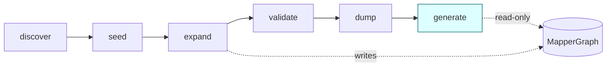
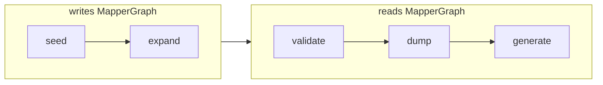
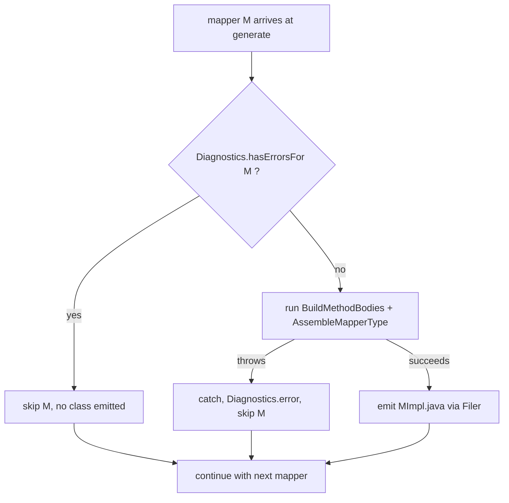
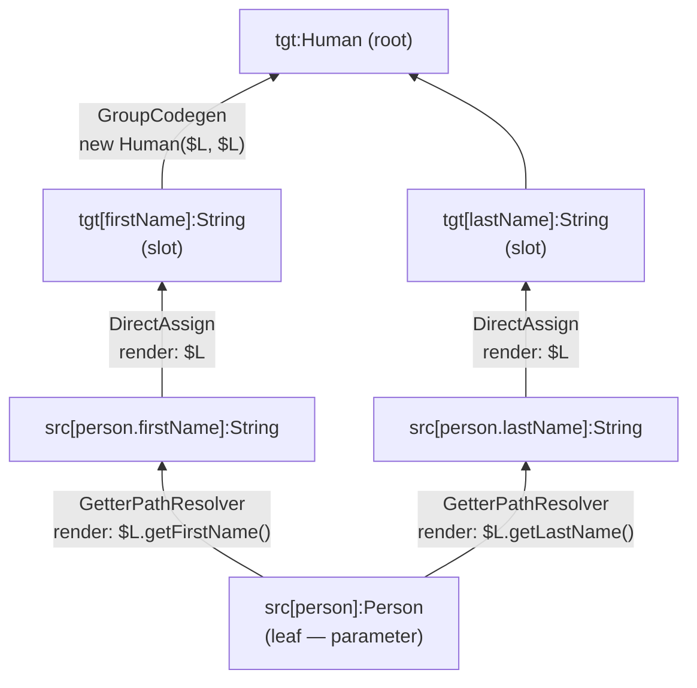

## Context

The processor produces a fully validated `MapperGraph` whose REALISED edges already carry `EdgeCodegen` lambdas, and whose `ExpansionGroup`s carry `GroupCodegen` lambdas. Every strategy already knows how to render its own `CodeBlock`. What is missing is the orchestrator: a stage that walks each method's realised subgraph, composes the per-edge codegen into a method body, and assembles a `JavaFile`.

Today's pipeline:


After this change:



The shift is large enough to bring real architectural choices: where the codegen stage sits in the pipeline, how it composes per-strategy `CodeBlock`s, how it handles failure, and how it leaves room for future slices (multi-segment paths, container scope transitions, nested mapper composition, dependency injection) without restructuring on every addition.

Constraints in play:
- Java 11 source (so `javax.annotation.processing.Generated` is available without a separate `javax.annotation-api` dependency).
- `com.palantir.javapoet` is already on the SPI module's classpath (every strategy returns `CodeBlock`s built with it).
- The processor module is Dagger-wired; the new stage MUST be `@Inject`-constructed and registered through `ProcessorModule`.
- The `feedback_never_forward_expansion` memory establishes that expansion walks target-to-source. Codegen walks the same direction by *recursion* (each node asks its REALISED predecessors to render first), even though runtime evaluation order is source-to-target — recursion + expression composition naturally produces the latter from the former.

## Goals / Non-Goals

**Goals:**

- Add a `generate` pipeline stage that emits one `<MapperName>Impl` Java source file per `@Mapper` interface whose graph fully realised.
- Pin the generated class shape so future slices add to it (fields, ctor parameters, DI annotations) without changing the shape — consumers calling `new <MapperName>Impl(...)` work across slices.
- Establish a pipeline invariant: codegen is read-only; the last graph-modifying stage runs before `dump`.
- Establish a failure policy: skip the whole mapper on any validation error or any exception thrown by `generate`, never emit a partial / broken class.
- Cover slice 1 capability scope: `DirectAssign` bridges, single-segment source paths, and `ConstructorCall`-style group targets. End-to-end compile-tested.
- Leave seams for the next three slices (multi-segment paths, container scopes, nested mapper composition) that don't require restructuring.

**Non-Goals:**

- Multi-segment source paths beyond a single appended segment (slice 2).
- Container scope transitions (`*Unwrap` / `*Collect` pairs producing `.stream().map(…).collect(…)`) (slice 3).
- Nested mapper composition via `@Mapper(uses = …)` and the matching private-field + ctor-param emission (slice 4).
- A plan-tree intermediate representation between the graph and the rendered source (added when slice 3 demands it).
- Dependency-injection annotations (`@Singleton`, `@Inject`, `@Component`, etc.). The class shape is DI-ready, but actual annotation emission is a future additive feature configured via processor options.
- A normalisation/optimization stage between `expand` and `dump`. The pipeline ordering reserves the slot but this change does not fill it.
- Statement-style intermediate locals or shared-intermediate extraction. Expression-style only.
- Per-method `UnsupportedOperationException` stubs. The earlier exploration considered them; the final failure policy is *whole-class skip on validation errors*, which removes the need for stubs entirely.

## Decisions

### D1: Pipeline ordering — dump before generate; generate is read-only



`dump` always runs after the last graph-modifying stage so its `.dot` outputs are a faithful snapshot of what `generate` consumed. If a future change adds a graph-modifying stage (e.g., an optimisation that collapses scope-pair brackets), it slots in *before* `dump`, and `dump` may grow another `.dot` output for the post-optimisation view.

**Rationale**: a debug dump that doesn't reflect what the generator actually saw is worse than no dump at all. Pinning the invariant in the architecture makes the next contributor's choice obvious.

**Alternative considered**: keep `dump` last and rely on `generate`'s exception-tolerance to never block it. Rejected because the ordering invariant is cleaner than the catch-everything pattern, and *both* together (D1 + D2) give belt-and-braces with negligible cost.

### D2: Per-mapper failure policy — whole-class skip; never ship broken code



Two reasons not to emit anything when validation failed:

1. `RealisationDiagnosticsStage` already surfaces a structured error pointing at the source code; the user will see the failure regardless of whether a class file is emitted.
2. Emitting a `UnsupportedOperationException` stub (the earlier proposal) compiles but explodes at runtime — exactly the failure mode annotation processors should avoid.

**Rationale**: annotation processors that produce code which "almost works" are worse than annotation processors that produce nothing. The first failure mode is invisible until runtime; the second is impossible to miss.

**Alternative considered**: per-method granularity (skip just the broken method, emit UOE stub, complete the rest of the class). Rejected because it defeats the "never ship broken code" principle and the resulting class file shadows the diagnostic with a runtime trap.

### D3: Split codegen — BuildMethodBodies + AssembleMapperType, with a MethodImpl intermediate


`MethodImpl` value type (Lombok `@Value`):

```java
final class MethodImpl {
    ExecutableElement method;
    CodeBlock body;
    Set<TypeElement> requiredMapperDeps; // empty in slice 1
}
```

The split lets per-method body composition stay a pure function (`(method, realisedSubgraph) → CodeBlock`) that's testable in isolation against synthetic graphs. The assembler concentrates the cross-cutting "what does the class look like" concerns: package, name, `@Generated`, constructor + fields, `JavaFile` assembly, `Filer` write.

**Rationale**: by slice 2, body-building grows shared-intermediate detection; by slice 3, it grows scope-pair recognition; by slice 4, every body that uses a nested mapper signals "I need `Set<TypeElement>` deps" through `requiredMapperDeps`, and the assembler collects those into the constructor parameter list. The fault line is clean: bodies are local; the class shape is global.

**Alternative considered**: monolithic `GenerateStage` that does everything. Rejected because the body/shape split is a real fault line that's going to exist by slice 4 anyway; extracting it now costs one trivial class file and gives unit-testable body composition immediately.

### D4: Class shape — stable, additive across slices

```mermaid
flowchart TD
    Slice1["Slice 1<br/>(this change)"] --> |adds private final fields| Slice4["Slice 4 / nested mappers"]
    Slice4 --> |adds DI annotation| Future["future: @Singleton / @Component"]
    Slice1 -.->|never changes| Header
    Slice4 -.->|never changes| Header[@Generated / public final / package / Impl suffix]
    Future -.->|never changes| Header
```

```java
// Slice 1 (this change)
@javax.annotation.processing.Generated("io.github.joke.percolate")
public final class PersonMapperImpl implements PersonMapper {
    public PersonMapperImpl() {}
    @Override public Human map(Person p) { return new Human(p.getFirstName(), p.getLastName()); }
}

// Slice 4 (future, additive)
@javax.annotation.processing.Generated("io.github.joke.percolate")
public final class PersonMapperImpl implements PersonMapper {
    private final AddressMapper addressMapper;
    public PersonMapperImpl(AddressMapper addressMapper) { this.addressMapper = addressMapper; }
    @Override public Human map(Person p) { return new Human(p.getFirstName(), addressMapper.toHomeAddress(p.getAddress())); }
}
```

**Decisions baked in**:

- **Naming**: `<InterfaceName>Impl` in the same package as the `@Mapper` interface. Conventional MapStruct-style, classpath-visible without imports.
- **Visibility**: `public final` — consumers need to call `new`; nothing should extend.
- **Constructor**: always explicit and `public`, even when empty. Future additions to the parameter list are additive at the source level (consumer code may need to pass new args, but it doesn't have to change file structure).
- **`@Generated`**: emitted with value `"io.github.joke.percolate"`. Standard JDK type, no extra dependency.

**Rationale**: the future-proof shape is "always emit an explicit constructor." It costs nothing in slice 1 and means slice 4's nested-mapper support adds parameters to a constructor that already exists, rather than introducing one.

**Alternative considered**: rely on Lombok-generated default ctor. Rejected because the explicit ctor is the seam where DI integration plugs in later.

### D5: Codegen as post-order recursion over the realised subgraph



`render(node)` algorithm:

1. If `node` has no inbound REALISED edges in the realised subgraph: it is a leaf. The leaf must be a `SourceLocation` whose `path.first()` matches a parameter of the current method. Return `CodeBlock.of("$N", paramSimpleName)`.
2. Otherwise, for each inbound REALISED edge `e`, recursively render its source node into a child `CodeBlock`.
3. If `node` is a `GroupTarget` root (carries a `GroupCodegen`): assemble an `IncomingValues` mapping slot names → child CodeBlocks, then return `groupCodegen.render(varNames, incomingValues)`.
4. Otherwise (single inbound REALISED edge `e`): return `e.codegen.render(varNames, IncomingValues.single(childCodeBlock))`.

Walk yields the method body's return expression. The body becomes:

```java
return <renderedExpression>;
```

**Rationale**: recursion is the simplest expression of "compose the snippets." Post-order recursion produces source-to-target evaluation order in the rendered code without needing an explicit topological sort.

### D6: Leaf parameter handling — synthesise at recursion bottom, not at SEED edges

The realised subgraph excludes SEED edges by definition (`RealisedSubgraph` is REALISED-only). The leaves of that subgraph are the `SourceLocation` nodes whose paths are method parameters. Those nodes carry no inbound `EdgeCodegen` because nothing realised them — they *are* the source.

Codegen synthesises the leaf reference by looking up the leaf's `SourceLocation.path.first()` (the parameter name) against the current method's `ExecutableElement.getParameters()`. The leaf renders as `CodeBlock.of("$N", paramSimpleName)`.

**Rationale**: keeps `SourceLocation` codegen-aware without polluting the SEED edge surface. SEED edges remain pure structural carriers.

**Alternative considered**: synthesise a "parameter source" edge at seed time with an `EdgeCodegen`. Rejected because (a) SEED edges are not REALISED and would be filtered out of the realised subgraph anyway, and (b) the lookup is trivial and isolated to the body builder.

### D7: IncomingValues and VarNames implementations

Both interfaces live in `spi/` already. The processor module ships package-private impls:

```java
// IncomingValues impl
final class IncomingValuesImpl implements IncomingValues {
    private final List<CodeBlock> positional;
    private final Map<String, CodeBlock> byName;
    // single(), byGroupPosition(int), byName(String) — straight delegations
}
```

```java
// VarNames impl — no-op for slice 1; fresh-name supplier in slice 3
final class VarNamesImpl implements VarNames {
    // empty marker today; slice 3 adds: String fresh(String hint)
}
```

**Rationale**: `VarNames` has no slice-1 callers (no strategy under the slice-1 scope renders a lambda parameter or local). The impl is a placeholder that exists so the codegen call site has something to pass.

### D8: JavaPoet import discipline

All type references in generated code MUST use `ClassName.get(...)` / `TypeName.get(...)` / `ParameterizedTypeName.get(...)`. JavaPoet manages imports automatically and the generated source is human-readable rather than FQN-laden.

A spot audit of slice-1 strategies (`DirectAssign`, `ConstructorCall`, `GetterPathResolver`, `MethodPathResolver`, `FieldPathResolver`) confirms they already use `ClassName`/`TypeMirror`-backed builders; no raw-string class names slip through.

**Rationale**: import discipline is harder to retrofit than to enforce. Slice 1 sets the bar.

## Risks / Trade-offs

- **[Risk: slice-1 scope doesn't exercise scope-transition contracts]** → Mitigation: slice 1 only validates that recursion + expression composition compose correctly for non-container chains. Container support is explicitly slice 3 and was always going to need its own design pass (likely a plan-tree IR). Surfacing this as a named follow-up keeps the scope honest.

- **[Risk: expression-style produces duplicated subexpressions]** → If a node has fan-out ≥ 2 (e.g., `person.address` feeds both `street` and `city`), expression-style emits `person.getAddress().getStreet()` and `person.getAddress().getCity()` separately, paying `getAddress()` twice at runtime. Slice 1 fixtures avoid this (no path resolvers). Mitigation: slice 2's path-resolution work explicitly takes responsibility for shared-intermediate detection and local extraction. Pinned in the spec as out-of-scope-for-slice-1.

- **[Risk: per-mapper isolation is incomplete if a stage upstream of generate mutates shared state]** → `Pipeline.process(TypeElement)` constructs a fresh `MapperContext` per mapper, and `Diagnostics` resets per round, so per-mapper isolation already holds at the framework layer. Generate's exception handler is one more layer.

- **[Risk: MethodImpl intermediate is over-engineered for slice 1]** → Today it's `(method, body, ∅)`. The third field exists only to be populated in slice 4. If slice 4 never lands the way we expect, we have a useless field. Mitigation: cheap to remove later; cheap to keep now. Documented as a forward-looking seam in the spec.

- **[Risk: `@Generated` value string `"io.github.joke.percolate"` collides with future module reorganization]** → Low. The value is informational, not enforced. If we rename the processor module the annotation value can change without breaking consumers (no one programmatically reads it).

- **[Risk: a strategy uses raw-string `CodeBlock.of("$L.x()", className)` instead of `ClassName`]** → Mitigation: a spec scenario in the new `code-generation` capability bans the pattern, and a unit-test grep enforces it.

## Migration Plan

This change is internal to the processor module. No runtime configuration, no persisted data, no SPI break, no external consumer contract change.

1. Add `GenerateStage`, `BuildMethodBodies`, `AssembleMapperType`, `MethodImpl`, `IncomingValuesImpl`, `VarNamesImpl` under `processor/src/main/java/io/github/joke/percolate/processor/stages/generate/`.
2. Register `GenerateStage` in `ProcessorModule`'s ordered `List<Stage>` provider — appended after `DumpExpandedGraph`.
3. Update `processor` spec: pipeline grows from nine stages to ten; ordering pins `dump` before `generate`; drop the "no code generation in this change" disclaimer.
4. Add the new `code-generation` capability spec covering class shape, ctor contract, `@Generated`, body composition algorithm, leaf parameter handling, failure policy (validation skip + exception tolerance), and import discipline.
5. Add Spock unit specs for `BuildMethodBodies` (synthetic `RealisedSubgraph` → expected `CodeBlock`) and `AssembleMapperType` (`List<MethodImpl>` → expected `JavaFile`).
6. Add a Google compile-testing end-to-end spec: process a `Person → Human` record-to-record fixture, assert the generated `PersonMapperImpl.java` compiles, and assert it produces the expected runtime output.
7. Run `./gradlew check` — zero violations.
8. Sync delta specs to main; archive.

Rollback: revert the commit. There is no persisted state and no external dependency change.

## Open Questions

- **Where does `List<MethodImpl>` live between the two phases?** Two options: (a) a new field on `MapperContext` (parallel to `graph`, `mappings`, etc.), (b) a stage-internal `Map<MapperContext, List<MethodImpl>>` or simply pass-through within a single `GenerateStage.run(ctx)` call. Option (b) keeps `MapperContext` clean of generate-only fields and matches the "split is an implementation detail of `generate`" framing. Default to (b) unless a test forces (a).

- **Filer write timing**: write each `JavaFile` immediately when `AssembleMapperType` finishes its mapper, or accumulate all `JavaFile`s and write at end-of-round? Immediate is simpler and matches the per-mapper isolation model. Round-end batching would only matter if we needed cross-mapper writes (we don't).

- **Test-time `Filer`**: `compile-testing`'s `JavaCompiler` already provides a `Filer`; no special handling. For unit-level tests of `AssembleMapperType` that don't want to spin up a full compile, we can pass a `Filer` mock and assert `createSourceFile` was called with the expected args.
