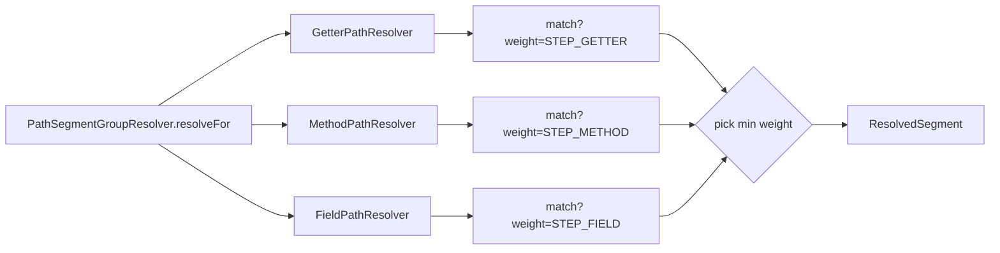

## Context

Path-segment resolution is the engine's mechanism for turning a path like `person.address.street` into a chain of typed nodes plus codegen. Each segment is resolved by a `PathSegmentResolver` SPI implementation: given the parent type and the segment name, return an `Optional<ResolvedSegment>` carrying the return type, codegen, and a weight.

Today, three resolvers ship from `strategies-builtin`:

```
GetterPathResolver   matches getX() / isX()                Weights.STEP (= 1)
FieldPathResolver    matches non-private, non-static fields Weights.STEP (= 1)
RecordPathResolver   matches no-arg method foo() — ONLY     Weights.STEP (= 1)
                       on types whose kind is RECORD
```

All three return `Weights.STEP`, so when more than one matches the same `(parent type, segment)` pair they tie. `PathSegmentGroupResolver.resolveFor` resolves the tie by iterating the list and returning the first match. The list is sorted alphabetically by class name in `ProcessorModule.pathSegmentResolvers()`, which gives the order `Field → Getter → Record`. The engine therefore silently prefers a public field over an explicit `getX()` — almost certainly the wrong precedence — and a fluent-style class with `String address() { … }` outside a record gets no match at all because `RecordPathResolver` gates on `RECORD` kind.

The orchestrator (`PathSegmentGroupResolver`) and the resolver SPI sit at distinct layers: the orchestrator owns "is this a path-segment group? what is the appended segment?" and iterates resolvers; the SPI owns "given a type and segment name, here is the access." Domain-type member inspection happens only in the expansion phase — no other phase walks into the type's members. That invariant is preserved by this change.

A second, independent thread: the jqwik property tests under `processor/src/test/groovy/.../stages/expand/properties/` use fake bridges/group-targets and a tiny `TypeUniverse`, and exercise structural invariants of the test harness rather than the algorithm. They did not surface any of the bugs fixed by the recent subgraph-scoped-expansion and cross-group-fixed-point changes. Their cost-to-value is negative.

## Goals / Non-Goals

**Goals:**

- Cover all four property-access shapes listed in the requirements: JavaBean getter, direct field, no-arg method (records and fluent classes), with an extensibility seam for additional resolvers.
- Make resolver precedence explicit and encoded in `Weights` rather than emerging from alphabetical class-name sort.
- Remove the duplicated DECLARED-check + `asElement` + `getAllMembers` scaffolding across three resolvers, without coupling them via inheritance.
- Drop the jqwik property tests, the `fakes/` directory, and the jqwik dependency from the build.
- Preserve the architectural invariant that domain-type inspection happens only in the expansion phase (via SPIs).

**Non-Goals:**

- Lombok-annotation-driven getter inference. Excluded by user decision; Lombok-generated methods are already visible to standard `Elements.getAllMembers` because Lombok mutates the javac AST before annotation processors run.
- Property-precedence configuration per `@Mapper`. The precedence stays global, encoded in resolver weight constants.
- Restructuring `PathSegmentGroupResolver` into the expansion phase or eliminating it. It carries the orchestrator role and stays.
- Refactoring `ResolveTargetChainsPhase` into `SeedGraph` (was discussed during exploration; out of scope for this change).
- Changing `Bridge` or `GroupTarget` precedence. Those don't tie at the same point and their selection is per-frontier.

## Decisions

### D1: Generalise `RecordPathResolver` → `MethodPathResolver`; drop the record-kind gate

`RecordPathResolver` matches `no-arg method whose simple name equals segment`. That predicate is identical for records and for fluent-style non-records. Records will continue to work because their canonical accessors fit the predicate; the `"RECORD".equals(typeElement.getKind().name())` check at line 33 of the current `RecordPathResolver` adds no behavioural value.

**Rationale**: One resolver per access shape is the cleanest model. Records aren't a separate access shape — they're a class kind whose accessors happen to fit the method-style shape. Coupling the resolver to the kind couples behaviour to syntax.

**Alternative considered**: Keep `RecordPathResolver` and add a second `MethodPathResolver`. Rejected because the two would have identical match logic gated only by `RECORD` kind, and the weight-precedence machinery (D3) would then need to decide whether records-via-`Record` outranks fluent-via-`Method`, which is a distinction without behavioural consequence.

**Trade-off**: Loses the "this method is guaranteed to exist by JLS" semantic of record accessors. In practice the resolver only fires when the method is visible in `getAllMembers`, so the guarantee was incidental, not load-bearing.

### D2: Weight-based precedence; orchestrator collects all matches and picks the minimum

`PathSegmentGroupResolver.resolveFor` SHALL iterate every resolver, collect every match, and return the match with the lowest `ResolvedSegment.weight`. Ties (two resolvers returning the same weight for the same segment) SHALL be broken by the existing list order from `ProcessorModule` (alphabetical class-name sort), but ties are not expected because the built-in resolvers carry distinct weights (D3).

**Rationale**: Weight is already a first-class property of `ResolvedSegment`. Using it for resolver selection makes precedence visible at the resolver definition (one constant per resolver in `Weights`), rather than an emergent property of `ServiceLoader` listing order. It also generalises uniformly to user-defined resolvers: a user who wants their custom resolver to outrank built-ins picks a lower weight.

**Alternative considered**: A `priority()` method on the SPI. Rejected because `ResolvedSegment.weight` already encodes "how cheap is this access" and resolver selection is fundamentally a "pick the cheapest" decision. Adding a second priority axis decoupled from weight would invite the two to disagree.



### D3: New weight constants encode precedence

Add to `Weights`:

```
STEP_GETTER = 1     // getX() / isX() — idiomatic JavaBean
STEP_METHOD = 2     // foo() — records or fluent style
STEP_FIELD  = 3     // direct field access
```

`Weights.STEP` (= 1) stays for backwards compatibility but is no longer used by the three built-in resolvers. `Weights.METHOD` (= 1) is unrelated to this change (used by `MethodCallBridge`) and stays.

**Rationale**: Lower number = preferred. The order matches the user's stated requirement: `getter < method < field`. A getter is the most idiomatic and intentional accessor; a no-arg method is intentional but ambiguous (might do work); a direct field access bypasses encapsulation and should lose to any explicit accessor.

**Alternative considered**: Use `Weights.STEP` for getter, `Weights.METHOD` for method, leave field at a new constant. Rejected because `Weights.METHOD = 1` already exists with `MethodCallBridge` semantics, and reusing it for method-style accessor weight conflates two unrelated concepts. The new triple is self-contained.

### D4: Shared `Members` utility; composition, not inheritance

Extract a package-private utility `Members` in `strategies-builtin/spi/builtins/`:

```java
final class Members {
    static Optional<TypeElement> asTypeElement(TypeMirror parentType, ResolveCtx ctx);
    static Iterable<? extends Element> declaredMembersOf(TypeElement typeElement, ResolveCtx ctx);
    static boolean isInObjectClass(Element member);
}
```

Each resolver calls these from its `resolve(...)` body. No abstract base class.

**Rationale**: All three resolvers (and any future resolver targeting `DECLARED` types) share the same boilerplate: kind check, cast to `TypeElement`, walk members, skip `Object`. A utility makes the duplication explicit and testable without inheriting a class that pre-commits to a particular match-and-build shape.

**Alternative considered**: `AbstractMemberResolver` with template methods `match(Element, String)` and `build(Element)`. Rejected because the three resolvers diverge slightly in what they return (`ExecutableElement` vs `VariableElement`), and templating that out via generics on the base class would add complexity that didn't pay for itself at three concrete subclasses.

### D5: Delete jqwik property tests and the dependency

Delete:

- `processor/src/test/groovy/io/github/joke/percolate/processor/stages/expand/properties/` (entire directory)
- `fakes/` subdirectory under it
- The jqwik dependency entry in `processor/build.gradle.kts`

The seven property specs assert structural invariants of the harness (idempotence, determinism, monotonicity, order-independence, disjoint-additivity, empty-strategy-identity, identity-collapse) against fake bridges over a tiny `TypeUniverse`. None of them exercise the real built-in strategies, container chains, target-name hints flowing to `GroupTarget`s, or cross-group fixed-point ordering — i.e., the surfaces where bugs actually lived during the recent expansion refactor.

The one genuine invariant in the set is `IdentityCollapseSpec`'s claim that no two nodes share `(scope, location, type)`. This is already implicitly enforced elsewhere; preserving it as an explicit assertion is left out of scope.

**Rationale**: Tests that don't exercise the production strategies and don't catch real bugs are deadweight. Removing them removes a dependency, simplifies the harness, and shrinks `ExpansionHarness.expand` if its signature was inflated to support fake-strategy injection only for property tests.

**Trade-off**: We lose the test names as documentation of intended invariants. If those invariants are worth asserting, they belong in unit-level tests of the engine, not in a property harness driven by fake strategies.

### D6: `ExpansionHarness.expand` signature stays if other tests need it

The `expand(seed, bridges, sourceSteps, groupTargets)` overload in `ExpansionHarness` was introduced (per the `expansion-test-harness` spec) for both property tests and failure-mode tests. Failure-mode tests still need controlled strategy injection. The signature is preserved; only the property-test callers are deleted. If a parameter exists only because of property tests, it is removed; otherwise the signature stays as-is.

## Risks / Trade-offs

[**Risk: A user has registered an `@AutoService(PathSegmentResolver.class)` resolver returning `Weights.STEP`, expecting it to win against `STEP_GETTER`**]  →  After this change `STEP_GETTER = 1 = Weights.STEP` so the user's resolver would tie with the built-in getter, falling back to class-name sort. Behaviour change is bounded; documenting the new weight constants in the `source-path-resolution` spec mitigates surprise. Cross-reference in release notes if any are produced.

[**Risk: `RecordPathResolver` removal breaks external code that wired the class by FQN**]  →  Marked **BREAKING** in the proposal. Internally, only `@AutoService` registration is affected and `ServiceLoader` discovers the renamed class transparently. No known external consumers.

[**Risk: Generalising the method-style resolver matches an unintended no-arg method**]  →  Possible: a class with method `cleanup()` and a target slot named `cleanup` would match. Mitigation: weight-based precedence (D2) means an explicit `getCleanup()` will still beat `cleanup()`. The risk is fundamentally a name-collision risk in the user's code, not an engine bug.

[**Risk: Deleting property tests removes coverage of `IdentityCollapse` invariant**]  →  Low. The invariant is enforced by `MapperGraph.addNode` deduplication semantics and is exercised indirectly by the integration-style `ExpansionFailureModesSpec` and per-strategy specs in `strategies-builtin`. Out of scope to add an explicit assertion in this change.

[**Risk: `Members` utility evolves to accommodate every future resolver, drifting into a general-purpose `TypeMirror` Swiss army knife**]  →  Keep it package-private to `strategies-builtin/spi/builtins/`. If a method has only one caller, inline it back. Reviewers should reject `Members` additions that aren't immediately consumed by ≥2 resolvers.

## Migration Plan

This change is internal to the processor and strategies-builtin modules. There is no runtime configuration, no persisted data, no API contract that an external project depends on at the byte level (the SPI surface is `PathSegmentResolver` — class names are encapsulated by `@AutoService` + `ServiceLoader`).

1. Rename `RecordPathResolver` → `MethodPathResolver`; drop record-kind gate; switch to `Weights.STEP_METHOD`.
2. Switch `GetterPathResolver` to `Weights.STEP_GETTER`; `FieldPathResolver` to `Weights.STEP_FIELD`.
3. Add the three new constants to `Weights`.
4. Extract `Members` utility and refactor all three resolvers to use it.
5. Change `PathSegmentGroupResolver.resolveFor` to collect-all-and-pick-min-weight.
6. Delete the property-test directory and `fakes/`; drop the jqwik dependency.
7. Rename `RecordPathResolverSpec` → `MethodPathResolverSpec`; broaden fixtures to include a non-record fluent class.
8. Update the three affected specs (`source-path-resolution`, `builtin-strategy-unit-tests`, `expansion-test-harness`) via delta files in this change.

Rollback: revert the commit. There is no persisted state.

## Open Questions

None at this point. Open design questions were settled during exploration:

- Lombok inference → dismissed.
- Record vs Method split → option (A): one `MethodPathResolver`.
- Members utility → option (b): composition, no abstract base.
- jqwik scope → delete the entire tree, not just the worst offenders.
