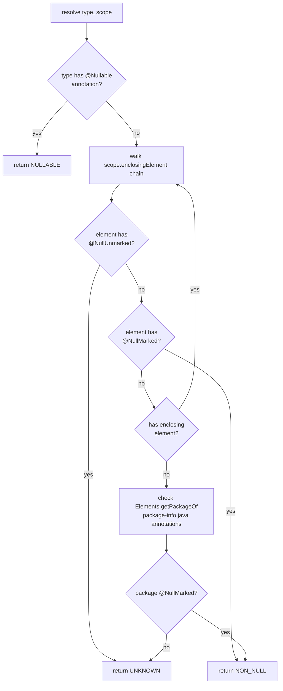
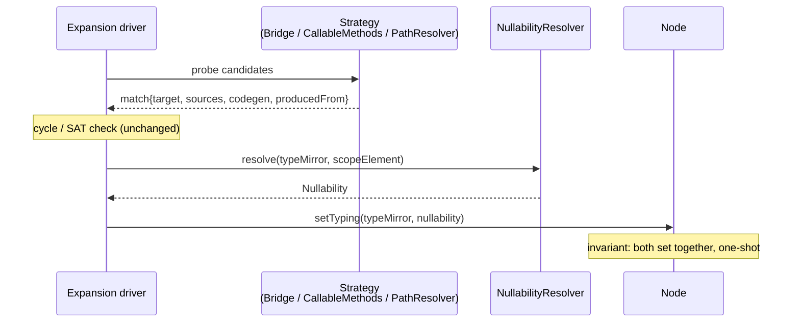
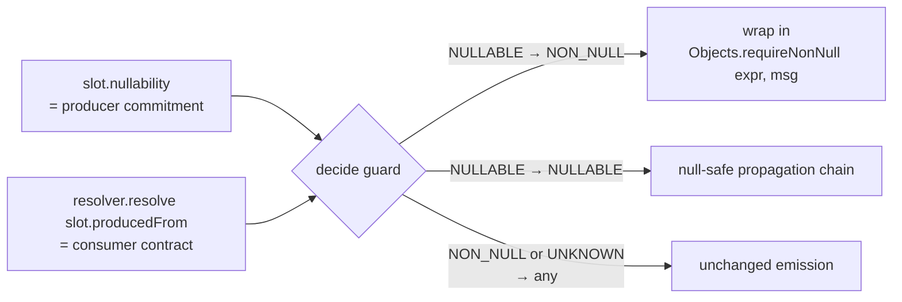

## Context

Today's pipeline produces `<Mapper>Impl` classes by walking a realised
subgraph: `SeedGraph` registers structurally-typed `ExpansionGroup`s, the
expansion engine resolves them via `Bridge` / `CallableMethods` /
`PathSegmentResolver` matches, and `GenerateStage` renders the result. Three
properties of the current architecture shape this design:

1. **The seed graph is largely untyped.** Every non-leaf `Node` is created
   with `Optional.empty()` type. `Node.setType(TypeMirror)` is a one-shot call
   made later, during expansion, at the exact moment a producer's commitment
   fixes the typing of that point in the computation. Today's only exception
   to this rule is the slot Nodes created by `GroupTarget` builds (see D2).
2. **Strategies stay myopic.** `Bridge` / `GroupTarget` / `PathSegmentResolver`
   / `CallableMethods` implementations don't reach across the graph; the
   scaffolding/driver owns mutation. (See
   `feedback_strategies_stay_myopic.md`.)
3. **Per-group walk is target-to-source.** Within a group, the engine asks
   "what produces this slot?" anchored on the slot's expected type. Cross-group
   ordering is a fixed-point loop that converges in O(depth) passes. (See
   `project_expansion_direction.md`.)

JSpecify provides the user-facing vocabulary we want to honour: `@Nullable`,
`@NullMarked`, `@NullUnmarked` — declaration- *and* type-use scoped, with
`@NullMarked` inheritable from a `package-info.java`. These annotations need to
end up affecting code generation without disrupting any of the three
properties above.

## Goals / Non-Goals

**Goals:**

- Recognise JSpecify annotations on directive return types, directive
  parameters, source/target POJO fields, *and* type-use positions (generics,
  arrays, container element types).
- Resolve effective nullability by walking the JSpecify scope chain (element
  → enclosing class → enclosing class … → package via `package-info.java`),
  honouring both `@NullMarked` and `@NullUnmarked`.
- Make nullability **emerge** through the same mechanism that emerges type
  during expansion — never a separate pre-pass, never a stale-then-restamp.
- Keep strategy authors entirely free of nullability concerns. Strategies
  surface only the `AnnotatedConstruct` they matched; the engine derives
  nullability.
- Generate the agreed contract: `NULLABLE → NON_NULL` ⇒ `Objects.requireNonNull(…)`
  guard; `NULLABLE → NULLABLE` ⇒ null-safe propagation; everything else
  unchanged.
- Leave a documented architectural hook in `ProcessorOptions` for configuring
  custom `@Nullable` annotation FQNs in a follow-up.
- **Align the slot-Node typing lifecycle with every other non-leaf Node** —
  slot Nodes start untyped and are typed at producer commit (see D2). This is
  the alignment that makes a single uniform nullability model possible.

**Non-Goals:**

- No NullAway-style strict enforcement. A `@Nullable` source feeding a
  non-null target is NEVER a compile-time error; users wanting that strictness
  add NullAway as a second annotation processor.
- No per-mapper switching of nullability behaviour.
- No wiring of the custom-annotation processor option in this change. The
  data structure exists; the parsing/extension is deferred unless trivial.
- No changes to SAT / convergence semantics. Nullability is purely
  metadata.

## Decisions

### D1. Type and nullability share a paired one-shot on `Node`

Because non-leaf Nodes are untyped at creation and their type emerges during
expansion via a one-shot `Node.setType(…)`, the same call site is the *only*
place where the underlying `AnnotatedConstruct` is in hand. Splitting
type-stamping from nullability-stamping would create a window in which a Node
has type but no nullability (or vice versa) and would force a second walk.

**Decision:** Add a single `Optional<Nullability>` field to `Node` and replace
`setType(TypeMirror)` with a paired one-shot:

```java
public void setTyping(TypeMirror type, Nullability nullability);   // both empty before; both populated after
```

Both must be unset before the call; both are set after. The invariant
guarantees that no realised Node ever exists without a nullability.

**Alternatives considered:**

- *Two separate one-shots* (`setType` + `setNullability`): allows ordering bugs
  and would silently produce Nodes with type but no nullability.
- *Edge-stored nullability* (Path A, see D2): tempting because `Edge.codegen`
  represents the producing operation. But would duplicate information already
  derivable from the Node lifecycle and would leave `Node.nullability` with
  asymmetric semantics (consumer for slots, producer for everything else).

### D2. Slot Nodes adopt the producer-typed lifecycle (Path B, chosen over Path A)

Investigation of the engine code revealed that slot Nodes — created by
`GroupTarget.buildFor(...)` — are *typed at slot-creation* using the
consumer-side `Slot.type`:

- `ResolveTargetChainsPhase:69` — `slotNode.setType(slot.getType())`
- `ExpandGroupsPhase:524` — `new Node(Optional.of(slot.getType()), …)`

Every other non-leaf Node (path-segment roots, bridge intermediates) is typed
at *producer commit* via the existing `setType` call site (e.g.,
`ExpandGroupsPhase:196`: `root.setType(rs.getReturnType())`). Slot Nodes are
the lone exception.

Two paths were considered:

- **Path A — additive.** Keep slot Nodes typed at creation. Add
  `Edge.outputNullability` to capture producer commitment per realised edge.
  `Node.nullability` semantic becomes asymmetric (consumer for slots, producer
  for others); guard emission compares `edge.outputNullability` to
  `edge.to.nullability`.
- **Path B — alignment.** Refactor slot Nodes to start untyped and be typed at
  producer commit, joining every other non-leaf Node under one rule. No
  `Edge.outputNullability` needed; `Node.nullability` semantic is uniform
  (always the producer's commitment); guard emission compares
  `slot-Node.nullability` against the consumer contract derived on demand from
  the slot's underlying `AnnotatedConstruct`.

**Decision: Path B.** It produces a single uniform rule (every non-leaf
Node's typing+nullability comes from its producer's commitment), removes the
one-off in slot-Node lifecycle, and reinforces — rather than weakens — the
"largely untyped seed graph" property. The project is pre-release with one
GroupTarget impl, so the refactor blast radius is contained.

**Direction is unchanged.** Within a group, expansion still asks "what
produces this slot?" anchored on `Slot.type` (the consumer's expected type).
`Slot.type` continues to drive candidate search exactly as it does today; the
*only* change is that `Node.type` is no longer written at slot creation —
it's written when a producer commits, the same lifecycle path-segment roots
already follow.

**Engine-side changes (sized small):**

| Site | Today | Path B |
|---|---|---|
| `ExpandGroupsPhase:524` | `new Node(Optional.of(slot.getType()), …)` | `new Node(Optional.empty(), …)` |
| `ResolveTargetChainsPhase:69` | `slotNode.setType(slot.getType())` | **remove** |
| Each producer-match commit for a slot | (no slot typing) | `slot.setTyping(producerType, producerNullability)` |
| Candidate search reading `slot.type` | unchanged | unchanged — `Slot.type` is still the search anchor; only `Node.type` deferred |

### D3. `NullabilityResolver` is **processor-internal**; the SPI gains only data carriers

Because strategies hand the engine an `AnnotatedConstruct` and the engine does
the lookup, no strategy ever needs to inject or call the resolver. Putting
the resolver in `percolate-spi` would expose machinery no one outside the
engine consumes.

**SPI delta (`percolate-spi`):**

```
Nullability { NULLABLE, NON_NULL, UNKNOWN; static join(a, b) }

ResolvedSegment += AnnotatedConstruct producedFrom    // the Element the segment resolved to
BridgeMatch     += AnnotatedConstruct producedFrom    // the construct describing the unwrapped value
Slot            += AnnotatedConstruct producedFrom    // the ctor-param / setter-param / field Element
                                                       //   (drives consumer-contract derivation at codegen)
// MethodCandidate already carries ExecutableElement — no change.
```

**Processor-internal (new `io.github.joke.percolate.processor.nullability`
package):**

- `NullabilityResolver` interface (Dagger-bound).
- `JspecifyNullabilityResolver` — the only built-in impl.
- `NullabilityAnnotations` — config value type carrying the recognised FQN
  sets. Pre-seeded with JSpecify; an architectural hook in `ProcessorOptions`
  is added for follow-up extension.

### D4. Resolution algorithm

The resolver answers `Nullability resolve(TypeMirror type, Element scope)`.



Two inputs are required because `TypeMirror`s have no enclosing element
themselves — the `scope` provides the lexical anchor for the
`@NullMarked` / `@NullUnmarked` walk. Type-use annotations (`List<@Nullable
String>`, `@Nullable List<…>`, array element types, wildcard bounds) are
covered automatically because `TypeMirror` is an `AnnotatedConstruct` and the
direct check happens first.

### D5. Stamping sites within the expansion driver

Whenever today's engine calls `node.setType(…)`, it now calls
`node.setTyping(type, resolver.resolve(typeMirror, scopeElement))`. After D2,
this rule applies uniformly to *every* non-leaf Node — including slot Nodes.



For slot Nodes the same diagram applies: the strategy that matched the slot's
producer (path resolver, callable method, bridge) is what triggers the
`setTyping`. The slot's underlying `Slot.producedFrom` (consumer Element)
remains attached to the slot for codegen-time consumer-contract derivation.

### D6. `Nullability.join` lattice

| a \ b | NULLABLE | NON_NULL | UNKNOWN |
|---|---|---|---|
| **NULLABLE** | NULLABLE | NULLABLE | NULLABLE |
| **NON_NULL** | NULLABLE | NON_NULL | UNKNOWN |
| **UNKNOWN** | NULLABLE | UNKNOWN | UNKNOWN |

NULLABLE is absorbing (any nullable hop poisons the result); uncertainty
propagates (UNKNOWN + NON_NULL = UNKNOWN). The join ships with this change;
GenerateStage uses it when composing multi-hop null-safe chains.

### D7. Code generation contract

At each slot, `BuildMethodBodies` (or its successor) compares the slot Node's
nullability (producer commitment) against the consumer contract derived on
demand from `Slot.producedFrom`:



`GroupCodegen.render(…)` continues to receive ready-to-use `CodeBlock`
expressions; it doesn't reason about nullability.

The exact form of the null-safe propagation chain (e.g., `expr == null ? null
: expr.next()` vs `Optional.ofNullable(expr).map(…).orElse(null)`) is a
code-generation detail to be settled in the `code-generation` spec update.

### D8. `ProcessorOptions` hook

`ProcessorOptions` grows a single field documenting the extension surface
(e.g., `Set<String> customNullableAnnotations`). Parsing of the option may
stay minimal (or be deferred to a follow-up). The key constraint is that
`NullabilityAnnotations` consumes a `Set<String>` of FQNs, so future wiring
is purely a parsing change — no consumer touches.

## Risks / Trade-offs

- **[Risk] Type-use annotation propagation in javac.** Some javac versions
  drop type-use annotations through certain code paths (e.g., when reading
  members from classfiles versus source). → **Mitigation:** restrict the
  resolver to inputs we control (the user's source code under compilation),
  and add a Spock spec exercising `List<@Nullable T>` plus array and wildcard
  positions to lock in current behaviour.

- **[Risk] Downstream readers of `slot-Node.getType()` before producer
  commit.** Path B defers slot-Node typing to producer-match time. If any
  engine code reads `slotNode.getType()` *before* the producer commits and
  expects it to equal `Slot.type`, that code needs adjustment (either keep
  `Slot.type` reachable via a side channel that isn't `Node.type`, or defer
  the reader). → **Mitigation:** sweep all `slotNode.getType()` /
  `node.getType()` call sites in the expansion driver as a pre-implementation
  task. Captured explicitly in `tasks.md`.

- **[Risk] Multiple producer matches for the same slot.** SAT picks one
  winner, so only one `setTyping` should ever happen — but a bug elsewhere
  could violate this. → **Mitigation:** `setTyping`'s one-shot guard already
  throws; keep it. Add a Spock spec covering the rollback path
  (cycle-attempting match) to confirm no typing leaks after rollback.

- **[Trade-off] Consumer contract resolved on every codegen visit.** The
  resolver is called once per slot at generation time rather than cached.
  → **Mitigation:** scope-walks are bounded by enclosing-element depth
  (typically ≤ 4 hops); caching can be added later if profiling demands it.

- **[Trade-off] `Objects.requireNonNull` throws a plain NPE without
  identifying the source path in the stack trace by itself.** → **Mitigation:**
  the message passed as the second argument names both the source path and
  the target slot. The exception is propagated to the caller normally.

- **[Architecture alignment, not shift]** Path B does *not* shift the
  architecture — it removes an existing one-off in slot-Node typing so that
  every non-leaf Node follows the same rule. Cycle rollback semantics actually
  improve (a rolled-back match leaves no typing trace). Flag during code
  review only if the slot-typing sweep (Risk #2) surfaces unexpected readers.

## Open Questions

All resolved during design discussion:

- ~~Does any current `GroupTarget` impl pre-type its slot Nodes at creation
  time?~~ → **Resolved.** Yes: `ConstructorCall` via `Slot.type`. Addressed
  by Path B (D2).
- ~~Should `Nullability.join` ship in this change or be deferred?~~ →
  **Resolved.** Ship in this change (D6).
- ~~Form of null-safe propagation chains?~~ → **Resolved.** Deferred to the
  `code-generation` spec update (D7).
