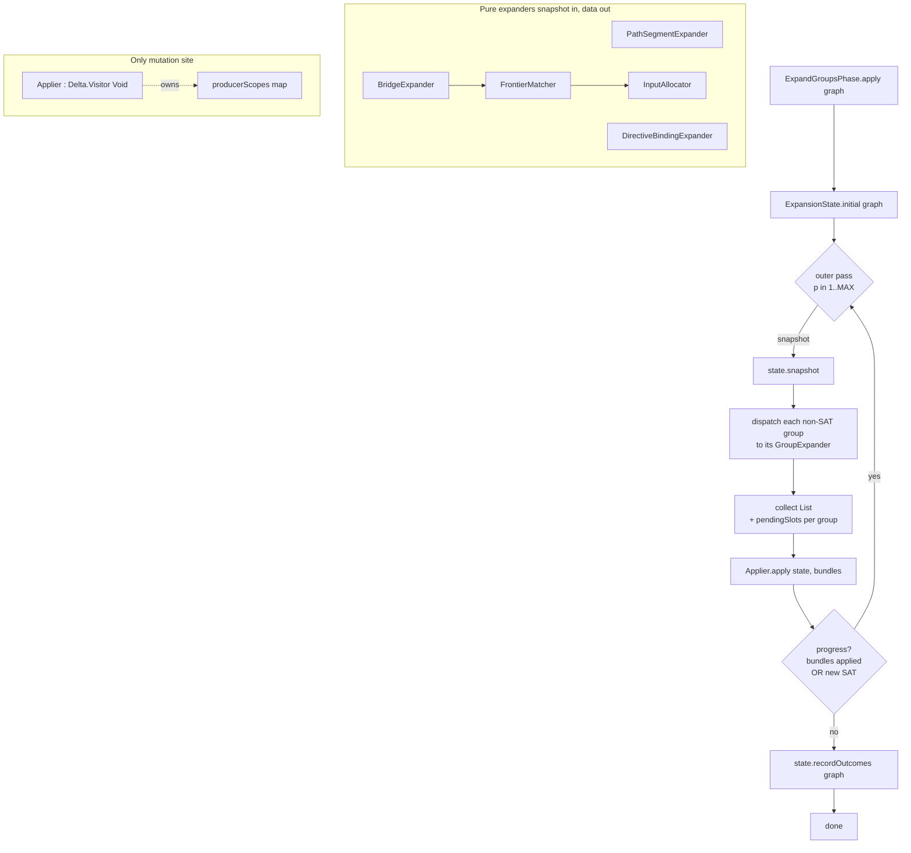
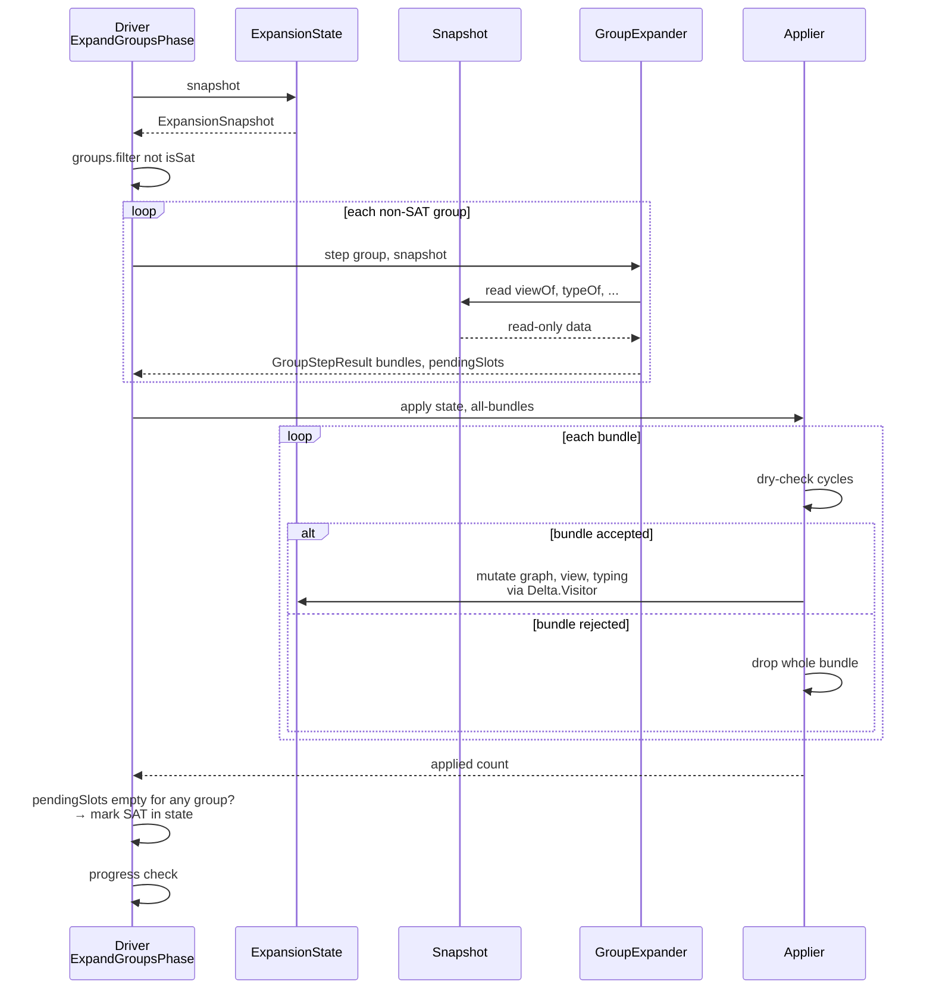
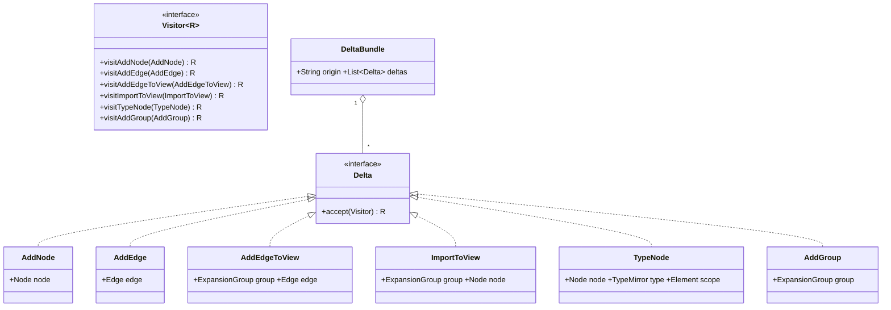
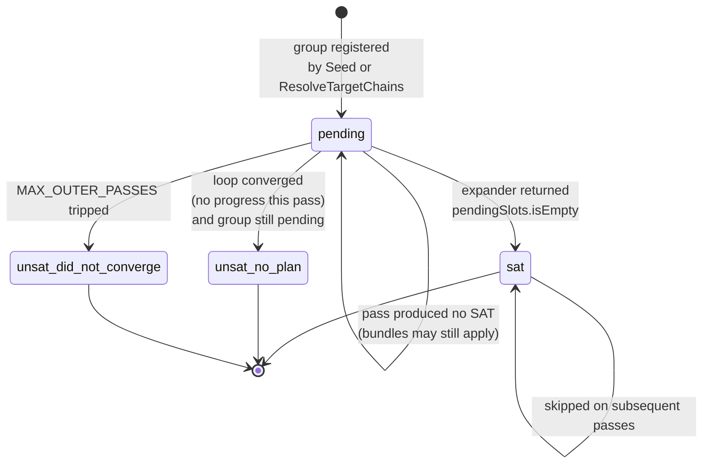

## Context

`ExpandGroupsPhase` is a 696-line class flagged `@SuppressWarnings("PMD.GodClass")`. Three smells drive the refactor:

1. **Cross-cutting state.** A `producerScopes : IdentityHashMap<Node, Element>` field is written at four producer-commit sites and read at one propagation site — a side-channel that exists only because every `setTyping` must be paired with the resolver scope that produced it.
2. **Implicit mutation accumulator.** A `ChangeTracker` with four `markX()` methods (all aliasing `changed = true`) is threaded through every method that mutates the graph, solely to drive the outer fixed-point loop's termination check.
3. **Mixed responsibilities in one file.** Outer-loop orchestration, three group-kind branches, the frontier-expansion engine (`expandFrontier`, `tryBridges`, `commitBridgeStep`), and input-node allocation (`allocateInputNode` + three transition-specific variants) all live in one class. The shared substrate is dense (~230 lines) and tested only via end-to-end mapper compilation.

A latent bug rides on this design: when `MapperGraph.addEdgeIfAcyclic` rolls back a cycle-attempting edge, the fresh input `Node` allocated immediately prior is *not* rolled back and remains in the graph as an orphan. Today this is benign; once explicit, the model should make it impossible.

The refactor target is **Level 2** on the functional-style spectrum: pure expander functions returning data descriptions of their intended mutations, a single applier interpreting those descriptions, and an outer driver that becomes a textbook fixed-point fold. `MapperGraph` and `Node` remain mutable — that's the engine's authoritative model per existing architecture rules (`Expansion vs strategy: WHEN/WHERE vs HOW — scaffolding/driver owns graph modification`) — but mutation is constrained to **one** call site.

## Goals / Non-Goals

**Goals:**

- Make `ExpandGroupsPhase` a thin orchestrator (~80 lines): snapshot, dispatch, apply, converge, drain outcomes.
- Make each group-kind expander a pure function: `(group, snapshot) → (bundles, pendingSlots)`. No graph reference, no shared mutable state.
- Centralise all mutation (graph add, `Node.setTyping`, view mutation, cycle check) in **one** `Applier` class.
- Make bridge-step commits atomic — cycle-rejected steps leave no orphan nodes.
- Eliminate `producerScopes` as a phase-level field (move ownership to `Applier`) and `ChangeTracker` entirely.
- Enable expander-level unit tests that need no live `MapperGraph` — assertions on `GroupStepResult` directly.

**Non-Goals:**

- Going Level 3 (immutable `Node` typing, immutable `ExpansionGroup.view`, immutable `MapperGraph`). That's a multi-class redesign; the cost/value collapses on Java 11.
- Changing the `Bridge` / `GroupTarget` / `PathSegmentResolver` / `ResolveCtx` SPI. Strategies stay myopic per the existing architecture rule.
- Changing observable behaviour beyond the orphan-node fix and the batched-end-of-pass convergence semantics (which only shifts when SATs become visible across groups within a pass; correctness preserved by the fixed-point loop).
- Within-group failure accumulation. Groups are an internal concept; the developer sees only across-group diagnostics, which already happens.
- Optimising the convergence path. Performance is explicitly lowest priority; one extra pass in degenerate cases is acceptable.

## Decisions

### D1. Delta + Applier pipeline (vs. extract-collaborator refactor)

**Decision:** Introduce a `Delta` sum type whose values describe intended mutations. Expanders return `List<DeltaBundle>`; the `Applier` is the sole site that performs mutation.

**Alternatives considered:**

- **Option A** (extract collaborators only): pull `FrontierMatcher`, `InputAllocator`, `NullabilityCommitter` into separate classes; keep three group-kind branches as methods on the phase. Smaller move; ~50% LOC reduction. Rejected because it leaves `producerScopes` as cross-cutting field, leaves `ChangeTracker` as an accumulator, and doesn't centralise mutation. The biggest readability wins are the elimination of those two pieces of state; option A captures neither.
- **Option C** (extract `NullabilityCommitter` only): lowest-risk move. Rejected for the same reason as A — leaves the multi-branch structure of the phase intact.
- **Option D** (Level 3 — immutable everything): requires touching `Node.setTyping`, `ExpansionGroup.view`, `MapperGraph` itself. Wider blast radius than the readability gain justifies on Java 11 without records/sealed types.

**Why this:** Level 2 is the sweet spot where mutation moves from "everywhere" to "exactly one call site" without redesigning the underlying mutable graph types. The win is real architectural separation (data vs interpretation) without a multi-class redesign.

### D2. Visitor pattern for the `Delta` sum type

**Decision:** `Delta` is an interface with `<R> R accept(Visitor<R> v)`. Each delta variant is a Lombok `@Value` class with a manual `accept` override. `Visitor<R>` declares one `visitX` method per variant.

**Alternatives considered:**

- **Self-applying deltas** (each delta has an `applyTo(state)` method). Rejected because it scatters interpretation logic across the variants, and the explicit FP separation of "data" vs "interpretation" is a core goal — the user prefers functional style.
- **Single applier with `instanceof` chain** (no visitor; type-test in the applier). Rejected because Java 11 lacks pattern matching for `instanceof`, and we lose compile-time exhaustiveness when adding new variants.
- **Sealed-type + pattern-matching switch** (Java 17+). Rejected — the project is on Java 11 and the user explicitly does not want to migrate.

**Why this:** Visitor is the textbook Java-pre-17 substitute for sealed sum types. Adding a new `Delta` variant causes compile errors in every `Visitor` implementation, which is exactly the exhaustiveness behaviour we want for a refactor of this size.

### D3. Atomic `DeltaBundle` semantics

**Decision:** A `DeltaBundle { String origin; List<Delta> deltas }` is applied as a unit. If any delta cannot be applied (today only `AddEdge` can be rejected, via cycle detection), the **whole bundle** is dropped — no partial application.

**Alternatives considered:**

- **Loose deltas** (no bundles; each delta independent). Rejected — bridge-step commits are conceptually atomic (AddNode + AddEdge + maybe TypeNode + AddGroup), and the orphan-node bug today comes from non-atomic partial commits.
- **Per-delta dependency graph** ("AddGroup depends on AddEdge which depends on AddNode"). Rejected as over-engineered for the actual unit-of-atomicity: a strategy match.

**Why this:** Bundles match the conceptual unit (one bridge-step match, one path-segment resolver match, one GroupTarget match). The orphan-node bug evaporates as a side effect.

### D4. `ExpansionState` / `ExpansionSnapshot` split

**Decision:** Two interfaces backed by one implementation. `ExpansionSnapshot` exposes only read methods (`groups()`, `viewOf(group)`, `typeOf(node)`, `isSat(group)`, `effectiveTypeFor(slot)`); expanders receive a `Snapshot`. `ExpansionState` exposes both read and mutation methods; only `Applier` ever sees the `State` interface.

**Alternatives considered:**

- **Pass `MapperGraph` directly** (with documentation saying "read-only please"). Rejected — no compiler enforcement; a future contributor would mutate it.
- **Defensive-copy a full immutable snapshot per pass**. Rejected — JGraphT subgraphs are non-trivial to copy and the cost would be significant. `Graphs.unmodifiableGraph` gives the same compile-time guarantee for free.

**Why this:** Read-only-by-contract via Java interface is the cheapest enforceable separation. JGraphT's `Graphs.unmodifiableGraph` wrapper is the idiomatic choice for the view.

### D5. SAT signalled by `pendingSlots.isEmpty()` (no `MarkSat` delta)

**Decision:** `GroupExpander.step` returns `GroupStepResult { List<DeltaBundle> bundles; List<Node> pendingSlots }`. Empty `pendingSlots` means the expander considers the group SAT after applying its bundles. The driver records SAT on `State` directly; no SAT delta passes through the visitor.

**Alternatives considered:**

- **Explicit `MarkSat` delta**. Rejected — `pendingSlots.isEmpty()` is unambiguous and avoids redundancy. SAT isn't a graph mutation; it's a control-flow signal to the driver. Keeping it out of the visitor keeps the visitor focused on actual graph mutations.

**Why this:** Cleaner separation. Visitor describes graph mutations; the return tuple describes group status.

### D6. Batched end-of-pass application

**Decision:** Each outer pass collects bundles from **all** non-SAT groups against a single snapshot taken at pass start, then applies them at end of pass. Within a pass, no expander sees the deltas emitted by any other expander.

**Alternatives considered:**

- **Per-group apply** (current behaviour — later groups in the same pass see earlier groups' SATs). Rejected — adds complexity (live snapshot mid-pass), the optimisation is undocumented today, and the user confirmed batched-end-of-pass is acceptable.

**Why this:** Trivially correct under the fixed-point loop (any "missed" intra-pass coupling is picked up in the next pass). Convergence cost: at most one extra pass per dependency chain, well within `MAX_OUTER_PASSES = 32`.

### D7. DI-bound expander list (vs. enum dispatch)

**Decision:** Dagger injects `List<GroupExpander>`. The driver iterates the list and picks the **first** expander whose `appliesTo(group)` returns true. Order is determined by DI binding order.

**Alternatives considered:**

- **Enum `GroupKind` + switch in dispatcher**. Rejected — closed-set; adding a new group kind requires updating the enum, the dispatcher, and the factory. Open-set via `appliesTo` extends cleanly.
- **Polymorphic dispatch on `ExpansionGroup` subtype**. Rejected — `ExpansionGroup` is a single concrete class today; group kind is a structural shape detected from contents, not a type discriminator.

**Why this:** Open for extension (new expanders can be added by registering a new Dagger binding); closed for modification (the dispatcher and orchestrator never change). Matches Dagger's idiomatic multi-binding pattern.

### D8. `Applier` owns `producerScopes`

**Decision:** The `IdentityHashMap<Node, Element> producerScopes` field migrates from the phase to `Applier` as private state. The `TypeNode` delta carries `(Node node, TypeMirror type, @Nullable Element scope)`; the applier interprets the delta by computing nullability via the resolver, calling `Node.setTyping`, and recording `(node → scope)` in its private map. The `DirectiveBindingExpander` reads the scope by querying the snapshot (which exposes `Snapshot.producerScopeOf(node)` backed by the applier's map after commit).

**Alternatives considered:**

- **Eliminate `producerScopes` entirely** by computing scope lazily at the propagation site. Rejected — the scope can be a method parameter `Element`, a bridge-step `ProducedFrom`, or a path-segment resolver's `ProducedFrom`; not derivable from the node alone after the fact.

**Why this:** The map remains, but its scope is one class instead of being a phase-level field. The cross-cutting nature shrinks to "applier writes, snapshot reads".

### D9. `ChangeTracker` deletion

**Decision:** Convergence signal becomes `appliedBundleCount > 0 || newSatCount > 0` per pass. The `ChangeTracker` class is removed outright.

**Why this:** The four `markX()` methods all aliased `changed = true`; the distinctions were never read. Counting bundle applications + SAT transitions is equivalently expressive and lives in the driver where the loop runs.

## Architecture diagram

## One-pass sequence

## `Delta` taxonomy (visitor sum type)

## Group-status state machine

## Risks / Trade-offs

- **[One extra pass per dependency chain in degenerate cases]** → Mitigation: `MAX_OUTER_PASSES = 32` is far above the typical 2–4 passes for realistic mappers. Performance was ranked lowest priority; the tradeoff is accepted explicitly.
- **[Larger PR than the extract-collaborator alternative — ~800–1000 LOC net move/rewrite]** → Mitigation: phased rollout under `tasks.md` — introduce `Delta` + `Applier` first with current code calling `Applier` for all mutations (no behaviour change), then extract one expander at a time. Each phase is independently reviewable.
- **[`ExpandGroupsPhaseSpec` rewritten from scratch — risk of losing coverage during transition]** → Mitigation: existing harness-driven end-to-end tests in `expansion-test-harness` are unchanged and serve as the regression net. The expander-level Spock specs replace fine-grained internal coverage. Migration is reviewable as a separate commit.
- **[`Applier` becomes a single non-trivial class]** → Mitigation: it's bounded by the visitor surface (6 methods, each ~10 lines). Smaller than today's `commitBridgeStep` (~50 lines) and entirely linear to follow.
- **[DI binding order is now load-bearing for `List<GroupExpander>` dispatch]** → Mitigation: `appliesTo` predicates are mutually exclusive by construction (path-segment, directive-binding, and bridge-group structural shapes don't overlap). Document the disjointness as a precondition in the `GroupExpander` interface.
- **[Architectural shift — explicit warning per artifact rules]** This refactor introduces a new internal data type (`Delta`) and a new architectural pattern (mutation-via-visitor). Strategies (`Bridge`, `GroupTarget`, `PathSegmentResolver`) are unaffected — the strategy SPI stays untouched and the strategies-stay-myopic rule still holds. The shift is wholly internal to `ExpandGroupsPhase`'s package.

## Migration plan

Phased — each phase is a separately-reviewable commit/PR:

1. **Scaffold types** (no behaviour change): introduce `Delta` interface + 6 variants, `DeltaBundle`, `GroupStepResult`, `ExpansionState`, `ExpansionSnapshot`, `Applier`. The phase still does its mutations directly. Tests unchanged. Confidence: high (additive only).
2. **Route mutations through `Applier`**: every `graph.addNode` / `graph.addEdge` / `Node.setTyping` / `group.addEdgeToView` call in `ExpandGroupsPhase` is rewritten as `applier.apply(state, Delta...)`. `producerScopes` field moves to `Applier`. `ChangeTracker` deleted; convergence signal becomes "applier returned > 0". Tests unchanged. Confidence: medium (behaviour-preserving but touches every mutation site).
3. **Extract `PathSegmentExpander`**: smallest of the three; clean cut. Confidence: high.
4. **Extract `DirectiveBindingExpander`**: depends on `Snapshot.producerScopeOf` query. Confidence: medium.
5. **Extract `BridgeExpander` + `FrontierMatcher` + `InputAllocator`**: largest move. Bridge-step commit becomes one `DeltaBundle`. Orphan-node bug disappears here. Confidence: medium.
6. **Flip the driver to delta-only**: `apply()` becomes the 80-line snapshot/dispatch/apply/converge loop. The phase no longer references graph mutators directly. Confidence: high (mechanical after 1–5).
7. **Replace `ExpandGroupsPhaseSpec`** with per-expander Spock specs. Confidence: high (additive; deletion of obsolete spec at the end).

Rollback: each phase is a single commit. Any phase can be reverted independently; the harness-driven end-to-end tests are the regression net across all phases.

## Open Questions

- **`Snapshot.producerScopeOf(node)` exposure timing.** The applier writes to `producerScopes` during `apply()`; the snapshot is taken at pass start. So a directive-binding expander reading `producerScopeOf` in pass N only sees scopes recorded in pass N-1 or earlier. This matches the existing behaviour (source-leaf is typed in pass N-1 by path-segment expansion before directive-binding propagates in pass N). Worth verifying once during implementation that no scenario requires intra-pass scope visibility.
- **Should `AddEdgeToView` and `ImportToView` collapse into one delta type with a structural discriminator?** They differ only in payload shape (`Edge` vs `Node`). Two variants keep the visitor surface unambiguous; one variant with a sum payload reintroduces a small type-tag check. Leaning toward two variants for visitor clarity, but worth a second look during the scaffold step.
- **`MAX_OUTER_PASSES` budget — keep at 32 or revisit?** The batched-end-of-pass semantics may need a small bump in worst-case chains. To be observed during implementation; no decision needed up front.
