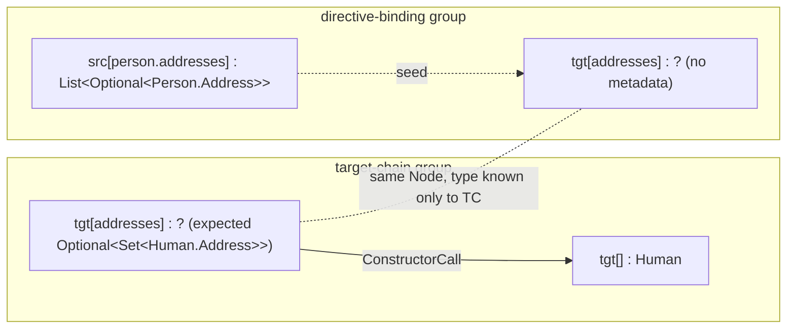
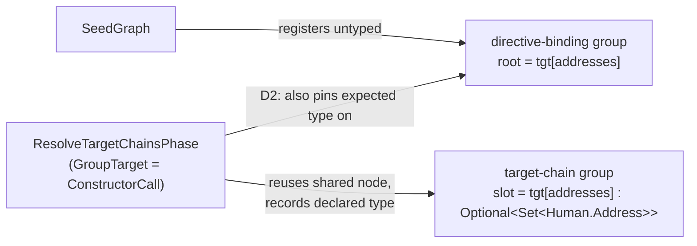
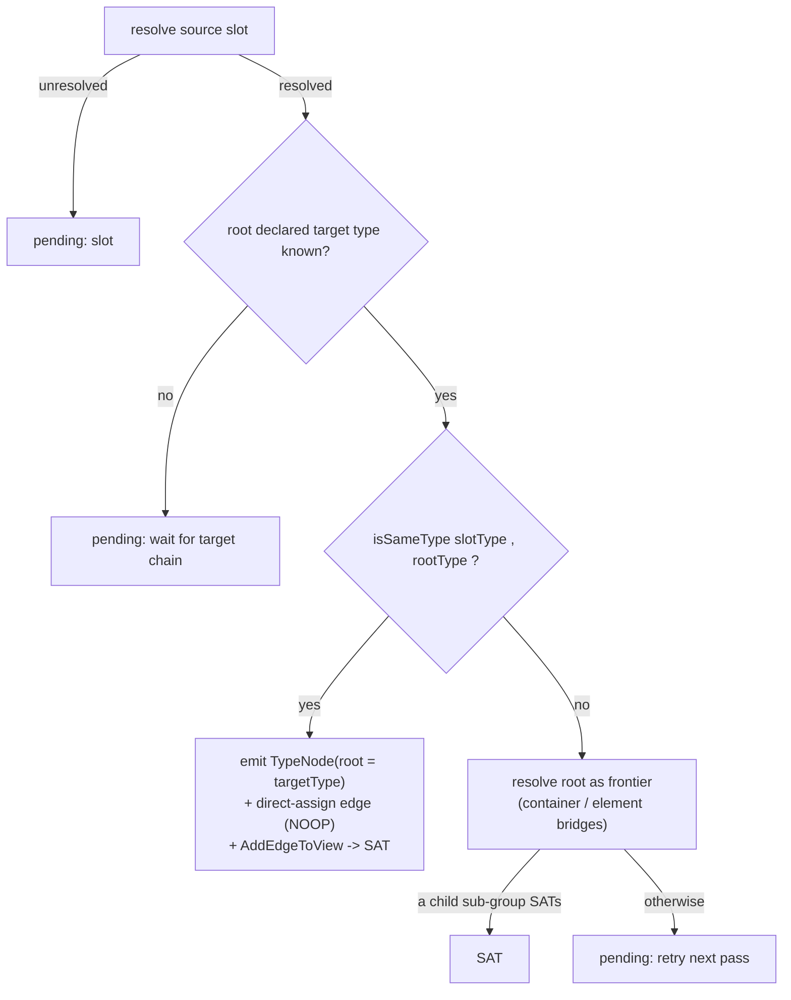

## Context

The delta-pipeline refactor (`e14e741`) split the monolithic `ExpandGroupsPhase` into myopic `GroupExpander`s driven by a cross-group fixed-point loop. The new `DirectiveBindingExpander` regressed directive-bound mappings whose target type differs from the source type: the realised graph collapses the conversion chain into one wrong-typed direct-assign edge (see `proposal.md`).

Relevant current state, confirmed by reading the code:

- `SeedGraph.registerSeedGroup` creates every seed group (path-segment, target-chain, directive-binding) with **empty** `slotMetadata` and **untyped** target nodes. So a directive-binding group knows neither `Node.type` nor `expectedTypeFor` for its root.
- `ResolveTargetChainsPhase.obtainOrAllocateSlotNode` **reuses** the seed target node (matched by last path segment) as the `GroupTarget` (`ConstructorCall`) slot, and records the declared param type in the **target-chain** group's `slotMetadata`. The shared node's `Node.type` stays empty — it is "typed at producer commit".
- `ExpansionSnapshot.effectiveTypeFor(node, group)` returns `node.getType()` else `group.expectedTypeFor(node)`. For the directive-binding group this is `null`, because the declared type lives in the *target-chain* group's metadata, not the directive-binding group's.
- `DirectiveBindingExpander.step` branches on `snapshot.typeOf(root)` (the producer-stamped `Node.type`, never set for the directive root). Finding it empty, it stamps the **source** slot type onto the root (`directAssignTyping`), then on the next pass sees source == root and emits a NOOP direct-assign edge — the container-conversion branch never fires.

The declared target type therefore already exists in the graph (target-chain group metadata); it is simply not reachable from where the directive-binding expander decides.

## Goals / Non-Goals

**Goals:**
- Restore the container-conversion chain in the realised graph for directive bindings whose target type differs from the source type, including recursive element mapping.
- Make `DirectiveBindingExpander` drive its decision off the root's **declared target type**, never the source slot type.
- Keep the fix within scaffolding/driver components (expander + snapshot); no `Bridge`/`GroupTarget` SPI changes; expanders stay myopic (no reaching into a specific sibling group by identity).

**Non-Goals:**
- Code generation. The emitted-mapper compile error is a known, separate incomplete-codegen issue and stays out of scope.
- Re-architecting seed-group registration or the target-chain phase.
- Changing within-group target-to-source direction or the cross-group fixed-point loop.

## Decisions

### D1 — The declared target type is the source of truth for the directive root; the source slot type is never propagated onto it

`DirectiveBindingExpander` SHALL obtain the root's type as a **declared target type**, not by copying the resolved source slot type. The `directAssignTyping` step (stamping `slotType` onto an untyped root) is removed. This is the root-cause fix: it stops the source type masquerading as the target type and makes the same-type check meaningful.

*Alternative considered:* keep stamping but only when types already match. Rejected — the root is untyped at decision time, so "already match" can't be evaluated without first knowing the real target type; the stamp is what destroys that information.

*Provenance:* this restores the control flow the last-good commit `5dcee1c` already had (`expandDirectiveBindingGroup`: resolve slot → if root type unknown, return pending without stamping → same-type direct-assign → differ expand root frontier). `e14e741` added the source-type stamp that broke it. D2 has no `5dcee1c` counterpart because that commit typed the root eagerly via `Node.setType`; the delta pipeline types lazily at producer commit, so the declared type must be read from group metadata instead.

### D2 — Pin the declared target type onto the directive-binding group structurally (scaffolding, not a driver-time scan)

The declared target type is already declaration-pinned: `ResolveTargetChainsPhase` reuses the shared seed node as a `GroupTarget` slot and records the type in the *target-chain* group's `slotMetadata`. The directive-binding group, registered earlier by `SeedGraph`, has the same node as its **root** but no metadata for it.

The architecturally-aligned fix makes the relationship **structural before the driver runs** (per the engine's layering: scaffolding pins relationships; the driver does not reach across groups at runtime). `ResolveTargetChainsPhase` — already holding both the shared node and the declared `Slot` — SHALL also record that expected type on the directive-binding group rooted at the same node. Then `effectiveTypeFor(root, group)` resolves from the directive-binding group's **own** metadata (`node.getType()` → `group.expectedTypeFor(node)`), with no new snapshot method and no global scan. The group stays self-contained; `FrontierMatcher`/`SlotResolver` (which already call `effectiveTypeFor`) see the target type unchanged.

`ExpansionGroup` slotMetadata is currently immutable, so this needs a narrow, scaffolding-only mutator (e.g. `recordExpectedType(Node, Slot)`) used solely by `ResolveTargetChainsPhase` while it is still registering target chains — not exposed to expanders or strategies.

*Alternative considered:* a group-agnostic `ExpansionSnapshot.expectedTypeFor(Node)` that scans every group for the node's expected type, with `effectiveTypeFor` falling back to it. Rejected — it is the driver reaching across groups at runtime to recover a relationship that scaffolding should have made structural (contradicts `feedback-strategies-stay-myopic` / the WHEN-WHERE vs HOW layering). The structural pin keeps candidate search and type reads inside the owning group.

### D3 — Decision flow of the rewritten `step`

Same-type bindings (e.g. `String` → `String`) still emit a single direct-assign edge, but now type the root with the **target** type (equal in value) at the producer-commit point, preserving the "typed at producer commit" lifecycle. Differing types expand the root as a frontier so the existing container/element `Bridge`s build the chain; the group SATs when a spawned child SATs.

### D4 — Fix location

All changes land in driver/scaffolding code:
- `DirectiveBindingExpander` (decision logic — read `effectiveTypeFor`, gate direct-assign vs frontier expansion, no source-type stamp).
- `ResolveTargetChainsPhase` (pins the declared target type onto the directive-binding group via a new `ExpansionGroup.recordExpectedType` mutator).
- `ExpansionGroup` (the scaffolding-only `recordExpectedType` mutator on the graph model).

`effectiveTypeFor` / `ExpansionStateImpl` are unchanged (no global scan — the pin makes the type group-local). No strategy SPI or `SeedGraph` change. This matches the project rule that expansion fixes belong in scaffolding/driver while strategies stay myopic.

## Risks / Trade-offs

- **The new `ExpansionGroup` mutator widens mutable group state** → Mitigation: keep it package-private and used only by `ResolveTargetChainsPhase` during target-chain registration (before `ExpandGroupsPhase` runs); expanders see only the read side via `expectedTypeFor`. Do not expose it on the snapshot.
- **A directive-binding group whose root is not a target-chain slot** (no reused shared node, so nothing pins its type) → Mitigation: the group stays pending → `unsatNoPlan`, a correct diagnostic; covered by a test. Confirm `ResolveTargetChainsPhase` pins every directive root that corresponds to a constructor/setter slot.
- **Phase-ordering assumption** (the target chain records the declared type before `ExpandGroupsPhase` runs) → Mitigation: `ResolveTargetChainsPhase` precedes `ExpandGroupsPhase` in the declared phase order, so the type is present from pass 1; covered by an end-to-end graph-shape test.
- **A directive target with no resolvable target chain** (no expected type recorded) → the group stays pending and converges to `unsatNoPlan` — a correct diagnostic rather than a wrong direct-assign. Acceptable.
- **Nested directive targets (`tgt[a.b]`)** rely on the same shared-node typing at each level → Mitigation: the expected-type lookup is per-node and applies uniformly; the integration `addresses` case exercises a single level, deeper nesting should get a follow-up test.

## Migration Plan

No data or API migration. Rollback is reverting the expander + snapshot change. Verification is regenerating the `percolate-integration` `PersonMapper` graph and asserting `tgt[addresses]` carries `Optional<Set<Human.Address>>` with a bridge chain (not a source-typed direct assign).

## Open Questions

- Should the same-type direct-assign path additionally assert that the slot's resolved type is assignable to the declared target type (defensive), or is `isSameType` sufficient for now? Leaning sufficient; revisit if a widening/boxing case appears.
</content>
