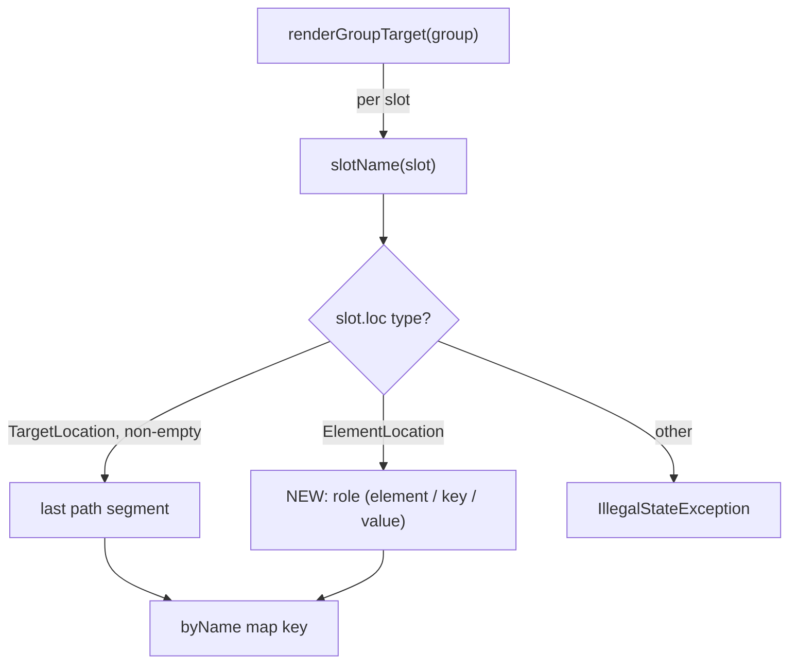

## Context

`BuildMethodBodies` is the codegen pass that runs after expansion has converged. It is read-only over `MapperGraph` and walks the realised subgraph to emit each method body. For a group target it calls `slotName(slot)` per slot to build the `byName` map that `GroupCodegen` consumes.

`slotName` only handles `TargetLocation` slots:

```java
private static String slotName(final Node slot) {
    if (slot.getLoc() instanceof TargetLocation) {
        final var segments = ((TargetLocation) slot.getLoc()).getPath().getSegments();
        if (!segments.isEmpty()) {
            return segments.get(segments.size() - 1);
        }
    }
    throw new IllegalStateException("cannot derive slot name from node: " + slot.id());
}
```

Container expansion produces sub-groups whose slot is an `ElementLocation` node, not a `TargetLocation`. So any container chain throws at codegen time. The chain itself is built correctly by the engine — this is purely a naming gap in the consumer.



## Goals / Non-Goals

**Goals:**
- Make `slotName` total over the slot kinds the engine actually produces: `TargetLocation` and `ElementLocation`.
- Unblock container-typed mapper targets at codegen (`List`/`Set`/`Array`/`Optional`).
- Add the `BuildMethodBodiesSpec` container-group coverage that was missing.

**Non-Goals:**
- No expansion, SPI, `Bridge`, or `GroupTarget` change — see [[feedback_strategies_stay_myopic]]. The element slots already exist; only the codegen consumer is patched.
- No change to expansion direction (still target-to-source) or sub-group structure — see [[project_container_processing]], [[project_delta_pipeline]].
- No `java.util.Map` support and no `ArrayWrap`. Those are separate container gaps; this change only completes slot naming for the slots the current bridges emit.
- No change to how container `GroupCodegen`s consume inputs (still positional `inputs.single()`).

## Decisions

### D1 — Derive the name from `ElementLocation.role`

`ElementLocation` already carries `role` (`"element"` default; the model reserves `"key"`/`"value"` for map-shaped containers per [[project_container_processing]]). Use it directly as the slot name.

*Why over a synthetic counter or positional index:* `role` is already the element slot's identity in the graph model, is unique within a single-element container group, and is distinct across the two axes of a future map container — so name-based access (`inputs.byName("key")`) works for free if a multi-axis `GroupCodegen` ever wants it. A counter would invent a parallel naming scheme the rest of the model doesn't use.

### D2 — Keep the fall-through error

A slot that is neither `TargetLocation`-with-segments nor `ElementLocation` is still a genuine engine invariant violation; keep the `IllegalStateException` so a real defect surfaces loudly rather than emitting nonsense codegen. `GenerateStage` already wraps this into a per-mapper `code generation failed` diagnostic without aborting the round.

### D3 — Pin the gap with a test, not just the fix

The defect shipped because no `BuildMethodBodiesSpec` case drove a group whose slot is an `ElementLocation`. Add a container-group scenario (single-level) and, ideally, a nested case mirroring `Optional<Set<…>>`. This converts the integration-only failure into a unit-level regression guard.

## Risks / Trade-offs

- **[Fix necessary but maybe not sufficient for `mapHuman`]** → the integration chain also composes `MethodCallBridge` and multi-fire `OptionalCollect`/`OptionalWrap` siblings. Mitigation: gate completion on a real `:mappers:classes` run against `percolate-integration`, not just the unit spec.
- **[`role` collides if a future container reuses the same role for two slots]** → not possible for the current single-element bridges; for map containers the model already mandates distinct `"key"`/`"value"` roles. If a future bridge violates that, the `byName` map would silently overwrite — acceptable because positional reads are what container codegens use, and a distinct-role rule is already part of the container model.
- **[Scope creep toward Map/ArrayWrap]** → explicitly excluded; this change only names the slots the existing bridges emit.

## Open Questions

- None blocking. Whether to also assert the rendered container expression (not just "does not throw") in the unit spec is a test-depth choice; the integration build is the real end-to-end signal.
