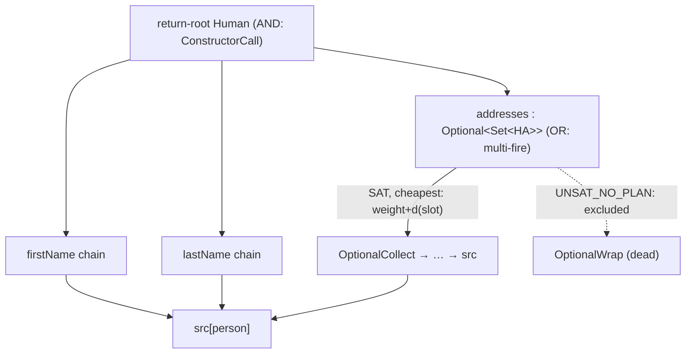

## Context

`BuildMethodBodies` walks `realisedSubgraph()`, which holds every committed `REALISED` edge. Multi-fire expansion registers sibling groups at the same root (one `SAT`, others `UNSAT_NO_PLAN`); their edges all sit in the realised subgraph. The render pass selects a group per root with `putIfAbsent` and never reads `GroupOutcome`, so it can pick a dead sibling and fail (`leaf node is not a SourceLocation`). The expansion model already assigns sibling selection to the render-time consumer ([[project_expansion_direction]]): "codegen picks among siblings via outcome at render time, not via a-priori commit." The engine, diagnostics, and `delta` pipeline stay untouched ([[feedback_strategies_stay_myopic]], [[project_delta_pipeline]]).

Underlying graph is a `DirectedMultigraph<Node, Edge>` (unweighted); `Edge.weight` is an `int`; edges point input→frontier (source→target). Views are JGraphT `MaskSubgraph`s; debug dumps are gated on `ProcessorOptions.isDebugGraphs()` and render a `GraphSource` through the shared `DotRenderer`.

## Goals / Non-Goals

**Goals:**
- A dedicated `PlanView` (`GraphSource`) exposing only the chosen plan: SAT-group edges with multi-fire OR-choices resolved to the cheapest branch.
- Cheapest selection via JGraphT `DijkstraShortestPath` as a cost oracle (library primitive, [[feedback_library_primitives]]).
- `BuildMethodBodies` consumes `planView()`; ambiguity (putIfAbsent, multi-inbound) gone.
- New debug-gated `DumpPlan` → `.plan.dot`.

**Non-Goals:**
- No change to `transformsView()` / `.transforms.dot` — it keeps dead siblings on purpose (debugging).
- No engine / `Applier` / `Bridge` / `GroupTarget` / SPI change. Outcomes are already recorded; this only consumes them.
- No change to how `GroupCodegen`s consume inputs (still positional).

## Decisions

### D1 — `PlanView` is a dedicated `GraphSource`, not a method body on `MapperGraph`

`MapperGraph.planView()` returns a `PlanView` built by a dedicated builder class. Keeping the selection logic in its own class makes it unit-testable in isolation and lets `DumpPlan` and `BuildMethodBodies` share one source of truth. Mirrors the existing `RealisedSubgraph` / `TransformsView` pattern.

### D2 — Dijkstra is the cost oracle, not the plan extractor

`DijkstraShortestPath.getPath(root)` returns one path — wrong for AND nodes (a `ConstructorCall` needs all slots). So Dijkstra computes only the distance labels `d(n)`; the plan is assembled by a guided target-to-source walk.

Selection rule per node in the walk:
- **AND node** (one eligible group): keep all slot→root edges, recurse every slot.
- **OR node** (>1 eligible SAT group): keep the group minimising `weight(slot→node) + d(slot)`, recurse only it.

`d(n)` is the cheapest single-path cost source→n; correct for ranking OR siblings (single-slot chains) and harmlessly unused at AND nodes.

### D3 — Cost oracle construction

Build a weighted projection of the eligible (REALISED ∩ SAT-group) subgraph via `AsWeightedGraph(eligible, e -> (double) e.weight)`. Add one virtual super-source with weight-0 edges to every source-parameter-leaf node. `new DijkstraShortestPath<>(weighted).getPaths(superSource).getWeight(n)` gives `d(n)`. The super-source/weighting is built on a throwaway copy; the real `MapperGraph` is never mutated.

### D4 — Eligibility = REALISED ∧ owned by a SAT group

An edge is plan-eligible iff `kind == REALISED` and some group with `GroupOutcome.kind == SAT` contains it (`group.contains(edge)` over `groupOutcomes()`). Dead-sibling edges live only in UNSAT groups and are filtered out. This is the same outcome the diagnostics stage filters on ("alive sibling exists").

### D5 — `DumpPlan` mirrors `DumpTransforms`

Same constructor deps (`Filer`, `Diagnostics`, `ProcessorOptions`, `DotRenderer`), same `isDebugGraphs()` gate, same empty-graph skip and warning-on-IOException policy, same pipeline position (after validation). Only the view (`planView()`) and the filename infix (`.plan.dot`) differ. `PlanView implements GraphSource` so the existing renderer consumes it unchanged.

## Risks / Trade-offs

- **[Multiple SAT siblings with equal `weight + d`]** → deterministic tiebreak by `Node.id()` (stable, identity-suffixed) so output is reproducible. Documented; equal-cost plans are semantically interchangeable.
- **[A REALISED edge in no group at all]** → would be invisible to the plan. Mitigation: assert during build that every plan-reachable node has an eligible producer; if a render-reachable node has none, fail loudly (keep the existing `IllegalStateException` shape) rather than emit silent-wrong code. Surface in tests.
- **[`d` over a multigraph with parallel edges]** → `AsWeightedGraph` over the multigraph honours per-edge weight; Dijkstra picks the min parallel edge naturally.
- **[Cost-oracle cost]** → one Dijkstra per mapper graph (small). Negligible vs annotation-processing overhead.
- **[transforms vs plan divergence confuses users]** → documented in the `graph-debug-output` spec: transforms = everything committed (debug), plan = chosen plan (what codegen emits).

## Open Questions

- None blocking. Whether `planView()` should be computed once and cached on `MapperGraph` vs recomputed per accessor call is a minor perf choice; default to compute-on-call (views are cheap, graph is frozen post-expansion).
