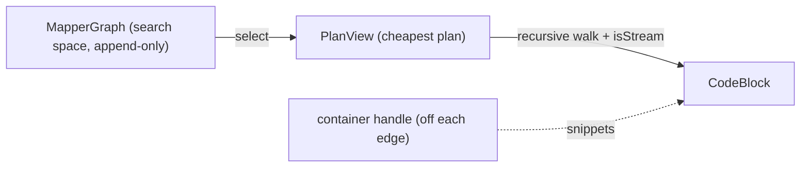
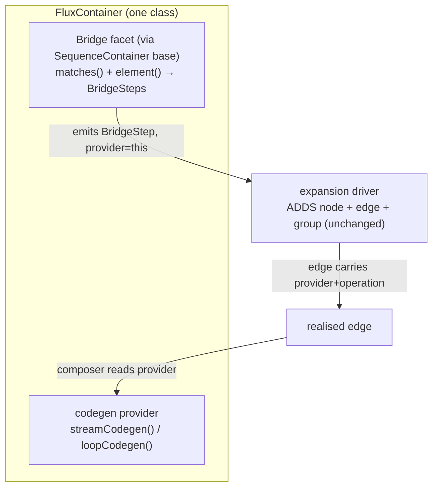

## Context

`BuildMethodBodies` builds a method body by **recursively walking `PlanView`** (render child, apply parent's edge/group codegen). Scalars and constructors work. Containers do not: a collect/unwrap bridge attaches a `$L` pass-through, so a container target emits a type-incorrect body (a `List` passed to a scalar mapper). The structural reason is that container weaving spans **several** strategies (open a stream, flat-map a wrapper, map the element, collect), the stream flows between them, and one hop's rendering depends on whether it sits inside a stream.

The project goal is that **developers add a container by supplying a strategy** (so `Mono`/`Flux`/custom need no engine change). So the fix must keep all container syntax in strategies and leave only structure in the engine. See [[project_codegen_architecture_direction]] (locked 2026-05-30), which this change implements; it **supersedes** the abandoned `plan-graph-codegen` mutable op-node IR.

## Goals / Non-Goals

**Goals:**
- Code generation is a **pure function of the solved graph**; every container `CodeBlock` comes from a strategy handle; the composer holds zero container syntax.
- A container is **one developer-facing class per type** — candidacy (`Bridge`) + per-paradigm codegen — on shared SPI bases; List/Set/array/Optional are the first customers of that exact SPI.
- Container weaving extends the **existing recursive `PlanView` walk** with a one-bit `isStream` flag — no IR, no mutable plan graph, no lowering pass.
- **Three orthogonal axes** (reference-nullability / presence / sequence) composed, never merged.
- Regression-safe: scalar/constructor output is byte-identical.

**Non-Goals:**
- Loop backend + `codegen.style` (second paradigm) — architecturally enabled via `loopCodegen()`, not built.
- Concrete `Mono`/`Flux` containers — the SPI shape is proven against them, impl deferred.
- Nested sequences (`List<List<X>>`) and single-element extraction — developer's explicit converter (one `MethodCallBridge` hop).
- Maps, filtering.
- Any change to expansion direction, the driver's graph mutation, nullability resolution, or `MapperGraph`'s append-only invariant.

## Goals realised — worked example (`mapHuman`)

`List<Optional<Address>>` → `Optional<Set<HumanAddress>>`, element mapper `mapAddr`:

```java
new Human(/* … */,
  Optional.ofNullable(                       // OptionalWrap  (PRESERVING scalar wrap, EdgeCodegen)
    p.getAddresses().stream()                // Iterable/List iterate   (ENTERING seq, not-in-stream → open)
      .flatMap(o -> o.stream())              // Optional in stream      (ENTERING wrapper, in-stream → FilterPresent)
      .map(a -> mapAddr(a))                  // element map             (PRESERVING, in-stream → mapElements)
      .collect(Collectors.toSet())));        // Set collect             (EXITING → close)
```

Every fragment but the `new Human(...)`/`?:` glue comes from a strategy handle.

## Decisions

### D1 — No IR. Codegen stays a recursive `PlanView` walk + a one-bit `isStream` flag

The container reorganization is a **stateful walk**, not graph mutation: the chain is already linear and ordered target→source, and child-first recursion renders the stream opener (deepest) before its consumers, so the fluent chain builds inside-out naturally. The only cross-hop fact is *“is my input already a stream?”*, which rides **up** the recursion as a return flag.

A mutable op-node `PlanGraph` with lowering/optimization passes (the prior design) bought a backend-neutral plan and a separately dumpable emission graph — both justified only by a **second backend (loop)**, which is not on the roadmap. YAGNI: drop the IR; if the loop backend ever lands it is its own recursive walk, introduced then with no SPI impact.



### D2 — Composition ⟂ snippets (the load-bearing seam)

The composer owns **only the paradigm skeleton**: lambda/variable names, expression/statement sequencing, the null-guard ternary. It contains **zero** container syntax. Every container-touching `CodeBlock` (`stream()`, `collect(toSet())`, `ofNullable`, `orElse`) comes from a strategy handle. Scalars keep `EdgeCodegen`; `ConstructorCall` keeps `GroupCodegen`. This is what keeps codegen developer-extensible.

### D3 — A container is ONE class per type: candidacy + per-paradigm codegen



`SequenceContainer`/`WrapperContainer` `implement Bridge`; their `bridge(from,to,ctx)` turns the developer's `matches`/`element` into the collect/iterate/wrap/unwrap `BridgeStep`s, attaching `this` as the codegen provider. The developer writes `matches`, `element`, and the snippet methods — nothing else. Registration is `@AutoService`/`ServiceLoader`, exactly like today's bridges. The driver still owns all graph mutation (strategy declares shape; engine materialises — [[project_expansion_what_vs_how]], [[feedback_strategies_stay_myopic]]).

*Alternative rejected:* keep the 9 per-op bridges and merely attach a handle. It leaves "add Flux" meaning several bridge classes — the opposite of the single-class goal.

### D4 — The edge carries the container provider + operation, not a frozen snippet

A single frozen snippet would block a second paradigm (the loop backend could never get its loop snippets from a one-slot edge). So a container edge carries the **provider** + the **operation** (collect/iterate/wrap/unwrap/map); the backend selected by `codegen.style` asks the provider for the paradigm it wants and dispatches on the operation:

```
stream backend → provider.streamCodegen().collect(s)
loop  backend → provider.loopCodegen().orElseThrow().add(r, e)
```

Scalar edges still carry a paradigm-neutral `EdgeCodegen` (a getter is the same in any backend). A container lacking the chosen paradigm → error/fallback (`Flux` has no `for` form — correct by omission).

### D5 — Three orthogonal axes, never merged

1. **reference-nullability** — JSpecify `@Nullable`, **per level** (the container ref AND each element ref). Existing machinery; only **read** at container boundaries.
2. **presence** — `Optional`/`Mono` 0-or-1. Own ops (`map`/`ofNullable`/`orElse`).
3. **sequence** — `List`/`Set`/array/`Flux`. iterate→map→collect.

Merging presence into nullability is **rejected**: `@Nullable Optional<@Nullable Long>` has three distinct states (null ref / empty / present), and `Mono` empties reactively and cannot be null-checked. Cross-axis (not merge): a wrapper's empty→scalar collapse **reads** the target's reference-nullability to pick `orElse(null)` (`@Nullable`) vs `orElseThrow` (non-null).

### D6 — Built-ins are the first customers of the developer SPI

`ListContainer`/`SetContainer`/`ArrayContainer`/`OptionalContainer` (in `strategies-builtin`) extend the same `SequenceContainer`/`WrapperContainer` bases a developer uses for `FluxContainer`/`MonoContainer`, with no privileged internal path. If List can't be expressed cleanly on the SPI, the SPI is wrong. The 9 per-op bridges are **deleted**, folded in as operations.

### D7 — `isStream` weaving rules (the whole composer extension)

Each hop dispatches on `(operation, isStream-of-input)`; the result carries an `isStream` bit up:

| hop | input NOT a stream | input IS a stream |
|---|---|---|
| ENTERING sequence | open: `iterate(in)` → stream | (nested seq — out of scope, explicit converter) |
| ENTERING wrapper | top-level: `unwrap(in, target-nullability)` / `mapPresence` | `flatMapElements(in, v, iterate(v))` — FilterPresent, drops empties |
| PRESERVING element map | inline `Convert` (scalar `EdgeCodegen`) | `mapElements(in, v, edge(v))` |
| EXITING into container | — | close: `collect(in)` (sequence) / `collectPresence(in)` (wrapper) |

`FilterPresent` is **emergent** — `Optional.iterate()` = `o.stream()`, so `flatMapElements` over it drops empties; no special op. Top-level `Optional<X>→Optional<Y>` uses `mapPresence` (`o.map(f)`); the verbose explicit form is the acceptable fallback for a bean mapper.

### D8 — Two paradigms, one now

Stream backend ships. The loop backend (`codegen.style=loop`, classic `for`+`add`) is a **second recursive walk** emitting statements via each container's `loopCodegen()` — no IR needed (recursion nests `for`/temp-vars symmetrically). Adding a paradigm = a backend + a handle method group; adding a container = one class; the two are independent.

## Risks / Trade-offs

- **[Deleting 9 working bridges]** → regression surface in expansion candidacy. Mitigation: the 4 container classes emit the same `BridgeStep`s (same graph shape); `container-expansion` and golden graph/dot tests stay green; consolidate behind unchanged expansion semantics.
- **[New public SPI surface in `spi`]** → naming/ergonomics churn. Mitigation: prove it against List/Set/array/Optional (built-ins) and `Flux`/`Mono` (design only) before locking names.
- **[Verbose top-level `Optional<X>→Optional<Y>` if `mapPresence` fold misfires]** → accepted ("right most of the time is decent"); covered by composer unit tests.
- **[`isStream` bottom-up flag for deep mixed nesting]** → kept tractable by excluding nested sequences (explicit converter); covered by composer unit tests over hand-built `PlanView` shapes.
- **[No IR ⇒ loop backend re-walks `PlanView`]** → intentional; the loop backend is additive and introduces its own walk, with no SPI/handle change.

## Migration Plan

Regression-safe, staged:
1. SPI types + bases in `spi`; `Edge` carries provider+operation; scalar/constructor path untouched — tree stays green, identical output.
2. Built-in `*Container` classes on the bases; delete the 9 per-op bridges; expansion graph shape unchanged.
3. Extend the composer with the `isStream` weaving (D7); container bodies become stream-woven; `mapHuman` verified.

Rollback = revert to the per-op bridges + `$L` pass-through (today's behaviour). Nothing else depends on the new SPI.

## Open Questions

- Exact method names on `ContainerCodegen`/`WrapperCodegen` and whether `wrap` (single-element `List.of`) is a sequence op or stays a PRESERVING `EdgeCodegen` — settle while implementing the built-ins.
- Whether the edge stores an explicit `operation` enum or the composer derives it from `(ScopeTransition, isStream, handle-kind)` — settle in stage 1 by what keeps the walk simplest.
