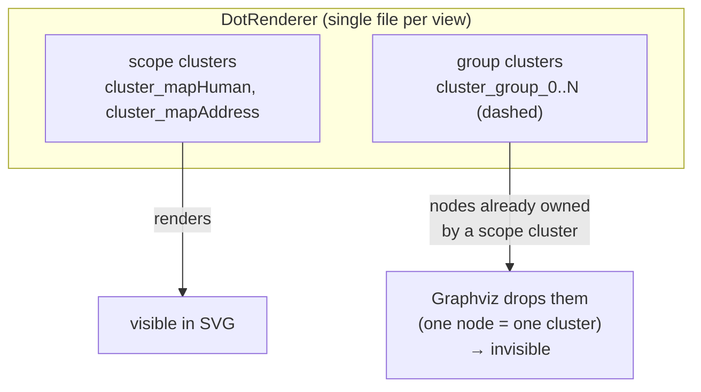
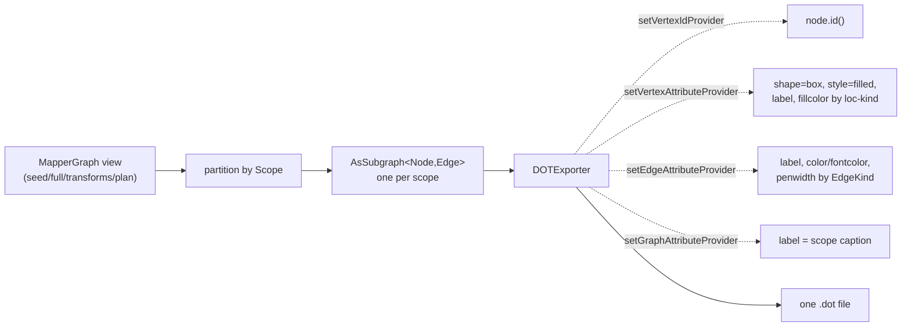
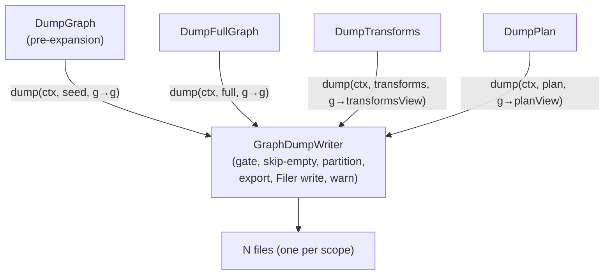

## Context

The processor emits optional DOT debug graphs (off by default, gated on `ProcessorOptions.debugGraphs`) at four pipeline points — `seed`, `full`, `transforms`, `plan`. Today a hand-rolled `DotRenderer` serializes a whole `MapperGraph` (or a `GraphSource` view) into a single file per view, grouping nodes into two layers of `subgraph cluster_*` blocks:

The group clusters are dead output: Graphviz binds each node to exactly the first cluster it is declared in, and `DotGroupClusterRenderer` only emits bare re-references to nodes already declared inside a scope cluster. The scope clusters work but stack every mapper method into one crowded file. Investigation of the integration mapper (`PersonMapper`) confirmed **zero cross-scope edges** in both `seed` and `full` — scopes are disjoint subgraphs, because cross-method calls are by-name codegen bindings, not graph edges.

The graph is a JGraphT `DirectedMultigraph<Node, Edge>`; `jgrapht-io` (`DOTExporter`) and `jgrapht-core` (`AsSubgraph`, already used by `ExpansionGroup`) are on the classpath. Once both cluster layers are removed, each output file is a flat, attributed, single-scope graph — exactly `DOTExporter`'s sweet spot.

The four `Dump*` stages are near-identical: they differ only by a filename suffix and a view selector, repeating the debug gate, empty-graph skip, `Filer` write, and `IOException`→warning handling.

## Goals / Non-Goals

**Goals:**
- Remove the dead group-cluster code with zero change to rendered output.
- Emit one file per `(scope, view)` so each mapper method reads in isolation.
- Reimplement the renderer over JGraphT `DOTExporter`, deleting bespoke DOT escaping/assembly.
- Encode node role by `fillcolor` on a uniform `box`; remove the hard-to-read diamond.
- Make `SEED` edges recede (grey) and keep `REALISED` edges dominant.
- Collapse the four dump stages onto one shared `GraphDumpWriter`, keeping their distinct pipeline positions.

**Non-Goals:**
- No change to the four views' semantics (`seed`/`full`/`transforms`/`plan` selection logic stays in `MapperGraph`).
- No change to expansion, codegen, or any SPI.
- No re-enabling of expansion-group visualization (it was invisible and is treated as noise; if ever wanted, it needs a non-cluster encoding — out of scope here).
- No determinism guarantees beyond what `DOTExporter` provides given deterministically-ordered inputs.

## Decisions

### D1 — Reimplement over JGraphT `DOTExporter` (vs keep hand-rolled)

`DOTExporter` over an `AsSubgraph` of the underlying graph, configured with attribute providers:

The blocker that previously made `DOTExporter` unsuitable (cluster support) disappears once both cluster layers are gone. `BaseExporter.setGraphAttributeProvider` (confirmed present in 1.5.2) supplies the visible scope caption, so no information is lost. **Why over hand-rolled:** the library owns id escaping and statement structure, removing `escapeDot`/`appendAttributes`/header-footer code; the user explicitly asked for this. Alternative (keep hand-rolled, delete only clusters) was rejected — it leaves bespoke serialization that the library does for free.

### D2 — One file per scope (vs one file with scope clusters)

Partition each view's nodes by `Scope`; run one exporter pass per scope. The file *is* the scope; a graph-level `label=` carries the human-readable caption.

**Filename:** `<MapperFQN>.<methodSimpleName>.<view>.dot`, disambiguated to `<methodSimpleName>-<n>` only when two scopes in the same mapper share a method simple name (overloads). `n` is a deterministic index over the colliding scopes (stable order, e.g. by `Scope.encode()`).

**Cross-scope edge fallback:** an edge is assigned to its `from`-node's scope file. By construction no edge spans scopes, but this rule guarantees an edge is never dropped if one ever did. No dedicated invariant test (diagnostic tool; a misplaced debug edge is harmless).

Alternative (keep one file, drop only group clusters) was rejected — the user finds multiple method clusters in one graph confusing.

### D3 — Colour, not shape

Every node renders `shape=box, style=filled`. Role → `fillcolor`:

| Location kind | fillcolor |
|---|---|
| `SourceLocation` | light blue (`#CFE8FF`) |
| `TargetLocation` | light green (`#D7F0D0`) |
| `ElementLocation` | light amber (`#FFE0B3`) |

The diamond (previously `ElementLocation`) is removed. Hex values are implementation-defined but stable. Alternative (keep shapes) rejected per user feedback that the diamond is hard on the eye and that colour reads better.

### D4 — Edge visual hierarchy

`EdgeKind` drives edge attributes:

| Kind | line | label | weight |
|---|---|---|---|
| `SEED` | grey (`grey60`) | grey (`fontcolor=grey60`) | thin |
| `REALISED` | black | black | `penwidth=2` |
| `MARKER` | neutral fallback | neutral | thin |

Seed edges (and their labels) recede to background; realised edges dominate. Label *content* (SEED token, strategy short name + weight, `∞` for sentinel) is unchanged from the current renderer — only colour/weight styling moves.

### D5 — Shared `GraphDumpWriter` (composition, not a base class)

A single `GraphDumpWriter` collaborator holds `Filer`, `Diagnostics`, `ProcessorOptions`, and the renderer, and owns the whole IO mechanism including the per-scope partition loop. Each `Dump*` stage stays a distinct DI bean (needed to keep its pipeline ordering — `DumpGraph`/seed must fire before `expandStage`) and shrinks to a one-line delegation with its suffix and view selector. Composition is preferred over a template base class per the project's convention.

## Risks / Trade-offs

- **[File-count growth: N scopes × 4 views]** → Acceptable: output is off-by-default diagnostic; build cost is irrelevant; files are smaller and individually readable. No mitigation needed.
- **[Visible scope caption depends on `setGraphAttributeProvider` behaving as expected in 1.5.2]** → API confirmed present; if a caption fails to render, the scope is still unambiguous from the filename. Low impact.
- **[`GraphSource` views are stream-based, `DOTExporter` needs an `org.jgrapht.Graph`]** → Feed `DOTExporter` an `AsSubgraph` over `MapperGraph`'s underlying `DirectedMultigraph` filtered by a scope predicate (and, for `transforms`/`plan`, by the view's edge/vertex masks). Reuses the existing `AsSubgraph`/`MaskSubgraph` machinery; no full-graph copy.
- **[Existing `graph-debug-output` spec is partly stale (mentions `expandedView`/`expanded.dot`)]** → This change's delta touches only the requirements it actually changes (clusters, shapes, file naming, edge styling, stages); it does not attempt to reconcile pre-existing drift. Flagged, not fixed here.
- **[Downstream tooling parsing old single-file names or `cluster_group_*`]** → None known; documented as BREAKING in the proposal for support notes.

## Open Questions

- Final hex palette is a cosmetic detail; the values in D3 are defaults and may be tuned during implementation without a spec change (the spec fixes *role→distinct-colour*, not exact hex).
