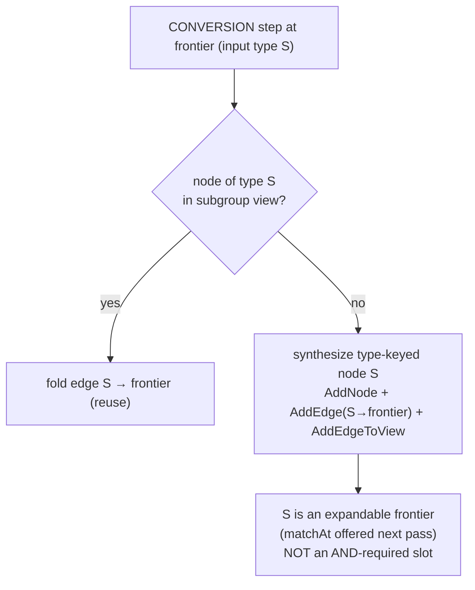

## Context

Percolate resolves a slot target-to-source: a frontier asks "what produces this type?", and `FrontierMatcher.produce` accepts only steps whose `output` equals the frontier's target type. Each `ExpansionStep` carries an `Intent`:

- **`BOUNDARY`** crosses into a *different logical item* — a getter (`person` → `person.address`), a mapper method call (an explicit/generated `mapAddress(src)`), a constructor, a container element. It opens a child `ExpansionGroup` rooted at the frontier; depth comes from nested sub-groups.
- **`CONVERSION`** re-types the *same item in place* — `Integer.valueOf(x)`, `x.intValue()`, `(long) x`. It does not change which value we are solving; it folds an edge onto the frontier within the current group's view.

Two current facts block conversion *chains*:

1. **`convertBundle` is reuse-only.** It folds from an existing in-view node (`findInViewByType`) and emits nothing when absent — so the intermediate type a cross-product needs is never created. (The `unify-expansion-spi` design intended synthesis and even named box/widen as consumers, but only the reuse half shipped; `DirectAssign`, the sole CONVERSION strategy, is same-type so its input is always already in view and the gap had no consumer.)
2. **Satisfaction is first-edge.** `SlotResolver.producedInView` treats a slot as satisfied the instant it has *one* incoming realised edge — it does not check that the edge's source is itself produced. The documented SAT rule (`graph-expansion`) is "base-case OR a SAT child sub-group."

So `int → Long` stalls: at `Long` the only candidate is `int`; `box(int)=Integer≠Long` fails the output gate, widen sees a non-primitive target; nothing fires, no `long` is ever created, and re-running changes nothing. Even with synthesis, first-edge SAT would declare `Long` done the moment `box` folds `long→Long`, before `long` is produced.

Constraints ([[feedback_never_forward_expansion]], [[feedback_strategies_stay_myopic]]): target-to-source only; myopic strategies; Java 11, Lombok, `@AutoService(ExpansionStrategy.class)`, tagged Spock specs.

## Goals / Non-Goals

**Goals:**
- Resolve single-hop boxing (`int → Integer`), unboxing (`Integer → int`), widening (`int → long`).
- Let the engine **compose** the boxed-widening cross-products (`int → Long`, `Integer → long`, `Integer → Long`) from atomic single-hop strategies — no per-pair code.
- Make the enabling engine model — in-subgroup conversion synthesis + reachability SAT — bounded and terminating by construction.
- Cover the full JLS 5.1.2 widening lattice incl. the IEEE legs. Ship a tagged spec per strategy.

**Non-Goals:**
- Narrowing / lossy conversions (user-helper territory).
- `Number`/`Object` boxing targets.
- Nullable-unbox diagnostics (deferred to `nullability`).
- Changing `BOUNDARY` semantics, the `Intent` enum, `ExpansionStep` factories, the plan-view/codegen, or the global stop-at-SAT bound for boundary/assembly groups.

## Decisions

### D1 — Conversions are CONVERSIONs, not boundaries; two atomic strategies

box/unbox/widen re-type the *same item* → `Intent.CONVERSION`. (Getters and mapper-method calls change the item → `BOUNDARY`; a `valueOf`/`intValue`/cast does not.) Boxing and unboxing are one relationship (the primitive↔wrapper identity) → one strategy `PrimitiveWrapperConversion`. Widening is a separate relationship (a numeric lattice) → `WidenPrimitive`. Both emit **single-hop** steps; the engine composes chains (D2–D4), so neither needs cross-product knowledge.

### D2 — A conversion subgroup is a type-DAG; CONVERSION synthesizes type-keyed nodes

`X`, `Y`, `Z` are different types ⇒ different **nodes** in the *same* subgroup (not sub-groups — a coercion is not a flow-identity crossing). `convertBundle` becomes reuse-**or**-synthesize:

Dedup keys on **type within the subgroup** (matching the shipped `findInViewByType`/`isSameType`). This is positionally sound: a conversion subgroup is *one logical item* at different types, so "same type = same node" cannot cross positions ([[project_expansion_mental_model]]).

### D3 — Reachability SAT ⚠️ revisits the SAT rule

> **This is the substantive engine change.** Satisfaction generalizes from first-incoming-edge to **base-case reachability**: a slot/node satisfies iff it is a base case, OR a child sub-group is SAT, OR it has an incoming realised **conversion edge whose source node is itself satisfied** (transitively). This revisits [[project_group_sat_rule]] (previously "base-case OR SAT child sub-group"). Flagged per the design rule "warn explicitly on architecture shifts."

`Long` is satisfied **only** when `long` is, which holds only when `int` is, which holds because `Integer` is a base case. A whole realised path must exist — no premature SAT. Synthesized nodes that never become reachable (e.g. widen's `short`/`byte` alternatives) are **dead ends retained in the graph**; they are not AND-required, so they never block. The group SATs iff all its **fixed slots** are reachable.

### D4 — Stop at SAT; over-emit, select late

Once a group SATs it is **not expanded further** (the existing `runPass` filter is unchanged). This is sound and optimal for conversions: expansion is breadth-by-hops and every conversion hop costs `STEP`, so the shortest = cheapest path completes first and is present when the group SATs; any deeper path is strictly more expensive. The graph still holds the competing shorter paths and dead ends — the plan-view's existing AND/OR + Dijkstra walk picks the cheapest realised path ([[project_plan_view_codegen]], [[project_cutover_assembly_myopia]]). Codegen need only be correct, never optimal; a direct conversion we didn't write (because it overlaps box/widen) simply isn't chosen — fine.

### D5 — Termination by type-dedup + stop-at-SAT

The primitive/wrapper conversion lattice is finite (~8 + 8 types). Type-dedup ⇒ at most one node per type per subgroup ⇒ a bounded DAG ⇒ the fixed-point loop converges in O(lattice depth) passes; stop-at-SAT halts at the first complete path. A box∘unbox round-trip lands its return edge on the existing same-type node → closes a cycle the `Applier`/`CycleDetector` rejects ([[cycles_dropped_not_impossible]]); no guard in the strategies.

### D6 — Widening lattice as data; explicit codegen; uniform weight

`WidenPrimitive` holds JLS 5.1.2 as a static `Map<TypeKind, Set<TypeKind>>` (consumes-direction). Codegen pins the static type per leg: box `W.valueOf($L)`, unbox `$L.
Value()`, widen `(p) $L` — each emits an *expression* whose static type must equal `output` for the next fold to consume it. Each leg is `Weights.STEP`; `DirectAssign` stays `NOOP`, so exact matches beat conversions and shorter chains beat longer.

## Engine mechanics (seam decisions, settled from a code spike)

These pin the mechanics the behavioural decisions above depend on, resolved against the current `expand` stage.

### E1 — Conversion intermediate location + dedup search

A synthesized conversion node is created at the **frontier's own location/scope/parent** — `new Node(Optional.of(inputType), frontier.getLoc(), frontier.getScope(), frontier.getParent())` — and stamped with the frontier's `Directive` via `AddNode(node, directive)` (re-activating the dormant directive-propagation path, see E4). The conversion-input dedup (`FrontierMatcher.findInViewByType`) searches the group's view by `isSameType`, excluding **only the frontier itself** — notably it does **not** exclude `TargetLocation` (unlike the boundary `InputAllocator.findCandidateByInputType`). This is required: re-deriving a type already on the chain (e.g. a box∘unbox or unbox∘box ping-pong) must reuse the existing node so the fold closes a cycle the `Applier` rejects; excluding `TargetLocation` would let the ping-pong synthesize fresh nodes forever (each a distinct instance, so no cycle), blowing the pass budget. `candidatesOf` (the `from`-candidate list for combinatorial strategies) keeps excluding `TargetLocation` — only the conversion-dedup search widens.

### E2 — Conversion frontiers are expanded but not AND-required

`ExpansionGroup` gains a mutable `conversionFrontiers` set. When `convertBundle` synthesizes, it emits a new `RegisterConversionFrontier(group, node)` delta whose `Applier` handler does `group.addVertexToView(node); group.addConversionFrontier(node)` (the node must enter the view before `AddEdgeToView`, which rejects edges with absent endpoints). Each group expander (`BridgeExpander`, `DirectiveBindingExpander`, `AssemblyExpander`) runs `SlotResolver.resolve` over its fixed slots/root **and** over `group.getConversionFrontiers()`; only the fixed slots/root feed `pendingSlots`. So a conversion frontier is expanded (its producers discovered) while the group is pending, but an unreachable one never blocks SAT — it is a retained dead end.

### E3 — Reachability predicate

`SlotResolver` replaces `producedInView` with `reachable(node, group, snapshot)`: `true` iff the node is a parameter-root base case, OR `hasSatChildAt` (a boundary child sub-group SAT), OR it has an incoming view `REALISED` edge whose source is itself `reachable` (DFS with a visited set; the view is acyclic by the `Applier` cycle check). Boundary slot→root edges live in the *child* view, not the parent, so a boundary-produced root is reached via `hasSatChildAt`; conversion folds live in the group's own view (added by `AddEdgeToView`), so a chain `X→Y→Z` is reached edge-by-edge. `resolve` collapses to "if `reachable` → satisfied, else expand". Both call sites change: `SlotResolver.resolve` and `DirectiveBindingExpander` (`reachable(root)` replaces `producedInView(root) || hasSatChildAt(root)`). This strictly generalizes the old behaviour — when a fold's source is already produced (every pre-existing case, all reuse-only), `reachable` and `producedInView` agree.

### E4 — Strategies are plain target-driven `ExpansionStrategy`, synthesis re-uses dormant wiring

`PrimitiveWrapperConversion` / `WidenPrimitive` implement `ExpansionStrategy.expand` directly (read `frontier.targetType()`, emit `CONVERSION` steps), **not** `CombinatorialMatch` — they are target-driven and must fire independent of whether any `from`-candidate is in view (`CombinatorialMatch.expand` emits nothing for an empty candidate list). The synthesis path re-uses infrastructure already present from the pre-`e4a1c95` model: `AddNode(node, inheritedDirective)`, `Node.inheritDirective`, and the `Applier` stamping; only `InputAllocator`'s "conversions never synthesize" comment is now stale. A new `RegisterConversionFrontier` delta is the sole addition to the delta taxonomy (forcing the two `Delta.Visitor` impls — `Applier`, `CycleProbe` — to handle it).

## Risks / Trade-offs

- **Reachability SAT (D3) is a real change to the SAT rule.** Mitigation: the plan-view already walks AND/OR + Dijkstra, so codegen is unaffected — only expansion/SAT catches up; conversion DAGs are bounded (D5); boundary/assembly termination (stop-at-SAT, scoping, pass budget) is untouched; `DirectAssign`'s same-type fold (input always present) is unchanged.
- **Widen fan-out creates dead-end nodes.** Bounded by type-dedup + stop-at-SAT (the group halts at the first complete path, so deeper dead-end expansion never happens). Watch graph size in the debug dumps during apply.
- **Same-type reuse picking the wrong candidate.** Within one conversion subgroup there is a single logical item, so type-dedup is correct; the cross-position hazard does not arise here. (Confirm during apply that conversion nodes never reuse an unrelated same-type node imported from a sibling.)
- **Precision loss on IEEE legs** — accepted (JLS/javac parity). **Nullable-unbox NPE** — deferred (Open Questions).

## Open Questions

- **Nullable-unbox handling.** A primitive `TypeMirror` likely resolves `UNKNOWN`, so `Integer → int` from a nullable source emits an NPE-prone `.intValue()` with no warning. Not fixed here; the `type-conversion` spec asserts no nullability behaviour. File a follow-up `nullability` change if a warning is wanted.
- **Strategy naming.** `PrimitiveWrapperConversion` / `WidenPrimitive` vs terser `AutoBox` / `Widen`. Cosmetic; settle in tasks.
