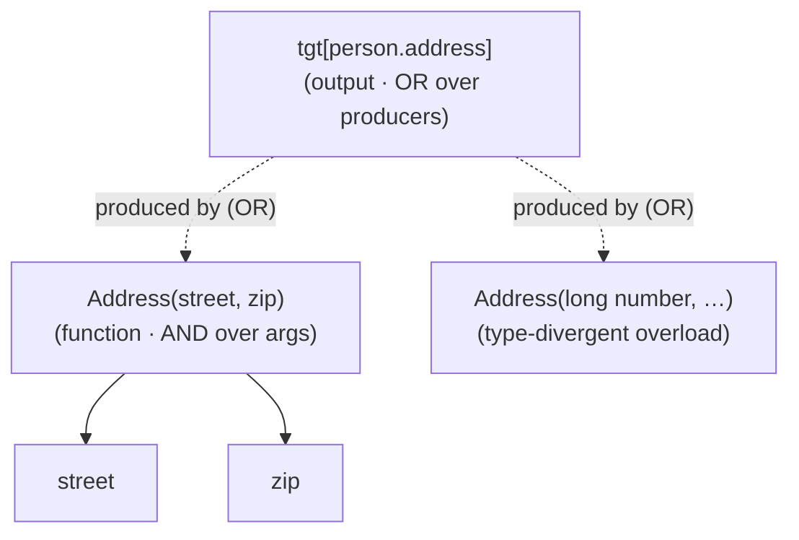
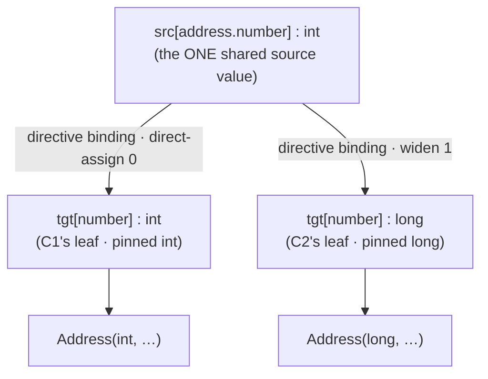
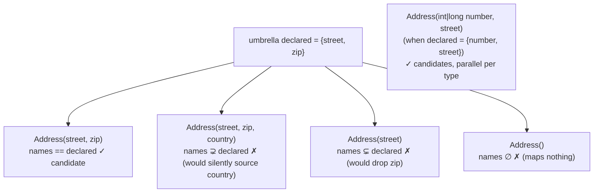

## Context

A mapper whose target declares **type-divergent overloaded constructors** — e.g. `Address(int number, String street)` and `Address(long number, String street)` — fails code generation with `no return-root TargetLocation node in scope`. The proposal traces the proximate cause: the seed creates **one untyped target leaf per field name**, `ConstructorCall` over-emits one boundary per constructor, and each tries to pin its own parameter type onto that *same* `number` leaf. The leaf's directive-binding group can hold only one expected type (`pinExpectedTypesOnProducers` is a last-writer-wins `slotMetadata.put`), so the overloads collide and no constructor cleanly satisfies.

Investigating it surfaced that this is not a constructor-specific quirk but two gaps in a single, otherwise-uniform model. The model — confirmed against the code — is:

> **Every subgroup is a function: one output (its root), N required inputs (its slots) — exactly like a Java constructor/method (one return type, N parameters, all arguments required to invoke).** `ExpansionGroup` *is* this: `getRoot()` = output, `getSlots()` = inputs, SAT = "every slot resolves" = "every argument supplied."

On this model the two operators are:

- **AND** = "a method needs all its arguments" — a subgroup is SAT only when all inputs connect.
- **OR** = "overloading" — an output node may have several subgroups rooted at it (competing constructors / converter methods); pick one.

The two gaps, restated accurately against the architecture:

1. **Type-divergent overloads collide on one shared, singular supply.** The genuinely-singular entity for `@Map(target=number, source=address.number)` is the **source value** `src[address.number]` (one field read). The directive-binding group adapts that source value to the *declared target type* — and the declared type is pinned from the constructor parameter. Today **one** leaf and **one** directive-binding group are shared across all constructors, so two constructors that disagree on `number`'s type race a single pin. There is no representation in which `number:int` (for one constructor) and `number:long` (for another) coexist.

2. **Assembly silently sources un-declared inputs / drops declared ones.** `FrontierMatcher.bindSlot` reuses a leaf by **name only**, and on a miss **falls through to `InputAllocator.allocate`** — allocating a *fresh* slot that a later pass descends to source. So a constructor with a parameter the user never mapped (`country`) gets a fresh `country` slot that is silently sourced; and a no-arg `Address()` is a zero-slot function, **vacuously SAT** (`BridgeExpander` iterates zero slots → empty pending → SAT), consumes none of the mapped supplies, is the *cheapest* producer, and can win — emitting `new Address()`, dropping every `@Map`.

Both gaps live in the **engine** (the assembly path of the driver), not in any SPI strategy, and the second is producer-shaped: it is the assembly path's job to bind inputs only to what the user declared.

> **Note — specs lag the code.** The `graph-expansion` and `seed-graph` specs still describe `ResolveTargetChainsPhase` and per-edge target-chain groups; the code deleted that phase and seeds **one umbrella assembly group per parent** via `SeedGraph.registerAssemblyGroups` (`slots = targetChildren`) plus `Applier.pinExpectedTypesOnProducers`. This design tracks the **shipped code**. The `specs` artifact must rebase the stale `ResolveTargetChainsPhase` requirements it touches (see Open Questions).

## Goals / Non-Goals

**Goals:**

- **Let type-divergent overloads coexist.** Each constructor's parameter is its own **typed target-leaf demand**, fed from the **shared source value** by its own directive-binding conversion (identity for an exact-type match, widen/box for a divergence). The type check is then **structural**: a parameter leaf resolves iff a valid conversion from the source exists, so an incompatible overload is UNSAT and pruned — no separate type guard. SAT comes to mean "compiles."
- **Bind only what the user declared.** The assembly path binds each constructor parameter only to a directive-**declared** child of the matching name, and **never allocates a fresh slot to auto-source an un-declared parameter.** For constructors (all parameters mandatory) this makes the candidate rule a name-set equality: a constructor is a candidate iff `param-name-set == declared-child-name-set`. Coverage ("no declared field dropped") and no-silent-sourcing ("no un-declared field invented") are then the two halves of that one equality.
- **Diagnose, don't drop.** When an output has directive-declared children but **no** name-matching constructor, fail with a diagnostic naming the unsatisfiable field(s) — never a silent `new Address()`, never an internal `IllegalStateException`.
- **Deterministic, cost-driven selection** among the surviving (name-matched, type-correct) constructors — DirectAssign `0` beats Widen `1`, matching Java overload resolution.
- **Regression coverage** for the `int`/`long` `Address` case and the no-arg / extra-parameter cases.

**Non-Goals (and forward-compatibility):** the invariant below is chosen *specifically* so each roadmap item is an additive producer-kind or a new way to satisfy a declared child — **never** a change to the rule.

- **Directive default values** (a `@Map`-supplied constant). This grows what "declared" *means*: a child may be declared by a source path **or** a constant. A constructor `country` parameter becomes usable the moment the user declares `country` with a default — name-set matches, its supply is the constant. No rule change; out of scope here.
- **Unmapped-target policy** (MapStruct-style `IGNORE`/`WARN`/`ERROR`). Meaningful only for **flexible** assembly (setter/builder/with), where an input is optional and a target property may be left untouched. A constructor parameter is mandatory, so an un-declared one is *always* unusable regardless of policy. The policy is per-producer-kind and lives in the flexible producers; out of scope here.
- **Builder / setter / with-style updaters.** Future `AssemblyStrategy` implementations under the same "subgroup = function, name-matched inputs, per-type parallel solutions" model; their inputs are build-steps / setters / with-methods. They differ only in **cardinality** — inputs are *optional*, relaxing `params == declared` to `available-inputs ⊇ declared` (use the declared subset; leave the rest per policy). The invariant — *bind only declared, never auto-source* — is identical. Out of scope here.
- **Collapsing the four shape-expanders** (`AssemblyExpander`, `BridgeExpander`, `DirectiveBindingExpander`, `SourceDescentExpander`) into one uniform AND/OR engine — a follow-up.
- **Value-materialization / CSE** for a node consumed by more than one producer — a pre-existing codegen limitation (relevant to tuple-splits); only one producer wins per plan, so the chosen plan is unaffected.

## Decisions

### D1 — Frame the change as "subgroup = function," not "constructor patch"

The whole change is one sentence applied to assembly: *every subgroup is a function — one output, all mandatory inputs supplied, each input bound only to a value the user declared.* The same model governs converter methods, factories, and the future flexible producers; constructors merely exposed the gaps first.

> **Architecture note (not a break):** this aligns the assembly path with the existing `DirectiveBindingExpander` conversion mechanism and the existing umbrella contract, and removes a silent-sourcing fall-through. No SPI surface changes. `AssemblyStrategy` stays purely a *firing-location* hint, untouched. The strict-vs-descend behaviour keys on `AssemblyStrategy` vs the rest, a marker that already exists.

### D2 — Per-constructor typed leaves, adapted from the shared source value

The shared, singular supply is `src[address.number]`. Each type-divergent constructor parameter becomes its **own** target leaf, pinned to its parameter type, with its **own** directive-binding conversion from that shared source — reusing the existing `DirectiveBindingExpander` path (same-type ⇒ direct-assign; differing ⇒ a conversion chain). Today's single shared leaf and single pin are replaced by one-per-`(name, required-type)`.

This respects two live architecture rules that the earlier "convert from the target leaf" idea violated: conversions and candidate search **exclude `TargetLocation` inputs** (graph-expansion §"Candidate search", §"Intent-driven fold"), and **source→target-type conversion is owned by `DirectiveBindingExpander`** (graph-expansion §"DirectiveBindingExpander root typing"). So the adaptation lives where the architecture already puts it; nothing new is invented.

**Alternatives considered:** *pick a canonical constructor up front* — rejected (discards over-emit uniformity; user ruled it out). *Full per-constructor duplication down to the source* — rejected; the source value is one logical entity (one `@Map`, one field read).

### D3 — Bind only declared inputs; for constructors that is name-set equality

The assembly path SHALL bind a constructor parameter only to a directive-declared child of the same name, read from the umbrella group's slots (`group.getSlots()` at the assembly root — the driver already holds them, no cross-group scan). It SHALL NOT allocate a fresh slot for an un-declared parameter. For constructors (mandatory parameters) this reduces to: **a constructor is a candidate iff its parameter-name set equals the umbrella's declared-child name set.** Type-divergent constructors with the *same* name set become the parallel per-type solutions of D2.

Coverage ("don't drop a declared field") and no-silent-sourcing ("don't invent an un-declared one") are the `⊇` and `⊆` halves of this single equality. The no-arg and partial constructors fall out **at candidate selection**, not via a separate cost or SAT tweak. Auto-discovery of un-declared values remains the explicit job of **bridge** producers (`MethodCallBridge` and friends), which legitimately descend their arguments because the author wrote that method — the strict-vs-descend split keys on `AssemblyStrategy`.

**Alternative considered:** *over-emit all constructors + a coverage SAT gate + descend extras* — rejected; it is exactly the silent-sourcing the rule forbids, and name-set equality subsumes it more simply.

### D4 — Diagnose an unsatisfiable assembly instead of pruning it

When an output has declared children but no name-matching, type-correct constructor, emit a diagnostic naming the field(s) via the existing `RealisationDiagnosticsStage` path (it already runs the forward reachability walk in `hasAliveSibling`), rather than letting `PlanView.reachableEdges` drop the return-root and `BuildMethodBodies` throw.

### D5 — Selection = cost among the survivors

Once D2 makes SAT mean "compiles" and D3 filters to name-matched candidates, `PlanView`'s existing cheapest-co-rooted-group selection is correct unchanged: DirectAssign (`0`) beats Widen (`1`), yielding the exact-type constructor — the choice Java overload resolution makes. No cost-oracle change.

## Risks / Trade-offs

- **[Graph growth]** Type-divergent overloads allocate distinct typed leaves and directive bindings. → Bounded by `(#overloads × type-distance)`; exact-type matches still direct-assign with no conversion node; the plan prunes losing siblings.
- **[Strictness is observable]** `@AllArgsConstructor` targets force the user to declare every field (or supply a narrower constructor); an un-declared field is a hard error, not a silent default. → This is the intended behaviour (Java has no default parameters); the future directive-default and unmapped-target-policy items relax it *explicitly*, without changing the rule.
- **[Spec rebase]** The `specs` artifact must update `ResolveTargetChainsPhase`-based requirements that no longer match the code. → Scope the rebase to the requirements this change touches; flag the rest as known drift.
- **[Behaviour change]** Mappers targeting overloaded-constructor classes begin compiling; constructor selection becomes observable. → Deterministic cost-driven selection keeps it stable; note in release notes.

## Open Questions

- **Where the bind-only-declared check lives** — in `FrontierMatcher`'s assembly path (reject a constructor step whose param-name set ≠ the umbrella slot-name set, before opening a sub-group) vs. a SAT-level gate. Leaning the assembly path, since it is local and removes the silent-sourcing fall-through at its source (`bindSlot`'s `InputAllocator` branch for assembly params).
- **Exact wiring of per-constructor leaves** — whether divergent leaves and their directive bindings are emitted by the assembly path during expansion (driver `AddGroup`/`AddNode` deltas reusing the one source node) or pre-materialised by the seed once constructor parameter types are known. To settle in specs/tasks; the principle (one shared source, per-`(name,type)` leaf via the directive-binding conversion) is fixed.
- **Container element scopes** — confirm the umbrella/`targetChildren` contract is constructed identically inside element scopes (`container-expansion`) so the same name-set equality applies through a seam without special-casing.
- **Diagnostic wording** for the unsatisfiable-assembly case (which declared field, which constructors were rejected and why) — to pin when writing the `RealisationDiagnosticsStage` reporting.
