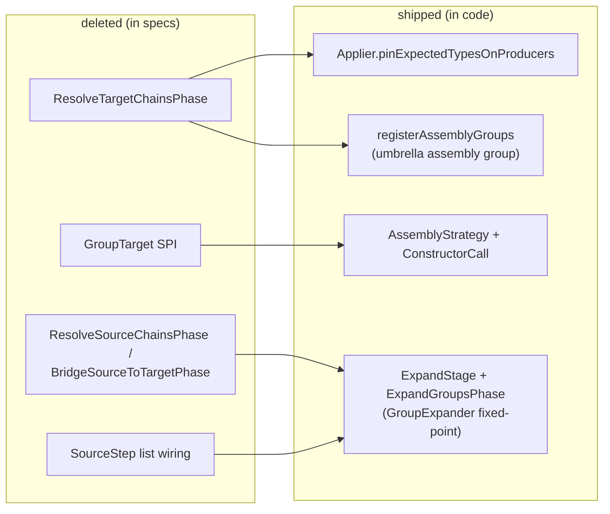

## Context

The expansion/assembly architecture has been rewritten across several superseded cutovers (an SPI extraction, a unified-expansion pass, and the assembly myopia cutover), but the capability specs were not kept in lockstep. The result is **spec describing deleted code**:

- `ResolveTargetChainsPhase` — deleted; its role (pinning the declared target type onto the directive-binding group) is now `Applier.pinExpectedTypesOnProducers`, driven by over-emitting assembly producers.
- `GroupTarget` SPI interface — deleted; assembly is now the `AssemblyStrategy` marker over `ExpansionStrategy`, implemented by `ConstructorCall`. (Only a `renderGroupTarget` codegen method name and a doc comment retain the word.)
- The older `ResolveSourceChainsPhase` / `ResolveTargetChainsPhase` / `BridgeSourceToTargetPhase` three-phase pipeline with `List<GroupTarget>`/`List<SourceStep>` wiring — gone; replaced by `ExpandStage` running `ExpansionPhase`s, with `ExpandGroupsPhase` driving a cross-group fixed-point loop over `GroupExpander` implementations.

The drift is **uneven**: `graph-expansion` is partly current (it already describes `ExpandGroupsPhase`/`GroupExpander`) but still names the deleted phase; `expansion-test-harness` describes a pipeline two cutovers old; the rest carry only residual `GroupTarget` vocabulary. The code is the ground truth.

## Goals / Non-Goals

**Goals:**

- Realign all 8 affected capability specs so every requirement is stated against **shipped types** (`ExpandStage`, `ExpandGroupsPhase`, `GroupExpander`, `Applier`, `AssemblyStrategy`, `ConstructorCall`, the umbrella assembly group), preserving each requirement's **intent**.
- Verify every realigned requirement against the current `processor` / `spi` / `strategies-builtin` source before writing it — no requirement is rewritten from memory.
- Produce a correct baseline so `fix-overloaded-constructor-assembly` rebases onto specs that match the code.

**Non-Goals:**

- **No behavior change, no code change.** Nothing new is asserted about how the processor works; only the description is corrected.
- **No re-litigation of the cutovers themselves** — the architecture is taken as shipped; this change does not re-open whether the cutovers were right.
- **No coverage / type-divergence / overload behavior** — that is the parked `fix-overloaded-constructor-assembly` change, which builds on this baseline.
- **Full realignment of every touched spec to shipped code.** Scope is *not* limited to the assembly-cutover drift: the affected specs predate multiple cutovers (the SPI unification renamed `Bridge`→`ExpansionStrategy`, `BridgeStep`→`ExpansionStep`, `ScopeTransition`→`ElementScope`; path resolution moved from `PathSegmentResolver`/`ResolvedSegment` to the `*PathResolver` strategies driven by `SourceDescentExpander`). Any requirement block this change rewrites SHALL be made fully correct against shipped types — a half-corrected requirement is not shipped. The only true Non-Goal is **behaviour/code change**: nothing about how the processor runs is altered, only the description.

## Decisions

### D1 — Code is the source of truth; verify before writing

Each modified requirement is produced by: (1) locate the existing requirement in `openspec/specs/<cap>/spec.md`; (2) read the corresponding shipped source; (3) rewrite the requirement (and its scenarios) to match shipped behavior, keeping intent. Where a requirement describes a construct that no longer exists with no shipped replacement, it is **REMOVED** with a `Reason` + `Migration` pointing at the shipped mechanism.

### D2 — Map deleted constructs to their shipped replacements consistently

A single substitution table is applied across all capabilities so the vocabulary is uniform:

### D3 — `MODIFIED` for surviving intent, `REMOVED` for deleted surface

- Requirements whose *intent* still holds but whose *vocabulary* is stale → **MODIFIED** (full requirement block copied and edited, per the delta-format rule).
- The `GroupTarget` SPI interface contract and the old three-phase harness wiring, which have no shipped counterpart as written → **REMOVED**, with `Migration` naming the shipped mechanism (`AssemblyStrategy`, `ExpandStage`/`ExpandGroupsPhase`).

### D4 — Order: verify the two load-bearing capabilities first

`graph-expansion` and `seed-graph` are the baseline the parked fix depends on, so they are realigned first and most rigorously. The vocabulary-sweep capabilities (`code-generation`, `callable-method-discovery`, `builtin-strategy-unit-tests`, `graph-model`, `expansion-strategy-spi`) and `expansion-test-harness` follow, each verified against its own code area.

## Risks / Trade-offs

- **[Writing new wrong spec]** Reverse-engineering shipped behavior risks mis-stating it — worse than the original drift. → Mitigated by D1 (read the source for every requirement) and by keeping intent intact rather than inventing new requirements.
- **[Uneven depth obscures a requirement]** A spec stale two cutovers back (`expansion-test-harness`) may describe a flow with no clean shipped analog. → Where the mapping is genuinely ambiguous, REMOVE with a migration note rather than fabricate a MODIFIED requirement; flag in tasks for a human check.
- **[Scope creep into other drift]** Touching these specs invites fixing adjacent unrelated staleness. → Non-Goal: strictly the assembly-cutover drift; other staleness stays out.
- **[Archive-time detail loss]** `MODIFIED` with partial content drops detail at sync. → Always copy the entire requirement block before editing (delta-format rule).
