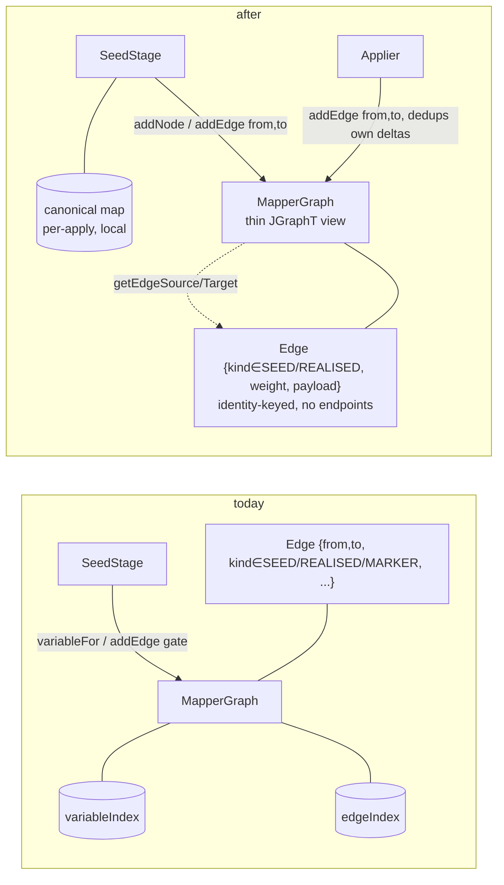
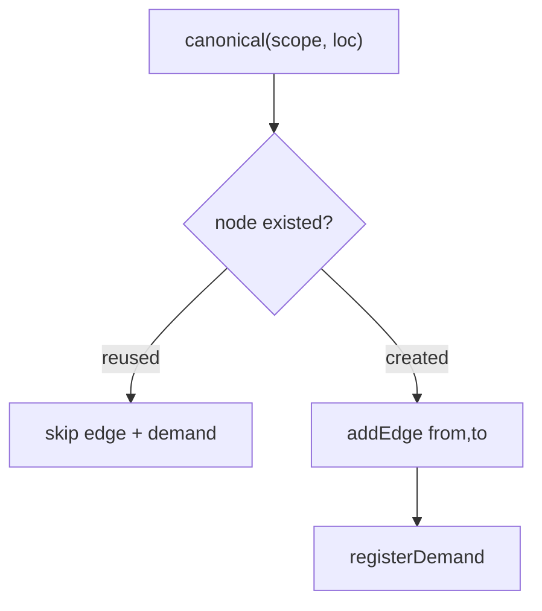
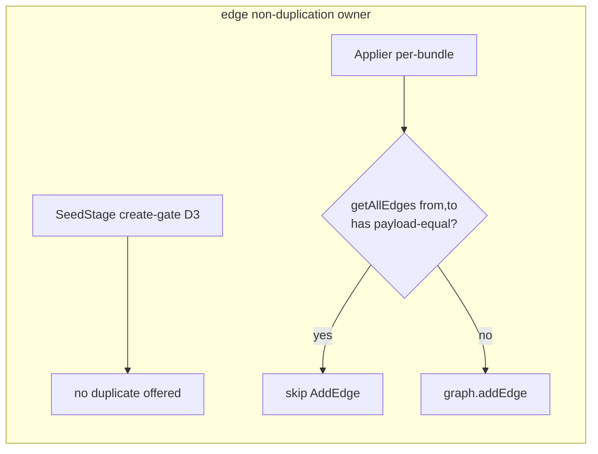

## Context

`MapperGraph` wraps a JGraphT `DirectedMultigraph<Node, Edge>` and is intended to be a dumb, append-only container. Today the graph layer carries three things it should not:

- **`EdgeKind.MARKER`** — a defined-but-unminted edge kind. Zero production call sites; referenced only by the enum, the `DotRenderer` label branch, and tests that fabricate one. A leftover of a collapsed taxonomy (`SUB_SEED`/`ELEMENT_SEED` already removed).
- **Seed-time logic** — node canonicalization (`variableIndex` + `variableFor`/`registerVariable`) and edge dedup (`edgeIndex` + the `addEdge` structural-equality reject). A whole-repo trace shows both are used by `SeedStage` only: `variableFor` has five call sites, all in `SeedStage`; the `addEdge` dedup boolean is gated on only by `SeedStage`, while `Applier.visitAddEdge` ignores it. Expansion already enforces idempotency at the producer (`incomingEdgesOf(frontier).isEmpty()`, the `FrontierMatcher` per-round fingerprint, `findInViewByType` reuse).
- **A topology mirror on `Edge`** — `from`/`to` fields read at 37 sites, with **zero** sites using JGraphT's `getEdgeSource`/`getEdgeTarget`. `SlotResolver` even queries `incomingEdgesOf(node)` (JGraphT) and then reads `edge.getFrom()` (manual) — a half-migration. `from`/`to` on the value also drive the manual `edgeIndex` and `copyWithEndpoints`.

The written `graph-model` spec already states the target ownership: "**SeedGraph** is responsible for emitting one `Node` instance per prefix via **its own internal deduplication** (a `Map<KeyTuple, Node>`)." This change makes the code match.

## Goals / Non-Goals

**Goals:**
- Remove `EdgeKind.MARKER` and its dead surface.
- Relocate node canonicalization and seed edge/demand idempotency from `MapperGraph` to `SeedStage`.
- Remove `Edge.from`/`Edge.to`; obtain endpoints from JGraphT everywhere; make `Edge` an identity-keyed payload.
- Leave a `MapperGraph` whose mutable surface is `addNode` / `addEdge(from, to, edge)` / `apply` / `addGroup` / `recordGroupOutcome`, holding no seed/expansion knowledge.
- Produce byte-identical graphs, plans, and generated source for every existing mapper.

**Non-Goals:**
- No change to the codegen model (the `strategyRef + token` "defrost" idea is explicitly deferred). `Edge` keeps `codegen`, `elementScope`, `consumerSlot`, `directive`, `strategyClassFqn` for now.
- No SPI change; strategy authors never saw `EdgeKind`/`Edge`/`MapperGraph`.
- No change to expansion semantics, the group model, or DOT output content (beyond MARKER's removal).

## Decisions

### D1 — Remove `EdgeKind.MARKER` (vestigial)

Drop the constant, `Edge.marker(...)`, and the `DotRenderer` branch; collapse the orphan-detection lattice to `REALISED | SEED`. Safe because nothing mints a MARKER edge, so every mapper's graph is unchanged. `EdgeKind` stays (it is load-bearing: every `MaskSubgraph` filters `SEED` vs `REALISED`).

### D2 — `SeedStage` owns the canonical map via a per-`apply` helper

Introduce a canonicalizer owned by one `SeedStage.apply(...)` call, holding the `(scope, location) → Node` map plus the graph; `seedMethod`/`seedDirective`/`buildSourceChain`/`buildTargetChain` receive it and call `canonical(scope, loc)` (get-or-create + `addNode`) and `register(node)`. A per-invocation helper (not a stage field) keeps `SeedStage` re-entrant across mappers and matches the project's immutability preference. The key embeds `MethodScope`, so one map across the whole `apply` is collision-free.

### D3 — Seed edge/demand idempotency derives from "node freshly created"

Each canonical node has exactly one structural producer edge (from its prefix parent), so *the chain edge into a node is new iff the node was just created*. `SeedStage` adds the segment edge and registers its demand only on creation. The directive-bridging edge is per-`MappingDirective` (emitted once); the degenerate identical-source-and-target duplicate is guarded by one `getAllEdges(from, to)` check, not by graph value-dedup.

### D4 — Remove `Edge.from`/`to`; endpoints come from JGraphT; `Edge` is identity-keyed

`Edge` drops `from`/`to`. `addEdge` takes `(Node from, Node to, Edge edge)` and delegates to `graph.addEdge(from, to, edge)`. The 37 read sites switch to `getEdgeSource(edge)`/`getEdgeTarget(edge)`; view-scoped sites use the `MaskSubgraph`/`RealisedSubgraph` they already hold (which implement `Graph`), and the `incomingEdgesOf` sites read the source via `getEdgeSource` instead of `edge.getFrom()`. `copyWithEndpoints` becomes a re-add of the payload between the new vertices.

With endpoints gone from the value, `Edge.equals`/`hashCode` become **identity-based** (like `Node`). This removes structural equality, which was only ever used by the dedup index — see D5.

*Alternative considered:* keep `from`/`to` as fields but stop reading them (cosmetic). Rejected — it leaves the mirror and the `copyWithEndpoints` re-creation pattern intact.

### D5 — Edge non-duplication moves to the single mutation sites; the graph keeps no dedup index

The multigraph invariant "do not add a second structurally-identical parallel edge" was served by `edgeIndex` keyed on `Edge.equals` (which included endpoints). With identity-keyed edges, JGraphT no longer collapses value-equal edges, so this invariant must be owned by whoever mutates:

- **Seed time** never offers a duplicate (D3), so it needs nothing further.
- **Expansion** can, in principle, offer a same-pass duplicate when two groups read the same start-of-pass snapshot and both produce a shared frontier from the same source. `Applier` — already the single expansion mutation site and already the owner of cycle-rejection (`wouldBeAcyclic`) — gains a sibling check: before applying an `AddEdge`, skip it when `getAllEdges(from, to)` already holds a payload-equal edge (same `kind`, `weight`). This is a producer-side, endpoint-aware guard built from the delta's own endpoints, not a standing index on the graph.

*Open point captured below:* whether the expansion duplicate ever actually occurs in the suite, or whether the `Applier` guard can be an assertion rather than a silent skip.

### D6 — This is convergence + a mechanical refactor, not an architecture shift

Per the rule to flag shifts: nothing here introduces a new pattern. B/D2-D3 move responsibilities to the component the spec already names; C/D4-D5 delete a redundant manual mirror and relocate one invariant to the existing single mutation sites. The graph ends as a strictly thinner typed JGraphT view. The one thing to call out for reviewers is the **internal** semantics change of `Edge.equals` (structural → identity); it is processor-internal and `Node` already works this way.

## Risks / Trade-offs

- **An endpoint-read site has no `Graph` handle to call `getEdgeSource`** → Mitigation: audit the 37 sites; the view/snapshot-scoped ones already hold a `Graph`, and the few that pass a bare `Edge` get the graph/view threaded. This is the bulk of the change's mechanical effort.
- **Losing JGraphT's value-equal-edge backstop breaks an expansion duplicate case** → Mitigation: the `Applier` guard (D5) reproduces it at the mutation site; covered by the existing compile-testing fixtures that exercise shared frontiers/assemblies.
- **`Edge` identity-equality breaks code/tests relying on structural equality** → Mitigation: grep for `Edge` equality use; the only structural consumer is `edgeIndex` (removed). Graph-comparison test helpers (`GraphCompare`) compare by endpoints+payload via the graph, not `Edge.equals`.
- **Hidden non-`SeedStage` consumer of `variableFor`** → Mitigation: grep shows five sites, all `SeedStage`; expansion uses fresh nodes by design.
- **Trade-off: scope.** Folding the topology change in (C) makes this materially larger and riskier than the MARKER + dumb-graph parts (A/B). A/B are low-risk and could ship first if C destabilizes; the tasks artifact sequences them so C is last and independently revertible.

## Migration Plan

Internal compiler refactor; no runtime artifacts, rollback = git revert. Sequence (low-risk → high-risk):

1. **A — MARKER**: remove constant, factory, `DotRenderer` branch, lattice rung; retarget MARKER tests.
2. **B — dumb graph**: add the canonicalizer to `SeedStage`, switch to `canonical`/`register` + create-gate; remove `variableFor`/`registerVariable`/`variableIndex` and `edgeIndex` from `MapperGraph`.
3. **C — topology**: change `addEdge` to `(from, to, edge)`; remove `Edge.from`/`to`; reroute the 37 reads through JGraphT; make `Edge` identity-keyed; add the `Applier` non-duplication guard.
4. Run the compile-testing suite after each step to confirm identical generated output across existing mapper fixtures.

## Open Questions

- Does the expansion same-pass duplicate edge (D5) ever actually occur in the test suite? If provably not, the `Applier` guard can be a defensive assertion rather than a silent skip.
- Is `addEdgeIfAcyclic` still live (the `Applier` uses a separate `wouldBeAcyclic` probe + plain `addEdge`)? If dead, remove it; otherwise simplify it to drop the `edgeIndex` bookkeeping.
- `directive` and `strategyClassFqn` on `Edge` are debug-only today; leave them (out of scope) or trim opportunistically? Default: leave — trimming belongs to the deferred codegen-defrost work.
