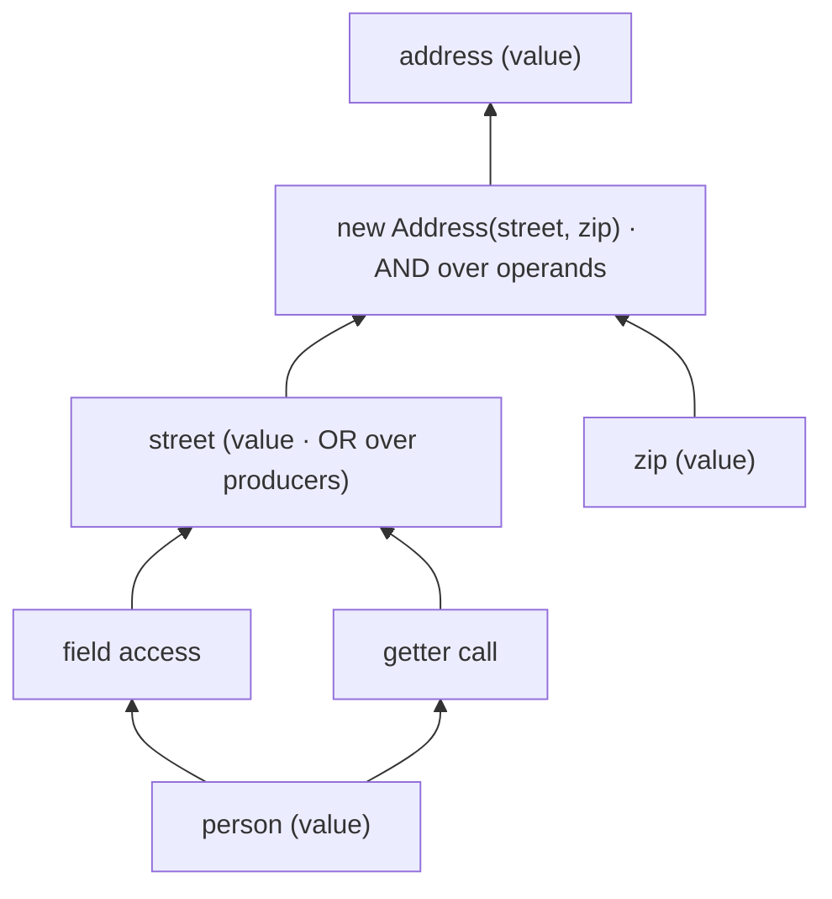
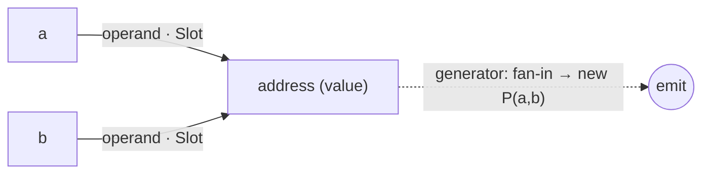
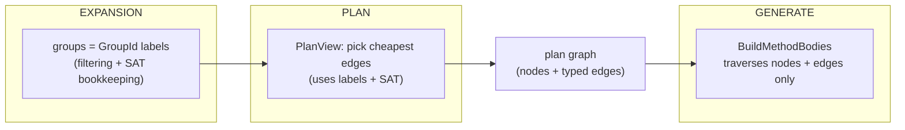

## Context

The resolution graph is built on `node = typed variable`, `edge = function`. `ExpansionGroup`
accreted state that does not belong to a "logical grouping unit": a mutable `AsSubgraph` view,
per-slot `slotMetadata`, `conversionFrontiers`, and a `GroupCodegen`. That forced the generator to
reach *into groups* (`BuildMethodBodies` reads `group.getCodegen()` / `getSlots()` /
`consumerContractFor`), violating the intended rule:

> A group is a logical grouping unit, never an active graph component. Generated code is determined
> **solely** by traversing the plan graph (nodes + edges).

Two constraints frame the solution:

- **Locked:** `container-codegen-spi` is shipped and the `2026-05-30` codegen north star puts codegen
  **on edges** ("REALISED edges are the codegen substrate; edge carries container provider+operation").
- **Behaviour must not change** — only the in-memory representation, stage names, and the seed/spec
  inconsistencies.

### The model underneath: an AND/OR graph

A mapper graph is genuinely **both** an OR-graph and an AND-graph:

- A **value** is an **OR** over the producers that can yield it (field *or* getter; ctor1 *or* ctor2).
- A **function** is an **AND** over its operands (a constructor needs *all* its arguments).

`PlanView` already performs an "AND/OR walk", so the semantics exist; they are just encoded
implicitly (a group ≈ the AND, parallel edges ≈ the OR). The two pure representations are **dual**:

| | OR (a value produced many ways) | AND (an n-ary function) |
|---|---|---|
| `node = value`, `edge = function` (**A**) | native: parallel edges, weight per edge | awkward: a *bundle* of edges → needs a group |
| `node = function`, `edge = value` (**B**) | awkward: duplicate value-nodes, weight per node | native: one node, N in-edges |

Neither pure model is clean. The formally clean model is **bipartite** (value-nodes *and*
function-nodes, edges as pure dependencies, weight+codegen on function-nodes) — but that is a larger
rewrite *and* moves codegen off edges, reopening the locked decision. It is therefore recorded as the
**deferred north star**, not this change's target.

## Goals / Non-Goals

**Goals:**
- Remove all non-grouping state from `ExpansionGroup`; reduce it to a thin label (`GroupId`).
- Make the generator traverse **only** nodes + edges; no `group.*` in `BuildMethodBodies`/`PlanView` codegen.
- Move the consumer contract (`Slot`: declared type + nullability) onto the **edge** (the function).
- `Node` `type` and `nullability` become independent write-once attributes.
- Unify seed registration (no `targetChildren` post-pass); fix the seed/spec inconsistencies.
- Rename every `implements Stage` class to `*Stage`.

**Non-Goals:**
- The bipartite value/function AND/OR graph (deferred north star).
- Flipping `node`/`edge` semantics (Option B) — explicitly rejected for this change.
- Moving codegen off edges; the locked `container-codegen-spi` model is preserved.
- Any change to generated mapper output or the public `@Map` surface.

## Decisions

> ⚠️ **Architecture note (per rules):** dissolving `ExpansionGroup` from an *object that holds graph
> state* into a *non-traversable label* is a deliberate, bounded architecture shift. It does **not**
> alter the locked `node=value / edge=codegen` model or the container-codegen SPI. The larger shift
> (bipartite AND/OR graph) is explicitly deferred.

### D1 — Option A: keep `node = value`, `edge = function`
Keep value-nodes (OR is free: parallel edges, weight per edge) and edge-carried codegen (honors the
locked SPI). The only thing A must solve is representing an **AND** (n-ary producer) without a
stateful group — see D2. *Alternative B (node=function)* duplicates value-nodes for multi-producer
values and moves weight/codegen onto nodes, reopening the locked decision; rejected.

### D2 — n-ary producers are a fan-in bundle, reconstructed at the output node
An n-ary function (`new P(a, b)`) is the **fan-in of operand edges into the output value-node**,
sharing a producer identity. The generator stands at the output node, reads its incoming REALISED
plan edges, sees they share a producer, and renders once from `IncomingValues`. No group object, no
group codegen.

### D3 — competing producers stay disambiguated by per-(name,type) leaf duplication
When two producers consume the same name pair (`ctor1(street,zip)` vs `ctor2(street,zip)`), their
operand edges connect the same node-pairs and would collide. We keep the **shipped**
`project_or_sibling_disjoint_slots` behaviour: mint distinct per-`(name, type)` leaf nodes per
producer, so the **nodes differ** and node-tags alone disambiguate the bundles. *Alternative:* a
`producer-id` on edges (no leaf dup) — deferred; it would move the AND-label onto edges and is only
needed if leaf duplication ever proves costly.

### D4 — membership is a thin `GroupId` on nodes only; views are `MaskSubgraph`
A `MaskSubgraph` with a **vertex** mask hides any edge with a masked endpoint, so node-tags suffice;
edges carry no tag (given D3). Group view = `MaskSubgraph(underlying, v -> !v.groups().contains(g),
e -> e.getKind() != REALISED)` — consistent with the existing `PlanView`/`RealisedSubgraph`/
`TransformsView` views. `GroupId` is a thin value type (not a raw `String`) for expressive,
fast-filtering membership. This deletes `AsSubgraph`, `addVertexToView`, `addEdgeToView`,
`initialEdges`, `validateInitialEdge`, and the `AddEdgeToView`/`RegisterConversionFrontier` deltas.

### D5 — `slotMetadata` dissolves onto the edge; `conversionFrontiers` dissolve structurally
The `Slot` (declared type + `AnnotatedConstruct` contract) is the consuming **function's** input, so
it lives on the consuming **edge**. `effectiveTypeFor(node)` collapses to `node.getType()`;
`consumerContractFor` reads the consuming edge's `Slot`. `conversionFrontiers` ("expandable but not
AND-required") become a **competing producer's fan-in** (OR) — read from the graph, not stored.
`GroupCodegen` folds into edge-carried `Codegen` (identical `render(VarNames, IncomingValues)`).

### D6 — `Node` attributes are independent write-once
`type` and `nullability` are set once (unknown → determined → frozen) at the single `Applier` site
(`setTyping` already enforces this for `type`; `nullability` is lifted to its own write-once setter).
Modeled as "a variable's type, once known, is fixed."

### D7 — variable identity owned by the graph
`MapperGraph.variableFor(scope, location)` get-or-create replaces `SeedGraph`'s
`sourceCache`/`targetCache`/`targetChildren`. **Key = `(scope, location)`**, used **only** for
seed-time structural nodes (param roots, path segments, target leaves, return root). Expansion-minted
nodes (per-`(name,type)` leaves from D3, conversion intermediates) are **fresh instances** and do
*not* route through `variableFor` — preserving the deliberate instance-identity those rely on. The
boundary rule: *structural seed variables dedup by `(scope, location)`; everything minted during
expansion is instance-identified.*

### D8 — SAT is structural + engine-memoized (already true)
`ExpansionStateImpl.isSat` already reads an engine-side `satGroups` map, not a group field. The group
keeps no SAT bit. A demand (group label) is SAT ⇔ all its operand edges resolve to produced
producers — recomputable, memoized engine-side.

### D9 — `PlanView` selects edges using demand-labels; emits a pure node+edge plan
`PlanView` may use group labels + the engine SAT set to **select** the cheapest realised edges
(dead-sibling pruning, Dijkstra cost oracle, AND/OR walk over fan-in). Its **output** is a
`MaskSubgraph` of nodes + edges only. The generator traverses *that* and never sees a group. This
keeps grouping in expansion/plan-selection and out of generation.

### D10 — seed registration unified to fan-in; spec/robustness fixes
`registerSeedGroup` + `registerAssemblyGroups` collapse to one demand registration; `targetChildren`
and the assembly post-pass are removed. The "bridging edge is always the untyped source leaf" rule is
corrected — a single-segment source binds to its **typed param root** (code wins). The dead non-param
first-segment branch and the silent empty-source drop are removed; `ValidateSourceParameters` becomes
a hard precondition.

### D11 — `*Stage` naming convention
Rename every `implements Stage` class to end in `Stage` (`SeedGraph → SeedStage`, etc.); `*Phase`
orchestration classes are unchanged. Done as the **first, isolated commit** so the substantive diff
stays readable; updates `Pipeline`/`ProcessorModule` wiring and `STRATEGY_FQN` constants.

## Risks / Trade-offs

- **Wide blast radius (~24 files touch `ExpansionGroup`)** → land D11 (rename) first as a pure
  mechanical commit, then the graph-model core, then expanders, then generation; keep tests green at
  each step.
- **Generator regression while moving `Slot` to edges** → assert the invariant
  `grep "group" BuildMethodBodies.java` is empty *and* diff debug DOT dumps before/after for a
  representative mapper (topology must be identical).
- **Cross-group edge leak on shared boundary nodes** → covered by D3 (distinct leaves) + the REALISED
  edge mask; add a test asserting each group view contains exactly its REALISED edges on a shared
  `person.address` node.
- **`variableFor` over-dedup of expansion nodes** → D7 routes only seed-time structural nodes through
  it; expansion mints fresh. Add a test that two type-divergent leaves at one path stay distinct.
- **Re-litigating the locked codegen model** → the design explicitly preserves edge-codegen; the
  bipartite north star is documented as *deferred*, not adopted.

## Migration Plan

1. D11 rename (mechanical, isolated commit; wiring + FQN constants).
2. `graph-model`: `Node` write-once attrs, `Edge` carries `Slot`(s), `GroupId`, `variableFor`.
3. `ExpansionGroup` gutted to label; delete view/metadata/frontier APIs + their deltas.
4. Expanders + `Applier` + `FrontierMatcher` updated to tag nodes and attach `Slot` to edges.
5. `PlanView` + `BuildMethodBodies` group-free; `GroupCodegen` folded into edge `Codegen`.
6. `SeedGraph` (now `SeedStage`) fan-in registration + spec/robustness fixes.
7. Sync specs (`graph-model`, `graph-expansion`, `seed-graph`, `code-generation`, `nullability`).

Rollback: revert as a unit; no schema/data migration, no persisted state, behaviour-preserving.

## Open Questions

- `GroupId` concretely: wrapper over a monotonic `int` vs. a UUID-like token — favour a small `int`
  generator for cheap equality/ordering. (Resolve in tasks; not behaviour-affecting.)
- Whether `ExpansionGroup` is fully deleted or retained as a 2-field record (`{GroupId, root}`) for
  expressiveness — lean to retaining a minimal record; confirm during implementation.
