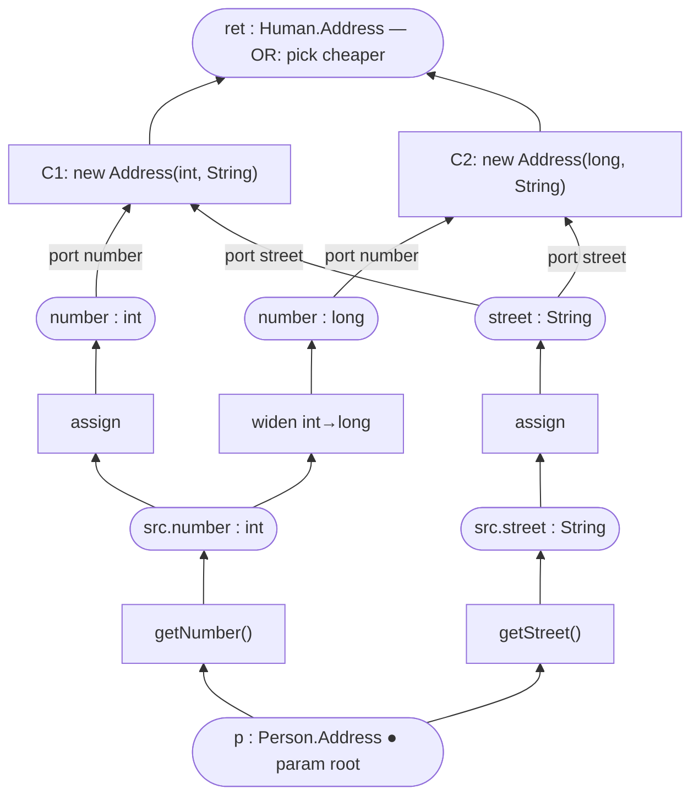
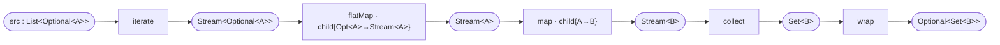

## Context

The resolution graph models `node = typed value`, `edge = function`. An n-ary producer (a constructor,
a multi-argument call) has no native representation in that model, so the shipped engine encodes
*function identity* three redundant ways, each owned by a different phase:

| Phase | Encoding of "this is one function" |
|---|---|
| Expansion | `GroupId` tags on endpoint nodes + a group `root` (`Node.groups()`, `ExpansionGroup`) |
| Plan selection | the same labels re-derived via `inGroup()` endpoint checks (`PlanView`) |
| Generation | N operand edges sharing one `EdgeCodegen` instance (`producerCodegen(inbound.get(0))`) |

plus a fourth shadow: per-`(name, type)` duplicated leaf nodes simulating the function's input ports
(the disjoint-slots rule). The three `PlanView` pruning passes, the leaf-duplication rule, and the
"all inbound REALISED edges share one producer" generator invariant exist solely to keep these
encodings consistent. Recent defects — overloaded-constructor assembly, OR-sibling slot collisions,
the spec'd-but-unimplemented conversion synthesis — were all consistency-maintenance failures.

The dual model (`node = function`, `edge = value`) smears *value* identity instead (type/nullability
duplicated per edge, value-equivalence labels reinvented). Any single-kind graph reinvents the
missing kind as labels. The formally clean model is **bipartite** — recorded as the *deferred north
star* in the `2026-06-06-dissolve-expansion-groups` design, whose own D2 already observed that a
group is "exactly like a Java constructor: one output, N required inputs."

The structure is well-studied: it is an **AND/OR graph**, equivalently the bipartite encoding of a
directed hypergraph; a Petri net is the same skeleton plus token dynamics; an e-graph is the same
skeleton plus equivalence machinery (union-find, congruence closure) that a one-directional,
acceptability-semantics engine never invokes. No maintained JVM library implements any of the three
formalisms — and none is needed, because the bipartite encoding *is* an ordinary digraph, which
JGraphT (already a dependency) handles natively. The e-graph literature contributes the algorithmic
playbook for plan selection ("extraction"); Petri-net notation contributes the rendering convention.

The project is in evaluation, with no releases; the generated mapper output and the public `@Map`
surface are the behavioural contract.

> ⚠️ **Architecture note (per rules):** this change is a deliberate, explicit architecture shift. It
> replaces the graph representation underneath every pipeline stage and **reopens the locked
> `2026-05-30` "codegen on edges" decision**: codegen moves onto `Operation` vertices. The substance
> of the locked decision — generated code is determined solely by traversing the plan structure; one
> codegen per operation; container operations first-class on the carrier — is preserved; only the
> carrier changes (edge → Operation vertex). The shipped `Edge` is already a payload-only identity
> object carrying codegen, weight, `Slot`, and element scope with no endpoints; the shift is closer
> to "promote `Edge` to vertex" than to a new codegen model.

## Goals / Non-Goals

**Goals:**

- One — and only one — representation of function identity: the `Operation` vertex. Delete every
  secondary encoding (`ExpansionGroup`, `GroupId`, `GroupOutcome`, node group-tags, leaf duplication,
  shared-codegen convention, `consumerSlot`-on-edge).
- AND and OR both structural: a `Value`'s producers are an OR by topology; an `Operation`'s ports are
  an AND by topology. SAT and plan selection become the two textbook recursions over that structure.
- Nullness with a single, definite home per `Value`; null-handling visible in the plan, not woven in
  codegen.
- Containers as nested sub-plans that reuse the method-body shape (scopes), not a parallel mechanism.
- Behaviour-preserving for users: identical generated mappers, identical diagnostics intent;
  integration tests arbitrate.
- Maximally library-leaning: JGraphT primitives (`DirectedMultigraph`, `MaskSubgraph`, traversal)
  remain the substrate; hand-written code is limited to the domain model plus two short algorithms
  (Horn propagation, cost extraction).

**Non-Goals:**

- Solver-based plan selection. Satisfiability is definite-Horn (linear via the existing work-list);
  optimisation is exact via tree-cost recursion because the cost model does not count shared
  subexpressions once. An ILP/pseudo-Boolean encoding (pure-Java Sat4j, shadow-jar relocated) is the
  documented escape hatch if sharing-aware optimal extraction is ever wanted — not now.
- Common-subexpression elimination / hoisting shared Values into locals (recorded follow-up).
- Any change to the public `@Map` surface, generated output, or MapStruct-style implicit name
  matching (the goal spec stays directive-driven).
- Adopting a Petri-net / hypergraph / e-graph library (none exists on the JVM; each would carry the
  wrong machinery).

## Decisions

### D1 — Bipartite `Value` / `Operation` vertices on the existing flat JGraphT digraph

Two vertex kinds on one `DirectedMultigraph<GraphVertex, Dep>`: `Value` (typed variable at a
location; OR over inbound producer edges) and `Operation` (production with codegen, weight, and an
ordered port signature; AND over inbound port edges). Edges are pure dependencies.

The overloaded-constructor scenario that previously required a dedicated fix change, the
disjoint-slots rule, and leaf minting reduces to: two Operations share the input Value
`street:String`; extraction picks the cheaper producer at `ret`. Edge ownership is topology — the
loser-pruning bug class ("No incoming value for slot") is unrepresentable.

*Alternatives rejected:* flipping to `node = function` (dual smear — value identity becomes edge
labels); a hierarchical/nested graph structure (D7 achieves nesting with scopes on a flat graph);
adopting a formalism library (none exists; wrong machinery).

### D2 — Java 11 closed hierarchy

No sealed types in Java 11: `GraphVertex` is an interface with exactly two final implementations,
package-private constructors in `processor.graph`, so the hierarchy is closed by package boundary.
Both keep instance identity (`equals`/`hashCode` as today's `Node`/`Edge`).

### D3 — Port identity on the edge payload; `Operation` declares the port signature

A `Dep` edge into an `Operation` carries the port id it feeds; the `Operation` declares the ordered
port signature (name, declared type, nullness — the former `Slot` contract, finally living on the
consumer). The graph remains the sole owner of topology (consistent with the shipped "Edge carries no
endpoints" rule); parallel `Dep`s from one `Value` into two ports of one `Operation` (e.g.
`Range(low, high)` both fed from `x`) are distinct edge instances. *Alternative rejected:*
Operation-owned binding lists (a second topology store to keep consistent).

### D4 — `Value` identity: dedup by `(scope, location, type, nullness)`

Seed-time structural Values and expansion-minted intermediates share one identity rule: get-or-create
keyed by scope, location, type, and nullness. Consequences:

- Type-divergent constructor parameters are honestly distinct Values (`number:int` vs `number:long`);
  type-identical demands are shared (`street:String` feeds both constructors) — supply sharing
  becomes a feature instead of the old model's bug source.
- Conversion chains dedup intermediates by type: the unimplemented convert-bundle synthesis
  ("reuse-or-synthesize, type-dedup") falls out of the identity rule; reachability SAT falls out of
  Horn propagation (D6). The `type-conversion` machinery loses its bespoke rules.
- Nullness is part of the key because under JSpecify `String!` and `String?` are different types.
  Every Value has one definite nullness; nothing is resolved "per chosen producer" at extraction
  time. *Alternative rejected:* nullness as a per-producer output contract resolved late — fewer
  vertices, but reintroduces exactly the winner-dependent ambiguity this change removes.

### D5 — Nullness crossings are explicit Operations; `defaultValue` is one of them

Shipped behaviour (preserved verbatim, relocated): the only acted-upon crossing is
`NULLABLE → NON_NULL`, wrapped in `Objects.requireNonNull(expr, "source for slot 'x' is null but
target is non-null")`; all other combinations pass through (lenient `UNKNOWN`).

In the new model the crossing is a unary Operation `(T?) → (T!)`:

- `[requireNonNull]` — default producer, today's exact semantics and message, now visible in the plan
  and DOT dumps;
- `[coalesce <literal>]` — emitted **instead** when the binding's directive declares `defaultValue`
  (the directive travels in the demand context, D9). Constants remain zero-port Operations
  (legitimately vacuously SAT). Dead-default rejection (`default-values` spec) is unchanged.

The "**instead**" is no longer a bespoke either/or: both Operations may be emitted, and selection is
the D8 **totality** rule — `[coalesce]` is total, `[requireNonNull]` is partial, so the default wins
whenever it is declared and `[requireNonNull]` is chosen only as the sole producer.

`BuildMethodBodies.applyNullabilityContract` and the edge-`Slot` consumer-contract resolution are
deleted; safe directions are port-acceptance rules, not Operations.

### D6 — SAT is Horn unit propagation; the goal spec is irreducible and gates emission

The clause system is definite Horn: `Value ⇐ any producer Operation`, `Operation ⇐ all port Values`,
facts = param roots and zero-port Operations. The existing fixed-point work-list *is* unit
propagation — it is kept, not replaced (a SAT solver would re-encode a linear-fragment problem).
`GroupOutcome` bookkeeping is deleted; SAT is a memoized vertex predicate.

Two goal-related rules:

- **No silent sourcing is structural.** Supply exists only where directives root it (source paths,
  constants). A port with no directive-rooted producer chain is UNSAT by exhaustion; there is no
  invention rule (the `InputAllocator` fall-through is removed, not ported).
- **Completeness cannot be structural.** "The user wants `number` mapped" exists only in the
  annotations — `new Address()` is type-correct, vacuously SAT, and cheapest. The **declared
  bindings** (`{child name → directive}`, per target level) are the goal half of the planning
  problem (initial state = param roots; state space = graph; goal = declared bindings + return
  type). Assembly strategies interpret the goal at Operation-emission time — constructors: exact
  consumption (param-name set = declared-children set) — turning a global covering constraint into a
  local filter so extraction stays unconstrained. *Alternatives rejected:* post-hoc coverage
  validation (the vacuous constructor outprices the correct one, then errors); infinite cost on
  dropping (absence of consumption has no edge to price).

### D7 — Containers compose through an explicit `Stream`; the per-element transform stays a child scope

A container conversion is two things at once: a **reshaping** across container kinds
(`List → Set`, `List → Optional`, drop-empties) and a **per-element transform** (`A → B`). The
per-element transform is a function `(elem:A) → (elem:B)` — the same shape as a method body — and
stays a child `Scope` owned by its Operation (the reused method mechanism, one level down). The
reshaping is *not* an element transform and has no same-kind decomposition: encoding the whole thing
as one fused same-kind Operation (`List<A> → List<B>` in one box) forces that Operation to know every
kind it bridges (`List` **and** `Set` **and** `Optional` at once for `List<Optional<A>> →
Optional<Set<B>>`) — the centralized multi-kind composer this change exists to delete, and the gap
that left the `mapHuman` integration mapper unplannable. So the reshaping is made explicit as a chain
of first-order Operations over an intermediate `Stream<T>` `Value`:

| Operation | Type | Shape | Emitted by |
|---|---|---|---|
| `iterate` | `Cont<E> → Stream<E>` | plain | each container, **its own kind** (incl. `Optional.stream()`) |
| `collect` | `Stream<E> → Seq<E>` | plain | each **sequence** container, its own kind |
| `wrap` / `unwrap` | `E → Wrap<E>` / `Wrap<E> → E` | plain (`unwrap` is **partial**, D8) | each container, its own kind |
| `mapPresence` | `Optional<A> → Optional<B>` | scope-owning | wrapper, **same-kind only** (a wrapper has no `collect`) |
| `map` / `flatMap` | `Stream<A> → Stream<B>` | scope-owning (child `A→B` / `A→Stream<B>`) | one **generic**, kind-free stream strategy |

- **No Operation knows two kinds.** Cross-kind and flatten emerge from OR-matching on `Stream`
  Values: the chain above is `wrap ⟵ collect ⟵ map[A→B] ⟵ flatMap[Optional→Stream] ⟵ iterate(List)`,
  every step single-kind or kind-free. Same-kind `List → List` routes through the same
  `iterate → map → collect` and renders identically; only `Optional → Optional` keeps `mapPresence`.
- **`Stream<T>` Values are parent-scoped — this is *not* the rejected scope-crossing alternative.**
  The stream stages are ordinary Operations in the parent scope; the only `Scope` boundary is still
  the per-element transform inside `map`/`flatMap`. **Invariant: no `Dep` edge crosses a scope
  boundary** holds unchanged — in fact more strictly, because `[stream]`/`[collect]` never straddle a
  boundary. Nested same-kind containers (`List<List<A>>`) are still scope-tree depth (a `map` whose
  child plan contains another `map`).
- SAT, expansion, extraction, codegen are the unchanged recursions over more vertices: a scope-owning
  Operation is SAT ⟺ outer ports SAT ∧ child return-root SAT (child param roots base-case SAT — the
  method rule); the child demand joins the same scope-confined work-list; codegen threads each stage's
  `StreamOps` snippet onto its operand, reproducing a fused pipeline string.
- **Bootstrapping** (target→source): the generic stream strategy names its `Stream<X>` port from a
  *non-stream* candidate via a shared structural helper `Containers.streamElement`
  (assignable-to-`Collection<E>` → E; array → component; `Optional<E>`/`Stream<E>` → E), and the
  existing port-synthesis turns that into the `iterate` demand. The helper is SPI-resident and
  structural, so any `Collection`-shaped container is covered for free; a non-`Collection` reactive
  container would declare its stream-element through an SPI hook when one lands (out of scope here).
- Wrap/unwrap stay **plain** Operations — the Wrap-vs-Collect asymmetry is now structural (plain wrap
  vs scope-owning element map). The `ElementScope` `ENTERING`/`EXITING` edge attribute and the
  strictly-linear REALISED-chain invariant are removed.

*Alternatives rejected:* one fused same-kind element-map Operation (cannot phrase cross-kind/flatten
without a multi-kind composer — the `mapHuman` regression); flat scope-crossing `[stream]`/`[collect]`
Operations with the stream living in an *element* scope (pollutes first-order candidate search,
scope-crossing SAT subtleties — `Stream`-in-parent-scope avoids both); eager/supply-driven `iterate`
(emits `Stream` candidates before demand — a forward sweep, against the target→source discipline);
lambda-as-attribute (hides a whole plan from the graph, dumps, and diagnostics).

### D8 — Plan selection is bottom-up cost extraction

`cost(Value) = min over SAT producers; cost(Operation) = weight + Σ cost(port Values)` — exact
because the cost model is per-use (no shared-cost discounting). Replaces all three `PlanView` passes
(`multiFireLoserEdges`, `conversionLoserEdges`, `reachableEdges`) and the Dijkstra oracle, which is a
*path* oracle and systematically underestimates through nested ANDs (min over operands instead of
sum). Losing producers are not pruned — extraction never walks into them. Ties break on a stable
deterministic ordering (as today). The extracted plan is a read-only view: each in-plan Value exposes
exactly one `chosenProducer()`; the generator's "all inbound edges share one producer" invariant
becomes true by construction. Shared Values render inline per use (today's behaviour; accessor
idempotency is a documented assumption); hoisting is a recorded non-goal.

**Totality dominates cost.** An Operation is **total** or **partial** (partial = may throw on a
structurally-valid input: `unwrap`/`orElseThrow`, `[requireNonNull]`). Among a `Value`'s SAT
producers, **a total producer is always preferred over a partial one, independent of weight**; a
partial producer is selected only when the Value has no total producer. This is a correctness rule,
not a heuristic — it stops extraction from choosing a runtime-throwing plan
(`map(o -> f(o.orElseThrow()))`) over an equivalent total one (`flatMap(o -> o.stream())`, drop-empties)
merely because the throwing plan costs less. It **subsumes** the D5 nullness either/or: `[coalesce]`
(default) is total and `[requireNonNull]` is partial, so "default wins when declared, `requireNonNull`
only when it is the sole producer" falls out of the same dominance rather than a bespoke rule.
Dominance is applied before cost; cost and the deterministic tie-break decide only among producers of
equal totality.

### D9 — Directives and demand context

A directive never lives on a `Value` (deduped intermediates would collide across bindings sharing a
conversion chain). It travels with the demand context the work-list carries — the frontier knows the
binding it serves; `Node.inheritDirective` has no successor. Seed produces: param-root Values,
return-root Value, and per-level declared-bindings goal specs derived by grouping dotted target
paths (`@Map(target="address.street")` contributes `street` to the goal at the `address` level).
There are no `SEED` edges, seed groups, or pre-created untyped target leaves.

### D10 — Delta pipeline retained; deltas reshaped; cycle rollback expected to dissolve

The pure-expander → `DeltaBundle` → single-`Applier` discipline is verified load-bearing and is
kept. Deltas become `AddValue` / `AddOperation`, where an `AddOperation` lands atomically with its
port edges — the granularity the old per-bundle atomicity wanted. The `CycleDetector` rollback is
expected to be removable: Horn propagation is well-founded (a Value never SATs through its own
cycle), and extraction follows the recorded finite derivation, so graph cycles (e.g. box∘unbox
Operations both ways between `x:int` and `x:Integer`) are harmless-but-never-chosen.
**Verification gate:** the zero-weight case needs a tie-break argument; until a test proves it, the
Applier keeps an assertion-only cycle check (no rollback), removed in the final task group if the
proof holds.

### D11 — Diagnostics and debug output

`RealisationDiagnosticsStage` walks unsatisfied demands: a Value with no SAT producer, an Operation
naming its unsatisfied ports. Closest-miss becomes the deepest unsatisfied port chain — strictly
better raw material than UNSAT group outcomes. The three DOT dumps (seed/full/transforms) are kept
with bipartite Petri-style rendering: Operation boxes, Value ellipses, port-labelled edges.

### D12 — SPI: strategies emit Operation specs; strategies stay myopic

A strategy match emits an **Operation spec**: codegen, weight, ordered typed ports (name, type,
nullness), optional child-scope declaration (container element mapping). `FrontierMatcher` turns
specs into `AddOperation` deltas (per-port fan-out replaces per-minted-leaf fan-out; signature dedup
retained). The `render(VarNames, IncomingValues)` codegen contract survives with incoming values
keyed by port name. Strategies receive no graph access (unchanged rule); the container SPI keeps the
one-class-per-container shape with candidacy + codegen-handle roles attached to Operations.

## Risks / Trade-offs

- **[Blast radius: every stage after validation]** → integration tests with unchanged generated
  output are the contract; DOT goldens regenerated once, then frozen; strictly ordered task groups
  so the build is green at each group boundary; conventional commits per group.
- **[Cycle-rollback removal is unproven]** → D10 verification gate: assertion-only check stays until
  a dedicated test (zero-weight conversion cycle) proves well-foundedness; rollback re-added if it
  fails.
- **[Plan changes where the old Dijkstra oracle was wrong]** → extraction may legitimately pick a
  different (cheaper-in-sum) plan for nested-constructor-under-OR shapes; integration tests
  arbitrate, and divergences are reviewed as bug-fixes of the old oracle, not regressions.
- **[Vertex growth from nullness-keyed identity]** → bounded by (locations × observed nullness
  variants); vertices are cheap; accepted for ambiguity-freedom.
- **[Shared-Value inline rendering duplicates accessor calls]** → unchanged from today's behaviour;
  idempotency assumption documented in `plan-extraction`; CSE recorded as follow-up.
- **[Spec churn: 16 modified + 1 new spec]** → delta specs written against requirements (not
  implementation); `openspec validate` gates archive.
- **[Re-litigating the locked codegen decision]** → explicitly reopened here, once, with the
  substance-preserving argument recorded in Context; the new locked statement becomes "codegen on
  Operations."

## Migration Plan

Task groups, strictly ordered, build green at each boundary:

1. **Graph core** — `GraphVertex`/`Value`/`Operation`/`Dep`, identity rules, scope tree,
   `MapperGraph` rebuilt; old types coexist temporarily behind the package boundary.
2. **SPI reshape** — Operation spec, port contract, codegen carrier; `strategies-builtin` compiles
   against the new surface (matching logic and weights carried over).
3. **Seed** — goal specs, param/return roots, declared-bindings derivation; old seed groups deleted.
4. **Expansion** — work-list over Value demands, Horn SAT, `AddValue`/`AddOperation` deltas,
   `FrontierMatcher` per-port fan-out; groups/outcomes deleted.
5. **Extraction** — cost recursion + plan view; `PlanView` passes and Dijkstra oracle deleted.
6. **Codegen** — plan walk over Operations, child-scope lambda rendering, nullability weaving
   deleted.
7. **Containers & nullness Operations** — scope-owning Operations, `[requireNonNull]`/`[coalesce]`,
   `ElementScope` removal.
8. **Diagnostics & dumps** — unsatisfied-port-chain messages, bipartite DOT rendering.
9. **Cleanup & verification** — cycle-check resolution per D10 gate, dead types removed
   (`ExpansionGroup`, `GroupId`, `GroupOutcome`, `PlanView`, …), harness/test-discipline sync,
   spec sync.

Rollback: revert as a unit; no persisted state; generated output unchanged means no downstream
migration.

## Open Questions

- **Zero-weight well-foundedness (D10 gate):** formal tie-break argument that extraction never
  records a cyclic derivation when weights are 0; resolved by a dedicated test in group 9.
- **Demand-context record shape (D9):** the exact carrier of `(binding directive, declared-bindings
  level, scope)` on the work-list — settle in group 4; not behaviour-affecting.
- **`TransformsView` fate:** whether the structural-filter dump survives as a filter over the
  extracted plan or is re-derived from it — settle in group 8; output intent unchanged.
